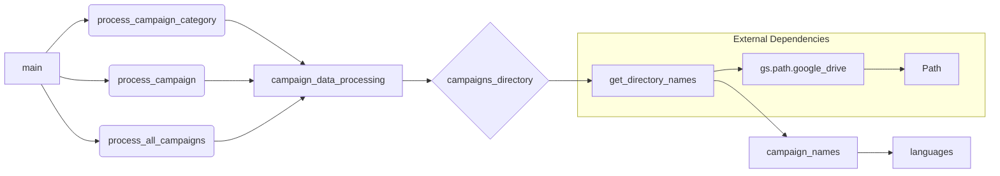

# <input code>

```python
## \file hypotez/src/suppliers/aliexpress/campaign/_examples/_examle_prepare_campains.py
# -*- coding: utf-8 -*-\
#! venv/Scripts/python.exe
#! venv/bin/python/python3.12

"""
.. module: src.suppliers.aliexpress.campaign._examples 
	:platform: Windows, Unix
	:synopsis:

"""
MODE = 'dev'

"""
	:platform: Windows, Unix
	:synopsis:

"""


"""
	:platform: Windows, Unix
	:synopsis:

"""


"""
  :platform: Windows, Unix

"""
"""
  :platform: Windows, Unix
  :platform: Windows, Unix
  :synopsis:
"""MODE = 'dev'
  
""" module: src.suppliers.aliexpress.campaign._examples """


from ..prepare_campaigns import *

# Example 1: Process a Single Campaign Category
process_campaign_category("SummerSale", "Electronics", "EN", "USD", force=True)

# Example 2: Process a Specific Campaign
process_campaign("WinterSale", categories=["Clothing", "Toys"], language="EN", currency="USD", force=False)

# Example 3: Process All Campaigns
process_all_campaigns(language="EN", currency="USD", force=True)


campaigns_directory = Path(gs.path.google_drive,'aliexpress','campaigns')
campaign_names = get_directory_names(campaigns_directory)
languages = {'EN': 'USD', 'HE': 'ILS', 'RU': 'ILS'}
```

# <algorithm>

**Блок-схема**


```mermaid
graph TD
    A[Начать] --> B{Вызов process_campaign_category("SummerSale", "Electronics", "EN", "USD", force=True)};
    B --Результат--> C[Вызов process_campaign("WinterSale", categories=["Clothing", "Toys"], language="EN", currency="USD", force=False)];
    C --Результат--> D[Вызов process_all_campaigns(language="EN", currency="USD", force=True)];
    D --Результат--> E[Получение списка кампаний (campaigns_directory)];
    E --> F[Обработка списка кампаний];
    F --> G[Конец];

```


**Описание:**


1. **Начать:** Программа запускается.
2. **Вызов `process_campaign_category`:** Выполняется функция, обрабатывающая конкретную категорию кампании.
3. **Вызов `process_campaign`:** Выполняется функция, обрабатывающая конкретную кампанию.
4. **Вызов `process_all_campaigns`:** Выполняется функция, обрабатывающая все кампании.
5. **Получение списка кампаний:** Определяется путь к директории с кампаниями на Google Drive. Функция `get_directory_names` возвращает список имен кампаний.
6. **Обработка списка кампаний:** Происходит дальнейшая обработка полученного списка кампаний.
7. **Конец:** Выполнение программы завершается.


# <mermaid>



# <explanation>

**Импорты:**

```python
from ..prepare_campaigns import *
```

Импортирует все функции и классы из модуля `prepare_campaigns`, который находится в родительском каталоге (`.prepare_campaigns`).  Предполагается, что в этом модуле `prepare_campaigns` определены функции (`process_campaign_category`, `process_campaign`, `process_all_campaigns`, `get_directory_names`), необходимые для обработки кампаний.  Связь с проектом: `src.suppliers.aliexpress.campaign` - это часть структуры пакета, которая отвечает за взаимодействие с поставщиком AliExpress.


**Функции (примеры):**

* `process_campaign_category("SummerSale", "Electronics", "EN", "USD", force=True)`: Обрабатывает конкретную категорию кампании.
* `process_campaign("WinterSale", categories=["Clothing", "Toys"], language="EN", currency="USD", force=False)`: Обрабатывает конкретную кампанию.
* `process_all_campaigns(language="EN", currency="USD", force=True)`: Обрабатывает все кампании.
* `get_directory_names(campaigns_directory)`: Получает имена файлов/папок из указанной директории.


**Переменные:**


* `MODE = 'dev'`: Глобальная переменная, скорее всего, используется для определения режима работы (например, 'dev', 'prod').
* `campaigns_directory`: Путь к директории кампаний на Google Drive.
* `campaign_names`: Список имен кампаний, полученных из `campaigns_directory`.
* `languages`: Словарь, сопоставляющий языки с валютами (EN-USD, HE-ILS, RU-ILS).


**Возможные ошибки и улучшения:**

* **Отсутствие обработки ошибок:** Код не содержит проверок на существование директории `campaigns_directory`, корректность полученных данных.
* **Не ясны логика и реализация `process_*`:** Функции `process_campaign_category`, `process_campaign` и `process_all_campaigns` не детализированы. Нужно понимать, что они делают, как взаимодействуют с файловой системой и данными.
* **Использование `gs.path.google_drive`:** Необходимо знать, где и как определяется эта переменная (модуль `gs`).
* **Переменные `MODE`:** Не используются в коде.


**Взаимосвязи с другими частями проекта:**

Код в `hypotez/src/suppliers/aliexpress/campaign/_examples/_examle_prepare_campains.py`  зависит от функций и классов, определенных в `prepare_campaigns.py` внутри того же пакета `aliexpress.campaign`, а также от внешней библиотеки `gs`, которая предоставляет доступ к Google Drive. Этот код, скорее всего, является примером или тестом, демонстрирующим использование функций из `prepare_campaigns`.