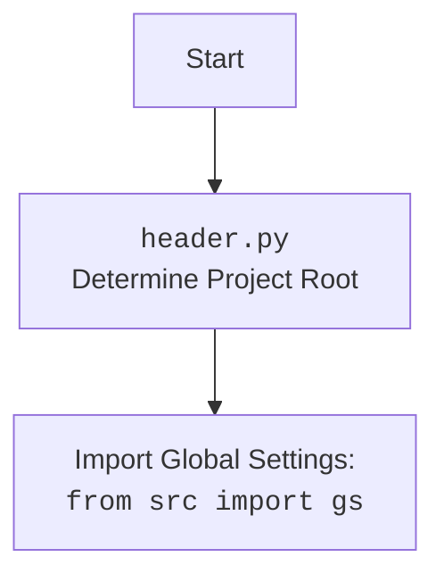

# АНАЛИЗ КОДА: `hypotez/src/suppliers/aliexpress/campaign/_examples/_examle_prepare_campains.py`

## <алгоритм>

1. **Импорт:**
    - Импортируются все (* wildcard) имена из `src.suppliers.aliexpress.campaign.prepare_campaigns`. Это означает, что все функции и классы, определенные в `prepare_campaigns.py`, становятся доступными в текущем файле.
    - Пример: после импорта мы можем вызвать функции `process_campaign_category`, `process_campaign`, `process_all_campaigns`, определенные в `prepare_campaigns.py`.
2. **Примеры вызова функций:**
   - **Пример 1: Обработка категории кампании:**
        - Вызывается функция `process_campaign_category` с аргументами:
            - `campaign_name = "SummerSale"` (название кампании)
            - `category = "Electronics"` (категория товаров)
            - `language = "EN"` (язык)
            - `currency = "USD"` (валюта)
            - `force=True` (принудительная обработка)
       - Данные передаются в функцию `process_campaign_category`, и результат не используется напрямую в данном коде.
       - Цель: подготовить данные для кампании "SummerSale" в категории "Electronics" на английском языке в долларах.
   - **Пример 2: Обработка конкретной кампании:**
        - Вызывается функция `process_campaign` с аргументами:
            - `campaign_name = "WinterSale"` (название кампании)
            - `categories = ["Clothing", "Toys"]` (список категорий товаров)
            - `language = "EN"` (язык)
            - `currency = "USD"` (валюта)
            - `force=False` (не принудительная обработка).
       - Данные передаются в функцию `process_campaign`, и результат не используется напрямую в данном коде.
       - Цель: подготовить данные для кампании "WinterSale" для категорий "Clothing" и "Toys" на английском языке в долларах.
   - **Пример 3: Обработка всех кампаний:**
        - Вызывается функция `process_all_campaigns` с аргументами:
            - `language = "EN"` (язык)
            - `currency = "USD"` (валюта)
            - `force = True` (принудительная обработка)
        - Данные передаются в функцию `process_all_campaigns`, и результат не используется напрямую в данном коде.
        - Цель: подготовить данные для всех кампаний на английском языке в долларах.
3. **Настройка директории и языков:**
    - **Определение директории кампаний:**
        - Создается объект `campaigns_directory` типа `Path` с путем к директории кампаний на Google Drive. Путь собирается из атрибутов `gs.path.google_drive`, `'aliexpress'`, `'campaigns'`. Предполагается, что `gs` это глобальный объект (global settings), который хранит пути.
        - Примеры: `gs.path.google_drive` может быть "/Users/user/Google Drive", тогда `campaigns_directory` будет "/Users/user/Google Drive/aliexpress/campaigns".
    - **Получение имен кампаний:**
        -  Вызывается функция `get_directory_names` с аргументом `campaigns_directory`, чтобы получить список имен директорий в директории кампаний (названия кампаний).
        -  Пример: если в директории `campaigns_directory` лежат поддиректории `SummerSale`, `WinterSale`, `BlackFriday`, то `campaign_names` будет списком `['SummerSale', 'WinterSale', 'BlackFriday']`
   - **Определение языков и валют:**
        - Создается словарь `languages`, который определяет соответствие между языками и валютами.
        - Пример: `languages = {'EN': 'USD', 'HE': 'ILS', 'RU': 'ILS'}` означает, что для английского языка используется USD, а для иврита и русского - ILS.

## <mermaid>

```mermaid
flowchart TD
    subgraph examples [Примеры вызова функций]
        Start --> processCampaignCategoryCall[process_campaign_category("SummerSale", "Electronics", "EN", "USD", force=True)]
        processCampaignCategoryCall --> processCampaignCall[process_campaign("WinterSale", categories=["Clothing", "Toys"], language="EN", currency="USD", force=False)]
        processCampaignCall --> processAllCampaignsCall[process_all_campaigns(language="EN", currency="USD", force=True)]
    end
    
    subgraph path_setup [Настройка директории и языков]
        processAllCampaignsCall --> createCampaignsDirectory[Создание Path к директории кампаний: campaigns_directory = Path(gs.path.google_drive, 'aliexpress', 'campaigns')]
        createCampaignsDirectory --> getCampaignNames[Получение имен директорий кампаний: campaign_names = get_directory_names(campaigns_directory)]
        getCampaignNames --> defineLanguages[Определение словаря языков и валют: languages = {'EN': 'USD', 'HE': 'ILS', 'RU': 'ILS'}]
    end
    
    
    
    classDef code_block fill:#f9f,stroke:#333,stroke-width:2px
    class examples,path_setup code_block
    
```



## <объяснение>

### Импорты:

-   `from ..prepare_campaigns import *`: Импортирует все имена (функции, классы и т.д.) из модуля `prepare_campaigns.py`, который находится на один уровень выше в структуре пакета (относительный импорт). `*` означает импорт всех публичных имен.
    -   **Взаимосвязь с `src`**: Этот импорт связывает текущий файл с модулем, который, по-видимому, содержит логику для обработки и подготовки данных о кампаниях AliExpress. Импорт  позволяет использовать функции и классы, определенные в `prepare_campaigns.py` для обработки кампаний.

### Классы:

-   В данном файле нет определений классов. Используется класс `Path` из модуля `pathlib`, который не импортируется явно, но вызывается при создании переменной `campaigns_directory`.

### Функции:

-   `process_campaign_category(campaign_name, category, language, currency, force=False)`:
    -   **Аргументы**:
        -   `campaign_name` (str): Название кампании.
        -   `category` (str): Категория товаров в кампании.
        -   `language` (str): Язык, на котором проводится кампания ("EN", "RU" и т.д.).
        -   `currency` (str): Валюта кампании ("USD", "ILS" и т.д.).
        -    `force` (bool, optional): Если True - принудительно обработать кампанию, по умолчанию False.
    -   **Возвращаемое значение**: Вероятно, ничего, так как не используется в коде.
    -   **Назначение**:  Выполняет подготовку данных для конкретной категории в определенной кампании.
    -   **Пример**: `process_campaign_category("SummerSale", "Electronics", "EN", "USD", force=True)` обрабатывает кампанию "SummerSale" для категории "Electronics" на английском языке в долларах США с принудительной обработкой.

-   `process_campaign(campaign_name, categories, language, currency, force=False)`:
    -   **Аргументы**:
        -   `campaign_name` (str): Название кампании.
        -   `categories` (list of str): Список категорий товаров в кампании.
        -   `language` (str): Язык, на котором проводится кампания.
        -   `currency` (str): Валюта кампании.
        -    `force` (bool, optional): Если True - принудительно обработать кампанию, по умолчанию False.
    -   **Возвращаемое значение**: Вероятно, ничего, так как не используется в коде.
    -   **Назначение**:  Выполняет подготовку данных для конкретной кампании для нескольких категорий.
    -   **Пример**: `process_campaign("WinterSale", categories=["Clothing", "Toys"], language="EN", currency="USD", force=False)` обрабатывает кампанию "WinterSale" для категорий "Clothing" и "Toys" на английском языке в долларах США без принудительной обработки.

-   `process_all_campaigns(language, currency, force=False)`:
    -   **Аргументы**:
        -   `language` (str): Язык, на котором проводятся кампании.
        -   `currency` (str): Валюта кампаний.
        -    `force` (bool, optional): Если True - принудительно обработать кампанию, по умолчанию False.
    -   **Возвращаемое значение**: Вероятно, ничего, так как не используется в коде.
    -   **Назначение**:  Выполняет подготовку данных для всех кампаний на указанном языке и в указанной валюте.
    -   **Пример**: `process_all_campaigns(language="EN", currency="USD", force=True)` обрабатывает все кампании на английском языке в долларах США с принудительной обработкой.

-  `get_directory_names(path)`:
    - **Аргументы**:
      - `path` (Path): Путь к директории.
    - **Возвращаемое значение**: `list of str`: Список названий поддиректорий.
    - **Назначение**: Функция, вероятно, получает список названий поддиректорий для заданного пути.

### Переменные:

-   `campaigns_directory` (pathlib.Path): Объект, представляющий путь к директории кампаний на Google Drive.
-   `campaign_names` (list of str): Список имен директорий, представляющих названия кампаний.
-   `languages` (dict): Словарь, содержащий соответствие между языками и валютами.

### Потенциальные ошибки и области для улучшения:

-   **Обработка ошибок**: В коде не предусмотрена обработка ошибок, например, если не удается найти директорию кампаний или если возникают проблемы при обработке кампаний. Следует добавить блоки try-except для отлова возможных исключений.
-   **Логирование**: Отсутствует логгирование действий, что затрудняет отслеживание процесса обработки и выявление ошибок. Желательно добавить логирование для отслеживания хода выполнения программы.
-   **Зависимость от `gs`**: Код зависит от глобального объекта `gs` для получения пути к Google Drive. Это может быть не совсем очевидно и может затруднить тестирование.  Следует рассмотреть возможность передачи путей в качестве аргументов или использовать конфигурационный файл.
-   **Не используется возвращаемое значение**: Функция process_campaign_category, process_campaign, process_all_campaigns что-то вычисляет, но в данном примере результат вычисления не используется.

### Взаимосвязи с другими частями проекта:

-   **`prepare_campaigns.py`**: Этот файл является примером использования функционала из `prepare_campaigns.py`. Он показывает, как можно вызывать функции для обработки кампаний.
-   **`gs` (global settings)**: Код зависит от глобальных настроек (`gs`) для получения пути к Google Drive. Это подразумевает наличие модуля, который инициализирует и предоставляет эти настройки.
-   **`pathlib`**: Использование `Path` подразумевает работу с путями к файлам в операционной системе.
-   **Google Drive:** Предполагается, что данные для кампаний хранятся на Google Drive.

В целом, код предоставляет пример использования функций для обработки кампаний, но требует доработок в части обработки ошибок, логирования и более явной зависимости от глобальных настроек.