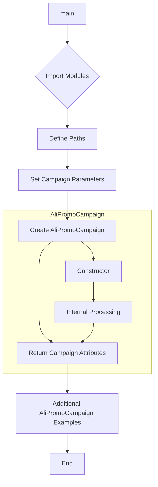

# <input code>

```python
## \file hypotez/src/suppliers/aliexpress/campaign/_examples/_example_ali_promo_campaign.py
# -*- coding: utf-8 -*-\
#! venv/Scripts/python.exe
#! venv/bin/python/python3.12

"""
.. module: src.suppliers.aliexpress.campaign._examples 
	:platform: Windows, Unix
	:synopsis:

"""
MODE = 'dev'


"""
	:platform: Windows, Unix
	:synopsis:

"""


"""
	:platform: Windows, Unix
	:synopsis:

"""


"""
  :platform: Windows, Unix

"""
"""
  :platform: Windows, Unix
  :platform: Windows, Unix
  :synopsis:
"""MODE = 'dev'
  
""" module: src.suppliers.aliexpress.campaign._examples """


""" Примеры создания рекламной кампании """


import header
from pathlib import Path
from types import SimpleNamespace
from src import gs
from src.suppliers.aliexpress import AliPromoCampaign
from src.suppliers.aliexpress import AliAffiliatedProducts
from src.utils import get_filenames, get_directory_names, read_text_file, csv2dict
from src.utils.jjson import j_loads_ns
from src.utils.printer import pprint
from src.logger import logger

campaigns_directory = Path(gs.path.google_drive, 'aliexpress', 'campaigns')
campaign_names = get_directory_names(campaigns_directory)

campaign_name = '280624_cleararanse'
category_name = 'gaming_comuter_accessories'
language = 'EN'
currency = 'USD'

a:SimpleNamespace = AliPromoCampaign(campaign_name = campaign_name, 
                     category_name = category_name, 
                     language = language, 
                     currency = currency) 

campaign = a.campaign
category = a.category
products = a.category.products

# dict
a = AliPromoCampaign(campaign_name,category_name,{'EN':'USD'})
# string
a = AliPromoCampaign(campaign_name,category_name, 'EN','USD')
```

# <algorithm>

**Шаг 1:** Импортируются необходимые модули и классы.

**Пример:** `from src.suppliers.aliexpress import AliPromoCampaign` импортирует класс `AliPromoCampaign` из модуля `src.suppliers.aliexpress`.

**Шаг 2:** Определяются пути к каталогу кампаний и считываются их названия.

**Пример:** `campaigns_directory = Path(gs.path.google_drive, 'aliexpress', 'campaigns')` формирует путь к каталогу кампаний. `campaign_names = get_directory_names(campaigns_directory)` получает список названий каталогов кампаний в указанном каталоге.

**Шаг 3:** Устанавливаются значения для имени кампании, категории, языка и валюты.

**Пример:** `campaign_name = '280624_cleararanse'`, `category_name = 'gaming_comuter_accessories'`, `language = 'EN'`, `currency = 'USD'`.

**Шаг 4:** Создается экземпляр класса `AliPromoCampaign` и передаются параметры.

**Пример:** `a:SimpleNamespace = AliPromoCampaign(campaign_name = campaign_name, category_name = category_name, language = language, currency = currency)`. Данные `campaign_name`, `category_name`, `language` и `currency` передаются в конструктор класса `AliPromoCampaign`.

**Шаг 5:** Получаются атрибуты `campaign`, `category` и `products` созданного объекта `AliPromoCampaign`.

**Пример:** `campaign = a.campaign`, `category = a.category`, `products = a.category.products`. Значения атрибутов из экземпляра `AliPromoCampaign` присваиваются переменным.

**Шаг 6:** Создаются дополнительные экземпляры `AliPromoCampaign` с различными типами аргументов, демонстрирующими вариативность ввода.

**Пример:** `a = AliPromoCampaign(campaign_name,category_name,{'EN':'USD'})` и `a = AliPromoCampaign(campaign_name,category_name, 'EN','USD')` показывают использование словаря и строк для языка и валюты соответственно.


# <mermaid>




# <explanation>

**Импорты:**

*   `header`: Вероятно, содержит вспомогательные функции или конфигурацию, специфичные для проекта.  Связь с другими частями неясна без детального просмотра файла `header.py`.
*   `pathlib`: Предоставляет классы для работы с файловыми путями.
*   `types`: Модуль, предоставляющий базовые типы данных, в частности `SimpleNamespace`.
*   `gs`: Вероятно, модуль, содержащий конфигурацию для работы с Google Drive.
*   `AliPromoCampaign`, `AliAffiliatedProducts`: Классы, связанные с рекламными кампаниями и аффилированными продуктами AliExpress. Определены, скорее всего, в модулях `src.suppliers.aliexpress.AliPromoCampaign` и `src.suppliers.aliexpress.AliAffiliatedProducts`.
*   `get_filenames`, `get_directory_names`, `read_text_file`, `csv2dict`: Вспомогательные функции из модуля `src.utils`. Вероятно, отвечают за обработку файлов и данных.
*   `j_loads_ns`: Вероятно, функция из `src.utils.jjson` для обработки JSON-данных, возвращая `SimpleNamespace`.
*   `pprint`: Функция для красивой печати данных из `src.utils.printer`.
*   `logger`: Модуль для ведения логов, скорее всего, из `src.logger`.

**Классы:**

*   `AliPromoCampaign`:  Класс, представляющий рекламную кампанию AliExpress.  Он отвечает за получение информации о кампании, включая имя, категорию, язык и валюту.  Необходима информация о структуре класса для более глубокого анализа.  Проблема в том, что в коде лишь показано как используются атрибуты `campaign`, `category`, `products`, без указания как они работают внутри.
*   `AliAffiliatedProducts`: Класс, вероятно, связан с аффилированными продуктами в кампании.

**Функции:**

*   `get_filenames`, `get_directory_names`: Функции, получающие имена файлов и каталогов. Подробная функциональность требует анализа кода этих функций.
*   `read_text_file`: Функция для чтения текстового файла.
*   `csv2dict`: Функция для преобразования CSV-данных в словарь.
*   `j_loads_ns`: Функция для загрузки данных JSON в `SimpleNamespace`.
*   `pprint`: Функция для красивой печати данных.
*   Логика `AliPromoCampaign` не продемонстрирована, а значит не понятно как эта информация используется.

**Переменные:**

*   `MODE`: Строковая константа, указывающая на режим работы.
*   `campaigns_directory`: Путь к каталогу с кампаниями.
*   `campaign_names`: Список имён кампаний.

**Возможные ошибки или области для улучшений:**

*   **Отсутствует реализация AliPromoCampaign**: Код демонстрирует лишь создание экземпляров, но не реализацию методов класса и внутренней логики.
*   **Неясные импорты**: Некоторые импорты, такие как `header`, не дают понимания функциональности и их связей с другими компонентами.
*   **Отсутствует обработка ошибок**: При работе с файлами или данными нет обработки потенциальных ошибок (например, если файл не найден).
*   **Недостаточно комментариев**: Комментарии в коде общие,  недостаточно описывающие логику работы разных частей.

**Цепочка взаимосвязей**:

Кода приведен фрагмент.  Чтобы полностью понять взаимосвязь с другими частями проекта, нужно рассмотреть полный код и контекст.  `AliPromoCampaign` зависит от функций из `src.utils` для обработки файлов и, вероятно, данных из Google Drive, обрабатываемых `gs`.