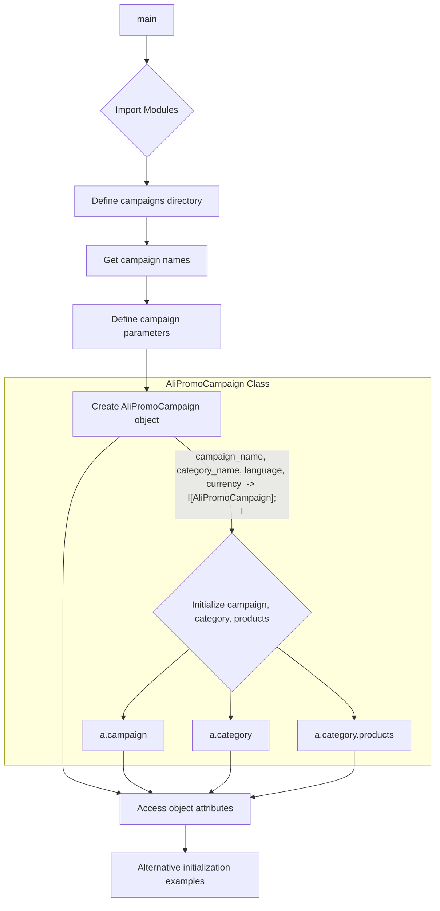

```MD
# <input code>

```python
## \file hypotez/src/suppliers/aliexpress/campaign/_examples/_example_ali_promo_campaign.py
# -*- coding: utf-8 -*-
#! venv/Scripts/python.exe
#! venv/bin/python/python3.12

"""
.. module: src.suppliers.aliexpress.campaign._examples 
	:platform: Windows, Unix
	:synopsis:

"""
MODE = 'dev'

"""
	:platform: Windows, Unix
	:synopsis:

"""


"""
	:platform: Windows, Unix
	:synopsis:

"""


"""
  :platform: Windows, Unix

"""
"""
  :platform: Windows, Unix
  :platform: Windows, Unix
  :synopsis:
"""MODE = 'dev'
  
""" module: src.suppliers.aliexpress.campaign._examples """


""" Примеры создания рекламной кампании """


import header
from pathlib import Path
from types import SimpleNamespace
from src import gs
from src.suppliers.aliexpress import AliPromoCampaign
from src.suppliers.aliexpress import AliAffiliatedProducts
from src.utils import get_filenames, get_directory_names, read_text_file, csv2dict
from src.utils import j_loads_ns
from src.utils import pprint
from src.logger import logger

campaigns_directory = Path(gs.path.google_drive, 'aliexpress', 'campaigns')
campaign_names = get_directory_names(campaigns_directory)

campaign_name = '280624_cleararanse'
category_name = 'gaming_comuter_accessories'
language = 'EN'
currency = 'USD'

a:SimpleNamespace = AliPromoCampaign(campaign_name = campaign_name, 
                     category_name = category_name, 
                     language = language, 
                     currency = currency) 

campaign = a.campaign
category = a.category
products = a.category.products

# dict
a = AliPromoCampaign(campaign_name,category_name,{'EN':'USD'})
# string
a = AliPromoCampaign(campaign_name,category_name, 'EN','USD')
```

# <algorithm>

**Алгоритм**

1. **Импорты:** Импортируются необходимые модули и классы, в том числе из подпапок `src`.
2. **Путь к директории кампаний:** Определяется путь к директории с кампаниями на Google Drive (`campaigns_directory`).
3. **Список названий кампаний:** Получается список имен кампаний в указанной директории (`campaign_names`) с помощью функции `get_directory_names`.
4. **Параметры кампании:** Определяются конкретные параметры кампании: `campaign_name`, `category_name`, `language`, `currency`.
5. **Создание объекта кампании:** Создается объект `AliPromoCampaign` с заданными параметрами. Используется `SimpleNamespace` для  хранения данных.  В этом шаге инициализируются атрибуты `campaign`, `category` и `products` объекта.
6. **Доступ к атрибутам:** Получаются значения атрибутов объекта `a` (как `SimpleNamespace`).
7. **Альтернативные варианты инициализации:** Приведены примеры альтернативного создания объекта `AliPromoCampaign` с различными типами входных данных (словарь и строки).


**Пример данных:**


* `campaigns_directory`: `/path/to/google/drive/aliexpress/campaigns`
* `campaign_name`: '280624_cleararanse'
* `category_name`: 'gaming_comuter_accessories'


**Примеры перемещения данных:**

```
  AliPromoCampaign(campaign_name, category_name, language, currency) -> a
  a.campaign -> campaign
  a.category -> category
  a.category.products -> products
```


# <mermaid>



**Объяснение диаграммы:**

* `main` - точка входа в скрипт.
* `Import Modules`: Импорт всех необходимых модулей, классов и функций.
* `Define campaigns directory`: Определяется переменная `campaigns_directory` с путем к директории кампаний.
* `Get campaign names`:  Получаются имена кампаний в указанной директории.
* `Define campaign parameters`: Определяются конкретные параметры конкретной кампании.
* `Create AliPromoCampaign object`: Создается объект `AliPromoCampaign`, инициализированный полученными параметрами.
* `Access object attributes`: Извлекаются атрибуты (`campaign`, `category`, `products`) созданного объекта.
* `Alternative initialization examples`: Примеры инициализации объекта `AliPromoCampaign` с использованием словаря и строк.
* Подграф `AliPromoCampaign Class`:  Показывается, как класс `AliPromoCampaign` хранит свои внутренние атрибуты (`campaign`, `category`, `products`).

# <explanation>

**Импорты:**

* `header`: Непонятное назначение. По-видимому, содержит дополнительный код, необходимый для запуска скрипта.
* `pathlib`: Для работы с путями к файлам и директориям.
* `types`: Для работы с `SimpleNamespace`.
* `gs`: Из подпапки `src`, вероятно, для доступа к глобальным настройкам или переменным.
* `AliPromoCampaign`, `AliAffiliatedProducts`: Классы из подпапки `src/suppliers/aliexpress`, которые, предположительно, представляют рекламные кампании и связанные продукты.
* `get_filenames`, `get_directory_names`, `read_text_file`, `csv2dict`, `j_loads_ns`, `pprint`, `logger`: Функции из подпапки `src/utils` и `src/logger` для работы с файлами, данными, выводом и логгированием соответственно.


**Классы:**

* `AliPromoCampaign`:  Класс, скорее всего, предназначен для представления рекламной кампании AliExpress. Имеет атрибуты `campaign`, `category`, `products`.  Непонятно, как именно данные будут заполняться внутри.

**Функции:**

Не присутствуют значимые функции, не считая инициализации параметров.

**Переменные:**

* `MODE`:  Переменная, определяющая режим работы (в данном случае, 'dev').
* `campaigns_directory`: Путь к директории на Google Drive, содержащей кампании.
* `campaign_names`: Список имен кампаний в `campaigns_directory`.
* `campaign_name`, `category_name`, `language`, `currency`: Параметры конкретной кампании.
* `a`: Объект `SimpleNamespace`, используемый для хранения данных о кампании.

**Возможные ошибки и улучшения:**

* **Нехватка документации:** Код не содержит достаточной документации.  Необходимо добавить подробные комментарии к классу `AliPromoCampaign`, а также к его методам, объясняющим назначение и поведение.
* **Логирование:** Отсутствует логирование важных событий. Добавьте `logger.info()`, `logger.error()` для отслеживания процесса.
* **Обработка ошибок:** В случае проблем с чтением файлов или доступом к Google Drive, скрипт должен обрабатывать эти ошибки.
* **Инициализация `products`:** Метод инициализации `AliPromoCampaign` не объясняет, как будут наполняться данные в атрибуте `products`.


**Взаимосвязи с другими частями проекта:**

* `gs`: Связано с настройками доступа к Google Drive.
* `AliPromoCampaign`, `AliAffiliatedProducts`:  Связаны с модулями для обработки данных AliExpress.
* `src/utils`:  Обеспечивает вспомогательные функции для работы с файлами и данными.


```