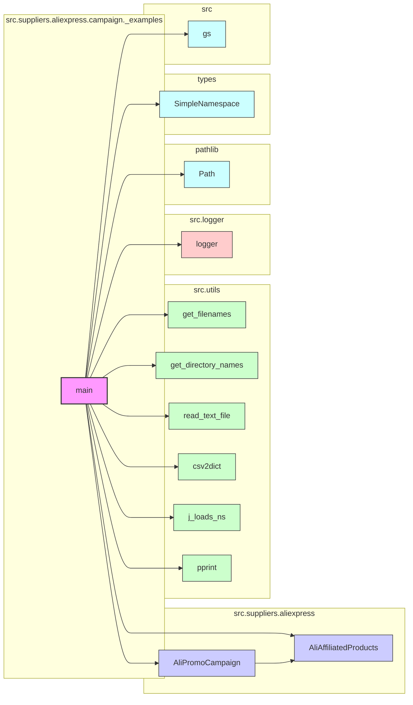

## Анализ кода `_example_ali_promo_campaign.py`

### 1. <алгоритм>

**Блок-схема:**

```mermaid
graph LR
    A[Начало] --> B(Импорт библиотек и модулей);
    B --> C{Определение переменных окружения и констант};
    C --> D(Создание объекта AliPromoCampaign);
    D --> E{Извлечение данных из объекта};
    E --> F(Вывод данных);
    F --> G[Конец];
    
    subgraph Импорт библиотек и модулей
        B --> B1[import header]
        B --> B2[from pathlib import Path]
        B --> B3[from types import SimpleNamespace]
        B --> B4[from src import gs]
        B --> B5[from src.suppliers.aliexpress import AliPromoCampaign]
        B --> B6[from src.suppliers.aliexpress import AliAffiliatedProducts]
        B --> B7[from src.utils import get_filenames, get_directory_names, read_text_file, csv2dict]
        B --> B8[from src.utils.jjson import j_loads_ns]
        B --> B9[from src.utils.printer import pprint]
        B --> B10[from src.logger.logger import logger]
    end
    
    subgraph Определение переменных окружения и констант
        C --> C1[]
        C --> C2[campaigns_directory = Path(...)]
        C --> C3[campaign_names = get_directory_names(...)]
        C --> C4[campaign_name = '280624_cleararanse']
        C --> C5[category_name = 'gaming_comuter_accessories']
        C --> C6[language = 'EN']
        C --> C7[currency = 'USD']
    end

    subgraph Создание объекта AliPromoCampaign
        D --> D1[a = AliPromoCampaign(campaign_name = campaign_name, category_name = category_name, language = language, currency = currency)]
        D --> D2[a = AliPromoCampaign(campaign_name,category_name,{'EN':'USD'})]
        D --> D3[a = AliPromoCampaign(campaign_name,category_name, 'EN','USD')]

    end
    
    subgraph Извлечение данных из объекта
        E --> E1[campaign = a.campaign]
        E --> E2[category = a.category]
        E --> E3[products = a.category.products]
    end

    subgraph Вывод данных
        F --> F1[pprint(campaign)]
        F --> F2[pprint(category)]
        F --> F3[pprint(products)]
    end
```

**Примеры:**

*   **Импорт:**
    *   `pathlib.Path`: для работы с путями файлов.
    *   `SimpleNamespace`: для создания простых объектов с атрибутами.
    *   `src.gs`: глобальные настройки проекта.
    *   `AliPromoCampaign`, `AliAffiliatedProducts`: классы для работы с AliExpress кампаниями и продуктами.
    *   `get_filenames`, `get_directory_names`, `read_text_file`, `csv2dict`: утилиты для работы с файловой системой и данными.
    *   `j_loads_ns`: загрузка JSON с созданием `SimpleNamespace`.
    *   `pprint`: функция для красивой печати.
    *   `logger`: инструмент для логирования.
*   **Создание объекта `AliPromoCampaign`:**  
    `a = AliPromoCampaign(campaign_name = campaign_name, category_name = category_name, language = language, currency = currency)`
    Пример создания объекта `AliPromoCampaign` с явным указанием имен параметров.
    `a = AliPromoCampaign(campaign_name,category_name,{'EN':'USD'})`
    Пример создания объекта `AliPromoCampaign` с передачей валюты в виде словаря.
    `a = AliPromoCampaign(campaign_name,category_name, 'EN','USD')`
    Пример создания объекта `AliPromoCampaign` с передачей языка и валюты в виде строк.
*   **Извлечение данных:**  
    Извлечение атрибутов `campaign`, `category` и `products` из объекта `AliPromoCampaign`.
*  **Вывод данных:**
    Примеры не показаны в коде, но предполагается их использование для отладки.

### 2. <mermaid>



**Объяснение зависимостей:**

*   `A[main]` (скрипт `_example_ali_promo_campaign.py`) зависит от:
    *   `B[AliPromoCampaign]` и `C[AliAffiliatedProducts]` из `src.suppliers.aliexpress` для создания и управления кампаниями и продуктами.
    *   `D[get_filenames]`, `E[get_directory_names]`, `F[read_text_file]`, `G[csv2dict]`, `H[j_loads_ns]`, `I[pprint]` из `src.utils` для работы с файлами, директориями, JSON и форматированным выводом.
    *   `J[logger]` из `src.logger` для логирования событий.
    *   `K[Path]` из `pathlib` для работы с путями файлов и директорий.
    *   `L[SimpleNamespace]` из `types` для создания простых объектов с атрибутами.
    *   `M[gs]` из `src` для получения глобальных настроек проекта.
*   `B[AliPromoCampaign]` зависит от `C[AliAffiliatedProducts]`, так как кампания может включать аффилированные продукты.

### 3. <объяснение>

**Импорты:**

*   `import header`: Предполагается, что это внутренний модуль, возможно, для добавления заголовков или метаданных. В предоставленном коде его реализации нет, поэтому точное назначение неизвестно.
*   `from pathlib import Path`: Модуль для работы с путями к файлам и директориям в объектно-ориентированном стиле, что упрощает манипуляции с путями.
*   `from types import SimpleNamespace`: Класс для создания простых объектов, которые могут иметь произвольные атрибуты, часто используется для хранения данных.
*   `from src import gs`: Импортирует модуль `gs` из пакета `src`, вероятно, содержащий глобальные переменные и настройки.
*   `from src.suppliers.aliexpress import AliPromoCampaign`, `AliAffiliatedProducts`: Импортирует классы для работы с рекламными кампаниями и партнерскими продуктами AliExpress. Они, вероятно, инкапсулируют логику взаимодействия с AliExpress API.
*   `from src.utils import get_filenames, get_directory_names, read_text_file, csv2dict`:  Импортирует функции из `src.utils` для работы с файловой системой, чтения файлов и преобразования данных.
    *   `get_filenames`: Получение списка файлов в директории.
    *   `get_directory_names`: Получение списка директорий.
    *   `read_text_file`: Чтение содержимого текстового файла.
    *   `csv2dict`: Преобразование данных из CSV-файла в словарь.
*   `from src.utils.jjson import j_loads_ns`: Функция из модуля `jjson` для загрузки JSON данных в объект `SimpleNamespace`.
*   `from src.utils.printer import pprint`: Функция для форматированного вывода данных, удобна для отладки.
*   `from src.logger.logger import logger`:  Инструмент для логирования событий, используется для отслеживания работы программы и отладки.

**Классы:**

*   `AliPromoCampaign`:
    *   **Роль:** Представляет рекламную кампанию AliExpress.
    *   **Атрибуты:** `campaign`, `category`, `products`, вероятно, и другие.  
    *   **Методы:** В коде не показаны, но класс должен включать методы для создания, обновления и извлечения данных о рекламной кампании.
    *   **Взаимодействие:** Работает с `AliAffiliatedProducts` для управления продуктами, участвующими в кампании. Зависит от утилит из `src.utils` для чтения конфигурации.
*   `AliAffiliatedProducts`:
     *   **Роль**: Представляет аффилированные продукты AliExpress.
    *   **Атрибуты**: Вероятно, содержит информацию о продуктах, их цене, ссылках, скидках и т.д.
    *   **Методы**: Методы для добавления, удаления, обновления и фильтрации аффилированных продуктов.
    *   **Взаимодействие**: Используется классом `AliPromoCampaign` для управления продуктами в рамках кампании.

**Функции:**

*   `get_directory_names(campaigns_directory)`:
    *   **Аргументы:**  `campaigns_directory` (путь к директории).
    *   **Возвращаемое значение:** Список имен директорий в указанном пути.
    *   **Назначение:** Получение списка названий директорий, которые, предположительно, представляют собой названия кампаний.
*   `pprint(obj)`:
    *   **Аргументы:**  `obj` (любой объект).
    *   **Возвращаемое значение:**  None (выводит форматированный вывод на консоль).
    *   **Назначение:**  Красиво печатает переданный объект, что удобно для отладки и анализа данных.

**Переменные:**

*   `MODE`: Строка, определяющая режим работы скрипта (`'dev'` для разработки).
*   `campaigns_directory`: Объект `Path`, представляющий путь к директории с кампаниями.
*   `campaign_names`: Список строк, содержащий названия директорий кампаний.
*   `campaign_name`: Строка, содержащая название конкретной кампании.
*   `category_name`: Строка, содержащая название категории продуктов.
*   `language`: Строка, содержащая язык для кампании.
*   `currency`: Строка, содержащая валюту для кампании.
*   `a`: Объект `SimpleNamespace` (в коде переопределяется несколько раз) или `AliPromoCampaign`, используемый для доступа к данным кампании.
*   `campaign`:  Атрибут объекта `a`, содержащий информацию о кампании.
*   `category`: Атрибут объекта `a`, содержащий информацию о категории продуктов.
*   `products`:  Атрибут объекта `category`, содержащий список продуктов.

**Цепочка взаимосвязей с другими частями проекта:**

*   Скрипт зависит от глобальных настроек (`gs`), утилит (`src.utils`), системы логирования (`src.logger`), а также классов для работы с AliExpress кампаниями (`src.suppliers.aliexpress`).
*   Использует `pathlib` для работы с путями, что является частью стандартной библиотеки Python.

**Потенциальные ошибки и области для улучшения:**

*   Переопределение переменной `a`:  В коде переменная `a` несколько раз переопределяется разными объектами `AliPromoCampaign`, это может запутать и привести к ошибкам.
*   Отсутствие явного вывода данных: В коде не используется `pprint`, хотя этот импорт есть. Желательно выводить данные для проверки.
*   Обработка ошибок: В коде нет явной обработки ошибок, что может привести к падению программы при возникновении исключений.
*   Неполная реализация классов: Приведенный код показывает только пример использования классов `AliPromoCampaign` и `AliAffiliatedProducts`.
*   `header` модуль не определён.
*   Не все импортированные модули используются в коде, например `get_filenames`, `read_text_file`, `csv2dict`. Это может означать, что эти модули используются в другом месте, или же это неоптимизированный код.
*   В коде встречаются множественные строки docstring, с однотипным текстом. Это следует убрать.
*   В коде отсутствуют комментарии.
*   В коде отсутствует проверка типов.

**Рекомендации:**

1.  Уточнить назначение и использование `header` модуля.
2.  Убрать лишние docstring и добавить комментарии к коду.
3.  Добавить обработку ошибок, например, с использованием `try-except`.
4.  Использовать `pprint` для вывода результатов.
5.  Устранить переопределение переменной `a`, используя разные имена.
6.  Проверить и использовать все импортированные модули.
7.  Добавить проверку типов и валидацию данных.
8.  Дополнить примеры использования классов `AliPromoCampaign` и `AliAffiliatedProducts`.