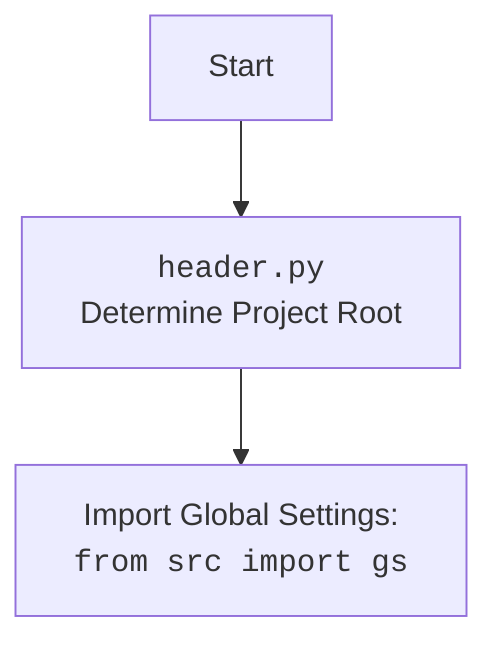

# Анализ кода `_example_ali_promo_campaign.py`

## 1. <алгоритм>

**Блок-схема:**

1.  **Начало**: Инициализация скрипта.
2.  **Импорт модулей**: Импорт необходимых библиотек и модулей:
    *   `header` (определение корня проекта)
    *   `pathlib.Path` (работа с путями)
    *   `types.SimpleNamespace` (пространство имен)
    *   `src.gs` (глобальные настройки)
    *   `src.suppliers.aliexpress.AliPromoCampaign` (класс для работы с рекламными кампаниями)
    *   `src.suppliers.aliexpress.AliAffiliatedProducts` (класс для работы с партнерскими продуктами)
    *   `src.utils.get_filenames`, `src.utils.get_directory_names`, `src.utils.read_text_file`, `src.utils.csv2dict` (утилиты)
    *    `src.utils.jjson.j_loads_ns` (загрузка JSON в namespace)
    *   `src.utils.printer.pprint` (красивый вывод)
    *   `src.logger.logger` (логгер)
    
3.  **Определение директории кампаний**:
    *   Определение пути к директории кампаний (`campaigns_directory`) на Google Drive.
    *   Получение списка названий директорий кампаний (`campaign_names`).
    *   *Пример*: `campaigns_directory` = `<путь_к_google_drive>/aliexpress/campaigns`
       `campaign_names` = `['280624_cleararanse', 'another_campaign']`
4.  **Установка параметров кампании**:
    *   Установка названия кампании (`campaign_name` = `'280624_cleararanse'`).
    *   Установка названия категории (`category_name` = `'gaming_comuter_accessories'`).
    *   Установка языка (`language` = `'EN'`).
    *   Установка валюты (`currency` = `'USD'`).
5.  **Создание экземпляра `AliPromoCampaign` (пример 1)**:
    *   Создание объекта `a` типа `SimpleNamespace`, который содержит экземпляр `AliPromoCampaign`.
    *   Передача параметров `campaign_name`, `category_name`, `language`, `currency`.
        *   *Пример*:  `a = AliPromoCampaign(campaign_name = '280624_cleararanse', category_name = 'gaming_comuter_accessories', language = 'EN', currency = 'USD')`
    *   Доступ к атрибутам `campaign`, `category`, `products` через `a`:
        *   `campaign = a.campaign`
        *   `category = a.category`
        *   `products = a.category.products`
6. **Создание экземпляра `AliPromoCampaign` (пример 2)**:
    *   Создание объекта `a` типа `AliPromoCampaign`
    *   Передача параметров `campaign_name`, `category_name`, `{'EN':'USD'}`.
        *   *Пример*:  `a = AliPromoCampaign('280624_cleararanse','gaming_comuter_accessories', {'EN':'USD'})`
7. **Создание экземпляра `AliPromoCampaign` (пример 3)**:
    *   Создание объекта `a` типа `AliPromoCampaign`
    *   Передача параметров `campaign_name`, `category_name`, `'EN'`, `'USD'`.
        *   *Пример*: `a = AliPromoCampaign('280624_cleararanse', 'gaming_comuter_accessories', 'EN', 'USD')`
8. **Конец**: Завершение работы скрипта.

## 2. <mermaid>

```mermaid
flowchart TD
    Start[Начало] --> ImportModules[Импорт модулей];
    ImportModules --> DefineCampaignDir[Определение директории кампаний];
    DefineCampaignDir --> SetCampaignParams[Установка параметров кампании];
    SetCampaignParams --> CreateAliPromoCampaign1[Создание экземпляра AliPromoCampaign (SimpleNamespace)];
    CreateAliPromoCampaign1 --> AccessCampaignAttributes[Доступ к атрибутам кампании];
    AccessCampaignAttributes --> CreateAliPromoCampaign2[Создание экземпляра AliPromoCampaign (dict)];
    CreateAliPromoCampaign2 --> CreateAliPromoCampaign3[Создание экземпляра AliPromoCampaign (string)];
    CreateAliPromoCampaign3 --> End[Конец];

    style Start fill:#f9f,stroke:#333,stroke-width:2px
    style End fill:#ccf,stroke:#333,stroke-width:2px

    classDef importClass fill:#ccf,stroke:#333,stroke-width:2px
    class ImportModules importClass

```

**Объяснение диаграммы `mermaid`:**

*   `Start`: Начало выполнения скрипта.
*   `ImportModules`: Этот блок представляет импорт всех необходимых модулей, таких как `header`, `pathlib`, `SimpleNamespace`, `src.gs`, `AliPromoCampaign`, `AliAffiliatedProducts` и другие утилиты из `src.utils`.
*   `DefineCampaignDir`: Здесь определяется путь к директории, где хранятся данные о рекламных кампаниях, и извлекается список названий директорий кампаний.
*   `SetCampaignParams`: Устанавливаются основные параметры рекламной кампании: название кампании, категория, язык и валюта.
*   `CreateAliPromoCampaign1`: Создается экземпляр класса `AliPromoCampaign` с параметрами кампании, при этом возвращаемый объект заворачивается в `SimpleNamespace`.
*   `AccessCampaignAttributes`: Получение доступа к атрибутам созданной кампании, таким как `campaign`, `category` и `products`.
*   `CreateAliPromoCampaign2`: Создается второй экземпляр класса `AliPromoCampaign` с теми же параметрами, но с передачей словаря как параметров.
*   `CreateAliPromoCampaign3`: Создается третий экземпляр класса `AliPromoCampaign` с теми же параметрами, но с передачей строки как параметров.
*   `End`: Конец выполнения скрипта.

Дополнительно:


    
**Объяснение диаграммы header.py:**
 * `Start`: Начало определения корня проекта.
 * `Header`:  Представляет исполнение кода `header.py`, который занимается определением корня проекта на основе текущего положения файла.
 * `import`: Импортирует глобальные настройки, которые будут использоваться остальным кодом.

## 3. <объяснение>

### Импорты:

*   `import header`: Модуль `header.py` используется для определения корня проекта, что позволяет правильно импортировать другие модули из пакета `src`. Он настраивает пути к файлам и каталогам.
*   `from pathlib import Path`: Предоставляет класс `Path` для удобной работы с путями к файлам и каталогам в разных операционных системах.
*   `from types import SimpleNamespace`:  `SimpleNamespace` - это простой класс для создания объектов с произвольными атрибутами, используемый для хранения конфигурации кампании.
*   `from src import gs`: Импортирует глобальные настройки проекта из модуля `gs` в пакете `src`. Эти настройки могут содержать пути, параметры конфигурации и т.д.
*   `from src.suppliers.aliexpress import AliPromoCampaign`: Импортирует класс `AliPromoCampaign`, который является основным классом для работы с рекламными кампаниями AliExpress.
*   `from src.suppliers.aliexpress import AliAffiliatedProducts`: Импортирует класс `AliAffiliatedProducts`, который используется для управления партнерскими продуктами AliExpress.
*   `from src.utils import get_filenames, get_directory_names, read_text_file, csv2dict`: Импортирует утилиты для работы с файловой системой, чтения текстовых и CSV файлов.
*   `from src.utils.jjson import j_loads_ns`: Импортирует функцию для загрузки JSON данных и создания из них объектов типа `SimpleNamespace`.
*   `from src.utils.printer import pprint`:  Импортирует функцию `pprint` для форматированного вывода данных, облегчающего чтение.
*   `from src.logger.logger import logger`: Импортирует объект `logger` для логирования сообщений.

### Переменные:

*   `campaigns_directory`: `pathlib.Path` - объект, представляющий путь к директории с данными о рекламных кампаниях на Google Drive.
*   `campaign_names`: `list` - список строк, содержащий имена директорий с кампаниями.
*   `campaign_name`: `str` - имя конкретной рекламной кампании (`'280624_cleararanse'`).
*   `category_name`: `str` - имя категории товаров (`'gaming_comuter_accessories'`).
*   `language`: `str` - язык для кампании (`'EN'`).
*   `currency`: `str` - валюта для кампании (`'USD'`).
*   `a`: `SimpleNamespace`, `AliPromoCampaign` -  объект, содержащий экземпляр класса `AliPromoCampaign`.
*   `campaign`: `object` -  объект кампании, полученный из экземпляра `AliPromoCampaign`.
*    `category`: `object` -  объект категории, полученный из экземпляра `AliPromoCampaign`.
*   `products`: `list` - список продуктов, полученный из объекта `category`.

### Классы:

*   `AliPromoCampaign`: Класс, отвечающий за создание и управление рекламными кампаниями AliExpress. Принимает параметры кампании, такие как название, категория, язык и валюта, и предоставляет доступ к данным кампании, категории и продуктам.
    *   **Атрибуты**:
        *   `campaign`:  Объект, представляющий кампанию.
        *   `category`:  Объект, представляющий категорию товаров.
        *   `category.products`:  Список продуктов в категории.
    *   **Методы**:  В предоставленном коде не показаны методы класса, но предполагается, что `AliPromoCampaign` имеет методы для инициализации, получения данных и т.д.

### Функции:

*   `get_directory_names(path)`: Функция из `src.utils`, которая принимает путь к директории и возвращает список имен поддиректорий.
*   `get_filenames(path)`: Функция из `src.utils`, которая принимает путь к директории и возвращает список файлов.
*   `read_text_file(path)`: Функция из `src.utils`, которая читает текст из файла.
*   `csv2dict(path)`: Функция из `src.utils`, которая конвертирует csv файл в словарь.
*    `j_loads_ns(data)`: Функция из `src.utils.jjson`, которая загружает JSON данные в виде SimpleNamespace.
*   `pprint(data)`: Функция из `src.utils.printer`, которая форматированно выводит данные.

### Потенциальные ошибки и области для улучшения:

*   **Использование `SimpleNamespace`**: Использование `SimpleNamespace` может быть неудобным для дальнейшей работы, лучше использовать полноценный класс для хранения конфигурации кампании.
*   **Множественное создание экземпляров `AliPromoCampaign`**:  Создается три экземпляра класса `AliPromoCampaign`, что может быть избыточным и запутать код.
*   **Отсутствие обработки исключений**: В коде отсутствуют блоки `try...except`, что может привести к неожиданным ошибкам.
*   **Жестко заданные параметры**: Жесткое задание параметров кампании может ограничить гибкость скрипта. Лучше использовать аргументы командной строки или конфигурационные файлы.
*   **Отсутствует использование логгера**:  В коде присутствует импорт логгера, но он не используется для логирования действий и ошибок.
*   **Использование строк для валюты**: Использование строк в качестве ключа словаря (`{'EN':'USD'}`) является не оптимальным подходом,  лучше использовать именованные константы или enums.

### Взаимосвязи с другими частями проекта:

*   Данный скрипт зависит от `header.py`, который определяет корень проекта, `gs.py` для доступа к глобальным настройкам,  а также от классов и функций, предоставляемых пакетом `src.utils`.
*   Скрипт использует класс `AliPromoCampaign` для создания и управления рекламными кампаниями AliExpress. Этот класс, вероятно, взаимодействует с другими модулями для получения данных о товарах, категориях, и т.д.
*   Класс `AliAffiliatedProducts` не используется в примере, но может быть связан с классом `AliPromoCampaign`.

**Цепочка взаимосвязей:**
`_example_ali_promo_campaign.py` -> `header.py` -> `src.gs` -> `src.suppliers.aliexpress.AliPromoCampaign` -> `src.utils` -> `src.logger`