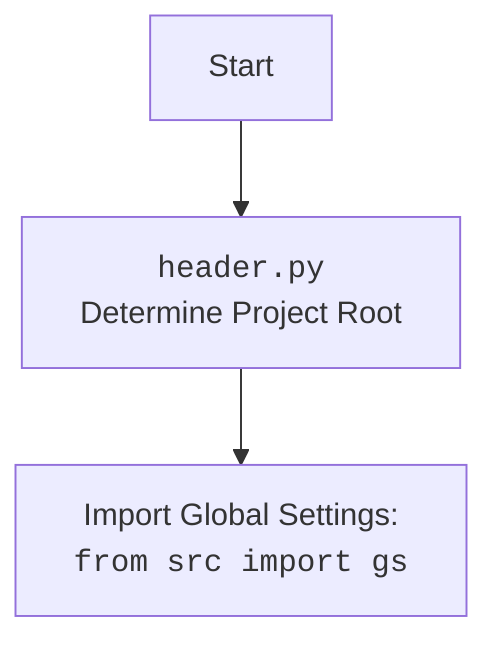

## АНАЛИЗ КОДА

### 1. **<алгоритм>**

**Описание рабочего процесса:**

1. **Инициализация (`__init__`)**:
   - Класс `AliCampaignEditor` наследует от `AliPromoCampaign`.
   - При создании экземпляра класса `AliCampaignEditor` вызывается конструктор `__init__`.
   - Принимает параметры:
     - `campaign_name` (str): Название рекламной кампании.
     - `category_name` (str): Название категории.
     - `language` (str, по умолчанию 'EN'): Язык кампании.
     - `currency` (str, по умолчанию 'USD'): Валюта кампании.
   - Вызывает конструктор родительского класса `AliPromoCampaign` с теми же параметрами для инициализации.
   - Пример:
     ```python
     editor = AliCampaignEditor(campaign_name="Test Campaign", category_name="Electronics", language="RU", currency="RUB")
     ```
     *Данные передаются из функции инициализации, передаются в конструктор базового класса `AliPromoCampaign`*

**Пример обработки данных:**

```mermaid
graph LR
    A[Start: Инициализация] --> B{Создание AliCampaignEditor};
    B --> C{Вызов __init__};
    C --> D{Вызов super().__init__};
    D --> E{Инициализация AliPromoCampaign};
    E --> F[End: Объект создан];
   
    style A fill:#f9f,stroke:#333,stroke-width:2px
    style F fill:#ccf,stroke:#333,stroke-width:2px
```

### 2. **<mermaid>**
```mermaid
    flowchart TD
        Start[Start] --> Initialize[Initialize AliCampaignEditor];
        Initialize --> CallParentConstructor[Call AliPromoCampaign's __init__];
        CallParentConstructor --> End[End];

        classDef init fill:#f9f,stroke:#333,stroke-width:2px;
        class Start,End init;
        classDef process fill:#ccf,stroke:#333,stroke-width:2px;
        class Initialize, CallParentConstructor process;


        subgraph AliCampaignEditor
            Initialize
        end
        subgraph AliPromoCampaign
           CallParentConstructor
        end

```

**Объяснение зависимостей:**

*   **flowchart TD**: Определяет тип диаграммы как блок-схему.
*   **Start**: Начало процесса, представляющее собой начало инициализации объекта.
*   **Initialize AliCampaignEditor**: Блок, представляющий инициализацию объекта класса `AliCampaignEditor`.
*   **Call AliPromoCampaign's \_\_init\_\_**: Блок, представляющий вызов конструктора родительского класса `AliPromoCampaign` для наследования его свойств и методов.
*   **End**: Конец процесса, представляющий успешное завершение инициализации объекта.
*  **subgraph AliCampaignEditor** -  отмечает принадлежность `Initialize` к классу `AliCampaignEditor`.
*  **subgraph AliPromoCampaign** - отмечает принадлежность `CallParentConstructor` к классу `AliPromoCampaign`.
*   **classDef init fill:#f9f,stroke:#333,stroke-width:2px;**:  Определяет стиль для начального и конечного блоков.
*   **class Start,End init;**: Применяет стиль `init` к блокам `Start` и `End`.
*    **classDef process fill:#ccf,stroke:#333,stroke-width:2px;**:  Определяет стиль для блоков процессов.
*    **class Initialize, CallParentConstructor process;**: Применяет стиль `process` к блокам `Initialize` и `CallParentConstructor`.



### 3. **<объяснение>**

**Импорты:**

*   `re`: Модуль для работы с регулярными выражениями (используется в `extract_prod_ids`, не представлен в примере).
*   `shutil`: Модуль для высокоуровневых операций с файлами (не используется в примере).
*   `pathlib.Path`: Класс для работы с путями к файлам и директориям (не используется в примере).
*   `typing.List, Optional, Union`: Типизация для аннотации типов переменных и функций (не используется напрямую в примере, но может использоваться в других частях класса, не показанных в примере).
*   `types.SimpleNamespace`: Создает простые объекты для хранения атрибутов. (не используется в примере).
*   `src.gs`: Глобальные настройки проекта.
*   `src.suppliers.aliexpress.scenarios.campaigns.AliPromoCampaign`: Базовый класс для рекламных кампаний AliExpress.
*   `src.suppliers.aliexpress.affiliated_products_generator.AliAffiliatedProducts`: Класс для генерации партнерских продуктов AliExpress (не используется в примере).
*   `src.suppliers.aliexpress.utils.extract_product_id.extract_prod_ids`: Функция для извлечения ID продуктов (не используется в примере).
*   `src.suppliers.aliexpress.utils.set_full_https.ensure_https`: Функция для преобразования URL в HTTPS (не используется в примере).
*   `src.utils.jjson.j_loads_ns, j_loads`: Функции для загрузки JSON.
*   `src.utils.convertors.list2string, csv2dict`: Функции для преобразования данных (не используются в примере).
*   `src.utils.printer.pprint`: Функция для красивого вывода данных (не используется в примере).
*    `src.utils.jjson.j_dumps, j_loads, j_loads_ns`: Функции для работы с JSON (не используется в примере).
*    `utils.interface.read_text_file, get_filenames`: Функции для чтения файлов (не используются в примере).
*   `src.logger.logger`: Модуль для логирования (не используется в примере).

**Классы:**

*   `AliCampaignEditor`:
    *   **Роль**: Редактор рекламных кампаний AliExpress, наследуется от `AliPromoCampaign`.
    *   **Атрибуты**:
        *   `campaign_name` (str): Имя кампании.
        *   `category_name` (str): Имя категории.
        *   `language` (str): Язык кампании (по умолчанию 'EN').
        *   `currency` (str): Валюта кампании (по умолчанию 'USD').
    *   **Методы**:
        *   `__init__`: Конструктор класса, который инициализирует объект и вызывает конструктор родительского класса.

**Функции:**

*   `__init__(self, campaign_name: str, category_name: str, language: str = 'EN', currency: str = 'USD')`:
    *   **Аргументы**:
        *   `campaign_name` (str): Имя кампании.
        *   `category_name` (str): Имя категории.
        *   `language` (str, по умолчанию 'EN'): Язык кампании.
        *   `currency` (str, по умолчанию 'USD'): Валюта кампании.
    *   **Возвращаемое значение**: None.
    *   **Назначение**: Инициализирует объект `AliCampaignEditor`, вызывая конструктор базового класса `AliPromoCampaign`.
    *   **Примеры**:
        ```python
        editor = AliCampaignEditor(campaign_name="Summer Sale", category_name="Clothing", language="RU", currency="RUB")
        ```

**Переменные:**

*   `campaign_name`, `category_name`, `language`, `currency`: Атрибуты экземпляра класса `AliCampaignEditor`, которые хранят информацию о кампании, как описано выше.

**Цепочка взаимосвязей:**

1.  `AliCampaignEditor` наследуется от `AliPromoCampaign`, что подразумевает использование функциональности базового класса.
2.  Импортирует `gs` для доступа к глобальным настройкам проекта.
3.  Использует классы и функции из других модулей (`src.suppliers.aliexpress.utils`, `src.utils`) для работы с данными, JSON и т.д. (хотя некоторые из этих импортов не используются в показанном примере кода).

**Потенциальные ошибки и области для улучшения:**

1.  **Не все импорты используются**: В коде есть импорты, которые не используются в представленном примере. Это может указывать на избыточные зависимости или на то, что не весь код класса представлен.
2.  **Отсутствует реализация методов**: В классе `AliCampaignEditor` нет никакой реализации методов кроме конструктора, что указывает на неполноту представленного кода.

**Дополнительно**:

*   Представленный код является лишь частью более крупного проекта, и его функциональность зависит от импортированных модулей и базового класса `AliPromoCampaign`.
*   Для полноценного анализа необходимо иметь доступ к полному коду классов `AliPromoCampaign` и других импортированных модулей.
*   В целом, код демонстрирует структуру класса для управления рекламными кампаниями AliExpress, но требует дополнительных деталей для полного понимания его функциональности.