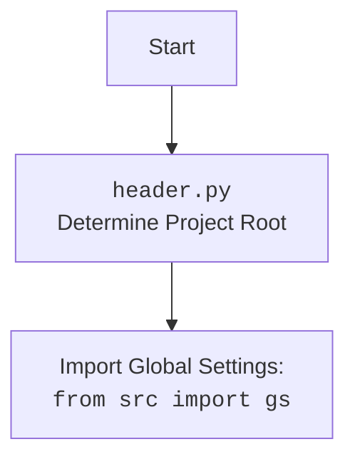

## <алгоритм>

1.  **Инициализация ( `__init__` ):**
    *   Принимает на вход: `campaign_name` (название кампании, строка), `category_name` (название категории, строка), `language` (язык, строка, по умолчанию 'EN') и `currency` (валюта, строка, по умолчанию 'USD').
    *   Вызывает конструктор родительского класса `AliPromoCampaign` с теми же аргументами.
    *   Пример:
        ```python
        editor = AliCampaignEditor(campaign_name="SummerSale", category_name="Clothes", language="RU", currency="RUB")
        ```
2.  **Импорт модулей и классов**:
    *   Импортируются модули для работы с файлами, типами данных, JSON, логгированием и специализированные модули для работы с AliExpress API (генерация аффилированных товаров, извлечение ID продуктов, работа с HTTP).
3.  **Работа с кампаниями** :
    *   Класс `AliCampaignEditor` наследует функциональность от `AliPromoCampaign`, что позволяет использовать его методы для управления рекламными кампаниями.

```mermaid
flowchart TD
    Start[Начало] --> ImportModules[Импорт необходимых модулей и классов];
    ImportModules --> CreateAliCampaignEditor[Создание экземпляра класса AliCampaignEditor];
    CreateAliCampaignEditor --> InitializeObject[Инициализация объекта с помощью __init__];
    InitializeObject --> CallSuperClassConstructor[Вызов конструктора родительского класса AliPromoCampaign];
    CallSuperClassConstructor --> End[Конец];
    
    style Start fill:#f9f,stroke:#333,stroke-width:2px
    style End fill:#ccf,stroke:#333,stroke-width:2px

    subgraph "Модули и классы"
    
    ImportModules --> re_module[re]
    ImportModules --> shutil_module[shutil]
    ImportModules --> pathlib_module[pathlib.Path]
    ImportModules --> typing_module[typing.List, typing.Optional, typing.Union]
     ImportModules --> types_module[types.SimpleNamespace]    
    ImportModules --> gs_module[src.gs]
    ImportModules --> AliPromoCampaign_module[src.suppliers.aliexpress.scenarios.campaigns.AliPromoCampaign]
    ImportModules --> AliAffiliatedProducts_module[src.suppliers.aliexpress.affiliated_products_generator.AliAffiliatedProducts]
    ImportModules --> extract_prod_ids_module[src.suppliers.aliexpress.utils.extract_product_id.extract_prod_ids]
    ImportModules --> ensure_https_module[src.suppliers.aliexpress.utils.set_full_https.ensure_https]
    ImportModules --> j_loads_ns_module[src.utils.jjson.j_loads_ns]
    ImportModules --> j_loads_module[src.utils.jjson.j_loads]
    ImportModules --> list2string_module[src.utils.convertors.list2string]
    ImportModules --> csv2dict_module[src.utils.convertors.csv2dict]
    ImportModules --> pprint_module[src.utils.printer.pprint]
     ImportModules --> j_dumps_module[src.utils.jjson.j_dumps]
    ImportModules --> read_text_file_module[utils.interface.read_text_file]
    ImportModules --> get_filenames_module[utils.interface.get_filenames]
    ImportModules --> logger_module[src.logger.logger.logger]
    end
   
```

## <mermaid>





## <объяснение>

### Импорты:

*   **`re`**: Модуль для работы с регулярными выражениями. Используется для обработки текстовых данных, например, для извлечения ID продуктов.
*   **`shutil`**: Модуль для работы с файлами и каталогами. Может использоваться для копирования или перемещения файлов.
*   **`pathlib.Path`**: Класс для работы с путями к файлам и каталогам. Обеспечивает более объектно-ориентированный подход по сравнению с обычными строками путей.
*   **`typing.List, typing.Optional, typing.Union`**: Модули для аннотации типов, что делает код более читаемым и позволяет статическим анализаторам находить ошибки на ранних стадиях.
    *   `List`: для определения списков;
    *   `Optional`: для определения переменных, которые могут быть None;
    *   `Union`: для переменных, которые могут принимать значения разных типов.
*   **`types.SimpleNamespace`**: Класс для создания объектов с атрибутами, доступными через точку (например, `obj.attr`). Позволяет передавать данные в структурированном виде.
*    **`src.gs`**:  Глобальные настройки проекта. Предположительно, содержит конфигурационные параметры, используемые в различных модулях.
*   **`src.suppliers.aliexpress.scenarios.campaigns.AliPromoCampaign`**: Базовый класс для работы с рекламными кампаниями AliExpress. `AliCampaignEditor` наследуется от него, что позволяет использовать его методы.
*  **`src.suppliers.aliexpress.affiliated_products_generator.AliAffiliatedProducts`**: Класс для генерации аффилированных товаров AliExpress. Может использоваться для добавления продуктов в кампанию.
*   **`src.suppliers.aliexpress.utils.extract_product_id.extract_prod_ids`**: Функция для извлечения ID продуктов из строк или других источников.
*   **`src.suppliers.aliexpress.utils.set_full_https.ensure_https`**: Функция для преобразования URL-адресов в формат `https`.
*   **`src.utils.jjson.j_loads_ns`**: Функция для загрузки JSON данных в `SimpleNamespace`, позволяя обращаться к данным как к атрибутам объекта.
*   **`src.utils.jjson.j_loads`**: Функция для загрузки JSON данных.
*    **`src.utils.jjson.j_dumps`**: Функция для преобразования Python объектов в JSON-строку.
*   **`src.utils.convertors.list2string`**: Функция для преобразования списка в строку.
*   **`src.utils.convertors.csv2dict`**: Функция для преобразования CSV данных в словарь.
*   **`src.utils.printer.pprint`**: Функция для "красивого" вывода данных.
*   **`utils.interface.read_text_file`**: Функция для чтения текстового файла.
*   **`utils.interface.get_filenames`**: Функция для получения списка имен файлов.
*   **`src.logger.logger.logger`**: Объект логгера для записи сообщений о событиях и ошибках.

### Классы:

*   **`AliCampaignEditor(AliPromoCampaign)`**:
    *   **Роль**: Класс для редактирования рекламных кампаний AliExpress. Наследует от `AliPromoCampaign`, получая доступ к методам управления кампаниями.
    *   **Атрибуты**:
        *   `campaign_name`: Название рекламной кампании.
        *   `category_name`: Название категории товаров.
        *   `language`: Язык для кампании.
        *  `currency`: Валюта для кампании.
    *   **Методы**:
        *   `__init__(self, campaign_name: str, category_name: str, language: str = 'EN', currency: str = 'USD')`: Конструктор класса.
            *   Вызывает конструктор родительского класса `AliPromoCampaign`, инициализируя базовые параметры кампании.
### Функции
*   `__init__`: Конструктор класса `AliCampaignEditor`, который инициализирует объект с названием кампании, названием категории, языком и валютой. Вызывает конструктор родительского класса `AliPromoCampaign` для выполнения базовой инициализации.
    * **Аргументы:**
        * `campaign_name` (str): Название рекламной кампании.
        * `category_name` (str): Название категории товаров.
        * `language` (str, по умолчанию 'EN'): Язык для кампании.
        * `currency` (str, по умолчанию 'USD'): Валюта для кампании.
    * **Возвращаемое значение:** None.

### Переменные:

*   `campaign_name`, `category_name`, `language`, `currency` : Строковые переменные, используемые для хранения параметров кампании.

### Потенциальные ошибки и улучшения:

*   **Отсутствие конкретной реализации:** В коде есть много многоточий (`...`), что указывает на отсутствие реальной логики внутри методов и класса.
*   **Расширение функционала:** Класс `AliCampaignEditor` имеет пустой конструктор, но в реальности он должен реализовывать методы редактирования рекламных кампаний (например, добавление продуктов, изменение бюджета, и т.д.).
*   **Использование `header.py`**: В данном файле не импортируется `header.py`, но в других файлах проекта это может быть использовано для определения корневой директории проекта.

### Взаимосвязи с другими частями проекта:

*   **`AliPromoCampaign`**: `AliCampaignEditor` наследует от `AliPromoCampaign`, что означает, что он зависит от логики управления рекламными кампаниями, реализованной в базовом классе.
*   **`AliAffiliatedProducts`**: `AliCampaignEditor` может использовать `AliAffiliatedProducts` для генерации списка аффилированных товаров для рекламной кампании.
*   **Утилиты `src.utils`**:  Используются для JSON обработки, конвертации данных и логгирования, что обеспечивает гибкость и переиспользование кода.
*   **Модули `src.suppliers.aliexpress`**:  `AliCampaignEditor` является частью модуля `aliexpress`, что обеспечивает структурированный и модульный подход к работе с AliExpress API.
*   **Глобальные настройки `src.gs`**: `AliCampaignEditor` использует глобальные настройки проекта для конфигурации.

В заключение, данный код является основой для создания редактора рекламных кампаний AliExpress. Он структурирован, использует ООП, но требует добавления реальной бизнес-логики для работы.