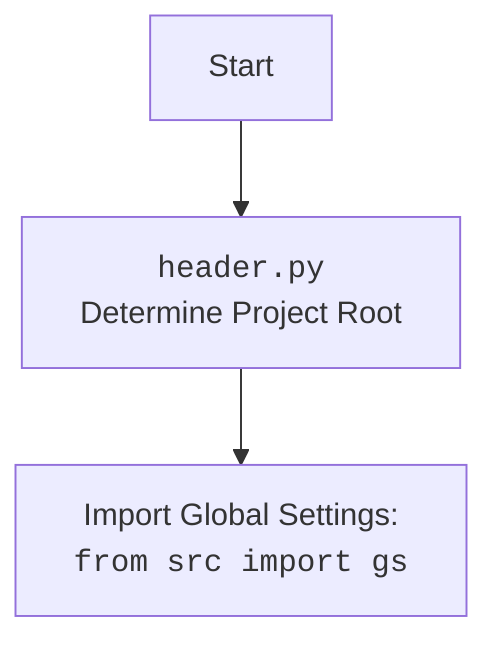

## ИНСТРУКЦИЯ:

Анализируй предоставленный код подробно и объясни его функциональность. Ответ должен включать три раздела:  

1.  **<алгоритм>**: Опиши рабочий процесс в виде пошаговой блок-схемы, включая примеры для каждого логического блока, и проиллюстрируй поток данных между функциями, классами или методами.  
2.  **<mermaid>**: Напиши код для диаграммы в формате `mermaid`, проанализируй и объясни все зависимости,
    которые импортируются при создании диаграммы.
    **ВАЖНО!** Убедитесь, что все имена переменных, используемые в диаграмме `mermaid`,
    имеют осмысленные и описательные имена. Имена переменных вроде `A`, `B`, `C`, и т.д., не допускаются!  
    
    **Дополнительно**: Если в коде есть импорт `import header`, добавьте блок `mermaid` flowchart, объясняющий `header.py`:\
    ```mermaid\
    flowchart TD\
        Start --> Header[<code>header.py</code><br> Determine Project Root]\
    \
        Header --> import[Import Global Settings: <br><code>from src import gs</code>] \
    ```

3.  **<объяснение>**: Предоставьте подробные объяснения:
    -   **Импорты**: Их назначение и взаимосвязь с другими пакетами `src.`.
    -   **Классы**: Их роль, атрибуты, методы и взаимодействие с другими компонентами проекта.
    -   **Функции**: Их аргументы, возвращаемые значения, назначение и примеры.
    -   **Переменные**: Их типы и использование.
    -   Выделите потенциальные ошибки или области для улучшения.

Дополнительно, постройте цепочку взаимосвязей с другими частями проекта (если применимо).

Это обеспечивает всесторонний и структурированный анализ кода.
## Формат ответа: `.md` (markdown)
**КОНЕЦ ИНСТРУКЦИИ**
## <алгоритм>

1. **Импорт модулей:**
   - Импортируются необходимые библиотеки и модули для работы с файлами, текстом, JSON, CSV, и другие.
   - Например, `re` для работы с регулярными выражениями, `pathlib.Path` для работы с путями файлов.
   - Импортируются модули проекта `src`, такие как `gs` (глобальные настройки), `AliPromoCampaign`, `AliAffiliatedProducts`, `extract_prod_ids`, `ensure_https`, `j_loads_ns`, `j_loads`, `list2string`, `csv2dict`, `pprint`, `j_dumps`, `logger`,  `read_text_file`, `get_filenames`.
2. **Объявление класса `AliCampaignEditor`:**
   - Определяется класс `AliCampaignEditor`, который наследуется от `AliPromoCampaign`.
   - Класс предназначен для редактирования рекламных кампаний AliExpress.
3. **Метод `__init__`:**
   - Конструктор класса `AliCampaignEditor`, принимает имя кампании (`campaign_name`), имя категории (`category_name`), язык (`language` по умолчанию 'EN') и валюту (`currency` по умолчанию 'USD').
   - Вызывает конструктор родительского класса `AliPromoCampaign` с переданными аргументами.

**Примеры:**
- **Импорт модулей:** `import re` (пример: для поиска определенных шаблонов в строке), `from pathlib import Path` (пример: для создания объектов путей к файлам).
- **Объявление класса:** `class AliCampaignEditor(AliPromoCampaign):` создает класс, который наследует функционал `AliPromoCampaign` и добавляет свою.
- **Метод `__init__`:** при создании экземпляра `AliCampaignEditor` с помощью `editor = AliCampaignEditor("test_campaign", "electronics", language="RU", currency="RUB")` будут переданы параметры для создания объекта и вызова конструктора родительского класса.

```mermaid
flowchart TD
    Start --> ImportModules[Импорт модулей]
    ImportModules --> ClassDefinition[Определение класса AliCampaignEditor]
    ClassDefinition --> Constructor[Метод __init__]
    Constructor --> ParentConstructorCall[Вызов __init__ родительского класса AliPromoCampaign]
    
    
    ImportModules --> reModule[import re]
    ImportModules --> shutilModule[import shutil]
    ImportModules --> pathlibModule[from pathlib import Path]
    ImportModules --> typingModule[from typing import List, Optional, Union]
    ImportModules --> typesModule[from types import SimpleNamespace]
    ImportModules --> globalSettings[from src import gs]
    ImportModules --> aliPromoCampaignModule[from src.suppliers.aliexpress.scenarios.campaigns import AliPromoCampaign]
    ImportModules --> aliAffiliatedProductsModule[from src.suppliers.aliexpress.affiliated_products_generator import AliAffiliatedProducts]
    ImportModules --> extractProductIdModule[from src.suppliers.aliexpress.utils.extract_product_id import extract_prod_ids]
    ImportModules --> ensureHttpsModule[from src.suppliers.aliexpress.utils.set_full_https import ensure_https]
    ImportModules --> jjsonModule[from src.utils.jjson import j_loads_ns, j_loads]
    ImportModules --> convertorsModule[from src.utils.convertors import list2string, csv2dict]
    ImportModules --> printerModule[from src.utils.printer import pprint]
    ImportModules --> jjsonModule2[from src.utils.jjson import j_dumps, j_loads, j_loads_ns]
    ImportModules --> interfaceModule[from utils.interface import read_text_file, get_filenames]
    ImportModules --> loggerModule[from src.logger.logger import logger]

    
    
    classDef imports fill:#f9f,stroke:#333,stroke-width:2px
    classDef class_def fill:#ccf,stroke:#333,stroke-width:2px
    classDef method_def fill:#cfc,stroke:#333,stroke-width:2px
    class ImportModules imports
    class ClassDefinition class_def
    class Constructor method_def
```

## <mermaid>


### Объяснение `mermaid`:

Диаграмма показывает поток выполнения кода.

- **Start**: Начало выполнения скрипта.
- **ImportModules**: Блок, обозначающий импорт различных модулей. Каждый модуль импортируется для конкретной цели, как показано ниже:
  - `reModule`: Модуль `re` для работы с регулярными выражениями.
  - `shutilModule`: Модуль `shutil` для операций с файлами и каталогами (копирование, удаление).
  - `pathlibModule`: Модуль `pathlib` для работы с путями к файлам в объектно-ориентированном стиле.
  - `typingModule`: Модуль `typing` для объявления типов (например, `List`, `Optional`, `Union`).
  - `typesModule`: Модуль `types` для работы с типами, в данном случае `SimpleNamespace`.
  - `globalSettings`: Модуль `gs` для доступа к глобальным настройкам проекта.
  - `aliPromoCampaignModule`: Модуль `AliPromoCampaign` для работы с рекламными кампаниями AliExpress.
  - `aliAffiliatedProductsModule`: Модуль `AliAffiliatedProducts` для генерации партнерских продуктов AliExpress.
  - `extractProductIdModule`: Модуль `extract_prod_ids` для извлечения ID продуктов.
  - `ensureHttpsModule`: Модуль `ensure_https` для обеспечения использования HTTPS в URL.
  - `jjsonModule`: Модуль `j_loads_ns` и `j_loads` из `jjson` для работы с JSON.
  - `convertorsModule`: Модуль `list2string` и `csv2dict` для преобразования данных.
  - `printerModule`: Модуль `pprint` для форматированного вывода.
  - `jjsonModule2`: Модуль `j_dumps`, `j_loads`, и `j_loads_ns` из `jjson` для работы с JSON (повторение для полноты).
  - `interfaceModule`: Модуль `read_text_file` и `get_filenames` для работы с файлами.
  - `loggerModule`: Модуль `logger` для логирования.
- **ClassDefinition**: Блок, обозначающий определение класса `AliCampaignEditor`.
- **Constructor**: Блок, обозначающий метод `__init__` (конструктор) класса `AliCampaignEditor`.
- **ParentConstructorCall**: Блок, показывающий вызов конструктора родительского класса `AliPromoCampaign`.



## <объяснение>

### Импорты:

-   `import re`: Модуль для работы с регулярными выражениями, используется для поиска и замены текста по шаблону.
-   `import shutil`: Модуль для операций с файлами и директориями, таких как копирование и удаление.
-   `from pathlib import Path`:  Используется для объектно-ориентированной работы с путями к файлам и каталогам. `Path` позволяет создавать, манипулировать и получать информацию о путях к файлам, что является более удобным и кроссплатформенным способом, чем работа со строками.
-   `from typing import List, Optional, Union`: Используется для аннотации типов, что повышает читаемость и обнаруживает ошибки на этапе разработки.
    - `List`: Обозначает тип данных "список".
    - `Optional`: Обозначает тип данных, который может быть либо определенным типом, либо `None`.
    - `Union`: Обозначает тип данных, который может быть одним из нескольких указанных типов.
-   `from types import SimpleNamespace`: Предоставляет простой способ создания объектов с атрибутами, доступными через точечную нотацию.
-   `from src import gs`: Импортирует модуль `gs` из пакета `src`, который предположительно содержит глобальные настройки приложения.
-  `from src.suppliers.aliexpress.scenarios.campaigns import AliPromoCampaign`: Импортирует класс `AliPromoCampaign` из модуля `campaigns`, предназначенный для работы с рекламными кампаниями AliExpress.
-   `from src.suppliers.aliexpress.affiliated_products_generator import AliAffiliatedProducts`:  Импортирует класс `AliAffiliatedProducts`, предназначенный для генерации партнерских продуктов AliExpress.
-   `from src.suppliers.aliexpress.utils.extract_product_id import extract_prod_ids`:  Импортирует функцию `extract_prod_ids` для извлечения ID продуктов AliExpress.
-  `from src.suppliers.aliexpress.utils.set_full_https import ensure_https`: Импортирует функцию `ensure_https` для преобразования URL в формат HTTPS.
-   `from src.utils.jjson import j_loads_ns, j_loads`: Импортирует функции `j_loads_ns` и `j_loads` для загрузки данных JSON в объекты `SimpleNamespace` и словари соответственно.
-   `from src.utils.convertors import list2string, csv2dict`: Импортирует функции `list2string` и `csv2dict` для преобразования данных из списков в строки и из CSV в словари соответственно.
-   `from src.utils.printer import pprint`: Импортирует функцию `pprint` для форматированного вывода данных.
-    `from src.utils.jjson import j_dumps, j_loads, j_loads_ns`:  Импортирует функции `j_dumps` для преобразования Python объектов в JSON, и `j_loads` и `j_loads_ns` для загрузки данных JSON (повторный импорт, возможно, не требуется).
-   `from utils.interface import read_text_file, get_filenames`: Импортирует функции `read_text_file` и `get_filenames` для работы с файлами и каталогами.
-   `from src.logger.logger import logger`: Импортирует объект `logger` для записи логов.

### Классы:

-   `class AliCampaignEditor(AliPromoCampaign):`:
    -   **Роль**: Класс `AliCampaignEditor` предназначен для редактирования рекламных кампаний AliExpress.
    -   **Атрибуты**:  Этот класс не имеет явных атрибутов, так как в предоставленном коде они не указаны, однако он наследует все атрибуты родительского класса `AliPromoCampaign`.
    -   **Методы**:
        -   `__init__(self, campaign_name: str, category_name: str, language: str = 'EN', currency: str = 'USD')`: Конструктор класса, который принимает имя кампании, имя категории, язык и валюту. Вызывает конструктор родительского класса `AliPromoCampaign` с этими аргументами.
    -   **Взаимодействие**: Наследует методы и свойства `AliPromoCampaign`, а также добавляет свою специфичную функциональность для редактирования кампаний.
    - **Пример**:
        ```python
        editor = AliCampaignEditor(campaign_name="Test Campaign", category_name="Electronics", language="RU", currency="RUB")
        ```

### Функции:
-   `__init__(self, campaign_name: str, category_name: str, language: str = 'EN', currency: str = 'USD')`:
    -   **Аргументы**:
        -   `campaign_name: str`: Имя рекламной кампании.
        -   `category_name: str`: Имя категории товаров.
        -   `language: str = 'EN'`: Язык кампании, по умолчанию 'EN'.
        -   `currency: str = 'USD'`: Валюта кампании, по умолчанию 'USD'.
    -   **Возвращаемое значение**: Нет явного возвращаемого значения (конструктор).
    -   **Назначение**: Инициализирует объект `AliCampaignEditor`, устанавливая значения атрибутов и вызывая конструктор родительского класса `AliPromoCampaign`.
-   Примеры использования других функций:
  - `re.search(r"pattern", "string")`: Поиск `pattern` в `string`.
  - `Path("file.txt").read_text()`: Чтение содержимого `file.txt`.
  - `j_loads('{"key": "value"}')`: Преобразование JSON строки в словарь Python.
  - `list2string(["a", "b", "c"])`: Преобразование списка в строку.
  - `csv2dict("key1,key2\nvalue1,value2")`: Преобразование CSV строки в словарь Python.
  - `pprint({"key": "value"})`: Вывод словаря в форматированном виде.
  - `logger.info("some info")`: Запись информационного сообщения в лог.

### Переменные:

-   `campaign_name: str`, `category_name: str`, `language: str`, `currency: str`: Переменные, используемые для передачи параметров в конструктор класса `AliCampaignEditor`.

### Потенциальные ошибки и области для улучшения:
- **Повторный импорт**: В коде есть повторный импорт `j_loads, j_loads_ns`. Это можно исправить, удалив повторный импорт.
-   **Отсутствие реализации методов**: Класс `AliCampaignEditor` содержит только конструктор, однако подразумевается его расширение для редактирования рекламных кампаний. Необходимо добавить методы для изменения параметров, добавления или удаления продуктов и т.д.
-   **Нехватка документации**: Код должен быть дополнен подробными комментариями и докстрингами, чтобы другие разработчики могли легко понять его функциональность.
-   **Обработка ошибок**: Отсутствуют явные блоки обработки ошибок, что может привести к сбоям в работе программы. Необходимо добавить `try-except` блоки для обработки возможных исключений.
-   **Валидация ввода**:  Необходимо добавить валидацию входных данных (например, проверка на корректность имени кампании, формата валюты и языка) для предотвращения ошибок.

### Взаимосвязь с другими частями проекта:
-   Этот скрипт является частью подмодуля `campaign` в модуле `aliexpress`, который в свою очередь является частью общего проекта `src`.
-   Зависимости от `gs`, `AliPromoCampaign`, `AliAffiliatedProducts`, `extract_prod_ids`, `ensure_https`, `jjson`, `convertors`, `printer`, `interface`, `logger` показывают, что Модуль глубоко интегрирован в проект и использует его основные функциональные возможности.

В целом, код представляет собой структуру для создания редактора рекламных кампаний AliExpress.  
Он использует различные модули и библиотеки для выполнения необходимых задач, но требует дальнейшей разработки для полноценной функциональности.