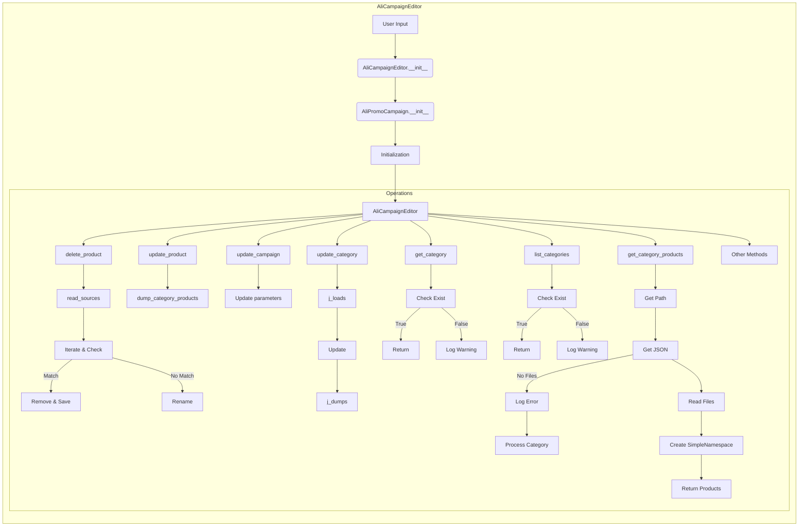

```MD
# Анализ кода AliCampaignEditor

**1. <input code>**

```graph LR
    subgraph AliCampaignEditor
        A[User Input: campaign_name, language, currency] --> B{AliCampaignEditor.__init__};
        B --> C[AliPromoCampaign.__init__];
        C --> D[Initialization: AliCampaignEditor constructor];
        D --> E[AliCampaignEditor];
        
        E --> F[delete_product: Check for affiliate link];
        F --> G[read_text_file sources.txt: Read product list];
        G --> H[Iterate & check product_id: Loop through product list];
        H -- Match --> I[remove & save: Remove product if match found];
        H -- No Match --> J[rename product file: Rename product file if no match];
        
        E --> K[update_product: Update product details];
        K --> L[Call dump_category_products_files: Update category with new product];
        
        E --> M[update_campaign: Update campaign properties like description];
        M --> N[update campaign parameters];
        
        E --> O[update_category: Update category in JSON file];
        O --> P[j_loads JSON file: Read category data];
        P --> Q[Update category: Update category data];
        Q --> R[j_dumps JSON file: Write updated category to file];
        
        E --> S[get_category: Retrieve category by name];
        S --> T[Check if category exists];
        T -- Found --> U[Return SimpleNamespace: Return category details];
        T -- Not Found --> V[Log warning: Category not found in campaign];
        
        E --> W[list_categories: List all categories in the campaign];
        W --> X[Check category attribute: Ensure categories exist in campaign];
        X -- Found --> Y[Return category list: List category names];
        X -- Not Found --> Z[Log warning: No categories found in campaign];
        
        E --> AA[get_category_products: Retrieve products for a category];
        AA --> AB[Get category path: Build path for category products];
        AB --> AC[Get JSON filenames: Retrieve all product JSON files];
        AC --> AD[Read JSON files: Load product data];
        AD --> AE[Create SimpleNamespace: Convert product data to objects];
        AE --> AF[Return products: Return list of products];
        AC -- No JSON files --> AG[Log error: No files found];
        AG --> AH[Process category: Trigger category product preparation];
        
        E --> AI[Other methods];
    end
```

**2. <algorithm>**

(Блок-схема описывается в предоставленной диаграмме.)  Этот код описывает алгоритм работы редактора кампании AliExpress. Он принимает данные от пользователя, обрабатывает их и обновляет различные данные кампании, продукты и категории.

**3. <mermaid>**



**4. <explanation>**

* **Импорты:**  Не указаны импорты, но можно предположить, что `sources.txt`, `dump_category_products_files`,  `j_loads`, `j_dumps` и `SimpleNamespace` импортируются из других модулей проекта `src`. `AliPromoCampaign` скорее всего из подпапки `campaign` (или в `src.suppliers.aliexpress.campaign`).  Без конкретного кода импортов это лишь предположения.

* **Классы:**
    * `AliCampaignEditor`:  Класс, представляющий редактор кампании. Он инициализируется данными пользователя (`campaign_name`, `language`, `currency`) и взаимодействует с `AliPromoCampaign`.  В нем содержатся методы для всех операций по редактированию кампании.

    * `AliPromoCampaign`:  Не ясен его функционал без кода, но, скорее всего, он связан с выполнением действий над промо-кампаниями.

* **Функции:**
    * `__init__`: Конструктор для классов, инициализирующий необходимые переменные.
    * `delete_product`, `update_product`, `update_campaign`, `update_category`, `get_category`, `list_categories`, `get_category_products`: Методы класса `AliCampaignEditor`, реализующие соответствующие функции.  Они могут принимать аргументы (например, идентификатор продукта, данные для обновления) и возвращать результаты (например, подтверждение удаления, обновленные данные).

* **Переменные:**
    * `campaign_name`, `language`, `currency`: Строковые переменные, хранящие данные о кампании.
    * Все переменные, используемые внутри методов.

* **Возможные ошибки и улучшения:**
    * Отсутствует подробная информация о типе данных, возвращаемых методами.
    * Не описана обработка ошибок (например, если `sources.txt` не найден или данные в нём некорректны).
    * Не описаны зависимости от внешних сервисов (например, если используются сторонние API).
    * Не указаны пути к файлам.
    * Не описаны типы данных, которые возвращаются `read_text_file`, `j_loads` и другими методами.

**Цепочка взаимосвязей:**

Пользовательский ввод -> `AliCampaignEditor` -> `AliPromoCampaign` -> Обработка данных и обновление файлов -> обновление данных. Взаимодействие между этими частями происходит через методы и передачу данных. Подробности должны быть получены из кода, который не был предоставлен.


**Заключение:**

Данная блок-схема описывает общую логику работы редактора кампаний.  Для полного понимания необходим код `AliCampaignEditor` и `AliPromoCampaign` для определения точного алгоритма обработки данных, типов аргументов, возвращаемых значений, а также обработки ошибок.