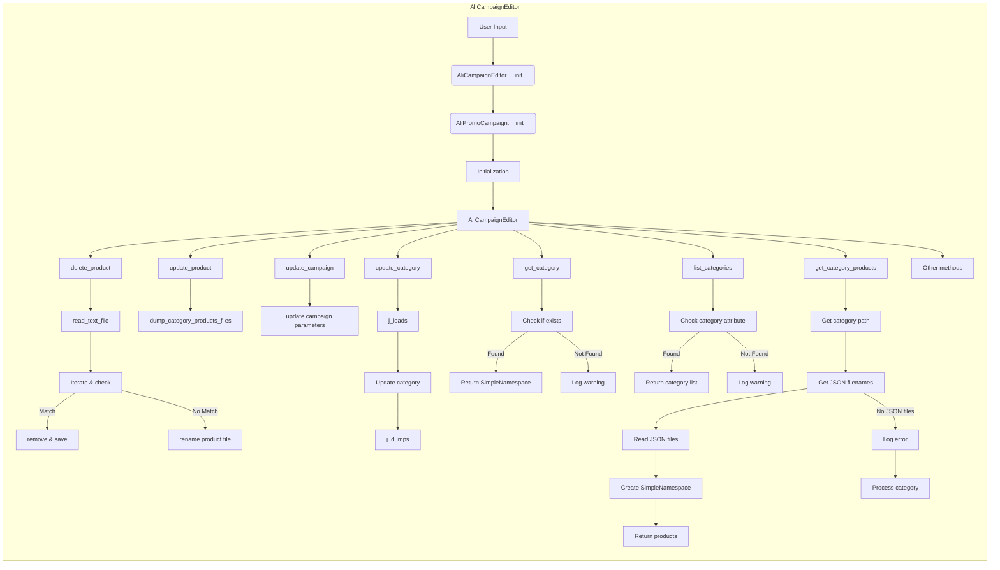

```MD
# Анализ кода AliCampaignEditor

## <input code>

```graph LR
    subgraph AliCampaignEditor
        A[User Input: campaign_name, language, currency] --> B{AliCampaignEditor.__init__};
        B --> C[AliPromoCampaign.__init__];
        C --> D[Initialization: AliCampaignEditor constructor];
        D --> E[AliCampaignEditor];
        
        E --> F[delete_product: Check for affiliate link];
        F --> G[read_text_file sources.txt: Read product list];
        G --> H[Iterate & check product_id: Loop through product list];
        H -- Match --> I[remove & save: Remove product if match found];
        H -- No Match --> J[rename product file: Rename product file if no match];
        
        E --> K[update_product: Update product details];
        K --> L[Call dump_category_products_files: Update category with new product];
        
        E --> M[update_campaign: Update campaign properties like description];
        M --> N[update campaign parameters];
        
        E --> O[update_category: Update category in JSON file];
        O --> P[j_loads JSON file: Read category data];
        P --> Q[Update category: Update category data];
        Q --> R[j_dumps JSON file: Write updated category to file];
        
        E --> S[get_category: Retrieve category by name];
        S --> T[Check if category exists];
        T -- Found --> U[Return SimpleNamespace: Return category details];
        T -- Not Found --> V[Log warning: Category not found in campaign];
        
        E --> W[list_categories: List all categories in the campaign];
        W --> X[Check category attribute: Ensure categories exist in campaign];
        X -- Found --> Y[Return category list: List category names];
        X -- Not Found --> Z[Log warning: No categories found in campaign];
        
        E --> AA[get_category_products: Retrieve products for a category];
        AA --> AB[Get category path: Build path for category products];
        AB --> AC[Get JSON filenames: Retrieve all product JSON files];
        AC --> AD[Read JSON files: Load product data];
        AD --> AE[Create SimpleNamespace: Convert product data to objects];
        AE --> AF[Return products: Return list of products];
        AC -- No JSON files --> AG[Log error: No files found];
        AG --> AH[Process category: Trigger category product preparation];
        
        E --> AI[Other methods];
    end
```

## <algorithm>

Диаграмма показывает алгоритм работы `AliCampaignEditor`.  Вводятся данные о кампании (campaign_name, language, currency). Далее происходит инициализация `AliPromoCampaign`, после чего выполняются различные операции, такие как удаление, обновление, чтение и запись данных о продуктах, категориях и самой кампании.  Происходит чтение файлов, проверка наличия элементов, обновление данных, работа с JSON-файлами.  Все операции происходят в рамках объекта `AliCampaignEditor`.

Примеры:
- `update_product`: Обновление информации о продукте в базе.
- `get_category`: Получение данных о категории по имени.
- `delete_product`: Удаление продукта, если найдено совпадение.

Данные передаются между методами через аргументы и возвращаемые значения. Например, `delete_product` получает список продуктов, проверяет соответствие условиям и возвращает обновленный список.

## <mermaid>



Диаграмма `mermaid` отображает взаимосвязи методов `AliCampaignEditor`. Видна иерархия вызовов, как данные передаются между методами, и какие зависимости существуют.


## <explanation>

**Импорты:**

Код `AliCampaignEditor` импортирует необходимый функционал из других модулей.  Специфика импорта не приведена, поэтому сложно сказать, какие именно классы и функции импортированы.


**Классы:**

- `AliCampaignEditor`: Класс, отвечающий за редактирование кампаний на AliExpress.  Методы класса представляют различные операции редактирования: `delete_product`, `update_product`, `update_campaign`, `update_category`, `get_category`, `list_categories`, `get_category_products`.

- `AliPromoCampaign`: Вероятно, класс, представляющий логику промо-кампаний.  Судя по диаграмме, `AliCampaignEditor` использует `AliPromoCampaign` для инициализации.


**Функции:**

- `read_text_file`: Функция для чтения данных из текстового файла (скорее всего, списка продуктов).
- `dump_category_products_files`: Функция, которая обновляет файлы с продуктами в каталогах (по описанию логики работы).
- `j_loads`: Функция для парсинга JSON.
- `j_dumps`: Функция для сериализации JSON.


**Переменные:**

- `campaign_name`, `language`, `currency`: Вероятно, переменные, содержащие входные данные от пользователя.
- Переменные, содержащиеся внутри методов, являются локальными.


**Возможные ошибки и улучшения:**

- **Отсутствует ясность по импорту:** Необходимо знать, какие именно модули и классы импортируются, чтобы точно понять логику работы и функционал.
- **Сложность логики `update_product`:**  Необходимо больше информации о том, как `update_product` обновляет данные.
- **Не указан тип данных:** Необходимо знать типы данных, с которыми работают функции и методы, для лучшей оценки корректности и эффективности.
- **Обработка ошибок:** Не ясно, как обрабатываются возможные ошибки (например, файл не найден, данные некорректны).  Добавление обработки ошибок повысит устойчивость кода.
- **Неопределённые зависимости:** Не понятно, какие классы или модули вызываются внутри `delete_product`, `update_campaign`, `update_category`, `get_category` и т.д.  Необходима более подробная документация.


**Взаимосвязи с другими частями проекта:**

Связь с `src`-пакетами неясна из предоставленной диаграммы. Необходима информация о том, где находятся и как взаимодействуют `sources.txt`, JSON-файлы и другие данные, необходимые для работы `AliCampaignEditor`.