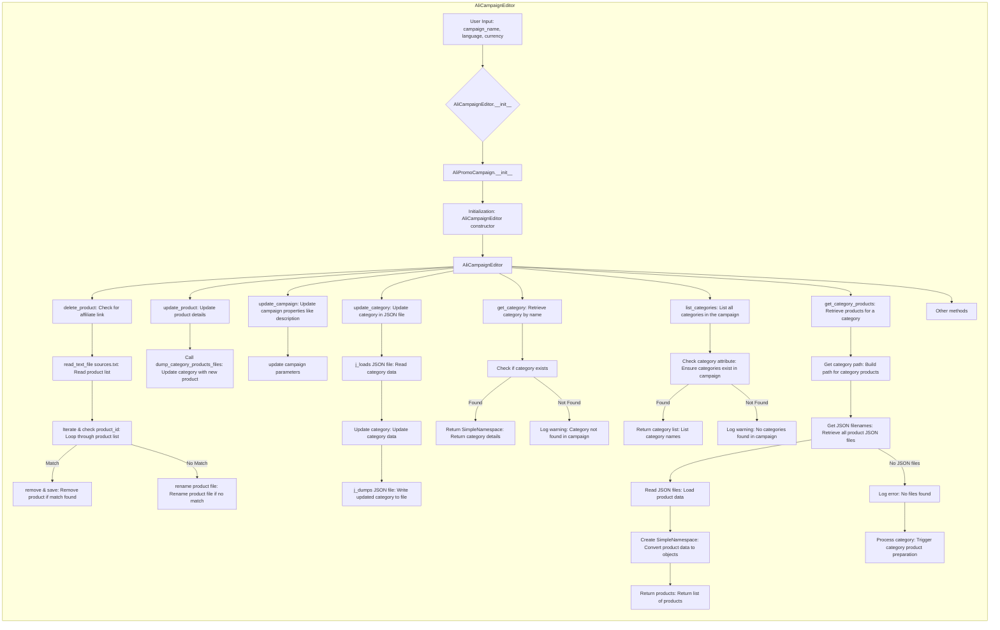

## Анализ кода `ali_campaign_editor.mmd`

### <алгоритм>
**Описание рабочего процесса `AliCampaignEditor`:**

1.  **Инициализация (`AliCampaignEditor.__init__`)**:
    *   Пользователь вводит начальные данные: `campaign_name`, `language`, `currency`.
    *   Создается экземпляр `AliCampaignEditor`.
    *   Создается экземпляр `AliPromoCampaign`, который хранит данные о кампании.

2.  **Удаление продукта (`delete_product`):**
    *   Проверяется наличие аффилированной ссылки (affiliate link) в данных продукта.
    *   Читается список продуктов из файла `sources.txt`.
        *   Пример: `sources.txt` содержит строки с `product_id`.
    *   Выполняется итерация по списку продуктов.
        *   **Совпадение:** Если `product_id` найден, продукт удаляется, данные сохраняются.
        *   **Нет совпадения:** Если `product_id` не найден, файл продукта переименовывается.

3.  **Обновление продукта (`update_product`):**
    *   Обновляет данные о продукте.
    *   Вызывает `dump_category_products_files`, для обновления категорий с новым продуктом.

4.  **Обновление кампании (`update_campaign`):**
    *   Обновляет свойства кампании, такие как описание (`description`).
    *   Обновляет параметры кампании.

5.  **Обновление категории (`update_category`):**
    *   Читает JSON файл с данными категории (`j_loads`).
    *   Обновляет данные категории (`Update category`).
    *   Сохраняет обновленные данные в JSON файл (`j_dumps`).

6.  **Получение категории (`get_category`):**
    *   Получает имя категории.
    *   Проверяет, существует ли категория.
        *   **Найдена:** Возвращает данные категории в формате `SimpleNamespace`.
        *   **Не найдена:** Записывает предупреждение в лог.

7.  **Список категорий (`list_categories`):**
    *   Проверяет, есть ли категории в кампании.
        *   **Найдены:** Возвращает список имен категорий.
        *   **Не найдены:** Записывает предупреждение в лог.

8.  **Получение продуктов категории (`get_category_products`):**
    *   Создает путь к продуктам категории.
    *   Получает все JSON файлы продуктов.
    *   Читает данные из JSON файлов.
    *   Преобразует данные в объекты `SimpleNamespace`.
    *   Возвращает список продуктов.
    *   Если JSON файлы не найдены, пишет ошибку в лог и запускает подготовку продуктов категории.

9.  **Другие методы (`Other methods`):**
    *   Включает другие методы, не описанные явно в диаграмме.

### <mermaid>

**Зависимости в `mermaid`:**
*   Диаграмма начинается с блока `A` -  `User Input: campaign_name, language, currency`, что указывает на то, что процесс начинается с ввода пользовательских данных, таких как название кампании, язык и валюта.
*   Затем блок `B` - `AliCampaignEditor.__init__` - вызывает конструктор класса `AliCampaignEditor`, который, в свою очередь, вызывает конструктор класса `AliPromoCampaign` - блок `C`.
*   `Initialization` в блоке `D` указывает на процесс инициализации `AliCampaignEditor`.
*   Далее,  `AliCampaignEditor` - блок `E` -  выступает как центральный узел, из которого расходятся все остальные методы: `delete_product`, `update_product`, `update_campaign`, `update_category`, `get_category`, `list_categories`, `get_category_products`, и `Other methods`.
*   Каждый из этих методов имеет свои внутренние зависимости, которые также описаны на диаграмме. Например,  метод `get_category_products` последовательно вызывает `Get category path`, `Get JSON filenames`, `Read JSON files`, `Create SimpleNamespace`, и `Return products`.

### <объяснение>

**Импорты:**

*   В данном коде нет явных импортов, так как это диаграмма, а не код на Python. Однако предполагается, что `AliCampaignEditor` использует `AliPromoCampaign` для работы с данными кампании. Также используются стандартные библиотеки Python для работы с JSON и файлами.

**Классы:**

*   **`AliCampaignEditor`:**
    *   **Роль:** Основной класс для управления кампаниями AliExpress. Предоставляет методы для создания, изменения и удаления продуктов и категорий.
    *   **Атрибуты:** Содержит экземпляр `AliPromoCampaign`, который хранит данные кампании, такие как список категорий, продуктов и параметры кампании.
    *   **Методы:**
        *   `__init__(campaign_name, language, currency)`: Конструктор для инициализации объекта.
        *   `delete_product()`: Удаляет продукт из кампании.
        *   `update_product()`: Обновляет данные продукта.
        *   `update_campaign()`: Обновляет параметры кампании.
        *   `update_category()`: Обновляет данные категории.
        *   `get_category()`: Получает категорию по имени.
        *   `list_categories()`: Возвращает список категорий.
        *   `get_category_products()`: Получает список продуктов для категории.
        *   Другие методы (показаны в блоке `AI`).
    *   **Взаимодействие:** `AliCampaignEditor` создает и использует `AliPromoCampaign` для хранения и управления данными кампании.

*   **`AliPromoCampaign`:**
    *   **Роль:** Класс для хранения данных о кампании.
    *   **Атрибуты:** Содержит информацию о кампании, такую как название, язык, валюта, категории и продукты.
    *   **Методы:** (не описаны в диаграмме, но предполагаются).
    *   **Взаимодействие:** Используется `AliCampaignEditor` для хранения и управления данными кампании.

*   **`SimpleNamespace`:**
     *  **Роль:** Используется для представления данных в виде объектов с атрибутами, к которым можно получить доступ через точку.
     *  **Использование:** Создается при чтении данных из JSON-файлов для представления продуктов и категорий.

**Функции:**

*   `__init__`: Конструктор классов `AliCampaignEditor` и `AliPromoCampaign`. Принимает параметры для инициализации объектов и создания экземпляров классов.
    *   **Пример:** `AliCampaignEditor("my_campaign", "en", "USD")`
*   `delete_product`: Удаляет продукт из списка, переименовывая файлы если нужно.
    *   **Пример:** Удаляет продукт `product_id` если он есть в списке `sources.txt`
*   `update_product`: Обновляет информацию о продукте.
    *   **Пример:** обновляет данные продукта с `product_id`.
*   `update_campaign`: Обновляет параметры кампании.
    *   **Пример:** меняет описание кампании.
*   `update_category`: Обновляет данные категории в JSON-файле.
    *   **Пример:** добавляет или изменяет название категории.
*   `get_category`: Возвращает объект SimpleNamespace с данными категории.
    *   **Пример:** получает категорию по имени `electronics`.
*   `list_categories`: Возвращает список имен категорий.
    *   **Пример:** получает список `["electronics", "clothing", "home"]`.
*   `get_category_products`: Возвращает список продуктов категории, загруженных из JSON файлов.
    *   **Пример:** возвращает все продукты из категории `electronics`.
*   `j_loads`: Читает JSON файл и возвращает данные.
    *   **Пример:** `j_loads('category.json')`
*   `j_dumps`: Записывает данные в JSON файл.
     *  **Пример:** `j_dumps(data, 'category.json')`
*   `read_text_file`: Читает данные из текстового файла, например, `sources.txt`.
    *   **Пример:** читает все `product_id` из `sources.txt`.

**Переменные:**

*   `campaign_name`: Название кампании (тип `str`).
*   `language`: Язык кампании (тип `str`).
*   `currency`: Валюта кампании (тип `str`).
*   `product_id`: Идентификатор продукта (тип `str`).
*   `category_name`: Имя категории (тип `str`).
*   `category_data`: Данные категории в JSON формате (тип `dict`).
*   `product_data`: Данные продукта в JSON формате (тип `dict`).

**Потенциальные ошибки и улучшения:**
*   Необходимо предусмотреть обработку ошибок при чтении/записи файлов.
*   Следует добавить валидацию пользовательского ввода для обеспечения целостности данных.
*   Реализация логгирования для отслеживания процесса работы.
*   Можно добавить кеширование данных для оптимизации производительности.
*  Метод `get_category_products` может потребовать более тщательной обработки ошибок при чтении JSON файлов, чтобы предотвратить потенциальные сбои в работе.

**Цепочка взаимосвязей с другими частями проекта:**

*   `AliCampaignEditor` работает с данными, хранящимися в файловой системе (JSON, текстовые файлы)
*   Взаимодействует с другими частями системы через методы, которые могут вызывать другие классы или модули для работы с данными, такими как обновление категорий в базе данных или API для взаимодействия с AliExpress.
*   Предполагается, что класс будет интегрирован с другими модулями системы управления кампаниями для AliExpress.
*   Взаимодействует с модулем логирования, чтобы записывать события и ошибки.

Этот анализ обеспечивает полное понимание кода `ali_campaign_editor.mmd` и его места в проекте.