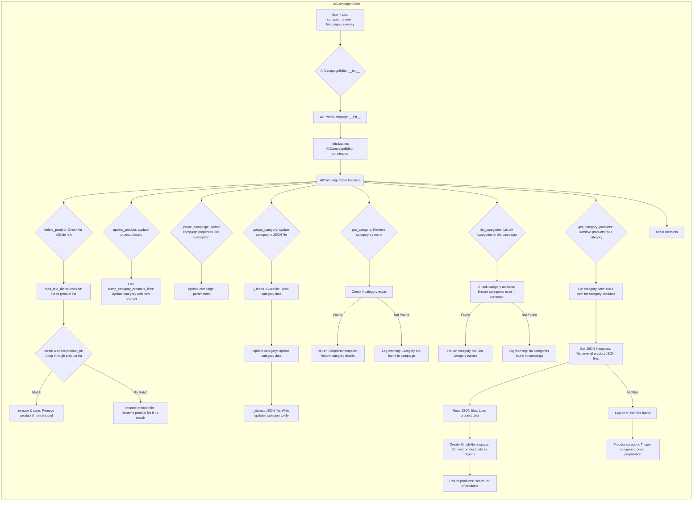

## ИНСТРУКЦИЯ:

Анализируй предоставленный код подробно и объясни его функциональность. Ответ должен включать три раздела:  

1.  **<алгоритм>**: Опиши рабочий процесс в виде пошаговой блок-схемы, включая примеры для каждого логического блока, и проиллюстрируй поток данных между функциями, классами или методами.  
2.  **<mermaid>**: Напиши код для диаграммы в формате `mermaid`, проанализируй и объясни все зависимости,
    которые импортируются при создании диаграммы.
    **ВАЖНО!** Убедитесь, что все имена переменных, используемые в диаграмме `mermaid`,
    имеют осмысленные и описательные имена. Имена переменных вроде `A`, `B`, `C`, и т.д., не допускаются!  
    
    **Дополнительно**: Если в коде есть импорт `import header`, добавьте блок `mermaid` flowchart, объясняющий `header.py`:\
    ```mermaid
    flowchart TD
        Start --> Header[<code>header.py</code><br> Determine Project Root]
    
        Header --> import[Import Global Settings: <br><code>from src import gs</code>] 
    ```

3.  **<объяснение>**: Предоставьте подробные объяснения:  
    - **Импорты**: Их назначение и взаимосвязь с другими пакетами `src.`.  
    - **Классы**: Их роль, атрибуты, методы и взаимодействие с другими компонентами проекта.  
    - **Функции**: Их аргументы, возвращаемые значения, назначение и примеры.  
    - **Переменные**: Их типы и использование.  
    - Выделите потенциальные ошибки или области для улучшения.  

Дополнительно, постройте цепочку взаимосвязей с другими частями проекта (если применимо).  

Это обеспечивает всесторонний и структурированный анализ кода.
## Формат ответа: `.md` (markdown)
**КОНЕЦ ИНСТРУКЦИИ**

## <алгоритм>

Диаграмма описывает логику работы класса `AliCampaignEditor`, который используется для управления рекламными кампаниями на AliExpress.

1.  **Инициализация:**
    *   Пользователь вводит данные кампании (`campaign_name`, `language`, `currency`).
    *   Создается экземпляр `AliCampaignEditor`.
    *   Инициализируется `AliPromoCampaign`, возможно, загружая существующую кампанию или создавая новую.

2.  **Удаление продукта (`delete_product`):**
    *   Проверяется, есть ли у продукта аффилиатская ссылка.
    *   Читается список продуктов из файла `sources.txt`.
    *   Проходится по списку продуктов, проверяя `product_id`.
        *   Если `product_id` найден, продукт удаляется и изменения сохраняются.
        *   Если `product_id` не найден, файл продукта переименовывается.

3.  **Обновление продукта (`update_product`):**
    *   Обновляются детали продукта (например, цена, описание).
    *   Вызывается `dump_category_products_files`, чтобы обновить файл категории с измененным продуктом.

4.  **Обновление кампании (`update_campaign`):**
    *   Обновляются свойства кампании, например описание.
    *   Обновляются параметры кампании.

5.  **Обновление категории (`update_category`):**
    *   Читается JSON-файл категории.
    *   Обновляются данные категории.
    *   Записывается обновленный JSON-файл.

6.  **Получение категории (`get_category`):**
    *   По имени категории проверяется, существует ли она.
        *   Если категория найдена, возвращается объект `SimpleNamespace` с ее деталями.
        *   Если категория не найдена, в журнал записывается предупреждение.

7.  **Список категорий (`list_categories`):**
    *   Проверяется, существуют ли категории в кампании.
        *   Если категории найдены, возвращается список их названий.
        *   Если категории не найдены, в журнал записывается предупреждение.

8.  **Получение продуктов категории (`get_category_products`):**
    *   Строится путь к файлам продуктов для конкретной категории.
    *   Извлекаются все JSON-файлы продуктов для этой категории.
        *   Читаются данные продуктов из JSON-файлов.
        *   Создаются объекты `SimpleNamespace` для каждого продукта.
        *   Возвращается список продуктов.
        *   Если JSON файлы не найдены в журнал записывается ошибка.
        *   После чего вызывается функция по подготовке категории `process category`.

9. **Другие методы**
    *   Обобщенное представление прочих методов, которые могут быть в `AliCampaignEditor`.

## <mermaid>



### **mermaid объяснение:**

1.  **`subgraph AliCampaignEditor`**: Объявляет подграф, представляющий класс `AliCampaignEditor`.
2.  **`UserInput`**: Начало процесса с ввода данных пользователем.
3.  **`InitEditor{AliCampaignEditor.__init__}`**:  Инициализация экземпляра класса `AliCampaignEditor`.
4.  **`InitPromoCampaign[AliPromoCampaign.__init__]`**: Инициализация экземпляра `AliPromoCampaign` внутри конструктора `AliCampaignEditor`.
5.  **`EditorInitialization`**: Представляет процесс инициализации.
6.  **`AliEditorInstance`**: Экземпляр класса `AliCampaignEditor`, с которого начинаются вызовы методов.
7.  **`DeleteProductCheck`**: Проверка наличия аффилиатской ссылки.
8.  **`ReadProductList`**: Чтение списка продуктов из `sources.txt`.
9.  **`IterateProducts`**: Итерация по списку продуктов для поиска совпадений.
10. **`RemoveAndSave`**: Удаление продукта, если `product_id` совпал.
11. **`RenameProductFile`**: Переименование файла продукта, если `product_id` не совпал.
12. **`UpdateProductDetails`**: Обновление деталей продукта.
13. **`UpdateCategoryFiles`**: Вызов функции для обновления файлов категории.
14. **`UpdateCampaignProperties`**: Обновление свойств кампании, таких как описание.
15. **`UpdateCampaignParameters`**: Обновление параметров кампании.
16. **`UpdateCategoryJSON`**: Обновление данных категории в JSON-файле.
17. **`ReadCategoryJSON`**: Чтение данных категории из JSON-файла.
18. **`UpdateCategoryData`**: Обновление данных категории.
19. **`WriteCategoryJSON`**: Запись обновленных данных в JSON-файл.
20. **`GetCategoryByName`**: Поиск категории по имени.
21. **`CheckCategoryExists`**: Проверка наличия категории.
22. **`ReturnCategoryDetails`**: Возврат деталей категории, если найдена.
23. **`LogCategoryWarning`**: Запись предупреждения, если категория не найдена.
24. **`ListAllCategories`**: Получение списка категорий.
25. **`CheckCategoryAttribute`**: Проверка наличия атрибута категорий.
26. **`ReturnCategoryList`**: Возврат списка категорий.
27. **`LogNoCategoriesWarning`**: Запись предупреждения, если нет категорий.
28. **`GetProductsForCategory`**: Получение продуктов для категории.
29. **`GetCategoryPath`**: Построение пути к файлам продуктов категории.
30. **`GetProductJSONFiles`**: Получение списка JSON-файлов продуктов.
31. **`ReadProductJSONFiles`**: Чтение данных из JSON-файлов продуктов.
32. **`CreateProductObjects`**: Создание объектов SimpleNamespace из данных.
33. **`ReturnProductList`**: Возврат списка продуктов.
34. **`LogNoFilesError`**: Запись ошибки, если файлы не найдены.
35.  **`ProcessCategoryCall`**: Вызов процесса подготовки категории
36. **`OtherMethods`**: Обобщенное представление других методов, которые могут быть в классе.

## <объяснение>

### **Импорты:**

В предоставленном коде не указаны импорты, но подразумевается что `AliCampaignEditor` взаимодействует с `AliPromoCampaign` и возможно использует `SimpleNamespace`, которые могут быть импортированы из других модулей пакета `src`.

### **Классы:**

*   **`AliCampaignEditor`:**
    *   **Роль:** Является основным классом для управления рекламными кампаниями AliExpress. Предоставляет методы для управления продуктами, категориями и самой кампанией.
    *   **Атрибуты:** Вероятно, содержит атрибуты для хранения состояния кампании, такие как `campaign_name`, `language`, `currency` и другие.
    *   **Методы:**
        *   `__init__`: Конструктор класса, который инициализирует экземпляр `AliCampaignEditor` и создает/загружает кампанию с помощью `AliPromoCampaign`.
        *   `delete_product`: Удаляет продукт из кампании.
        *   `update_product`: Обновляет информацию о продукте.
        *   `update_campaign`: Обновляет параметры кампании.
        *   `update_category`: Обновляет информацию о категории.
        *   `get_category`: Возвращает информацию о категории по имени.
        *   `list_categories`: Возвращает список категорий.
        *   `get_category_products`: Возвращает список продуктов для заданной категории.
         *   `Other methods`: Различные другие методы, которые могут использоваться классом.
    *   **Взаимодействие:** Взаимодействует с `AliPromoCampaign` для хранения и управления данными кампании.

*   **`AliPromoCampaign`:**
    *   **Роль:** Представляет логику и данные рекламной кампании AliExpress.
    *   **Атрибуты:** Может содержать данные, относящиеся к кампании, такие как список продуктов, категорий, настройки.
    *   **Методы:** Методы для работы с данными кампании: добавление, удаление, обновление данных.
    *   **Взаимодействие:** Используется классом `AliCampaignEditor` для выполнения операций над данными кампании.

*   **`SimpleNamespace`**:
    *   **Роль:** Простой класс для создания объектов с атрибутами, используется для возврата данных.
    *   **Взаимодействие:** Используется для структурирования данных, возвращаемых методами `get_category` и `get_category_products`.

### **Функции:**

*   **`AliCampaignEditor.__init__`:**
    *   **Аргументы:** `campaign_name`, `language`, `currency` (и, возможно, другие).
    *   **Возвращаемое значение:** Нет (конструктор).
    *   **Назначение:** Инициализация экземпляра `AliCampaignEditor`, создание или загрузка кампании с помощью `AliPromoCampaign`.

*   **`delete_product`:**
    *   **Аргументы:** `product_id` или другие параметры для идентификации продукта.
    *   **Возвращаемое значение:** Нет.
    *   **Назначение:** Удаляет продукт из кампании.

*   **`update_product`:**
    *   **Аргументы:** `product_id` и обновленные данные продукта.
    *   **Возвращаемое значение:** Нет.
    *   **Назначение:** Обновляет информацию о продукте.

*   **`update_campaign`:**
    *   **Аргументы:** Обновленные данные кампании (описание, параметры).
    *   **Возвращаемое значение:** Нет.
    *   **Назначение:** Обновляет свойства кампании.

*   **`update_category`:**
    *   **Аргументы:** `category_name` и обновленные данные категории.
    *   **Возвращаемое значение:** Нет.
    *   **Назначение:** Обновляет данные категории в JSON-файле.

*   **`get_category`:**
    *   **Аргументы:** `category_name`.
    *   **Возвращаемое значение:** `SimpleNamespace` с данными категории или `None`.
    *   **Назначение:** Возвращает информацию о категории по имени.

*   **`list_categories`:**
    *   **Аргументы:** Нет.
    *   **Возвращаемое значение:** Список имен категорий.
    *   **Назначение:** Возвращает список категорий.

*   **`get_category_products`:**
    *   **Аргументы:** `category_name`.
    *   **Возвращаемое значение:** Список объектов `SimpleNamespace` с информацией о продуктах категории.
    *   **Назначение:** Возвращает список продуктов для заданной категории.

### **Переменные:**

*   `campaign_name`, `language`, `currency`: Строковые переменные для хранения информации о кампании.
*   `product_id`: Идентификатор продукта (может быть строкой или числом).
*   `category_name`: Строка с именем категории.
*   Файловые пути: Переменные для хранения путей к файлам JSON и текстовым файлам.
*  Логи: используются для записи предупреждений или ошибок.

### **Потенциальные ошибки и области для улучшения:**

*   **Обработка ошибок:** Необходимо добавить более детальную обработку ошибок (например, `FileNotFoundError`, `JSONDecodeError`).
*   **Логирование:** Использовать более развитую систему логирования, чем просто `print`.
*   **Валидация данных:** Проверять входные данные на корректность.
*   **Конфигурация:** Вынести пути к файлам и другие настройки в конфигурационный файл.
*   **Рефакторинг:** Улучшить структуру кода, разбив методы на более мелкие и переиспользуемые функции.
*  **Обработка исключений** в методах работающих с файлами

### **Взаимосвязи с другими частями проекта:**

*   Этот класс может зависеть от других модулей в пакете `src` для работы с файловой системой, API AliExpress, и обработки данных.

### **Цепочка взаимосвязей:**

`User Input` -> `AliCampaignEditor` (init) -> `AliPromoCampaign` (init) -> `AliCampaignEditor` (methods) -> `JSON Files` (for categories and products) -> `Output to the system`