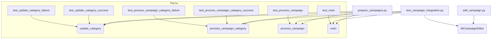

### <input code>

```
### Руководство для Тестера

#### Введение
Данный документ предназначен для тестеров, которые будут проверять модуль, отвечающий за подготовку материалов для рекламных кампаний на платформе AliExpress. Модуль включает в себя три основных файла:

1. `edit_campaign.py` - управление рекламной кампанией.
2. `prepare_campaigns.py` - подготовка и обработка категорий кампании.
3. `test_campaign_integration.py` - тесты для проверки интеграции всех компонентов модуля.

#### Основные файлы

1. **`edit_campaign.py`**:
    - **Описание**: Этот файл содержит класс `AliCampaignEditor`, который наследует от `AliPromoCampaign`. Основная задача этого класса - управление рекламной кампанией.
    - **Основные функции**:
        - `AliCampaignEditor`: Инициализация и управление кампанией.

2. **`prepare_campaigns.py`**:
    - **Описание**: Этот файл содержит функции для подготовки материалов кампании, включая обновление категорий и обработку кампаний по категориям.
    - **Основные функции**:
        - `update_category`: Обновление категории в JSON файле.
        - `process_campaign_category`: Обработка конкретной категории в рамках кампании.
        - `process_campaign`: Обработка всей кампании по всем категориям.
        - `main`: Асинхронная основная функция для обработки кампании.

3. **`test_campaign_integration.py`**:
    - **Описание**: Этот файл содержит тесты, проверяющие взаимодействие всех компонентов модуля.
    - **Основные тесты**:
        - `test_update_category_success`: Проверка успешного обновления категории.
        - `test_update_category_failure`: Проверка обработки ошибки при обновлении категории.
        - `test_process_campaign_category_success`: Проверка успешной обработки категории.
        - `test_process_campaign_category_failure`: Проверка обработки ошибки при обработке категории.
        - `test_process_campaign`: Проверка обработки всех категорий в кампании.
        - `test_main`: Проверка основного сценария выполнения кампании.

#### Инструкции по тестированию

1. **Установка зависимостей**:
    - Убедитесь, что все необходимые зависимости установлены. Выполните команду:
      ```sh
      pip install -r requirements.txt
      ```

2. **Запуск тестов**:
    - Для запуска всех тестов используйте команду:
      ```sh
      pytest test_campaign_integration.py
      ```

3. **Проверка тестов**:
    - Убедитесь, что все тесты проходят успешно. В выводе команды `pytest` должно быть указано, что все тесты пройдены (`PASSED`).


#### Проверка функциональности

... (описание проверки функциональности)

#### Заключение

...
```

### <algorithm>

К сожалению, предоставленный код — это документ, описывающий код, а не сам код.  Поэтому построить блок-схему алгоритма невозможно.  Документ описывает функции и классы, но не содержит логики их реализации.

### <mermaid>



### <explanation>

Документ описывает структуру модуля для управления рекламными кампаниями на AliExpress.  Он не содержит реализации кода, а представляет собой руководство по тестированию.

* **Импорты**:  В самом документе импорты не указаны.  Импорты будут в файлах `edit_campaign.py`, `prepare_campaigns.py`, и `test_campaign_integration.py` и будут связаны с необходимыми библиотеками (например, для работы с JSON, асинхронными операциями,  тестирования). Связь с другими пакетами неясна без предоставления кода.

* **Классы**:
    * `AliCampaignEditor`:  Класс для управления рекламной кампанией. Наследует от `AliPromoCampaign`,  означает, что  `AliPromoCampaign` предоставляет базовые методы для работы с кампаниями. Без кода невозможно точно описать функциональность и атрибуты.

* **Функции**:
    * `update_category`, `process_campaign_category`, `process_campaign`, `main`: Эти функции, скорее всего, содержат логику обработки категорий и кампаний, взаимодействия с источниками данных и сохранения результатов.

* **Переменные**: Без кода невозможно определить типы и использование переменных.

* **Возможные ошибки или области для улучшений**:
    * Документация не содержит информации о конкретных зависимостях.
    * Не описаны типы данных, с которыми работают функции.
    * Отсутствует информация о структуре JSON-файлов.
    * Необходимо более подробное описание логики функций (например, использование логгирования, обработка исключений и т.д.).
    * Вместо `main` для обработки кампании по категориям, использование отдельных функций или задач может улучшить масштабируемость и параллельность.

* **Взаимосвязи с другими частями проекта**:  Без кода трудно определить детали взаимодействия между `edit_campaign.py`, `prepare_campaigns.py` и другими частями проекта.  Можно предположить, что данные о кампаниях и категориях передаются между этими файлами, но без кода это лишь предположение.


**Вывод:**  Документ является руководством для тестирования, а не описанием реализации кода.  Чтобы дать полноценный анализ, необходим сам код.