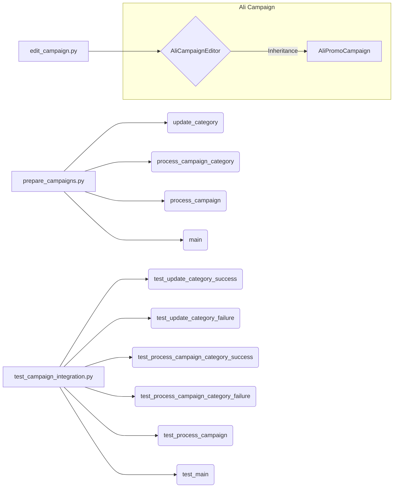

### <input code>

```
### Руководство для Тестера

#### Введение
Данный документ предназначен для тестеров, которые будут проверять модуль, отвечающий за подготовку материалов для рекламных кампаний на платформе AliExpress. Модуль включает в себя три основных файла:

1. `edit_campaign.py` - управление рекламной кампанией.
2. `prepare_campaigns.py` - подготовка и обработка категорий кампании.
3. `test_campaign_integration.py` - тесты для проверки интеграции всех компонентов модуля.

#### Основные файлы

1. **`edit_campaign.py`**:
    - **Описание**: Этот файл содержит класс `AliCampaignEditor`, который наследует от `AliPromoCampaign`. Основная задача этого класса - управление рекламной кампанией.
    - **Основные функции**:
        - `AliCampaignEditor`: Инициализация и управление кампанией.

2. **`prepare_campaigns.py`**:
    - **Описание**: Этот файл содержит функции для подготовки материалов кампании, включая обновление категорий и обработку кампаний по категориям.
    - **Основные функции**:
        - `update_category`: Обновление категории в JSON файле.
        - `process_campaign_category`: Обработка конкретной категории в рамках кампании.
        - `process_campaign`: Обработка всей кампании по всем категориям.
        - `main`: Асинхронная основная функция для обработки кампании.

3. **`test_campaign_integration.py`**:
    - **Описание**: Этот файл содержит тесты, проверяющие взаимодействие всех компонентов модуля.
    - **Основные тесты**:
        - `test_update_category_success`: Проверка успешного обновления категории.
        - `test_update_category_failure`: Проверка обработки ошибки при обновлении категории.
        - `test_process_campaign_category_success`: Проверка успешной обработки категории.
        - `test_process_campaign_category_failure`: Проверка обработки ошибки при обработке категории.
        - `test_process_campaign`: Проверка обработки всех категорий в кампании.
        - `test_main`: Проверка основного сценария выполнения кампании.

#### Инструкции по тестированию

1. **Установка зависимостей**:
    - Убедитесь, что все необходимые зависимости установлены. Выполните команду:
      ```sh
      pip install -r requirements.txt
      ```

2. **Запуск тестов**:
    - Для запуска всех тестов используйте команду:
      ```sh
      pytest test_campaign_integration.py
      ```

3. **Проверка тестов**:
    - Убедитесь, что все тесты проходят успешно. В выводе команды `pytest` должно быть указано, что все тесты пройдены (`PASSED`).

#### Проверка функциональности

... (описания тестов)

#### Заключение
```

### <algorithm>

Этот код представляет собой руководство для тестеров, описывающее модуль для подготовки рекламных кампаний AliExpress.  Блок-схема алгоритма здесь не применима, так как нет кода для анализа.  Документ описывает файлы, функции, классы и тесты, но не содержит реализации алгоритма.

### <mermaid>



**Зависимости:**

Диаграмма иллюстрирует взаимодействие основных файлов.  `edit_campaign.py` содержит класс `AliCampaignEditor`, который наследуется от `AliPromoCampaign`.  Файлы `prepare_campaigns.py` и `test_campaign_integration.py` взаимодействуют друг с другом, проверяя и используя функции `prepare_campaigns.py`.  Необходимая зависимость - установленные пакеты из `requirements.txt`.

### <explanation>

**Импорты:**

В коде отсутствуют импорты, так как это руководство, а не код программы.  Импорты необходимых библиотек и модулей должны быть в файлах `edit_campaign.py`, `prepare_campaigns.py` и `test_campaign_integration.py`.

**Классы:**

- `AliCampaignEditor`: Класс для управления рекламной кампанией.  Наследует от `AliPromoCampaign`, что предполагает существование базового класса для управления рекламными акциями.  Необходимы атрибуты и методы для хранения и изменения параметров кампании.


**Функции:**

- `update_category`: Обновляет категорию в JSON-файле.  Необходимо определить формат JSON, структуру данных категории, а также механизм записи в файл.

- `process_campaign_category`: Обрабатывает конкретную категорию кампании.  Должны быть явные шаги обработки и возвращаемое значение, обозначающее успех/неуспех.


- `process_campaign`: Обрабатывает все категории кампании.  Логически должна вызывать `process_campaign_category` для каждой категории.

- `main`: Асинхронная функция для запуска обработки кампании.  Необходимо использовать асинхронные операции (например, `asyncio`) для параллельной обработки.

**Переменные:**

Описание переменных отсутствует, так как это руководство.

**Возможные ошибки и улучшения:**

- Отсутствие кода затрудняет точный анализ потенциальных ошибок.  Необходимо определить, как обрабатываются исключения в функциях (например, ошибки ввода/вывода, некорректные данные).
- Не описаны пути обработки ошибок и логирование.  Важно отслеживать состояние выполнения, чтобы иметь возможность диагностировать проблемы.
- Не описаны типы данных, которые используются в функции, что делает трудным понимание работы программы и тестирования.
- Не описана связь с другими частями проекта, например, с базами данных или другими модулями.

**Цепочка взаимосвязей:**

Руководство описывает модуль подготовки рекламных кампаний.  Связь с другими частями проекта предполагается через входные и выходные данные.  Например, данные о кампании могут поступать из базы данных или из другого модуля, а результаты обработки могут сохраняться в базе данных или использоваться другими частями проекта.

**Заключение:**

Руководство предоставляет описание модуля, но не содержит функционального кода.  Для полноценного анализа и тестирования необходим сам код, описание используемых библиотек и данные о связях с другими частями проекта.