# Анализ кода модуля подготовки рекламных кампаний AliExpress

## <input code>

```
### Руководство для Тестера

#### Введение
Данный документ предназначен для тестеров, которые будут проверять модуль, отвечающий за подготовку материалов для рекламных кампаний на платформе AliExpress. Модуль включает в себя три основных файла:

1. `edit_campaign.py` - управление рекламной кампанией.
2. `prepare_campaigns.py` - подготовка и обработка категорий кампании.
3. `test_campaign_integration.py` - тесты для проверки интеграции всех компонентов модуля.

#### Основные файлы

1. **`edit_campaign.py`**:
    - **Описание**: Этот файл содержит класс `AliCampaignEditor`, который наследует от `AliPromoCampaign`. Основная задача этого класса - управление рекламной кампанией.
    - **Основные функции**:
        - `AliCampaignEditor`: Инициализация и управление кампанией.

2. **`prepare_campaigns.py`**:
    - **Описание**: Этот файл содержит функции для подготовки материалов кампании, включая обновление категорий и обработку кампаний по категориям.
    - **Основные функции**:
        - `update_category`: Обновление категории в JSON файле.
        - `process_campaign_category`: Обработка конкретной категории в рамках кампании.
        - `process_campaign`: Обработка всей кампании по всем категориям.
        - `main`: Асинхронная основная функция для обработки кампании.

3. **`test_campaign_integration.py`**:
    - **Описание**: Этот файл содержит тесты, проверяющие взаимодействие всех компонентов модуля.
    - **Основные тесты**:
        - `test_update_category_success`: Проверка успешного обновления категории.
        - `test_update_category_failure`: Проверка обработки ошибки при обновлении категории.
        - `test_process_campaign_category_success`: Проверка успешной обработки категории.
        - `test_process_campaign_category_failure`: Проверка обработки ошибки при обработке категории.
        - `test_process_campaign`: Проверка обработки всех категорий в кампании.
        - `test_main`: Проверка основного сценария выполнения кампании.

#### ... (остальной текст руководства)
```

## <algorithm>

К сожалению, предоставленный код - это описание кода, а не сам код.  Поэтому построить блок-схему алгоритма невозможно.  Руководство описывает функции и классы, но не содержит их реализации.  Мы можем представить *возможное* поведение:

1. **`prepare_campaigns.py`**: Функции `update_category`, `process_campaign_category`, `process_campaign` и `main` вероятно взаимодействуют с данными в JSON файлах, обновляя категории и обрабатывая кампании.  `main` запускает асинхронную обработку.

2. **`edit_campaign.py`**: `AliCampaignEditor` скорее всего взаимодействует с кампанией, используя функции из `prepare_campaigns.py`.  

3. **`test_campaign_integration.py`**: Тесты проверяют правильность работы функций и классов.

Без кода невозможно построить блок-схему с детальными шагами.

```mermaid
graph LR
    subgraph Модуль подготовки кампаний
        prepare_campaigns.py --> update_category
        prepare_campaigns.py --> process_campaign_category
        prepare_campaigns.py --> process_campaign
        prepare_campaigns.py --> main
    end
    subgraph Модуль управления кампанией
        edit_campaign.py --> AliCampaignEditor
    end
    subgraph Модуль тестирования
        test_campaign_integration.py --> test_update_category_success
        test_campaign_integration.py --> test_update_category_failure
        test_campaign_integration.py --> test_process_campaign_category_success
        test_campaign_integration.py --> test_process_campaign_category_failure
        test_campaign_integration.py --> test_process_campaign
        test_campaign_integration.py --> test_main
    end
    prepare_campaigns.py -- взаимодействие --> edit_campaign.py
    test_campaign_integration.py -- тестирование --> prepare_campaigns.py
    test_campaign_integration.py -- тестирование --> edit_campaign.py
```

## <mermaid>



## <explanation>

**Импорты**:  Руководство не содержит импортов.  В реальном коде были бы импорты для работы с JSON, асинхронностью, logging и т.д.

**Классы**:

*   `AliCampaignEditor`: Предполагаемый класс для управления рекламной кампанией на AliExpress. Наследует от `AliPromoCampaign` (который не определен в предоставленном фрагменте).

**Функции**:

*   `update_category`, `process_campaign_category`, `process_campaign`, `main`: Эти функции из `prepare_campaigns.py`  предполагают работу с данными (JSON) и обработку кампаний.
*   `AliCampaignEditor` скорее всего содержит методы для работы с конкретными кампаниями.


**Переменные**:  Тип переменных зависит от реализации.  Возможно, используются объекты для представления кампаний, категорий и других данных.


**Возможные ошибки и улучшения**:

*   Отсутствие кода затрудняет выявление точных ошибок.
*   Необходимо добавить обработку исключений (try...except блоки) для повышения устойчивости кода.
*   Не описана структура JSON данных, с которыми взаимодействуют функции.
*   Нет описания, что возвращают функции `update_category`, `process_campaign_category`, `process_campaign`, `main`.
*   Отсутствует описание логики обработки ошибок.


**Взаимосвязи**:

`prepare_campaigns.py` предоставляет функциональность для работы с данными кампаний. `edit_campaign.py` использует эту функциональность для управления кампаниями. `test_campaign_integration.py` тестирует корректность работы этих модулей.


**Заключение**:

Руководство описывает *структуру* кода, но не *реализацию*.  Для более глубокого анализа необходимо предоставить сам код файлов `edit_campaign.py`, `prepare_campaigns.py` и `test_campaign_integration.py`.