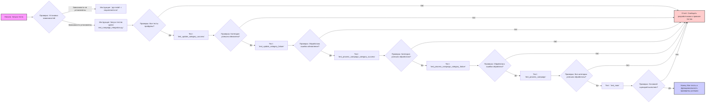
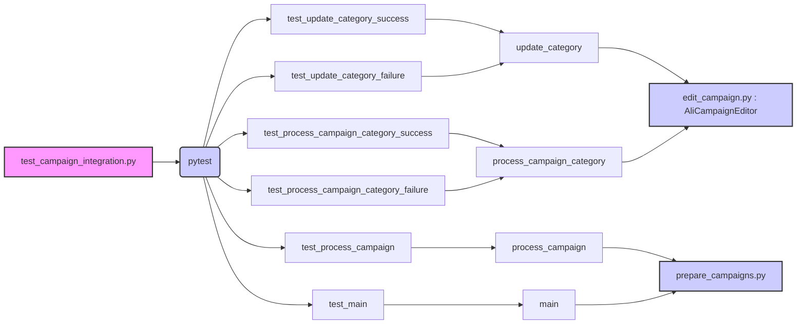

# Анализ кода модуля управления рекламными кампаниями AliExpress

## 1. <алгоритм>

**Блок-схема рабочего процесса:**

**Примеры для каждого логического блока:**

*   **A (Начало):** Запуск тестов командой `pytest test_campaign_integration.py`.
*   **B (Проверка зависимостей):** Проверка наличия установленных библиотек, которые указаны в файле `requirements.txt`.
*   **C (Установка зависимостей):**  Выполнение команды `pip install -r requirements.txt`, если зависимости не установлены.
*   **D (Запуск тестов):** Команда `pytest test_campaign_integration.py` выполняется для запуска всех тестов.
*   **E (Проверка успешности тестов):** Проверяется вывод pytest, который должен показывать `PASSED` для всех тестов.
*   **F (Отчет о провале):** В случае неуспешного выполнения какого-либо теста, сообщение об ошибке отправляется разработчикам для исправления.
*   **G (Тест `test_update_category_success`):** Проверка успешного обновления категории в JSON файле.  Например, запись новых данных в файл и сверка результата с ожидаемым.
*   **H (Проверка успешности обновления):** Убеждаемся что данные категории правильно обновляются в файле, и выводится соответствующее сообщение.
*   **I (Тест `test_update_category_failure`):**  Симулируем ошибку во время обновления категории, чтобы проверить правильность обработки ошибки. Например, попытка записи в файл без прав доступа.
*   **J (Проверка обработки ошибки обновления):** Функция должна залогировать сообщение об ошибке и вернуть `False`.
*   **K (Тест `test_process_campaign_category_success`):** Тестируем обработку категории в рамках кампании. Например,  проверяется корректность обработки данных для определенной категории и полученный результат.
*   **L (Проверка успешности обработки категории):** Убеждаемся, что функция обрабатывает категорию без ошибок и возвращает корректные данные.
*   **M (Тест `test_process_campaign_category_failure`):** Создаем ситуацию с ошибкой во время обработки категории (например, некорректные данные), чтобы проверить обработку ошибки.
*  **N (Проверка обработки ошибки обработки категории):** Убеждаемся, что в случае ошибки, функция логирует сообщение об ошибке и возвращает `None`.
*   **O (Тест `test_process_campaign`):** Проверяем обработку всех категорий в кампании. Например,  проверяется, что для всех категорий результат обработки возвращается без ошибок.
*   **P (Проверка успешной обработки всех категорий):** Убеждаемся, что функция корректно обрабатывает все категории и возвращает результаты для каждой из них.
*   **Q (Тест `test_main`):** Проверяем выполнение основного сценария кампании (полную обработку).
*   **R (Проверка успешности выполнения основного сценария):** Убеждаемся, что основной сценарий выполнился асинхронно без ошибок.
*   **S (Конец):** Все тесты и функциональность проверены успешно, модуль готов к работе.

## 2. <mermaid>

**Объяснение зависимостей:**

*   `test_campaign_integration.py` (A): Файл, содержащий все интеграционные тесты, использующий `pytest` (B) для запуска этих тестов.
*   `pytest` (B): Инструмент для запуска тестов, который вызывает отдельные тестовые функции.
*   Тесты (`C-H`):
    *   `test_update_category_success` (C) и `test_update_category_failure` (D) тестируют функцию `update_category` (I).
    *   `test_process_campaign_category_success` (E) и `test_process_campaign_category_failure` (F) тестируют функцию `process_campaign_category` (J).
    *   `test_process_campaign` (G) тестирует функцию `process_campaign` (K).
    *   `test_main` (H) тестирует функцию `main` (L).
*   `update_category` (I):  Функция для обновления категорий в JSON файле, используется `AliCampaignEditor` (M) для управления кампанией.
*   `process_campaign_category` (J): Функция для обработки категорий, используется `AliCampaignEditor` (M) для управления кампанией.
*   `process_campaign` (K): Функция для обработки кампании, использует модуль `prepare_campaigns.py` (N).
*   `main` (L): Основная асинхронная функция, используется модуль `prepare_campaigns.py` (N).
*   `edit_campaign.py : AliCampaignEditor` (M): Файл и класс для управления рекламными кампаниями, используется для управления кампанией.
*   `prepare_campaigns.py` (N): Файл, содержащий функции для подготовки и обработки данных кампаний.

## 3. <объяснение>

### Импорты

В предоставленном коде импорты не показаны, однако, исходя из описания файлов, можно предположить следующие:

-   В файле `edit_campaign.py`,  вероятно, импортируются базовые классы для работы с рекламными кампаниями, возможно, из других модулей `src`, а также необходимые библиотеки для работы с JSON.
-   В файле `prepare_campaigns.py` импортируются библиотеки для работы с JSON, логирования, а также возможно asyncio для асинхронных операций.
-   В файле `test_campaign_integration.py` импортируются модули `pytest`, `edit_campaign.py`, `prepare_campaigns.py` и, возможно, библиотеки для создания заглушек и моков для тестирования.

### Классы

*   **`AliCampaignEditor`** (из `edit_campaign.py`):
    *   **Роль:** Класс для управления рекламными кампаниями AliExpress.
    *   **Атрибуты:** Может содержать атрибуты для хранения данных кампании, такие как ID кампании, название, настройки и т.д.  Это зависит от реализации класса `AliPromoCampaign`, от которого наследуется данный класс.
    *   **Методы:** Основной метод — это конструктор `AliCampaignEditor`, который инициализирует объект. Возможно наличие других методов для редактирования кампании, добавления и удаления категорий, которые не отображены в данном документе.
    *   **Взаимодействие:** Этот класс используется в функциях `update_category` и `process_campaign_category` в файле `prepare_campaigns.py` для управления данными кампании.

### Функции

*   **`update_category(campaign_data: dict, category_id: str, new_data: dict) -> bool`** (из `prepare_campaigns.py`):
    *   **Аргументы:**
        *   `campaign_data`: Словарь с данными кампании (например, загруженные из JSON).
        *   `category_id`: Идентификатор категории, которую нужно обновить.
        *  `new_data`:  Словарь с новыми данными категории.
    *   **Возвращаемое значение:** `True`, если обновление прошло успешно, `False` в случае ошибки.
    *   **Назначение:** Обновляет данные категории в файле JSON.
    *   **Пример:** `update_category({"categories": {"123": {"name": "Old Name"}}}, "123", {"name": "New Name"})` Обновит имя категории с id "123" на "New Name".
*   **`process_campaign_category(campaign_data: dict, category_id: str) -> dict | None`** (из `prepare_campaigns.py`):
    *   **Аргументы:**
        *   `campaign_data`: Словарь с данными кампании.
        *   `category_id`: Идентификатор категории, которую нужно обработать.
    *   **Возвращаемое значение:** Словарь с результатами обработки категории, `None` в случае ошибки.
    *   **Назначение:** Обрабатывает данные для конкретной категории в рамках кампании.
    *   **Пример:** Если категория с `category_id = "123"` содержит данные о продуктах, эта функция может обработать эти данные (например, вычислить цену и выдать результат).
*   **`process_campaign(campaign_data: dict) -> dict`** (из `prepare_campaigns.py`):
    *   **Аргументы:**
        *   `campaign_data`: Словарь с данными кампании, включая все категории.
    *   **Возвращаемое значение:** Словарь, содержащий результаты обработки каждой категории.
    *   **Назначение:** Обрабатывает всю кампанию, включая все категории, путем вызова `process_campaign_category` для каждой категории.
    *   **Пример:**  `process_campaign({"categories": {"123": {"name": "Category 1"}, "456": {"name": "Category 2"}}})` обработает обе категории и вернет словарь с результатами.
*  **`main(campaign_data: dict) -> dict`** (из `prepare_campaigns.py`)
    *   **Аргументы:**
        *    `campaign_data`: Словарь с данными кампании.
    *   **Возвращаемое значение:** Словарь, содержащий результаты обработки всех категорий кампании.
    *   **Назначение:** Основная асинхронная функция для выполнения всех этапов обработки кампании.
    *  **Пример**: Использует `process_campaign` для обработки всех категорий, асинхронно.

### Переменные

В данном документе конкретные переменные не описаны, но можно предположить следующие:

*   В файлах `edit_campaign.py` и `prepare_campaigns.py` будут переменные для хранения данных кампании, категорий, настроек, а также для логирования.
*   В файле `test_campaign_integration.py` будут переменные для хранения тестовых данных, ожидаемых результатов и т.д.

### Потенциальные ошибки и области для улучшения

*   **Отсутствие проверок типов:** В коде не описаны проверки типов аргументов функций, что может привести к ошибкам во время выполнения.
*   **Обработка ошибок:** Необходимо более детально проработать обработку ошибок, включая логирование и корректную передачу сообщений об ошибках.
*   **Отсутствие документации кода:** В коде отсутствует подробная документация, что затрудняет понимание работы функций и классов.
*   **Зависимость от JSON:** Зависимость от формата JSON может ограничить гибкость модуля. Возможно стоит предусмотреть возможность использования других форматов данных в будущем.

### Взаимосвязи с другими частями проекта

*   Модуль тесно связан с системой управления рекламными кампаниями AliExpress и зависит от ее API или интерфейсов.
*   Модуль использует сторонние библиотеки и инструменты, например, `pytest`, `asyncio` и другие, указанные в `requirements.txt`.
*   Результаты обработки данных и логи могут использоваться другими модулями или компонентами проекта для дальнейшей аналитики или отчетности.

Этот анализ предоставляет полное представление о структуре модуля и его взаимодействии с другими частями проекта, что должно помочь в тестировании и понимании его работы.