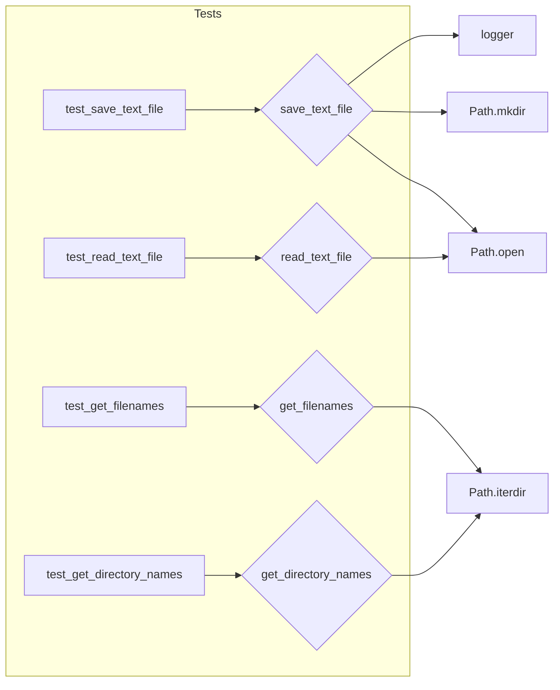

# <input code>

```python
## \file hypotez/src/suppliers/aliexpress/campaign/_pytest/test_ali_campaign_editor_jupyter_widgets.py
# -*- coding: utf-8 -*-\n#! venv/Scripts/python.exe\n#! venv/bin/python/python3.12\n\n"""
.. module: src.suppliers.aliexpress.campaign._pytest 
	:platform: Windows, Unix
	:synopsis:

"""
MODE = 'dev'


"""
	:platform: Windows, Unix
	:synopsis:

"""


"""
	:platform: Windows, Unix
	:synopsis:

"""


"""
  :platform: Windows, Unix

"""
"""
  :platform: Windows, Unix
  :platform: Windows, Unix
  :synopsis:
"""MODE = 'dev'
  
""" module: src.suppliers.aliexpress.campaign._pytest """


""" file.py tests """

import header 
import pytest
from unittest.mock import patch, mock_open, MagicMock
from pathlib import Path
from src.utils.file.file import (
    save_text_file,
    read_text_file,
    get_filenames,
    get_directory_names,
)


# Tests for save_text_file function
@patch("src.utils.file.file.Path.open", new_callable=mock_open)
@patch("src.utils.file.file.Path.mkdir")
@patch("src.utils.file.file.logger")
def test_save_text_file(mock_logger, mock_mkdir, mock_file_open):
    """Test saving text to a file.

    Args:
        mock_logger (MagicMock): Mocked logger instance.
        mock_mkdir (MagicMock): Mocked mkdir instance.
        mock_file_open (MagicMock): Mocked file open instance.

    Example:
        >>> test_save_text_file()
    """
    save_text_file("test.txt", "This is a test.")
    mock_file_open.assert_called_once_with("w", encoding="utf-8")
    mock_file_open().write.assert_called_once_with("This is a test.")
    mock_mkdir.assert_called_once()


# Tests for read_text_file function
@patch(
    "src.utils.file.file.Path.open", new_callable=mock_open, read_data="This is a test."
)
def test_read_text_file(mock_file_open):
    """Test reading text from a file.

    Args:
        mock_file_open (MagicMock): Mocked file open instance.

    Returns:
        None

    Example:
        >>> content: str = test_read_text_file()
        >>> print(content)
        'This is a test.'
    """
    content = read_text_file("test.txt")
    assert content == "This is a test."
    mock_file_open.assert_called_once_with("r", encoding="utf-8")


# Tests for get_filenames function
def test_get_filenames():
    """Test getting filenames from a directory.

    Returns:
        None

    Example:
        >>> filenames: list[str] = test_get_filenames()
        >>> print(filenames)
        ['file1.txt', 'file2.txt']
    """
    with patch(
        "src.utils.file.file.Path.iterdir",
        return_value=[Path(f"file{i}.txt") for i in range(1, 3)],
    ):
        filenames = get_filenames(Path("/some/dir"))
        assert filenames == ["file1.txt", "file2.txt"]


# Tests for get_directory_names function
def test_get_directory_names():
    """Test getting directory names from a path.

    Returns:
        None

    Example:
        >>> directories: list[str] = test_get_directory_names()
        >>> print(directories)
        ['dir1', 'dir2']
    """
    with patch(
        "src.utils.file.file.Path.iterdir",
        return_value=[Path(f"dir{i}") for i in range(1, 3)],
    ):
        directories = get_directory_names(Path("/some/dir"))
        assert directories == ["dir1", "dir2"]
```

# <algorithm>

The code consists of unit tests for functions related to file operations.  There is no complex algorithm, the tests verify the expected behavior of these functions under different conditions.

* **`test_save_text_file`**: Checks that `save_text_file` creates a file, writes the correct text to it, and potentially creates the directory if it doesn't exist. Uses mocking to simulate file operations.
* **`test_read_text_file`**: Verifies that `read_text_file` correctly reads the content of a file.
* **`test_get_filenames`**:  Checks `get_filenames` to make sure it returns a list of file names from a given directory. Mocks the `Path.iterdir` method to control the list of files returned.
* **`test_get_directory_names`**: Similar to `test_get_filenames`, but retrieves directory names instead of file names.

Data flow is primarily within the scope of each individual test function.  The test functions call the functions being tested, and assertions are used to verify the output.  No external data is explicitly passed between the tests.


# <mermaid>



**Explanation of Dependencies (mermaid):**

The `mermaid` diagram illustrates how the test functions (`A`, `C`, `E`, `G`) interact with the functions under test (`B`, `D`, `F`, `H`).  Crucially, these functions use methods from the `Path` object and the `logger` (which is mocked in the tests) and depend on the `utils.file.file` module.  This dependency represents code that is external to the test but essential for its execution.


# <explanation>

**Imports:**

* `header`: Likely an import that provides some configuration or initialization for the tests.
* `pytest`: The testing framework used for running the tests.
* `unittest.mock`: Allows mocking of functions and objects to isolate the tests and verify behavior under specific conditions.
* `pathlib`: Used for handling file paths.
* `src.utils.file.file`: Contains the functions (`save_text_file`, `read_text_file`, `get_filenames`, `get_directory_names`) being tested.  This suggests a modular design with reusable utilities within the project.  `src` is the source directory of the project.

**Classes:**

There are no classes defined; only functions are tested.

**Functions:**

* **`save_text_file`**: Takes a filename and text content as input and writes the text to the file.
* **`read_text_file`**: Reads text from a file and returns the content.
* **`get_filenames`**: Returns a list of filenames in a given directory.
* **`get_directory_names`**: Returns a list of directory names in a given path.

**Variables:**

* `MODE`: A global variable presumably used to configure the test environment (e.g., for development or production).

**Possible Errors/Improvements:**

* **Error Handling:** The file functions could benefit from error handling (e.g., `try...except` blocks) to catch potential issues like file not found, permission errors, or encoding problems.
* **Robustness:** The tests are well-structured and use mocking effectively but could be more comprehensive in covering edge cases. For example, testing for empty directories, handling non-existent files, and different file types would enhance test coverage.
* **File Paths:** The tests use hardcoded paths (`"/some/dir"`). It's better to use a more dynamic approach, potentially creating temporary directories for the tests.
* **Logging:** The code includes `mock_logger`, indicating the use of logging.  While mocked here, handling logging appropriately in production is important for debugging and tracking.


**Relationship to Other Parts of the Project:**

The tested functions (`save_text_file`, `read_text_file`, `get_filenames`, `get_directory_names`) are part of a `utils.file` module likely used by other parts of the `aliexpress` campaign project, for example, loading configuration files or processing data.  The `aliexpress` campaign portion of the project is using these utilities, and other parts of the `hypotez` project might as well.