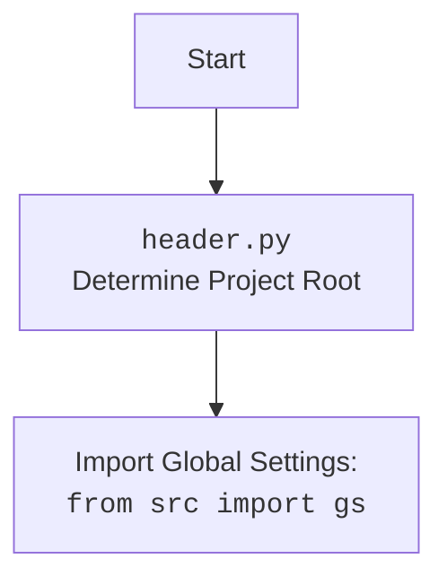

# Анализ кода `test_ali_campaign_editor_jupyter_widgets.py`

## <алгоритм>

**1. `test_save_text_file`**:

   - **Начало**: Вызывается функция `test_save_text_file`.
   - **Мокирование**: Используются `patch` для мокирования `Path.open`, `Path.mkdir` и `logger`.
     - `Path.open` заменяется на `mock_open` для перехвата вызова открытия файла.
     - `Path.mkdir` заменяется на `MagicMock` для перехвата вызова создания директории.
     - `logger` заменяется на `MagicMock` для перехвата вызова логирования.
   - **Вызов `save_text_file`**: Вызывается функция `save_text_file` с аргументами: имя файла `"test.txt"` и текст `"This is a test."`.
   - **Проверка вызова `mock_file_open`**: Проверяется, был ли вызван метод `mock_file_open` с параметрами `"w"` и `encoding="utf-8"`, что соответствует операции записи в файл.
   - **Проверка вызова `mock_file_open().write`**: Проверяется, был ли вызван метод `write` у объекта, возвращенного `mock_file_open`, с текстом `"This is a test."`, что соответствует записи текста в файл.
   - **Проверка вызова `mock_mkdir`**: Проверяется, был ли вызван метод `mkdir` (создание директории).
   - **Конец**: Функция завершается.

   **Пример**:
   ```
   test_save_text_file()
   ```

**2. `test_read_text_file`**:

   - **Начало**: Вызывается функция `test_read_text_file`.
   - **Мокирование**: Используется `patch` для мокирования `Path.open`, передавая ему `read_data="This is a test."` для имитации чтения файла.
   - **Вызов `read_text_file`**: Вызывается функция `read_text_file` с аргументом: имя файла `"test.txt"`.
   - **Проверка возвращаемого значения**: Проверяется, что возвращаемое значение равно `"This is a test."`.
   - **Проверка вызова `mock_file_open`**: Проверяется, был ли вызван метод `mock_file_open` с параметрами `"r"` и `encoding="utf-8"`, что соответствует операции чтения из файла.
   - **Конец**: Функция завершается.

   **Пример**:
   ```
   content = test_read_text_file()
   print(content)  # Вывод: 'This is a test.'
   ```

**3. `test_get_filenames`**:

   - **Начало**: Вызывается функция `test_get_filenames`.
   - **Мокирование**: Используется `patch` для мокирования `Path.iterdir`, возвращая список `Path` объектов `["file1.txt", "file2.txt"]`.
   - **Вызов `get_filenames`**: Вызывается функция `get_filenames` с аргументом: путь директории `Path("/some/dir")`.
   - **Проверка возвращаемого значения**: Проверяется, что возвращаемое значение равно `["file1.txt", "file2.txt"]`.
   - **Конец**: Функция завершается.

   **Пример**:
   ```
   filenames = test_get_filenames()
   print(filenames) # Вывод: ['file1.txt', 'file2.txt']
   ```

**4. `test_get_directory_names`**:

   - **Начало**: Вызывается функция `test_get_directory_names`.
   - **Мокирование**: Используется `patch` для мокирования `Path.iterdir`, возвращая список `Path` объектов `["dir1", "dir2"]`.
   - **Вызов `get_directory_names`**: Вызывается функция `get_directory_names` с аргументом: путь директории `Path("/some/dir")`.
   - **Проверка возвращаемого значения**: Проверяется, что возвращаемое значение равно `["dir1", "dir2"]`.
   - **Конец**: Функция завершается.

   **Пример**:
   ```
   directories = test_get_directory_names()
   print(directories) # Вывод: ['dir1', 'dir2']
   ```

## <mermaid>

```mermaid
flowchart TD
    Start[Начало теста] --> MockSetup[Мокирование функций Path.open, Path.mkdir, logger]
    MockSetup --> Call_save_text_file[Вызов save_text_file("test.txt", "This is a test.")]
    Call_save_text_file --> AssertFileOpen[Проверка вызова mock_file_open с "w"]
    AssertFileOpen --> AssertWrite[Проверка вызова mock_file_open().write с "This is a test."]
    AssertWrite --> AssertMkdir[Проверка вызова mock_mkdir]
    AssertMkdir --> End_save_text_file[Конец test_save_text_file]

    Start --> MockSetup_read[Мокирование Path.open с read_data]
    MockSetup_read --> Call_read_text_file[Вызов read_text_file("test.txt")]
    Call_read_text_file --> AssertReadContent[Проверка возвращаемого значения == "This is a test."]
    AssertReadContent --> AssertFileOpenRead[Проверка вызова mock_file_open с "r"]
    AssertFileOpenRead --> End_read_text_file[Конец test_read_text_file]


    Start --> MockSetup_filenames[Мокирование Path.iterdir с файлами]
    MockSetup_filenames --> Call_get_filenames[Вызов get_filenames(Path("/some/dir"))]
    Call_get_filenames --> AssertFilenames[Проверка возвращаемого значения == ["file1.txt", "file2.txt"]]
    AssertFilenames --> End_get_filenames[Конец test_get_filenames]


    Start --> MockSetup_directories[Мокирование Path.iterdir с директориями]
    MockSetup_directories --> Call_get_directory_names[Вызов get_directory_names(Path("/some/dir"))]
    Call_get_directory_names --> AssertDirectories[Проверка возвращаемого значения == ["dir1", "dir2"]]
    AssertDirectories --> End_get_directory_names[Конец test_get_directory_names]


    End_save_text_file --> End[Конец теста]
    End_read_text_file --> End
    End_get_filenames --> End
    End_get_directory_names --> End
```



## <объяснение>

**Импорты:**

- `header`:  Предположительно, файл `header.py` используется для определения корневой директории проекта и импорта глобальных настроек.
- `pytest`: Фреймворк для тестирования.
- `unittest.mock`: Модуль для создания имитаций (mocks) объектов в тестах.
- `pathlib.Path`: Модуль для работы с путями в файловой системе.
- `src.utils.file.file`: Модуль, содержащий функции для работы с файлами, такие как `save_text_file`, `read_text_file`, `get_filenames`, и `get_directory_names`.

**Функции:**

- `test_save_text_file(mock_logger, mock_mkdir, mock_file_open)`:
    - **Аргументы**:
        - `mock_logger`: Имитация объекта логирования.
        - `mock_mkdir`: Имитация метода создания директории.
        - `mock_file_open`: Имитация метода открытия файла.
    - **Назначение**: Тестирует функцию `save_text_file` из `src.utils.file.file`. Проверяет, что файл открывается в режиме записи, текст записывается в файл, и директория создается.
    - **Пример**: 
     ```python
      test_save_text_file()
     ```
- `test_read_text_file(mock_file_open)`:
    - **Аргументы**:
        - `mock_file_open`: Имитация метода открытия файла.
    - **Назначение**: Тестирует функцию `read_text_file` из `src.utils.file.file`. Проверяет, что функция читает текст из файла и возвращает его.
    - **Пример**: 
     ```python
      content: str = test_read_text_file()
      print(content)
     ```
- `test_get_filenames()`:
    - **Аргументы**: Нет.
    - **Назначение**: Тестирует функцию `get_filenames` из `src.utils.file.file`. Проверяет, что функция возвращает список имен файлов в указанной директории.
    - **Пример**:
    ```python
     filenames: list[str] = test_get_filenames()
     print(filenames)
    ```
- `test_get_directory_names()`:
    - **Аргументы**: Нет.
    - **Назначение**: Тестирует функцию `get_directory_names` из `src.utils.file.file`. Проверяет, что функция возвращает список имен директорий в указанном пути.
    - **Пример**:
    ```python
     directories: list[str] = test_get_directory_names()
     print(directories)
    ```

**Переменные:**
- `mock_logger`, `mock_mkdir`, `mock_file_open`: Объекты `MagicMock`, используемые для имитации зависимостей во время тестирования.
- `content`: Строка, содержащая контент, считанный из файла.
- `filenames`: Список строк, представляющих имена файлов.
- `directories`: Список строк, представляющих имена директорий.

**Объяснение:**

Этот код представляет собой набор тестов, написанных с использованием `pytest` и `unittest.mock`. Тесты проверяют работу функций из модуля `src.utils.file.file`, таких как `save_text_file`, `read_text_file`, `get_filenames` и `get_directory_names`.
Для изоляции тестируемых функций от реальной файловой системы используется мокирование (`unittest.mock.patch`). Это позволяет имитировать поведение файловой системы, не влияя на реальные файлы.

**Потенциальные улучшения:**

- **Более подробные тесты**:  Можно добавить больше тестовых случаев, например, проверку обработки ошибок при записи в файл или чтения из несуществующего файла.
- **Параметризация тестов**: Использование `pytest.mark.parametrize` для проверки разных входных данных с помощью одного теста.
- **Документация**: Добавить docstrings для всех тестовых функций и указать конкретное предназначение каждой функции.
- **Проверка исключений**: Добавить проверку, что функция выбрасывает исключения в нужных случаях.
- **Использование `fixture`**: Можно использовать `fixture` в `pytest` для упрощения повторяющихся действий по мокированию.

**Цепочка взаимосвязей:**
- Код зависит от `src.utils.file.file`, который предоставляет функции для работы с файлами и директориями.
- Модуль `header` используется для инициализации настроек проекта, но сам не используется в тестах.
- Код использует `pytest` для организации и запуска тестов.
- `unittest.mock` используется для имитации зависимостей и контроля поведения тестируемых функций.

Таким образом, код представляет собой набор тестов, которые проверяют функциональность модуля для работы с файлами, используя мокирование для изоляции от реальной файловой системы.