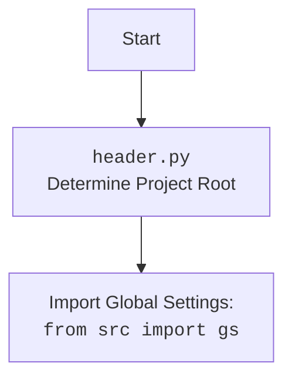

## <алгоритм>

1. **`test_save_text_file`**:
    *   **Вход**: Функция не принимает явных аргументов, но использует mock-объекты.
    *   **Действие**:
        *   Вызывает `save_text_file("test.txt", "This is a test.")`.
        *   Внутри `save_text_file`:
            *   Создается (mock) директория, если она не существует.
            *   Открывается файл `test.txt` в режиме записи ("w") с кодировкой UTF-8.
            *   В файл записывается строка "This is a test.".
        *   Проверяется, что `mock_file_open` был вызван с правильными аргументами для открытия файла на запись с кодировкой UTF-8.
        *   Проверяется, что метод `write` у mock-файла был вызван с нужным текстом.
        *   Проверяется, что метод `mkdir` был вызван для создания директории.
    *   **Выход**: Функция не возвращает значения.
    *   **Пример**:
        ```python
        # Вызов test_save_text_file
        test_save_text_file() 
        # Внутри test_save_text_file вызывается:
        save_text_file("test.txt", "This is a test.")
        # Результат: в mock файл записывается "This is a test."
        ```

2. **`test_read_text_file`**:
    *   **Вход**: Функция не принимает явных аргументов, но использует mock-объект.
    *   **Действие**:
        *   Вызывает `read_text_file("test.txt")`.
        *   Внутри `read_text_file`:
            *   Открывается файл `test.txt` в режиме чтения ("r") с кодировкой UTF-8.
            *   Читается содержимое файла. (mocked)
            *   Возвращается содержимое файла как строка.
        *   Проверяется, что содержимое файла равно "This is a test.".
        *   Проверяется, что `mock_file_open` был вызван с правильными аргументами для открытия файла на чтение с кодировкой UTF-8.
    *   **Выход**: Функция возвращает строку, представляющую содержимое файла.
    *   **Пример**:
        ```python
        # Вызов test_read_text_file
        content = test_read_text_file()
        # Внутри test_read_text_file вызывается:
        read_text_file("test.txt")
        # Результат: content = "This is a test."
        ```

3. **`test_get_filenames`**:
    *   **Вход**: Функция не принимает явных аргументов, но использует mock-объект.
    *   **Действие**:
        *   Вызывает `get_filenames(Path("/some/dir"))`.
        *   Внутри `get_filenames`:
            *   Получает список (mock) элементов в директории, представленных как `Path` объекты.
            *   Извлекает имена файлов из этих `Path` объектов.
            *   Возвращает список имен файлов.
        *   Проверяется, что возвращенный список имен файлов равен `["file1.txt", "file2.txt"]`.
    *   **Выход**: Функция возвращает список строк, представляющих имена файлов.
    *    **Пример**:
        ```python
        # Вызов test_get_filenames
        filenames = test_get_filenames()
        # Внутри test_get_filenames вызывается:
        get_filenames(Path("/some/dir"))
        # Результат: filenames = ["file1.txt", "file2.txt"]
        ```

4. **`test_get_directory_names`**:
    *   **Вход**: Функция не принимает явных аргументов, но использует mock-объект.
    *   **Действие**:
         *   Вызывает `get_directory_names(Path("/some/dir"))`.
        *   Внутри `get_directory_names`:
            *   Получает список (mock) элементов в директории, представленных как `Path` объекты.
            *   Извлекает имена директорий из этих `Path` объектов.
            *   Возвращает список имен директорий.
        *   Проверяется, что возвращенный список имен директорий равен `["dir1", "dir2"]`.
    *   **Выход**: Функция возвращает список строк, представляющих имена директорий.
    *   **Пример**:
        ```python
        # Вызов test_get_directory_names
        directories = test_get_directory_names()
        # Внутри test_get_directory_names вызывается:
        get_directory_names(Path("/some/dir"))
        # Результат: directories = ["dir1", "dir2"]
        ```

## <mermaid>

```mermaid
flowchart TD
    subgraph test_save_text_file
        A[test_save_text_file] --> B{save_text_file};
        B --> C[mock_mkdir.assert_called_once()];
        B --> D[mock_file_open.assert_called_once_with("w", encoding="utf-8")];
        D --> E[mock_file_open().write.assert_called_once_with("This is a test.")];
    end
    subgraph test_read_text_file
        F[test_read_text_file] --> G{read_text_file};
        G --> H[mock_file_open.assert_called_once_with("r", encoding="utf-8")];
        G --> I[assert content == "This is a test."];
    end
    subgraph test_get_filenames
        J[test_get_filenames] --> K{get_filenames};
        K --> L[assert filenames == ["file1.txt", "file2.txt"]];
    end
    subgraph test_get_directory_names
        M[test_get_directory_names] --> N{get_directory_names};
        N --> O[assert directories == ["dir1", "dir2"]];
    end
```



## <объяснение>

**Импорты:**

*   `header`: Предположительно, это модуль, который устанавливает корневой каталог проекта и загружает общие настройки. В данном коде используется для инициализации среды выполнения тестов.
*   `pytest`: Фреймворк для тестирования. Используется для написания и запуска тестов.
*   `unittest.mock.patch`, `unittest.mock.mock_open`, `unittest.mock.MagicMock`: Инструменты для создания mock-объектов, которые позволяют изолировать тестируемый код от зависимостей, таких как файловая система.
*   `pathlib.Path`: Класс для работы с путями в файловой системе.
*   `src.utils.file.file.save_text_file`, `src.utils.file.file.read_text_file`, `src.utils.file.file.get_filenames`, `src.utils.file.file.get_directory_names`: Функции для работы с файловой системой (сохранение текста, чтение текста, получение имен файлов, получение имен директорий). Эти функции являются частью пакета `src` и используются тестируемыми функциями.

**Функции:**

1.  `test_save_text_file`:
    *   **Назначение**: Тестирует функцию `save_text_file` из модуля `src.utils.file.file`.
    *   **Аргументы**: Принимает mock-объекты для `logger`, `mkdir`, и `file open`.
    *   **Действие**: Вызывает функцию `save_text_file` с тестовыми данными и проверяет, что файловые операции были вызваны с ожидаемыми параметрами (открытие файла на запись, запись текста, создание каталога).
    *   **Пример**: Создается mock файл, и в него записывается `"This is a test."`
    *   **Взаимосвязь**: Зависит от `src.utils.file.file.save_text_file`.

2.  `test_read_text_file`:
    *   **Назначение**: Тестирует функцию `read_text_file` из модуля `src.utils.file.file`.
    *   **Аргументы**: Принимает mock-объект для `file open`.
    *   **Действие**: Вызывает функцию `read_text_file` и проверяет, что возвращаемое содержимое файла соответствует ожидаемому значению, а также проверяет, что файл был открыт с необходимыми параметрами.
    *    **Пример**: С mock файла считывается строка `"This is a test."` и проверяется, что она равна этой строке
    *   **Взаимосвязь**: Зависит от `src.utils.file.file.read_text_file`.

3.  `test_get_filenames`:
    *   **Назначение**: Тестирует функцию `get_filenames` из модуля `src.utils.file.file`.
    *   **Аргументы**: Не принимает явных аргументов, но использует mock-объект.
    *   **Действие**: Вызывает функцию `get_filenames` и проверяет, что возвращаемый список имен файлов соответствует ожидаемому значению.
    *   **Пример**: Создается mock директория с файлами `file1.txt`, `file2.txt`, и проверяется, что функция возвращает список `["file1.txt", "file2.txt"]`.
    *   **Взаимосвязь**: Зависит от `src.utils.file.file.get_filenames`.

4.  `test_get_directory_names`:
    *   **Назначение**: Тестирует функцию `get_directory_names` из модуля `src.utils.file.file`.
    *   **Аргументы**: Не принимает явных аргументов, но использует mock-объект.
    *   **Действие**: Вызывает функцию `get_directory_names` и проверяет, что возвращаемый список имен директорий соответствует ожидаемому значению.
    *   **Пример**: Создается mock директория с поддиректориями `dir1`, `dir2`, и проверяется, что функция возвращает список `["dir1", "dir2"]`.
    *   **Взаимосвязь**: Зависит от `src.utils.file.file.get_directory_names`.

**Переменные:**

*   `mock_logger`, `mock_mkdir`, `mock_file_open` (в `test_save_text_file`): MagicMock-объекты, используемые для имитации поведения зависимостей функции `save_text_file`.
*   `mock_file_open` (в `test_read_text_file`): MagicMock-объект, используемый для имитации поведения метода `open` из модуля `pathlib.Path`.
*   `content`: Строковая переменная для хранения возвращаемого содержимого из `read_text_file`.
*   `filenames`: Список строк, содержащий имена файлов.
*    `directories`: Список строк, содержащий имена директорий.

**Потенциальные ошибки и области для улучшения:**

*   **Отсутствие обработки исключений**: В тестовом коде не проверяются возможные исключения, которые могут возникнуть в тестируемых функциях, например, если файл не найден.
*   **Мокирование**: Для более надежных тестов можно использовать mock-объекты более явно, например, проверяя аргументы и возвращаемые значения методов `Path` более детально.
*   **Избыточность**: Присутствует много повторяющегося кода, особенно в настройке mock-объектов. Это можно сократить, используя `pytest fixtures`.
*    **Улучшение покрытия кода**: Необходимо увеличить количество тестов, которые покрывают граничные условия и различные сценарии использования функций.
*   **Отсутствие явного тестирования кодировки**:  В тестах явно указывается `encoding='utf-8'`, но можно добавить тесты с другой кодировкой.

**Взаимосвязи с другими частями проекта:**

*   Данный файл является частью тестов для модуля `src.suppliers.aliexpress.campaign`, но он тестирует функции из `src.utils.file.file`. Это означает, что данный тест косвенно тестирует и функциональность модуля `src.utils.file.file`.
*   `header` -  модуль, необходимый для инициализации среды выполнения тестов, который предположительно настраивает пути к файлам и параметры конфигурации.

**Цепочка взаимосвязей:**

1.  `test_ali_campaign_editor_jupyter_widgets.py`  зависит от `header` для инициализации проекта.
2.  `test_ali_campaign_editor_jupyter_widgets.py`  импортирует и тестирует функции из  `src.utils.file.file.py`, то есть, данный тест зависит от этого модуля.
3.  Тестируемые функции, такие как `save_text_file`, `read_text_file`, `get_filenames`, `get_directory_names` предположительно могут использоваться в модулях проекта `src.suppliers.aliexpress.campaign`.