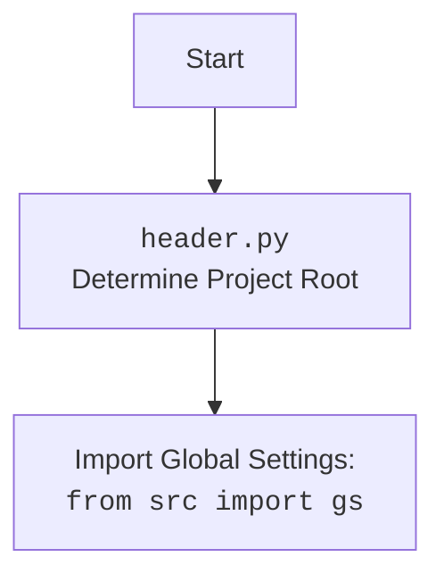

## АНАЛИЗ КОДА: `test_alipromo_campaign.py`

### 1. <алгоритм>

Этот код представляет собой набор тестов для класса `AliPromoCampaign`, который управляет рекламными кампаниями AliExpress. Основная цель - проверить корректность работы различных методов этого класса.

**Блок-схема:**

1.  **Настройка:**
    *   Импортируются необходимые модули и классы: `pytest`, `pathlib.Path`, `types.SimpleNamespace`, `AliPromoCampaign`, `j_dumps`, `j_loads_ns`, `save_text_file`, и `gs`.
    *   Определяются общие переменные: `campaign_name`, `category_name`, `language`, и `currency`.
    *   Создается фикстура `campaign`, которая инициализирует экземпляр класса `AliPromoCampaign` перед каждым тестом.

2.  **`test_initialize_campaign`:**
    *   Мокируется функция `j_loads_ns`, чтобы вернуть тестовые данные кампании.
    *   Вызывается метод `initialize_campaign`.
    *   Проверяется, что данные кампании были правильно инициализированы.

    *Пример:* Мокируются данные, чтобы имитировать загрузку из JSON-файла. Проверка `campaign.campaign.name == campaign_name` подтверждает, что имя кампании установлено правильно.

3.  **`test_get_category_products_no_json_files`:**
    *   Мокируется функция `get_filenames`, чтобы вернуть пустой список (нет JSON-файлов).
    *   Мокируется `fetch_product_data` чтобы вернуть пустой список.
    *   Вызывается `get_category_products`.
    *   Проверяется, что возвращен пустой список (нет продуктов).

    *Пример:* Мокируется сценарий, где нет JSON-файлов продуктов. Проверка `products == []` подтверждает, что функция правильно обрабатывает эту ситуацию.

4.  **`test_get_category_products_with_json_files`:**
    *   Мокируется `get_filenames`, чтобы вернуть список с именем файла JSON.
    *   Мокируется `j_loads_ns`, чтобы вернуть тестовые данные продукта.
    *   Вызывается `get_category_products`.
    *   Проверяется, что возвращен список с одним продуктом и его данные верны.

    *Пример:* Имитируется ситуация, когда есть JSON-файл с данными о продукте. Проверка `len(products) == 1`, `products[0].product_id == "123"` и `products[0].product_title == "Test Product"` убеждается, что данные загружены правильно.

5.  **`test_create_product_namespace`:**
    *   Создается тестовый словарь `product_data`.
    *   Вызывается `create_product_namespace`.
    *   Проверяется, что возвращенный объект содержит верные атрибуты.

    *Пример:* Создается SimpleNamespace объект продукта. Проверка `product.product_id == "123"` и `product.product_title == "Test Product"` подтверждает, что поля были установлены корректно.

6.  **`test_create_category_namespace`:**
    *   Создается тестовый словарь `category_data`.
    *   Вызывается `create_category_namespace`.
    *   Проверяется, что возвращенный объект содержит верные атрибуты.

    *Пример:* Аналогично `test_create_product_namespace`, но для категории. Проверяется `category.name == category_name` и `category.tags == "tag1, tag2"`.

7.  **`test_create_campaign_namespace`:**
    *   Создается тестовый словарь `campaign_data`.
    *   Вызывается `create_campaign_namespace`.
    *   Проверяется, что возвращенный объект содержит верные атрибуты.

    *Пример:* Создается SimpleNamespace объект кампании. Проверка `camp.name == campaign_name` и `camp.title == "Test Campaign"` подтверждает корректность заполнения.

8.  **`test_prepare_products`:**
    *   Мокируются `get_prepared_products`, `read_text_file`, `get_filenames`, и `process_affiliate_products`.
    *   Вызывается `prepare_products`.
    *   Проверяется, что `process_affiliate_products` был вызван.

    *Пример:* Проверяется, что метод `prepare_products` вызывает другие методы для обработки данных. `campaign.process_affiliate_products.assert_called_once()` убеждается, что метод был вызван один раз.

9.  **`test_fetch_product_data`:**
    *   Создается список `product_ids`.
    *   Мокируется `process_affiliate_products` для возврата моковых продуктов.
    *   Вызывается `fetch_product_data`.
    *   Проверяется, что возвращен список с ожидаемыми продуктами.

    *Пример:* Запрашиваются данные продуктов. Проверка длинны списка, а так же `products[0].product_id == "123"` и `products[1].product_id == "456"` подтверждают, что данные были получены верно.

10. **`test_save_product`:**
     *   Создается тестовый `product`.
     *   Мокируются функции `j_dumps` и `Path.write_text`.
     *   Вызывается `save_product`.
     *   Проверяется, что данные продукта были записаны в файл с помощью `Path.write_text`.
     
     *Пример:* Проверяется сохранение данных продукта. `Path.write_text.assert_called_once_with("{}", encoding=\'utf-8\')` убеждается, что функция сохранения была вызвана с правильными параметрами.

11. **`test_list_campaign_products`:**
    *   Создаются два тестовых продукта.
    *   Устанавливаются продукты в поле `campaign.category.products`.
    *   Вызывается `list_campaign_products`.
    *   Проверяется, что возвращенный список содержит названия продуктов.

    *Пример:* Проверяется, что извлечение названий продуктов работает корректно. `assert product_titles == ["Product 1", "Product 2"]` подтверждает, что возвращён список заголовков продуктов.

### 2. <mermaid>

```mermaid
flowchart TD
    Start[Start Test] --> Fixture[Fixture: Create AliPromoCampaign Instance];
    Fixture --> test_initialize_campaign;
    test_initialize_campaign --> MockJloads[Mock src.utils.jjson.j_loads_ns];
    MockJloads --> InitializeCamp[Call initialize_campaign()];
    InitializeCamp --> AssertInit[Assert campaign initialization];

    Fixture --> test_get_category_products_no_json_files;
    test_get_category_products_no_json_files --> MockFileNamesEmpty[Mock src.utils.file.get_filenames (empty list)];
    MockFileNamesEmpty --> MockFetchDataEmpty[Mock fetch_product_data (empty list)];
    MockFetchDataEmpty --> CallGetCategoryProducts1[Call get_category_products(force=True)];
     CallGetCategoryProducts1 --> AssertNoProducts[Assert products == []];

    Fixture --> test_get_category_products_with_json_files;
    test_get_category_products_with_json_files --> MockFileNamesWithData[Mock src.utils.file.get_filenames (with file)];
    MockFileNamesWithData --> MockJloadsProduct[Mock src.utils.jjson.j_loads_ns (product data)];
    MockJloadsProduct --> CallGetCategoryProducts2[Call get_category_products()];
    CallGetCategoryProducts2 --> AssertProductsData[Assert products data is correct];

    Fixture --> test_create_product_namespace;
    test_create_product_namespace --> CreateProductData[Create test product data dictionary];
    CreateProductData --> CallCreateProductNamespace[Call create_product_namespace()];
     CallCreateProductNamespace --> AssertProductNamespace[Assert product namespace values];

    Fixture --> test_create_category_namespace;
    test_create_category_namespace --> CreateCategoryData[Create test category data dictionary];
    CreateCategoryData --> CallCreateCategoryNamespace[Call create_category_namespace()];
    CallCreateCategoryNamespace --> AssertCategoryNamespace[Assert category namespace values];

    Fixture --> test_create_campaign_namespace;
     test_create_campaign_namespace --> CreateCampaignData[Create test campaign data dictionary];
    CreateCampaignData --> CallCreateCampaignNamespace[Call create_campaign_namespace()];
     CallCreateCampaignNamespace --> AssertCampaignNamespace[Assert campaign namespace values];

    Fixture --> test_prepare_products;
     test_prepare_products --> MockGetPreparedProducts[Mock get_prepared_products()];
    MockGetPreparedProducts --> MockReadFile[Mock read_text_file()];
     MockReadFile --> MockGetFileNames[Mock get_filenames()];
    MockGetFileNames --> MockProcessAffiliateProducts[Mock process_affiliate_products()];
    MockProcessAffiliateProducts --> CallPrepareProducts[Call prepare_products()];
     CallPrepareProducts --> AssertProcessAffiliateCalled[Assert process_affiliate_products called];

    Fixture --> test_fetch_product_data;
    test_fetch_product_data --> SetProductIds[Set product_ids];
    SetProductIds --> MockProcessAffiliateProducts2[Mock process_affiliate_products (return mock products)];
    MockProcessAffiliateProducts2 --> CallFetchProductData[Call fetch_product_data()];
     CallFetchProductData --> AssertProductDataFetched[Assert product data is fetched];

    Fixture --> test_save_product;
    test_save_product --> CreateMockProduct[Create mock product];
    CreateMockProduct --> MockJdumps[Mock src.utils.jjson.j_dumps()];
    MockJdumps --> MockPathWriteText[Mock pathlib.Path.write_text()];
     MockPathWriteText --> CallSaveProduct[Call save_product()];
    CallSaveProduct --> AssertPathWriteTextCalled[Assert Path.write_text called];


    Fixture --> test_list_campaign_products;
    test_list_campaign_products --> CreateMockProductsList[Create list of mock products];
     CreateMockProductsList --> CallListCampaignProducts[Call list_campaign_products()];
    CallListCampaignProducts --> AssertProductTitlesList[Assert product titles are listed];

    AssertInit --> End[End Test];
    AssertNoProducts --> End;
    AssertProductsData --> End;
    AssertProductNamespace --> End;
    AssertCategoryNamespace --> End;
     AssertCampaignNamespace --> End;
     AssertProcessAffiliateCalled --> End;
    AssertProductDataFetched --> End;
     AssertPathWriteTextCalled --> End;
    AssertProductTitlesList --> End;
```

**Импорты и зависимости `mermaid`:**

-   **`Start`, `End`**:  Начало и конец тестового процесса.
-   **`Fixture`**:  Фикстура `campaign`, предоставляющая экземпляр `AliPromoCampaign` для каждого теста.
-   **`Mock...`**: Обозначают мокирование функций из различных модулей (`src.utils.jjson`, `src.utils.file`, и т.д.), которые используются для изоляции теста от внешних зависимостей.
-   **`Call...`**: Обозначают вызовы методов тестируемого класса `AliPromoCampaign`.
-   **`Assert...`**: Обозначают проверки, которые подтверждают правильность работы тестируемых методов.
-   **Стрелки (`-->`)**: Указывают поток управления и зависимостей между блоками.

**Дополнительно:**


### 3. <объяснение>

**Импорты:**

*   `pytest`: Фреймворк для тестирования.
*   `pathlib.Path`: Для работы с путями к файлам.
*   `types.SimpleNamespace`: Для создания простых объектов с атрибутами.
*   `src.suppliers.aliexpress.campaign.ali_promo_campaign.AliPromoCampaign`: Класс, который тестируется.
*   `src.utils.jjson`: Модуль для работы с JSON.
*   `src.utils.file`: Модуль для работы с файлами.
*   `src.gs`: Глобальные настройки проекта.

**Классы:**

*   `AliPromoCampaign`: Класс для управления рекламными кампаниями AliExpress. Тесты проверяют его методы:
    *   `initialize_campaign`: Инициализирует данные кампании из JSON.
    *   `get_category_products`: Получает продукты категории из JSON-файлов.
    *   `create_product_namespace`: Создает объект продукта.
    *   `create_category_namespace`: Создает объект категории.
    *   `create_campaign_namespace`: Создает объект кампании.
    *   `prepare_products`: Подготавливает продукты к обработке.
    *   `fetch_product_data`: Загружает данные о продуктах.
    *   `save_product`: Сохраняет данные продукта в файл.
    *   `list_campaign_products`: Возвращает список заголовков продуктов кампании.

**Фикстура:**

*   `campaign()`: Создает экземпляр `AliPromoCampaign` перед каждым тестом, чтобы обеспечить чистую среду для каждого теста.

**Функции:**

*   Каждая функция `test_*` представляет собой тестовый случай для определенного метода класса `AliPromoCampaign`.
*   `mocker`: Предоставляется pytest для мокирования (замены) функций и методов, чтобы изолировать тестируемый код.
*   `assert`: Используется для проверки ожидаемых результатов.

**Переменные:**

*   `campaign_name`, `category_name`, `language`, `currency`: Используются как параметры для инициализации объектов `AliPromoCampaign` в тестах.

**Цепочка взаимосвязей:**

1.  Тесты используют фикстуру `campaign` для создания экземпляра `AliPromoCampaign`.
2.  Методы класса `AliPromoCampaign` используют `src.utils.jjson` для работы с JSON и `src.utils.file` для работы с файлами.
3.  Тесты используют `pytest` и `mocker` для мокирования и тестирования методов `AliPromoCampaign`.

**Потенциальные ошибки и улучшения:**

*   Мокирование функций может привести к сложностям при отладке, если моки не соответствуют реальному поведению функций.
*   Тесты в основном проверяют корректность данных, но не проверяют корректность логики работы с этими данными.
*   Может потребоваться добавление большего количества тестов, особенно для обработки ошибок.

**Дополнительные примечания:**
*   Код хорошо структурирован и покрыт тестами.
*   Используются моки для изоляции тестируемого кода.
*   Тесты в основном проверяют основные функции класса `AliPromoCampaign`.
*   Может быть полезна дополнительная проверка логики обработки данных и ошибок.