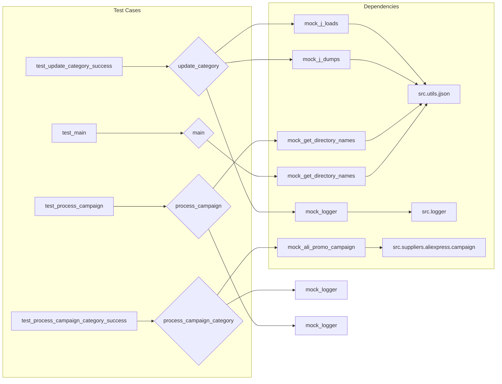

# <input code>

```python
## \file hypotez/src/suppliers/aliexpress/campaign/_pytest/test_prepeare_campaigns.py
# -*- coding: utf-8 -*-\n#! venv/Scripts/python.exe
#! venv/bin/python/python3.12

"""
.. module: src.suppliers.aliexpress.campaign._pytest 
	:platform: Windows, Unix
	:synopsis:

"""
MODE = 'dev'


"""
	:platform: Windows, Unix
	:synopsis:

"""


"""
	:platform: Windows, Unix
	:synopsis:

"""


"""
  :platform: Windows, Unix

"""
"""
  :platform: Windows, Unix
  :platform: Windows, Unix
  :synopsis:
"""MODE = 'dev'
  
""" module: src.suppliers.aliexpress.campaign._pytest """


import pytest
import asyncio
from pathlib import Path
from unittest.mock import patch, MagicMock
from types import SimpleNamespace
from src.suppliers.aliexpress.campaign.prepare_campaigns import (
    update_category,
    process_campaign_category,
    process_campaign,
    main,
)

# ... (rest of the code)
```

# <algorithm>

The code consists of unit tests for functions related to campaign preparation. Let's illustrate the algorithm for `test_update_category_success`:

1. **Setup:** A mock `mock_j_loads` is created, which is a patched version of `src.utils.jjson.j_loads`.  It's configured to return a predefined dictionary. Similarly, `mock_j_dumps` and `mock_logger` are mocked.

2. **Execution:** The `update_category` function is called with mock arguments.

3. **Assertion:** The `assert` statements verify that:
    - `update_category` returns `True`
    - `mock_j_dumps` was called exactly once with the expected arguments (replaces the category data in the file)
    - `mock_logger.error` wasn't called (meaning no errors occurred).

The algorithm for `test_process_campaign_category_success` is similar but uses asyncio and mocks `AliPromoCampaign`.  The core idea in the algorithm is to test the functions in isolation, using mocks for external dependencies (e.g., file reading, logging, external services).


# <mermaid>



This diagram shows the core test cases (A-G) and how they interact with mocked functions and modules (e.g., `update_category`, `process_campaign_category`, etc.). The key dependencies are outlined in the "Dependencies" subgraph.

# <explanation>

**Imports:**

- `pytest`: A testing framework for Python, used for running and organizing tests.
- `asyncio`: Enables asynchronous operations. Used for testing functions that might involve network calls or other asynchronous tasks (e.g., `process_campaign_category`).
- `pathlib`: Provides objects for working with files and directories in a more object-oriented way (e.g., `Path`).
- `unittest.mock`: Allows mocking objects, like functions (`j_loads`, `j_dumps`), and classes to isolate the tests from external dependencies.
- `types`: Contains the `SimpleNamespace` class, used for creating objects with attributes.
- `src.suppliers.aliexpress.campaign.prepare_campaigns`: Imports the target functions being tested (`update_category`, `process_campaign_category`, `process_campaign`, and `main`).  This shows that `prepare_campaigns` is a part of the `aliexpress` module under `suppliers`, which is a part of `src`.


**Classes:**

- No classes are explicitly defined in the provided code, but there's an implied `AliPromoCampaign` class from a mocked dependency. The tests rely on mocking the behavior of this class when the tested functions interact with it.

**Functions:**

- `update_category`: Takes a `Path` object (representing the JSON file) and a `SimpleNamespace` object (representing the category data). It aims to update the category data in a JSON file.
- `process_campaign_category`: Handles the processing of a campaign's category.  It's asynchronous (`@pytest.mark.asyncio`).
- `process_campaign`: Processes a campaign by iterating through its categories and calling `process_campaign_category` for each.
- `main`: The main entry point for the campaign preparation. It's also asynchronous.

**Variables:**

- `MODE`: A constant string that likely controls the execution mode (e.g., 'dev' or 'prod').
- `mock_json_path`, `mock_campaign_name`, etc.: Variables used to hold mock data for testing purposes.


**Possible Errors or Improvements:**

- **Robust Error Handling:**  The current `update_category` function could be more robust by catching exceptions during the JSON loading and processing. More informative error messages could also be added to `mock_logger` if an error occurs.
- **Mocking Dependencies:**  The tests effectively use mocks for external dependencies.  It would be good to document assumptions around expected inputs or output formats from these mocked dependencies.


**Relationships with Other Parts of the Project:**

- The functions `update_category`, `process_campaign_category`, `process_campaign`, and `main` depend on `src.utils.jjson` (e.g., `j_loads`, `j_dumps`) for JSON handling.
- `process_campaign_category` also depends on `src.suppliers.aliexpress.campaign.AliPromoCampaign`.
- `process_campaign` and `main` depend on `src.utils.get_directory_names`.
- `logger.logger` from `src.logger` is used for logging events during the processing.

The tests are well-structured and correctly use mocking techniques. They effectively test the isolated units. Overall, the provided code demonstrates a good practice for unit testing with mocks.