## Анализ кода `test_prepeare_campaigns.py`

### 1. <алгоритм>

**Общая схема:**

1.  **Начало**: Запускается тестовый файл `test_prepeare_campaigns.py` с использованием `pytest`.
2.  **Фикстуры**: Создаются фикстуры для мокирования зависимостей (например, `j_loads`, `j_dumps`, `logger`, `get_directory_names`, `AliPromoCampaign`).
3.  **Тест `test_update_category_success`**:
    *   Создается моковый путь к файлу JSON и моковый объект категории.
    *   `mock_j_loads` возвращает пустой словарь для имитации чтения JSON.
    *   Вызывается функция `update_category`.
    *   Проверяется, что функция возвращает `True`.
    *   Проверяется, что `mock_j_dumps` вызывается с ожидаемыми данными и путем.
    *   Проверяется, что `mock_logger.error` не вызывается.
4.  **Тест `test_update_category_failure`**:
    *   Создается моковый путь к файлу JSON и моковый объект категории.
    *   `mock_j_loads` вызывает исключение для имитации ошибки чтения JSON.
    *   Вызывается функция `update_category`.
    *   Проверяется, что функция возвращает `False`.
    *   Проверяется, что `mock_j_dumps` не вызывается.
    *   Проверяется, что `mock_logger.error` вызывается.
5.  **Тест `test_process_campaign_category_success`**:
    *   Создаются моковые данные для кампании, категории, языка и валюты.
    *   Создается моковый экземпляр `AliPromoCampaign`.
    *   У `mock_ali_promo` мокируется метод `process_affiliate_products`.
    *   Вызывается асинхронная функция `process_campaign_category`.
    *   Проверяется, что результат не `None`.
    *   Проверяется, что `mock_logger.error` не вызывается.
6.  **Тест `test_process_campaign_category_failure`**:
    *   Создаются моковые данные для кампании, категории, языка и валюты.
    *   Создается моковый экземпляр `AliPromoCampaign`.
    *   У `mock_ali_promo` мокируется метод `process_affiliate_products` с генерацией исключения.
    *   Вызывается асинхронная функция `process_campaign_category`.
    *   Проверяется, что результат `None`.
    *   Проверяется, что `mock_logger.error` вызывается.
7.  **Тест `test_process_campaign`**:
    *   Создаются моковые данные для кампании, списка категорий, языка, валюты и флага `force`.
    *   `mock_get_directory_names` возвращает моковый список категорий.
    *   Вызывается функция `process_campaign`.
    *   Проверяется, что длина возвращаемого списка результатов равна 2.
    *   Проверяется, что каждый результат связан с категорией из списка и не равен `None`.
    *   Проверяется, что `mock_logger.warning` не вызывается.
8.  **Тест `test_main`**:
    *   Создаются моковые данные для кампании, списка категорий, языка, валюты и флага `force`.
    *   `mock_get_directory_names` возвращает моковый список категорий.
    *   Вызывается асинхронная функция `main`.
    *   Проверяется, что `mock_get_directory_names` вызывался один раз.
9.  **Конец**: Завершение тестов.

**Поток данных:**

*   **`test_update_category_success`**: 
    *   `mock_j_loads` -> `update_category` -> `mock_j_dumps`, `mock_logger`
*   **`test_update_category_failure`**:
     *   `mock_j_loads` -> `update_category` -> `mock_logger`
*   **`test_process_campaign_category_success`**:
     *  `mock_ali_promo_campaign` -> `process_campaign_category` -> `mock_logger`
*   **`test_process_campaign_category_failure`**:
     *   `mock_ali_promo_campaign` -> `process_campaign_category` -> `mock_logger`
*   **`test_process_campaign`**:
    *   `mock_get_directory_names` -> `process_campaign` -> `mock_logger`
*    **`test_main`**:
        *   `mock_get_directory_names` -> `main`

```mermaid
graph LR
    A[Начало тестов] --> B(Фикстуры);
    B --> C{test_update_category_success};
    C --> D{mock_j_loads};
    D --> E[update_category];
    E --> F{mock_j_dumps};
    E --> G{mock_logger};
    F --> H[Проверки];
    G --> H
    H --> I{test_update_category_failure};
    I --> J{mock_j_loads};
    J --> K[update_category];
    K --> L{mock_logger};
    L --> M[Проверки];
     M --> N{test_process_campaign_category_success};
    N --> O{mock_ali_promo_campaign};
    O --> P[process_campaign_category];
     P --> Q{mock_logger};
     Q --> R[Проверки];
    R --> S{test_process_campaign_category_failure};
    S --> T{mock_ali_promo_campaign};
     T --> U[process_campaign_category];
     U --> V{mock_logger};
     V --> W[Проверки];
    W --> X{test_process_campaign};
    X --> Y{mock_get_directory_names};
    Y --> Z[process_campaign];
     Z --> AA{mock_logger};
     AA --> BB[Проверки];
    BB --> CC{test_main};
    CC --> DD{mock_get_directory_names};
    DD --> EE[main];
    EE --> FF[Проверки];
    FF --> GG[Конец тестов];
    
    style D fill:#f9f,stroke:#333,stroke-width:2px
    style F fill:#ccf,stroke:#333,stroke-width:2px
    style J fill:#f9f,stroke:#333,stroke-width:2px
    style O fill:#f9f,stroke:#333,stroke-width:2px
    style T fill:#f9f,stroke:#333,stroke-width:2px
    style Y fill:#f9f,stroke:#333,stroke-width:2px
    style DD fill:#f9f,stroke:#333,stroke-width:2px
    style G fill:#f9f,stroke:#333,stroke-width:2px
     style Q fill:#f9f,stroke:#333,stroke-width:2px
    style V fill:#f9f,stroke:#333,stroke-width:2px
    style AA fill:#f9f,stroke:#333,stroke-width:2px
    style L fill:#f9f,stroke:#333,stroke-width:2px
```

### 2. <mermaid>

**Зависимости:**

*   `mock_j_loads`: Мокирует функцию чтения JSON (`src.utils.jjson.j_loads`). Используется для имитации чтения данных JSON из файла.
*   `mock_j_dumps`: Мокирует функцию записи JSON (`src.utils.jjson.j_dumps`). Используется для имитации записи данных в JSON файл.
*   `mock_logger`: Мокирует объект логгера (`src.logger.logger`). Используется для имитации логирования ошибок и предупреждений.
*    `mock_get_directory_names`: Мокирует функцию получения списка директорий (`src.utils.get_directory_names`). Используется для имитации получения списка категорий.
*   `mock_ali_promo_campaign`: Мокирует класс `AliPromoCampaign` (`src.suppliers.aliexpress.campaign.AliPromoCampaign`). Используется для имитации работы с API AliExpress.

### 3. <объяснение>

**Импорты:**

*   `pytest`: Фреймворк для тестирования. Используется для организации и запуска тестов.
*   `asyncio`: Библиотека для асинхронного программирования. Используется для тестирования асинхронных функций.
*   `pathlib.Path`: Класс для работы с путями файлов.
*   `unittest.mock.patch`: Функция для мокирования объектов.
*   `unittest.mock.MagicMock`: Класс для создания моковых объектов.
*   `types.SimpleNamespace`: Класс для создания простых объектов с атрибутами.
*   `src.suppliers.aliexpress.campaign.prepare_campaigns`: Модуль, содержащий функции для подготовки кампаний AliExpress. Содержит `update_category`, `process_campaign_category`, `process_campaign`, `main`.

**Фикстуры:**

*   `mock_j_loads`: Мокирует функцию `j_loads` из `src.utils.jjson` для контроля возвращаемых значений при загрузке JSON.
*   `mock_j_dumps`: Мокирует функцию `j_dumps` из `src.utils.jjson` для контроля того, как и с какими аргументами вызывается сохранение JSON.
*   `mock_logger`: Мокирует логгер из `src.logger.logger` для проверки, как и что логируется.
*   `mock_get_directory_names`: Мокирует функцию `get_directory_names` из `src.utils` для контроля возвращаемого списка директорий.
*   `mock_ali_promo_campaign`: Мокирует класс `AliPromoCampaign` для контроля его вызова и поведения.

**Функции тестирования:**

*   `test_update_category_success(mock_j_loads, mock_j_dumps, mock_logger)`:
    *   **Аргументы**: Моки функций `j_loads`, `j_dumps` и `logger`.
    *   **Назначение**: Тестирует успешное обновление категории.
    *   **Возвращает**: `None`.
    *   **Пример**: Проверяет, что при корректных данных функция `update_category` обновляет файл и не логирует ошибок.
*   `test_update_category_failure(mock_j_loads, mock_j_dumps, mock_logger)`:
    *   **Аргументы**: Моки функций `j_loads`, `j_dumps` и `logger`.
    *   **Назначение**: Тестирует неудачное обновление категории.
    *   **Возвращает**: `None`.
    *   **Пример**: Проверяет, что при ошибке чтения JSON функция `update_category` возвращает `False` и логирует ошибку.
*   `test_process_campaign_category_success(mock_ali_promo_campaign, mock_logger)`:
    *   **Аргументы**: Мок класса `AliPromoCampaign` и логгера.
    *   **Назначение**: Тестирует успешную обработку категории кампании.
    *   **Возвращает**: `None`.
    *   **Пример**: Проверяет, что при успешной обработке не возникает ошибок.
*   `test_process_campaign_category_failure(mock_ali_promo_campaign, mock_logger)`:
    *   **Аргументы**: Мок класса `AliPromoCampaign` и логгера.
    *   **Назначение**: Тестирует неудачную обработку категории кампании.
    *   **Возвращает**: `None`.
    *   **Пример**: Проверяет, что при ошибке обработки, функция логирует ошибку и возвращает `None`.
*   `test_process_campaign(mock_get_directory_names, mock_logger)`:
    *   **Аргументы**: Мок функции `get_directory_names` и логгера.
    *   **Назначение**: Тестирует обработку кампании.
    *   **Возвращает**: `None`.
    *   **Пример**: Проверяет, что функция вызывает обработку категорий и не логирует предупреждений при успешной работе.
*   `test_main(mock_get_directory_names)`:
    *   **Аргументы**: Мок функции `get_directory_names`.
    *   **Назначение**: Тестирует основную функцию `main`.
    *   **Возвращает**: `None`.
    *   **Пример**: Проверяет, что функция `main` вызывает `get_directory_names` один раз.

**Переменные:**

*   `mock_json_path`: `pathlib.Path` - путь к моковому файлу JSON.
*   `mock_category`: `SimpleNamespace` - моковый объект категории с атрибутом `name`.
*   `mock_campaign_name`: `str` - моковое имя кампании.
*   `mock_category_name`: `str` - моковое имя категории.
*   `mock_language`: `str` - моковый язык.
*   `mock_currency`: `str` - моковая валюта.
*   `mock_force`: `bool` - моковый флаг принудительной обработки.
*  `results`: `list` - список результатов обработки категорий.

**Потенциальные ошибки и улучшения:**

*   Тесты не покрывают все возможные случаи (например, edge cases в `update_category`, различные типы ошибок в `AliPromoCampaign`).
*   Может потребоваться тестирование с реальными данными или интеграционное тестирование для более полной уверенности в корректности работы.
*   Можно добавить больше проверок на аргументы функций при мокировании.
*   В тестах `test_process_campaign_category_success` и `test_process_campaign_category_failure` результат не используется, можно проверить его более детально
*   В тесте `test_process_campaign` не проверяется результат возвращаемый функцией, а также нет тестов на случай, если не будет категорий.
*   Не хватает ассертов на проверку конкретных сообщений в логах

**Взаимосвязи с другими частями проекта:**

*   Этот тестовый файл проверяет функциональность модуля `src.suppliers.aliexpress.campaign.prepare_campaigns`, который отвечает за подготовку кампаний для AliExpress.
*   Мокируются функции из `src.utils.jjson`, `src.utils` и `src.logger` для изоляции тестируемого кода от зависимостей.
*   Используется класс `AliPromoCampaign` из `src.suppliers.aliexpress.campaign` для имитации работы с API AliExpress.

Таким образом, данный файл содержит тесты для проверки корректности работы функций подготовки кампаний AliExpress, обеспечивая покрытие основных сценариев и выявляя возможные проблемы.