## <алгоритм>

### 1. `test_update_category_success`
   - **Входные данные**: `mock_json_path` (путь к файлу JSON), `mock_category` (объект SimpleNamespace с атрибутом `name`).
   - **Подготовка**:
     - `mock_j_loads` имитирует успешную загрузку JSON, возвращая пустой словарь `{“category”: {}}`.
     - `mock_j_dumps` имитирует сохранение JSON.
   - **Выполнение**:
     - Функция `update_category` вызывается с подготовленными входными данными.
   - **Проверка**:
     - Проверяется, что результат работы функции `update_category` равен `True`.
     - Проверяется, что `mock_j_dumps` был вызван с ожидаемыми данными и путем.
     - Проверяется, что `mock_logger.error` не вызывался.
   - **Пример**:
     - `mock_json_path` = "mock/path/to/category.json"
     - `mock_category.name` = "test_category"
     - Результат: JSON файл по пути `mock_json_path` обновляется, добавляя имя категории, функция возвращает `True`.

### 2. `test_update_category_failure`
   - **Входные данные**: `mock_json_path`, `mock_category`.
   - **Подготовка**:
     - `mock_j_loads` имитирует ошибку загрузки JSON.
     - `mock_j_dumps` имитирует сохранение JSON.
   - **Выполнение**:
     - Функция `update_category` вызывается с подготовленными входными данными.
   - **Проверка**:
     - Проверяется, что результат работы функции `update_category` равен `False`.
     - Проверяется, что `mock_j_dumps` не был вызван.
     - Проверяется, что `mock_logger.error` был вызван.
   - **Пример**:
     - `mock_json_path` = "mock/path/to/category.json"
     - `mock_category.name` = "test_category"
     - Результат: Функция возвращает `False`, а ошибка логируется.

### 3. `test_process_campaign_category_success`
   - **Входные данные**: `mock_campaign_name`, `mock_category_name`, `mock_language`, `mock_currency`.
   - **Подготовка**:
     - `mock_ali_promo_campaign` имитирует создание объекта `AliPromoCampaign`.
     - `mock_ali_promo.process_affiliate_products` имитирует успешную обработку товаров.
   - **Выполнение**:
     - Функция `process_campaign_category` вызывается с подготовленными входными данными.
   - **Проверка**:
     - Проверяется, что результат работы функции не равен `None`.
     - Проверяется, что `mock_logger.error` не вызывался.
   - **Пример**:
     - `mock_campaign_name` = "test_campaign"
     - `mock_category_name` = "test_category"
     - `mock_language` = "EN"
     - `mock_currency` = "USD"
     - Результат: Обработка товаров выполняется успешно, функция возвращает объект.

### 4. `test_process_campaign_category_failure`
   - **Входные данные**: `mock_campaign_name`, `mock_category_name`, `mock_language`, `mock_currency`.
   - **Подготовка**:
     - `mock_ali_promo_campaign` имитирует создание объекта `AliPromoCampaign`.
     - `mock_ali_promo.process_affiliate_products` имитирует ошибку во время обработки.
   - **Выполнение**:
     - Функция `process_campaign_category` вызывается с подготовленными входными данными.
   - **Проверка**:
     - Проверяется, что результат работы функции равен `None`.
     - Проверяется, что `mock_logger.error` был вызван.
   - **Пример**:
     - `mock_campaign_name` = "test_campaign"
     - `mock_category_name` = "test_category"
     - `mock_language` = "EN"
     - `mock_currency` = "USD"
     - Результат: Функция возвращает `None`, а ошибка логируется.

### 5. `test_process_campaign`
   - **Входные данные**: `mock_campaign_name`, `mock_categories`, `mock_language`, `mock_currency`, `mock_force`.
   - **Подготовка**:
     - `mock_get_directory_names` имитирует получение списка категорий.
   - **Выполнение**:
     - Функция `process_campaign` вызывается с подготовленными входными данными.
   - **Проверка**:
     - Проверяется, что количество результатов соответствует количеству категорий.
     - Проверяется, что каждая категория присутствует в списке и результат обработки не равен `None`.
     - Проверяется, что `mock_logger.warning` не вызывался.
   - **Пример**:
     - `mock_campaign_name` = "test_campaign"
     - `mock_categories` = ["category1", "category2"]
     - `mock_language` = "EN"
     - `mock_currency` = "USD"
     - `mock_force` = False
     - Результат: Функция возвращает список кортежей (категория, результат), где результат не равен `None`.

### 6. `test_main`
   - **Входные данные**: `mock_campaign_name`, `mock_categories`, `mock_language`, `mock_currency`, `mock_force`.
   - **Подготовка**:
     - `mock_get_directory_names` имитирует получение списка категорий.
   - **Выполнение**:
     - Функция `main` вызывается с подготовленными входными данными.
   - **Проверка**:
     - Проверяется, что `mock_get_directory_names` был вызван один раз.
   - **Пример**:
     - `mock_campaign_name` = "test_campaign"
     - `mock_categories` = ["category1", "category2"]
     - `mock_language` = "EN"
     - `mock_currency` = "USD"
     - `mock_force` = False
     - Результат: Функция `main` вызывается и отрабатывает без ошибок.

```mermaid
flowchart TD
    subgraph Test Suite
        test_update_category_success[test_update_category_success]
        test_update_category_failure[test_update_category_failure]
        test_process_campaign_category_success[test_process_campaign_category_success]
        test_process_campaign_category_failure[test_process_campaign_category_failure]
        test_process_campaign[test_process_campaign]
        test_main[test_main]
    end

    subgraph Fixtures
        mock_j_loads[mock_j_loads]
        mock_j_dumps[mock_j_dumps]
        mock_logger[mock_logger]
        mock_get_directory_names[mock_get_directory_names]
        mock_ali_promo_campaign[mock_ali_promo_campaign]
    end

    test_update_category_success --> mock_j_loads
    test_update_category_success --> mock_j_dumps
    test_update_category_success --> mock_logger
    test_update_category_failure --> mock_j_loads
    test_update_category_failure --> mock_j_dumps
    test_update_category_failure --> mock_logger
    test_process_campaign_category_success --> mock_ali_promo_campaign
    test_process_campaign_category_success --> mock_logger
    test_process_campaign_category_failure --> mock_ali_promo_campaign
    test_process_campaign_category_failure --> mock_logger
     test_process_campaign --> mock_get_directory_names
     test_process_campaign --> mock_logger
     test_main --> mock_get_directory_names

    subgraph Functions
      update_category[update_category]
      process_campaign_category[process_campaign_category]
      process_campaign[process_campaign]
      main[main]
    end
    
    test_update_category_success --> update_category
    test_update_category_failure --> update_category
    test_process_campaign_category_success --> process_campaign_category
    test_process_campaign_category_failure --> process_campaign_category
    test_process_campaign --> process_campaign
    test_main --> main
    
    
    process_campaign --> process_campaign_category
    main --> process_campaign
   
   
    
    linkStyle default stroke:#333,stroke-width:1px

```

## <mermaid>

**Объяснение `mermaid` диаграммы:**

1.  **Test Suite**:
    *   Содержит все тестовые функции (`test_update_category_success`, `test_update_category_failure`, `test_process_campaign_category_success`, `test_process_campaign_category_failure`, `test_process_campaign`, `test_main`).
    *   Представляет основной блок, где выполняются тесты.
2.  **Fixtures**:
    *   Содержит фикстуры, которые предоставляют моки для зависимостей.
    *   `mock_j_loads`: Мок для загрузки JSON.
    *   `mock_j_dumps`: Мок для сохранения JSON.
    *   `mock_logger`: Мок для логирования.
    *   `mock_get_directory_names`: Мок для получения списка директорий.
    *   `mock_ali_promo_campaign`: Мок для `AliPromoCampaign`.
3.  **Functions**:
    *  Содержит функции, которые тестируются (`update_category`, `process_campaign_category`, `process_campaign`, `main`).
4.  **Связи**:
    *   Тестовые функции используют фикстуры для мокирования зависимостей (стрелки от тестов к фикстурам).
    *   Тестовые функции вызывают функции для тестирования (стрелки от тестов к функциям).
    *   Функции `process_campaign` и `main` вызывают другие функции.
    *   `linkStyle default stroke:#333,stroke-width:1px` задаёт стиль для линий.

**Импорты**:

   * `pytest`: Фреймворк для тестирования Python.
   * `asyncio`: Библиотека для асинхронного программирования.
   * `pathlib.Path`: Класс для работы с путями в файловой системе.
   * `unittest.mock.patch`, `unittest.mock.MagicMock`: Инструменты для мокирования (замены реальных объектов на заглушки) при тестировании.
   * `types.SimpleNamespace`: Класс для создания простых объектов с атрибутами.
   * `src.suppliers.aliexpress.campaign.prepare_campaigns`: Модуль, содержащий функции, которые тестируются.

## <объяснение>

### Импорты

-   `pytest`: Используется для создания и запуска тестов. Фреймворк позволяет организовывать тестовые функции и проверять их результаты.
-   `asyncio`: Необходим для работы с асинхронными функциями, такими как `process_campaign_category` и `main`.
-   `pathlib.Path`: Используется для работы с путями к файлам, что делает код более платформонезависимым.
-   `unittest.mock.patch`, `unittest.mock.MagicMock`: Используются для создания моков. `patch` заменяет объекты в ходе теста на моки, а `MagicMock` создает моки, которые могут имитировать поведение реальных объектов.
-   `types.SimpleNamespace`: Позволяет создавать простые объекты, которые можно использовать для имитации объектов данных.
-   `src.suppliers.aliexpress.campaign.prepare_campaigns`: Прямой импорт модуля с функциями для подготовки кампаний AliExpress. Это является основной частью тестируемого кода.

### Фикстуры (`@pytest.fixture`)

-   `mock_j_loads`, `mock_j_dumps`: Фикстуры, которые мокируют функции `j_loads` и `j_dumps` из модуля `src.utils.jjson`. Это позволяет тестировать логику, которая использует эти функции, без выполнения реальных операций с файлами.
-   `mock_logger`: Фикстура, которая мокирует объект логгера, что позволяет проверять, что сообщения об ошибках правильно логируются.
-   `mock_get_directory_names`: Фикстура, которая мокирует функцию получения списка директорий. Это позволяет контролировать, какие категории будут обработаны.
-   `mock_ali_promo_campaign`: Фикстура, которая мокирует класс `AliPromoCampaign`. Это позволяет тестировать логику обработки кампаний, не завися от реального класса.

### Функции

1.  `test_update_category_success`, `test_update_category_failure`:
    -   **Аргументы**: `mock_j_loads`, `mock_j_dumps`, `mock_logger`.
    -   **Назначение**: Тестируют функцию `update_category`. Один тест проверяет успешное выполнение, другой - ситуацию, когда возникает ошибка.
    -   **Примеры**:
        -   `test_update_category_success` проверяет, что при успешной загрузке и сохранении JSON функция `update_category` возвращает `True`, и данные правильно сохраняются.
        -   `test_update_category_failure` проверяет, что при ошибке загрузки JSON функция `update_category` возвращает `False`, и сообщение об ошибке логируется.

2. `test_process_campaign_category_success`, `test_process_campaign_category_failure`:
    -   **Аргументы**: `mock_ali_promo_campaign`, `mock_logger`.
    -   **Назначение**: Тестируют асинхронную функцию `process_campaign_category`. Один тест проверяет успешное выполнение, другой - ситуацию, когда возникает ошибка.
    -  **Примеры**:
        -  `test_process_campaign_category_success` проверяет, что при успешной обработке функция возвращает не `None`.
        -   `test_process_campaign_category_failure` проверяет, что при возникновении ошибки функция возвращает `None`, и сообщение об ошибке логируется.

3.  `test_process_campaign`:
    -   **Аргументы**: `mock_get_directory_names`, `mock_logger`.
    -   **Назначение**: Тестирует функцию `process_campaign`, которая обрабатывает кампанию для нескольких категорий.
    -   **Примеры**: Проверяет, что функция возвращает результаты для всех категорий и что при успешной обработке не возникают предупреждения.
4.  `test_main`:
    -   **Аргументы**: `mock_get_directory_names`.
    -   **Назначение**: Тестирует асинхронную функцию `main`, которая является точкой входа в процесс подготовки кампаний.
    -   **Примеры**: Проверяет, что функция вызывает необходимые зависимости.

### Переменные

-   Большинство переменных в тестах - это моки, которые имитируют поведение реальных объектов.
-   `mock_json_path`: Путь к файлу JSON, который используется в тестах `test_update_category`.
-   `mock_category`: Объект SimpleNamespace, имитирующий категорию с именем.
-   `mock_campaign_name`, `mock_category_name`, `mock_language`, `mock_currency`, `mock_force`: Данные, которые передаются в функции `process_campaign_category`, `process_campaign`, `main`.
-   `results`: Список результатов, полученных от `process_campaign`.

### Потенциальные ошибки и области для улучшения:

1.  **Отсутствие точных проверок на моках**: В некоторых тестах проверяется только, был ли вызван мок, но не проверяются аргументы, с которыми он был вызван.
2. **Слабая проверка результатов**: В тестах `test_process_campaign_category_success` и `test_process_campaign` проверяется только, что результат не `None`, но не проверяется его структура или конкретные значения.
3. **Не все функции протестированы**: Не все функции в `prepare_campaigns.py` имеют свои тесты, например не протестирована функция `update_category`, возможно существуют другие не протестированные функции.

### Цепочка взаимосвязей:

1. **`test_prepeare_campaigns.py`**: Этот файл содержит тесты для модуля `prepare_campaigns.py`.
2. **`prepare_campaigns.py`**: Этот модуль содержит основную логику подготовки кампаний, которая зависит от других модулей в `src`.
3. **`src.utils.jjson`**: Содержит функции для работы с JSON, которые используются в `prepare_campaigns.py`.
4. **`src.logger.logger`**: Модуль логирования.
5. **`src.suppliers.aliexpress.campaign.AliPromoCampaign`**: Класс для работы с рекламными кампаниями AliExpress, который используется в `prepare_campaigns.py`.
6. **`src.utils.get_directory_names`**: Модуль для получения списка директорий.

Таким образом, `test_prepeare_campaigns.py` обеспечивает тестирование ключевых функций, взаимодействующих с другими модулями проекта.