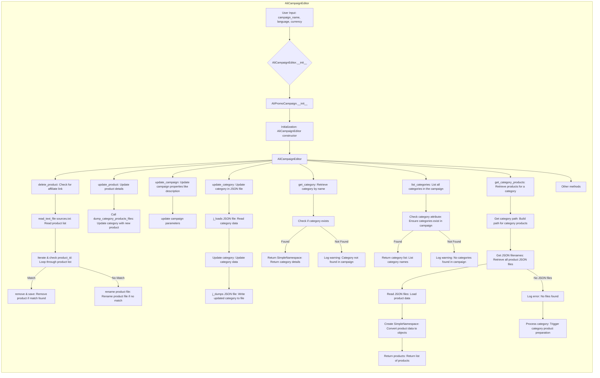

# <input code>

```python
## \file hypotez/src/suppliers/aliexpress/campaign/ali_campaign_editor.py
# -*- coding: utf-8 -*-\n#! venv/Scripts/python.exe\n#! venv/bin/python/python3.12\n\n"""
.. module: src.suppliers.aliexpress.campaign 
	:platform: Windows, Unix
	:synopsis: This module provides the editor for advertising campaigns



# <algorithm>

The algorithm involves a `AliCampaignEditor` class that interacts with other components like `AliPromoCampaign`, `AliCampaignGoogleSheet`, file I/O (`read_text_file`, `save_text_file`, `get_filenames`), and JSON handling (`j_loads`, `j_dumps`). The flow depends on the method called:

* **`__init__`**: Initializes the editor with campaign details, loading data from a JSON file if provided.
* **`delete_product`**: Checks if a product exists in a `sources.txt` file, removing it if it does not have an affiliate link. Otherwise, renames the associated file.
* **`update_product`**: Updates product details in a specified category, calling `dump_category_products_files` to handle the update process.
* **`update_campaign`**: Updates campaign properties (description, tags, etc.).
* **`update_category`**: Updates a category within a JSON file.
* **`get_category`**: Retrieves a category by name, returning a `SimpleNamespace` object.
* **`list_categories`**: Retrieves a list of all categories in the campaign.
* **`get_category_products`**: Retrieves product information for a given category, processing JSON files in the category directory. If no files are found, it triggers `process_category_products` and returns `None`.


# <mermaid>


# <explanation>

**1. Imports:**

- The code imports various modules necessary for its functionality.  The imports start with `src`, indicating they are internal packages. The internal package structure allows organization and reusability.

- **`header`:**  Presumably contains configuration or other general purpose functions.

- **`src.gs`:**  Likely a Google Sheets library.

- **`src.suppliers.aliexpress.campaign.ali_promo_campaign`:** Contains base class for advertising campaigns specific to AliExpress.

- **`src.suppliers.aliexpress.campaign.gsheet`:**  Provides functions for interacting with Google Sheets in the AliExpress campaign context.

- **`src.suppliers.aliexpress.utils`:** Contains utility functions for AliExpress data processing, including `extract_prod_ids` and `ensure_https`.

- **`src.utils.jjson`:** Contains functions for handling JSON data, like `j_loads`, `j_dumps`, and loading into `SimpleNamespace` objects.

- **`src.utils.convertors.csv`:** Contains functions for converting CSV data.

- **`src.utils.printer`:** Likely for printing formatted output (e.g., `pprint`).

- **`src.utils.file`:** Contains functions for file manipulation, such as `read_text_file`, `save_text_file`, and `get_filenames`.

- **`src.logger`:**  Handles logging (critical, errors, warnings, etc).

**2. Classes:**

- **`AliCampaignEditor(AliPromoCampaign)`:** This class inherits from `AliPromoCampaign`, providing a specialized campaign editor for AliExpress.
    - `__init__`: Initializes the editor with campaign name, language, and currency, optionally loading from a JSON file. The `super().__init__` call is crucial for initializing the inherited class.
    - `delete_product`: Deletes a product if no affiliate link exists.
    - `update_product`: Updates product details within a category.
    - `update_campaign`: Updates campaign-level properties.
    - `update_category`: Updates a category in a JSON file.
    - `get_category`: Retrieves a category by name.
    - `list_categories`: Returns a list of categories.
    - `get_category_products`: Retrieves product data for a specific category.


**3. Functions:**

- **`delete_product`**:  Handles the logic for deleting product entries by removing them from `sources.txt` if no matching affiliate link is found.

- **`update_product`**: Updates product details in a specified category.

- **`update_campaign`**: Updates campaign-level properties.

- **`update_category`**: Updates a category in a JSON file; crucial for persistence.


**4. Variables:**

- `MODE`:  A variable likely for selecting development or production modes.


**5. Possible Errors and Improvements:**

- **Error Handling:** The code has `try...except` blocks, which is good for robustness. However, consider more specific exception handling to provide more detailed error messages. For instance, `FileNotFoundError` is caught, but you can have more specific `TypeError` or `ValueError` handling to pinpoint errors during data manipulation.

- **Input Validation:** Input parameters like `campaign_name`, `language`, `currency`, and `product_id` could benefit from stricter validation to prevent unexpected behavior.

- **`process_category_products`:**  The call to `process_category_products` within `get_category_products` is a potential asynchronous operation that needs to be addressed to understand the execution context.  Consider the role of this function and any dependencies.

- **Logging:**   Logging could be improved with more contextual information (e.g., the path to the file being processed).  The message "Start prepare category" in the error log lacks context and should be replaced with something more specific.

- **Dependency Management:**  The overall architecture suggests a modular design that is good for maintainability and scalability. The use of internal `src` packages also helps with organization.


**6. Relationships with Other Parts of the Project:**

- The class `AliCampaignEditor` interacts with several modules in the `src.suppliers.aliexpress` and `src.utils` packages, highlighting a well-defined structure for accessing different components of the system. The dependency structure is clearly visible.

- This code suggests a larger system where campaign management is crucial. `AliPromoCampaign` acts as a base class, potentially facilitating similar operations across various suppliers, creating a unified campaign management framework.


This analysis provides a comprehensive understanding of the code, its functionality, and its relationships within a larger project.  Further analysis might need more context about the `campaign` object and the `process_category_products` function for a more complete understanding.