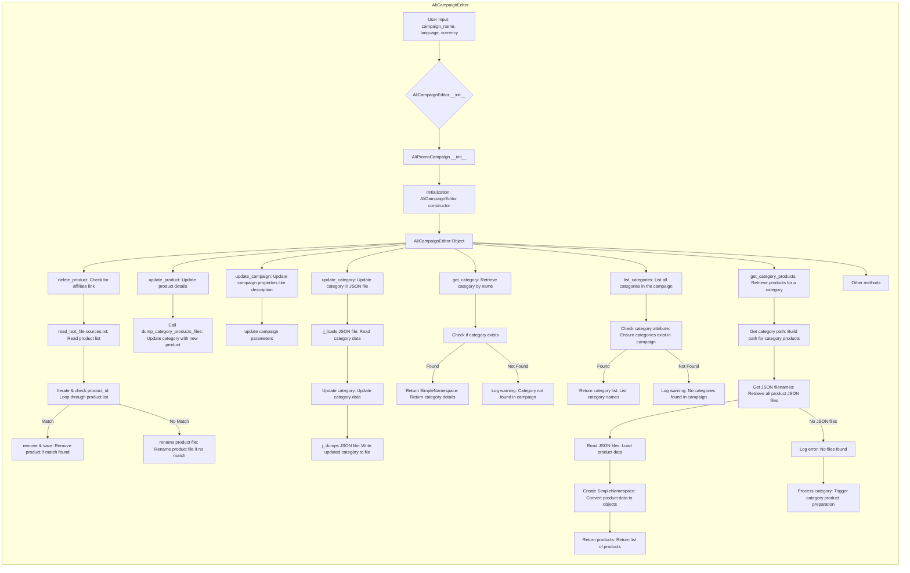
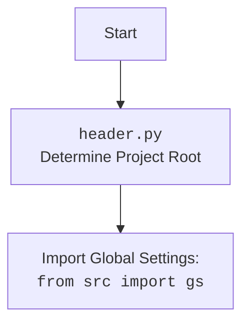

## АНАЛИЗ КОДА: `hypotez/src/suppliers/aliexpress/campaign/ali_campaign_editor.py`

### 1. <алгоритм>

**1. `AliCampaignEditor.__init__` (Инициализация редактора кампаний):**
    - Принимает `campaign_name`, `language` (опционально, строка или словарь), и `currency` (опционально).
    - Вызывает конструктор родительского класса `AliPromoCampaign`.
    - Инициализирует редактор кампаний, устанавливая базовые параметры.
    - Пример:
        ```python
        editor = AliCampaignEditor(campaign_name="Summer Sale", language="EN", currency="USD")
        ```

**2. `delete_product` (Удаление товара):**
    - Принимает `product_id` (строка) и `exc_info` (логическое значение, опционально).
    - Извлекает ID товара.
    - Проверяет наличие файла `sources.txt` в каталоге категории.
    - Если файл `sources.txt` существует, читает его построчно.
        - Если `product_id` найден в строке, удаляет эту строку из списка и сохраняет изменения в файл `_sources.txt`.
    - Если файл `sources.txt` не существует, то пытается переименовать `product_id.html` в `product_id_.html`
    - Логирует успехи и ошибки.
    - Пример:
        ```python
        editor.delete_product("12345")
        ```
    *   `Input`: product_id = "12345", exc_info = False
    *   `Output` :  - Product record removed from `sources.txt`
                    - Product html file renamed  `12345.html` => `12345_.html`
    
**3. `update_product` (Обновление товара):**
    - Принимает `category_name` (строка), `lang` (строка) и `product` (словарь).
    - Вызывает `dump_category_products_files` для обновления файла JSON продукта.
    - Пример:
        ```python
        editor.update_product("Electronics", "EN", {"product_id": "12345", "title": "Smartphone"})
        ```

**4. `update_campaign` (Обновление кампании):**
    - Функция для обновления свойств кампании. В текущей реализации не содержит действий.
    - Пример:
        ```python
        editor.update_campaign()
        ```

**5. `update_category` (Обновление категории):**
    - Принимает `json_path` (Path) и `category` (SimpleNamespace).
    - Загружает JSON файл по пути `json_path`
    - Обновляет категорию в загруженных данных
    - Сохраняет изменения обратно в JSON файл.
    - Возвращает `True` при успешном обновлении или `False` при ошибке.
    - Пример:
        ```python
        category = SimpleNamespace(name="New Category", description="Updated description")
        result = editor.update_category(Path("category.json"), category)
        ```

**6. `get_category` (Получение категории):**
    - Принимает `category_name` (строка).
    - Проверяет наличие категории в `self.campaign.category`.
    - Возвращает объект `SimpleNamespace` категории или `None`, если категория не найдена.
    - Логирует предупреждения и ошибки.
    - Пример:
        ```python
        category = editor.get_category("Electronics")
        ```
    *   `Input`: category_name = "Electronics"
    *   `Output`:
       *  `SimpleNamespace` : если категория найдена
       *  `None`: если категория не найдена
    

**7. `list_categories` (Список категорий):**
    - Возвращает список имен категорий из атрибута `self.campaign.category`, если таковой существует и является `SimpleNamespace`.
    - Возвращает `None`, если категории не найдены или атрибут отсутствует.
    - Логирует предупреждения и ошибки.
    - Пример:
        ```python
        categories = editor.list_categories
        ```
    *   `Input`: None
    *   `Output`: `List[str]` - список имен категорий
                 `None` - если нет категорий

**8. `get_category_products` (Получение товаров категории):**
   - Принимает `category_name` (строка).
   - Формирует путь к директории с JSON-файлами товаров категории.
   - Находит все JSON-файлы в директории.
   - Читает каждый JSON-файл и создает `SimpleNamespace` объект товара.
   - Возвращает список `SimpleNamespace` объектов товаров.
   - Если JSON-файлы не найдены, логирует ошибку и вызывает `process_category_products`.
   - Пример:
        ```python
        products = editor.get_category_products("Electronics")
        ```
   *   `Input`: category_name = "Electronics"
   *   `Output`: `List[SimpleNamespace]` - список товаров категории

### 2. <mermaid>





**Зависимости в Mermaid:**

- `AliCampaignEditor` — класс, который является ядром редактора кампаний.
- `AliPromoCampaign` — родительский класс для `AliCampaignEditor`, отвечающий за базовые операции с кампаниями.
- `__init__` — конструктор `AliCampaignEditor`, который инициализирует объект.
- `delete_product` — метод для удаления продукта из кампании.
- `read_text_file` — функция для чтения списка продуктов из файла.
- `save_text_file` — функция для сохранения списка продуктов в файл.
- `rename` — метод для переименования файла, используется для файлов продуктов.
- `update_product` — метод для обновления информации о продукте в кампании.
- `dump_category_products_files` — метод для сохранения данных о продуктах в JSON файлы.
- `update_campaign` — метод для обновления общей информации о кампании.
- `update_category` — метод для обновления данных категории в JSON файле.
- `j_loads` — функция из `src.utils.jjson` для загрузки данных из JSON файла.
- `j_dumps` — функция из `src.utils.jjson` для сохранения данных в JSON файл.
- `get_category` — метод для получения объекта SimpleNamespace категории.
- `list_categories` — метод для получения списка всех категорий в кампании.
- `get_category_products` — метод для получения списка продуктов в категории.
- `get_filenames` — функция из `src.utils.file` для получения списка файлов.
- `j_loads_ns` — функция для чтения JSON файла и возврата данных в SimpleNamespace.
- `process_category_products` — метод для подготовки данных категории.

### 3. <объяснение>

**Импорты:**

- `re`: Модуль для работы с регулярными выражениями. Используется для разбора идентификаторов продуктов.
- `shutil`: Модуль для высокоуровневых файловых операций.
- `pathlib.Path`: Модуль для работы с путями файлов и директорий. Обеспечивает кроссплатформенность.
- `types.SimpleNamespace`: Класс для создания объектов с произвольными атрибутами. Используется для представления данных о кампаниях, категориях и товарах.
- `typing.List`, `typing.Optional`: Модули для аннотации типов, улучшает читаемость и надежность кода.
- `header`: Модуль, который определяет корень проекта и загружает глобальные настройки.
- `src.gs`: Модуль, содержащий глобальные настройки приложения.
- `src.suppliers.aliexpress.campaign.ali_promo_campaign`: Базовый класс для управления рекламными кампаниями AliExpress.
- `src.suppliers.aliexpress.campaign.gsheet`: Класс для работы с Google Sheets, где хранятся данные кампании.
- `src.suppliers.aliexpress.utils.extract_prod_ids`: Функция для извлечения идентификаторов продуктов.
- `src.suppliers.aliexpress.utils.ensure_https`: Функция для преобразования URL в HTTPS.
- `src.utils.jjson.j_loads_ns`: Функция для загрузки JSON данных в `SimpleNamespace`.
- `src.utils.jjson.j_loads`: Функция для загрузки JSON данных.
- `src.utils.jjson.j_dumps`: Функция для сохранения JSON данных.
- `src.utils.convertors.csv.csv2dict`: Функция для преобразования CSV файлов в словари.
- `src.utils.printer.pprint`: Функция для красивого вывода данных.
- `src.utils.file.read_text_file`: Функция для чтения текста из файла.
- `src.utils.file.save_text_file`: Функция для сохранения текста в файл.
- `src.utils.file.get_filenames`: Функция для получения списка файлов.
- `src.logger.logger.logger`: Модуль для логирования событий в приложении.

**Классы:**

- `AliCampaignEditor(AliPromoCampaign)`:
    - **Роль**: Редактор рекламных кампаний AliExpress.
    - **Атрибуты**:
      - `campaign`: Объект кампании, содержащий информацию о кампании.
    - **Методы**:
        - `__init__`: Инициализирует объект `AliCampaignEditor`, устанавливая базовые параметры.
        - `delete_product`: Удаляет продукт из кампании, если нет партнерской ссылки.
        - `update_product`: Обновляет информацию о продукте в кампании.
        - `update_campaign`: Обновляет свойства кампании.
        - `update_category`: Обновляет данные категории в JSON файле.
        - `get_category`: Возвращает объект `SimpleNamespace` категории.
        - `list_categories`: Возвращает список всех категорий в кампании.
        - `get_category_products`: Возвращает список продуктов в категории.

**Функции:**

- `__init__(self, campaign_name, language=None, currency=None)`:
    - **Аргументы**:
      - `campaign_name` (строка): Имя кампании.
      - `language` (строка, словарь, опционально): Язык кампании. По умолчанию 'EN'.
      - `currency` (строка, опционально): Валюта кампании. По умолчанию 'USD'.
    - **Возвращает**: None
    - **Назначение**: Инициализация редактора кампаний.
    - **Пример**:
        ```python
        editor = AliCampaignEditor(campaign_name="Summer Sale", language="EN", currency="USD")
        ```
- `delete_product(self, product_id, exc_info=False)`:
    - **Аргументы**:
      - `product_id` (строка): Идентификатор продукта.
      - `exc_info` (логическое значение, опционально): Включать ли дополнительную информацию об исключениях в логи. По умолчанию `False`.
    - **Возвращает**: None
    - **Назначение**: Удаление продукта из списка товаров кампании.
    - **Пример**:
        ```python
        editor.delete_product("12345", exc_info=True)
        ```
- `update_product(self, category_name, lang, product)`:
    - **Аргументы**:
      - `category_name` (строка): Имя категории.
      - `lang` (строка): Язык кампании.
      - `product` (словарь): Словарь с данными продукта.
    - **Возвращает**: None
    - **Назначение**: Обновление информации о продукте.
    - **Пример**:
        ```python
        editor.update_product("Electronics", "EN", {"product_id": "12345", "title": "Smartphone"})
        ```
-   `update_campaign(self)`:
    *   **Аргументы**: None
    *   **Возвращает**: None
    *   **Назначение**: Обновление свойств кампании
-   `update_category(self, json_path, category)`:
    - **Аргументы**:
        - `json_path` (Path): Путь к JSON файлу категории
        - `category` (SimpleNamespace): Объект категории
    - **Возвращает**: `bool` - результат обновления категории
    - **Назначение**: Обновление категории в JSON файле
- `get_category(self, category_name)`:
    - **Аргументы**:
        - `category_name` (строка): Имя категории.
    - **Возвращает**: `Optional[SimpleNamespace]`: Объект категории или `None`.
    - **Назначение**: Получение объекта категории.
-  `list_categories(self)`:
    - **Аргументы**: None
    - **Возвращает**: `Optional[List[str]]`: Список имен категорий или `None`
    - **Назначение**: Получение списка имен категорий.
-  `get_category_products(self, category_name)`:
    - **Аргументы**:
        - `category_name` (строка): Имя категории.
    - **Возвращает**: `Optional[List[SimpleNamespace]]`: Список объектов товаров или `None`.
    - **Назначение**: Получение списка товаров категории.

**Переменные:**

- `campaign_name` (строка): Имя кампании.
- `language` (строка, словарь): Язык кампании.
- `currency` (строка): Валюта кампании.
- `product_id` (строка): Идентификатор продукта.
- `exc_info` (логическое значение): Включать ли дополнительную информацию об исключениях в логи.
- `category_name` (строка): Имя категории.
- `product` (словарь): Словарь с данными продукта.
- `json_path` (`pathlib.Path`): Путь к JSON файлу.
- `category` (`SimpleNamespace`): Объект категории.

**Потенциальные ошибки и области для улучшения:**

- **Обработка ошибок**: В некоторых методах (например, `delete_product`, `update_category`) есть блоки try-except, но их можно сделать более специфичными. Например, можно добавить обработку `FileNotFoundError` для `read_text_file` и `IOError` для операций с файлами.
- **Логирование**: Логирование достаточно информативно, но можно добавить уровень логирования для разных событий (например, DEBUG, INFO, WARNING, ERROR, CRITICAL).
- **Производительность**: Операции с большими списками продуктов (например, в `delete_product`) можно оптимизировать.
- **Унификация работы с файлами**: Все операции с файлами, кроме чтения `sources.txt`, используют JSON формат, имеет смысл унифицировать работу с файлами.
- **Обработка путей**: Создание пути для файлов внутри `get_category_products`, нужно перенести в отдельный метод.
- **Валидация входных данных**: Перед обработкой нужно добавить валидацию входных данных.

**Взаимосвязи с другими частями проекта:**

-   **`header.py`**: Определяет корень проекта, загружает глобальные настройки
-   **`src.gs`**: Содержит глобальные настройки, которые используются для инициализации объекта `AliCampaignEditor`
-   **`ali_promo_campaign.py`**: Базовый класс для управления кампаниями AliExpress, от которого наследуется `AliCampaignEditor`
-   **`gsheet.py`**: Управляет данными в Google Sheets, которые используются для кампании
-   **`src.utils.jjson`**: Модуль для работы с JSON файлами, используется для загрузки и сохранения данных о товарах, категориях, и кампаниях
-   **`src.utils.file`**: Модуль для чтения и записи файлов, используется для чтения `sources.txt` и списка товаров
-   **`src.logger.logger`**: Модуль для логирования событий, используется для отслеживания ошибок и результатов работы редактора
-   **`src.suppliers.aliexpress.utils`**: Модуль утилит для работы с Aliexpress. Содержит функции для извлечения идентификаторов и обработки ссылок.

Этот анализ предоставляет всестороннее понимание функциональности и взаимосвязей кода `ali_campaign_editor.py`.