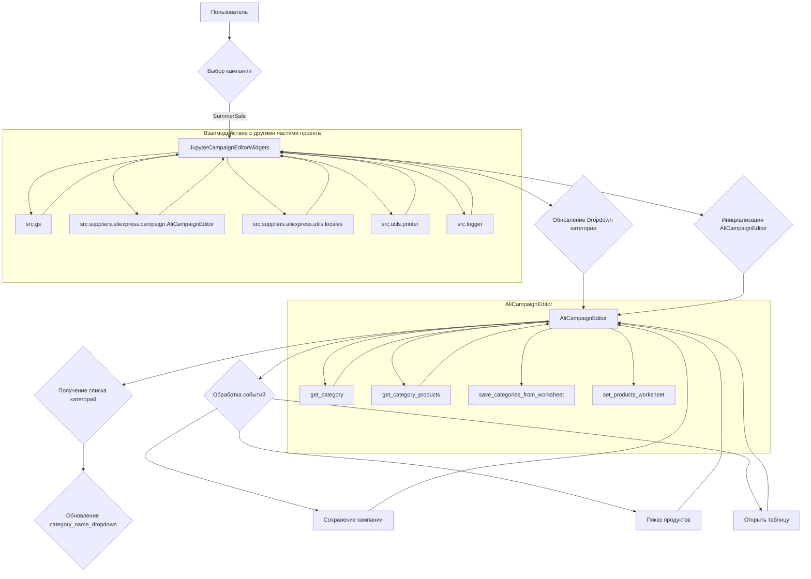

# <input code>

```python
## \file hypotez/src/suppliers/aliexpress/campaign/ali_campaign_editor_jupyter_widgets.py
# -*- coding: utf-8 -*-\
#! venv/Scripts/python.exe
#! venv/bin/python/python3.12

"""
.. module: src.suppliers.aliexpress.campaign 
	:platform: Windows, Unix
	:synopsis: Jupyter widgets for the AliExpress campaign editor.

This module contains widgets for managing AliExpress campaigns in Jupyter notebooks.

Testfile:
    file test_ali_campaign_editor_jupyter_widgets.py

"""
MODE = 'dev'


from types import SimpleNamespace
import header
from pathlib import Path
from ipywidgets import widgets
from IPython.display import display
import webbrowser

from src import gs
from src.suppliers.aliexpress.campaign import AliCampaignEditor
from src.suppliers.aliexpress.utils import locales
from src.utils.printer import pprint, get_directory_names
from src.logger import logger

class JupyterCampaignEditorWidgets:
    """Widgets for the AliExpress campaign editor.

    This class provides widgets for interacting with and managing AliExpress campaigns,
    including selecting campaigns, categories, and languages, and performing actions such as
    initializing editors, saving campaigns, and showing products.

    Example:
        >>> editor_widgets: JupyterCampaignEditorWidgets = JupyterCampaignEditorWidgets()
        >>> editor_widgets.display_widgets()
    """

    # Class attributes declaration
    language: str = None
    currency: str = None
    campaign_name: str = None
    category_name: str = None
    category:SimpleNamespace = None
    campaign_editor: AliCampaignEditor = None
    products:list[SimpleNamespace] = None
    def __init__(self):
        """Initialize the widgets and set up the campaign editor.

        Sets up the widgets for selecting campaigns, categories, and languages. Also sets up
        default values and callbacks for the widgets.
        """
        self.campaigns_directory:str = Path(
            gs.path.google_drive, "aliexpress", "campaigns"
        )
        
        if not self.campaigns_directory.exists():
            raise FileNotFoundError(
                f"Directory does not exist: {self.campaigns_directory}"
            )

        #self.languages = {"EN": "USD", "HE": "ILS", "RU": "ILS"}
        self.campaign_name_dropdown = widgets.Dropdown(
            options = get_directory_names(self.campaigns_directory),
            description = "Campaign Name:",
        )
        self.category_name_dropdown = widgets.Dropdown(
            options=[], description="Category:"
        )
        self.language_dropdown = widgets.Dropdown(
            options=[f"{key} {value}" for locale in locales for key, value in locale.items()],
            description="Language/Currency:",
        )
        # ... (rest of the code)
```

# <algorithm>

**Шаг 1:** Инициализация `JupyterCampaignEditorWidgets`.
* Создаются виджеты (Dropdown, Button) для выбора кампании, категории, языка/валюты и действий (инициализация, сохранение, показ продуктов).
* Получаются имена кампаний из каталога `campaigns`.
* Создается объект `AliCampaignEditor` для работы с кампаниями.
* Настраиваются обработчики событий (`setup_callbacks`) для изменения виджетов.
* Начальное значение виджета выбора кампании устанавливается.

**Шаг 2:** Обработка изменения выбора кампании (`on_campaign_name_change`).
* Новый выбранный `campaign_name` обновляет `category_name_dropdown` с вариантами категорий для этой кампании.
* Переинициализируется `AliCampaignEditor` с новыми данными.

**Шаг 3:** Обработка изменения выбора категории (`on_category_change`).
* Новая `category_name` используется для обновления данных в `AliCampaignEditor`.
* `AliCampaignEditor` переинициализируется.


**Шаг 4:** Обработка изменения выбора языка/валюты (`on_language_change`).
* Обновляются `language` и `currency` в объекте `AliCampaignEditor`.
* Переинициализируется `AliCampaignEditor`.

**Шаг 5:** Сохранение кампании (`save_campaign`).
* Получаются текущие значения `campaign_name`, `category_name`, `language` и `currency`.
* Если `campaign_name` и `language` заданы, создается `AliCampaignEditor` с текущими параметрами.
* Вызывается метод `save_categories_from_worksheet`.


**Шаг 6:** Показ продуктов (`show_products`).
* Получаются текущие значения `campaign_name` и `category_name`.
* Создание `AliCampaignEditor` с текущими данными.
* Вызывается метод `set_products_worksheet` для отображения продуктов.


**Шаг 7:** Открытие электронной таблицы (`open_spreadsheet`).
* Если `campaign_editor` инициализирован, формируется URL для открытой Google Таблицы и открывается в браузере.


**Пример данных:**

Кампании: "SummerSale", "WinterSale"
Категории для "SummerSale": "Electronics", "Clothes"
Язык/Валюта: "EN USD", "RU RUB"
Пользователь выбирает "SummerSale", "Electronics", "EN USD"

**Передача данных:**

Данные между виджетами передаются с помощью `observe()` и `on_click()`. Значения из выбранных опций передаются в `AliCampaignEditor` для дальнейшей обработки. Результат работы `AliCampaignEditor` возвращается в виджеты.


# <mermaid>



# <explanation>

**Импорты:**

* `header`: Возможно, содержит дополнительные настройки или конфигурацию, специфичные для проекта, но не представленные в данном фрагменте кода.
* `pathlib`: Предоставляет классы для работы с путями файлов и каталогов.
* `ipywidgets`: Библиотека для создания интерактивных виджетов в Jupyter Notebook.
* `IPython.display`: Библиотека для отображения результатов в Jupyter Notebook.
* `webbrowser`: Библиотека для открытия ссылок в браузере.
* `src.gs`: Вероятно, класс или модуль, содержащий данные о пути к Google Диску.
* `src.suppliers.aliexpress.campaign.AliCampaignEditor`: Класс для работы с кампаниями AliExpress.
* `src.suppliers.aliexpress.utils.locales`: Вероятно, содержит локализационные данные (языки и валюты).
* `src.utils.printer`: Библиотека для вывода данных.
* `src.logger`: Модуль для регистрации событий и ошибок (logging).


**Классы:**

* `JupyterCampaignEditorWidgets`: Этот класс предоставляет виджеты для взаимодействия с кампаниями AliExpress в Jupyter Notebook.  Атрибуты: `campaign_name`, `category_name`, `language`, `currency` хранят текущие выбранные параметры.
    * `__init__`: Инициализирует виджеты, устанавливает обработчики событий и загружает список кампаний.
    * `initialize_campaign_editor`: Инициализирует `AliCampaignEditor` с текущими выбранными кампанией, категорией и языком/валютой.
    * `update_category_dropdown`: Обновляет список категорий для `category_name_dropdown` в зависимости от выбранной кампании.
    * `on_campaign_name_change`, `on_category_change`, `on_language_change`: Обработчики событий для обновления состояния виджетов и переинициализации `AliCampaignEditor` при изменении выбора.
    * `save_campaign`, `show_products`, `open_spreadsheet`: Обработчики событий, вызывающие соответствующие методы `AliCampaignEditor`.
    * `setup_callbacks`: Настраивает обработчики событий для виджетов.
    * `display_widgets`: Отображает все созданные виджеты в Jupyter Notebook.

**Функции:**

* `get_directory_names`: Возвращает список имен каталогов в заданном пути.
* (`save_campaign`, `show_products`, `open_spreadsheet`): Все эти методы вызывают внутренние методы `AliCampaignEditor` и обрабатывают ошибки.

**Переменные:**

* `MODE`: Переменная, вероятно, определяет режим работы (например, разработка или производство).

**Возможные ошибки и улучшения:**

* Не обрабатываются ошибки при доступе к файлам/каталогам. Необходимо добавить обработку исключений `FileNotFoundError` или `PermissionError` в методах, где происходит чтение данных из каталога.
* Отсутствие проверки валидности данных, поступающих от пользователя. Необходимо проверять, что выбранные кампании, категории, язык и валюта действительно существуют.
* Возможны проблемы с `AliCampaignEditor`, если какие-либо внутренние методы не работают должным образом. Необходимо добавлять отслеживание ошибок (`try...except`) в ключевых местах кода.
* Недостаточная документированность. Для каждого метода стоит добавить подробное описание с возможными аргументами, типами возвращаемых значений.

**Взаимосвязи с другими частями проекта:**

`JupyterCampaignEditorWidgets` напрямую взаимодействует с `AliCampaignEditor`, `locales`, `gs` и `printer`. Это указывает на то, что `AliCampaignEditor` отвечает за непосредственную работу с данными AliExpress, `locales` содержит информацию о доступных языках и валютах, `gs` предоставляет доступ к хранилищу данных (Google Drive), а `printer` отвечает за вывод данных. `logger` позволяет отслеживать процессы и ошибки.  `src` - это, вероятно, главная папка приложения, в которой находятся все модули и файлы.