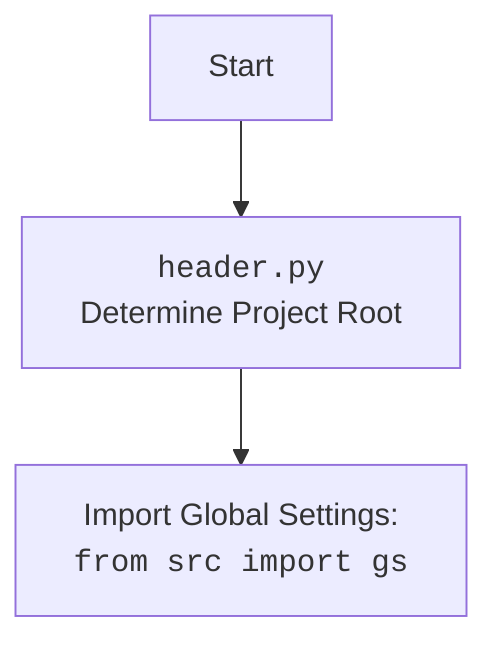

## АНАЛИЗ КОДА: `ali_campaign_editor_jupyter_widgets.py`

### 1. <алгоритм>

**Блок-схема:**

```mermaid
graph TD
    A[Начало] --> B{Создание экземпляра JupyterCampaignEditorWidgets};
    B --> C{Инициализация виджетов};
    C --> D{Определение пути к директории кампаний};
    D --> E{Проверка существования директории кампаний};
    E -- Нет --> F[Выброс исключения FileNotFoundError];
    E -- Да --> G{Создание выпадающих списков для кампаний, категорий и языков};
    G --> H{Создание кнопок для инициализации, сохранения, отображения и открытия};
    H --> I{Настройка обратных вызовов};
    I --> J{Первоначальная инициализация редактора};
     J --> K{Отображение виджетов};

    K --> L[Ожидание действий пользователя];
    L --> M{Изменение выбора кампании};
    M -- Да --> N{Обновление выпадающего списка категорий};
    N --> O{Повторная инициализация редактора};
    M -- Нет --> P{Изменение выбора категории};
    P -- Да --> Q{Повторная инициализация редактора};
    P -- Нет --> R{Изменение выбора языка};
    R -- Да --> S{Повторная инициализация редактора};
     R -- Нет --> T{Нажатие кнопки "Initialize Campaign Editor"};
     T -- Да --> O;
     T -- Нет --> U{Нажатие кнопки "Save Campaign"};
    U -- Да --> V{Сохранение кампании и ее категорий};
      U -- Нет --> W{Нажатие кнопки "Show Products"};
     W -- Да --> X{Отображение продуктов в выбранной категории};
      W -- Нет --> Y{Нажатие кнопки "Open Google Spreadsheet"};
    Y -- Да --> Z{Открытие Google Spreadsheet в браузере};
     Y -- Нет --> L;

     O --> L;
     S --> L;
     V --> L;
     X --> L;
     Z --> L;
```

**Примеры для каждого логического блока:**

*   **B:** Создается экземпляр класса `JupyterCampaignEditorWidgets`, запуская процесс инициализации.
*   **C:** Создаются виджеты `Dropdown` для выбора кампании, категории и языка, а также `Button` для выполнения действий.
*   **D:** Путь к директории кампаний формируется на основе глобальных настроек `gs.path.google_drive`. Пример пути: `/content/drive/MyDrive/aliexpress/campaigns`.
*   **E:** Проверяется, существует ли директория с кампаниями. Если нет, вызывается исключение.
*   **G:** Выпадающие списки `campaign_name_dropdown`, `category_name_dropdown`, `language_dropdown` инициализируются, считывая доступные кампании, категории и языковые настройки.
*   **H:** Создаются кнопки `initialize_button`, `save_button`, `show_products_button`, `open_spreadsheet_button`.
*   **I:** Настраиваются обратные вызовы для обработки событий изменения значений в выпадающих списках и нажатия кнопок.
*   **J:** Выполняется первоначальная инициализация редактора, основываясь на значениях по умолчанию, выбранных в виджетах.
*   **L:** Программа переходит в режим ожидания действий пользователя (выбор кампании, категории, языка или нажатие на кнопку).
*   **M:** Если пользователь изменил выбор кампании, выполняется `on_campaign_name_change`
*   **N:** Обновляется список категорий в выпадающем списке `category_name_dropdown`.
*   **O:** Редактор кампании повторно инициализируется на основе выбранных кампании, категории и языка/валюты.
*    **P:** Если пользователь изменил выбор категории, выполняется `on_category_change`
*   **Q:** Редактор кампании повторно инициализируется на основе выбранных кампании, категории и языка/валюты.
*   **R:** Если пользователь изменил выбор языка, выполняется `on_language_change`
*   **S:** Редактор кампании повторно инициализируется на основе выбранных кампании, категории и языка/валюты.
*   **T:** Если пользователь нажал кнопку "Initialize Campaign Editor", выполняется `initialize_campaign_editor`.
*    **U:** Если пользователь нажал кнопку "Save Campaign", выполняется `save_campaign`.
*   **V:** Сохраняются данные кампании, используя методы редактора кампаний.
*    **W:** Если пользователь нажал кнопку "Show Products", выполняется `show_products`.
*   **X:** Продукты выбранной категории отображаются в виде таблицы, используя методы редактора кампаний.
*    **Y:** Если пользователь нажал кнопку "Open Google Spreadsheet", выполняется `open_spreadsheet`.
*   **Z:** Открывается веб-браузер с URL Google Spreadsheet для выбранной кампании.

### 2. <mermaid>

```mermaid
flowchart TD
    Start[Начало] --> CreateWidgets[<code>JupyterCampaignEditorWidgets</code><br>Initialize Widgets and Editor];
    CreateWidgets --> SetCampaignDirectory[Set Campaign Directory: <br><code>gs.path.google_drive, "aliexpress", "campaigns"</code>];
    SetCampaignDirectory --> CheckDirectoryExists{Check Directory Exists?};
    CheckDirectoryExists -- No --> ErrorFileNotFound[Raise <code>FileNotFoundError</code>];
    CheckDirectoryExists -- Yes --> CreateDropdowns[Create Dropdown Widgets<br>(Campaign, Category, Language)];
    CreateDropdowns --> CreateButtons[Create Action Buttons<br>(Initialize, Save, Show, Open)];
    CreateButtons --> SetupCallbacks[Setup Widget Callbacks];
    SetupCallbacks --> InitializeEditor[Initialize Campaign Editor <br> with Default Values];
    InitializeEditor --> DisplayWidgets[Display Widgets];

    DisplayWidgets --> UserAction[User Interaction<br>(Dropdown Change, Button Click)];
    
    UserAction -- Campaign Change --> UpdateCategoryDropdown[Update Category Dropdown Options];
    UpdateCategoryDropdown --> ReInitializeEditor[Re-Initialize Campaign Editor];
    
    UserAction -- Category Change --> ReInitializeEditor;
   
    UserAction -- Language Change --> ReInitializeEditor;
    
    UserAction -- Initialize Click --> ReInitializeEditor;
    
    UserAction -- Save Click --> SaveCampaign[Save Campaign Data to Google Sheet];

    UserAction -- Show Click --> ShowProducts[Show Products from Google Sheet];
    
     UserAction -- Open Click --> OpenSpreadsheet[Open Google Spreadsheet in Browser];

    ReInitializeEditor --> UserAction;
    SaveCampaign --> UserAction;
    ShowProducts --> UserAction;
    OpenSpreadsheet --> UserAction;


    classDef callback fill:#f9f,stroke:#333,stroke-width:2px
    class SetupCallbacks, ReInitializeEditor, SaveCampaign, ShowProducts, OpenSpreadsheet callback;
```

**Объяснение:**

*   **`Start`**: Начало выполнения программы, при создании экземпляра класса `JupyterCampaignEditorWidgets`.
*   **`CreateWidgets`**:  Инициализация виджетов и редактора. Создание объекта `JupyterCampaignEditorWidgets` влечет за собой создание и настройку виджетов для управления кампаниями AliExpress.
*   **`SetCampaignDirectory`**: Определение пути к директории кампаний на Google Drive, используя глобальные настройки `gs.path.google_drive`.
*    **`CheckDirectoryExists`**: Проверка существования директории кампаний. Если директория не существует, выбрасывается ошибка `FileNotFoundError`.
*   **`CreateDropdowns`**: Создание выпадающих списков для выбора кампании, категории и языка/валюты.
*   **`CreateButtons`**: Создание кнопок для инициализации редактора, сохранения кампании, отображения продуктов и открытия Google Spreadsheet.
*   **`SetupCallbacks`**: Настройка обратных вызовов для обработки событий изменения значений в выпадающих списках и нажатия кнопок.
*   **`InitializeEditor`**: Первоначальная инициализация редактора кампании на основе значений виджетов по умолчанию.
*   **`DisplayWidgets`**: Отображение всех созданных виджетов в интерфейсе Jupyter Notebook.
*    **`UserAction`**: Ожидание действий пользователя.
*    **`UpdateCategoryDropdown`**: Обновление выпадающего списка категорий на основе выбранной кампании.
*   **`ReInitializeEditor`**: Повторная инициализация редактора кампании, если пользователь меняет кампанию, категорию, или язык/валюту.
*    **`SaveCampaign`**: Сохранение данных кампании в Google Sheet.
*   **`ShowProducts`**: Отображение продуктов выбранной категории из Google Sheet.
*   **`OpenSpreadsheet`**: Открытие Google Spreadsheet в веб-браузере.
*    **`classDef callback ...`**: Определение стиля для классов, представляющих собой функции обратного вызова.

**Дополнительно**:


### 3. <объяснение>

#### Импорты:

*   **`from types import SimpleNamespace`**: Используется для создания простых объектов с атрибутами (например, для представления категорий и продуктов).
*   **`import header`**: Модуль `header` (предположительно `header.py` в корне проекта) используется для определения корневой директории проекта и загрузки глобальных настроек.
*   **`from pathlib import Path`**: Используется для работы с путями к файлам и директориям в файловой системе.
*   **`from ipywidgets import widgets`**: Импортирует виджеты Jupyter для интерактивного взаимодействия.
*   **`from IPython.display import display`**: Импортирует функцию `display` для отображения виджетов в Jupyter Notebook.
*   **`import webbrowser`**: Используется для открытия URL в браузере.
*   **`from src import gs`**:  Импортирует глобальные настройки проекта, предположительно определенные в `src/gs.py`.
*   **`from src.suppliers.aliexpress.campaign import AliCampaignEditor`**: Импортирует класс `AliCampaignEditor`, который занимается логикой работы с кампаниями AliExpress.
*    **`from src.suppliers.aliexpress.utils import locales`**: Импортирует  локальные настройки (язык/валюта).
*   **`from src.utils.printer import pprint, get_directory_names`**: Импортирует функции для вывода информации и получения списка директорий.
*   **`from src.logger.logger import logger`**: Импортирует объект `logger` для логирования событий и ошибок.

#### Класс `JupyterCampaignEditorWidgets`:

*   **Роль**: Предоставляет виджеты для взаимодействия с редактором кампаний AliExpress в Jupyter Notebook.
*   **Атрибуты класса**:
    *   `language: str`: Выбранный язык кампании.
    *   `currency: str`: Выбранная валюта кампании.
    *   `campaign_name: str`: Название выбранной кампании.
    *   `category_name: str`: Название выбранной категории.
    *   `category: SimpleNamespace`: Объект, представляющий выбранную категорию.
    *   `campaign_editor: AliCampaignEditor`: Экземпляр редактора кампаний AliExpress.
    *   `products: list[SimpleNamespace]`: Список продуктов выбранной категории.

*   **Методы**:
    *   **`__init__(self)`**: Конструктор класса. Инициализирует виджеты, устанавливает пути к директориям кампаний, настраивает обратные вызовы и производит первоначальную инициализацию редактора.
    *   **`initialize_campaign_editor(self, _)`**: Инициализирует `AliCampaignEditor` на основе выбранных кампании, категории, языка и валюты. Получает категорию и список продуктов.
    *  **`update_category_dropdown(self, campaign_name: str)`**: Обновляет выпадающий список категорий на основе выбранной кампании.
    *   **`on_campaign_name_change(self, change: dict[str, str])`**: Обрабатывает изменение выбора кампании в выпадающем списке. Обновляет список категорий и переинициализирует редактор.
    *   **`on_category_change(self, change: dict[str, str])`**: Обрабатывает изменение выбора категории в выпадающем списке и переинициализирует редактор.
    *   **`on_language_change(self, change: dict[str, str])`**: Обрабатывает изменение выбора языка/валюты в выпадающем списке и переинициализирует редактор.
    *   **`save_campaign(self, _)`**: Сохраняет кампанию и ее категории, используя методы `AliCampaignEditor`.
    *   **`show_products(self, _)`**: Отображает продукты в выбранной категории, используя методы `AliCampaignEditor`.
    *   **`open_spreadsheet(self, _)`**: Открывает Google Spreadsheet для выбранной кампании в браузере.
    *   **`setup_callbacks(self)`**: Настраивает обратные вызовы для виджетов.
    *   **`display_widgets(self)`**: Отображает все виджеты в Jupyter Notebook.

#### Функции:
*   **`get_directory_names(path: Path) -> list[str]`**:
    *   **Аргументы**: `path` (Path) - путь к директории, в которой нужно искать поддиректории.
    *   **Возвращаемое значение**: `list[str]` - список имен поддиректорий.
    *   **Назначение**: Возвращает список имен всех поддиректорий в указанной директории.

#### Переменные:

*   Большинство переменных являются атрибутами класса `JupyterCampaignEditorWidgets` и служат для хранения состояния виджетов и связанных с ними данных.
*   Переменные типа `widgets.Dropdown` представляют собой выпадающие списки.
*   Переменные типа `widgets.Button` представляют собой кнопки для действий.

#### Потенциальные ошибки и области для улучшения:

*   **Отсутствие обработки ошибок при инициализации**: Если выбранные кампания или категория не существуют, это может вызвать ошибки при работе `AliCampaignEditor`.
*   **Жестко заданные пути**: Пути к директориям кампаний заданы жестко (`"aliexpress", "campaigns"`). Лучше сделать их более гибкими, возможно, через настройки.
*   **Дублирование кода**: В `save_campaign` и `show_products` есть дублирование кода по инициализации `AliCampaignEditor`. Можно вынести эту часть в отдельный метод.
*   **Использование `_` в качестве аргумента**: Частое использование `_` как имени переменной, которая не используется, может быть заменено на `None` или просто убрать аргумент (когда это возможно).
*   **Отсутствие валидации**: Нет проверки корректности введенных данных (например, проверки, что название кампании или категории - строка).
*    **Логирование**: Логирование ошибок происходит в нескольких местах, но можно улучшить логирование всех ключевых событий.

#### Цепочка взаимосвязей:

1.  `header.py` определяет корневую директорию проекта и загружает глобальные настройки (`gs`), включая пути к директориям Google Drive.
2.  `ali_campaign_editor_jupyter_widgets.py` использует эти глобальные настройки для доступа к директории кампаний.
3.  `ali_campaign_editor_jupyter_widgets.py`  создает экземпляры `AliCampaignEditor` для работы с данными кампаний.
4.  `AliCampaignEditor` (из `src.suppliers.aliexpress.campaign`) взаимодействует с Google Sheets для хранения и извлечения данных.
5.   Локали (`src.suppliers.aliexpress.utils.locales`) используются для настройки языка/валюты.
6.  `logger` используется для записи событий и ошибок.

Этот анализ дает детальное представление о структуре, функциональности и взаимосвязях в коде `ali_campaign_editor_jupyter_widgets.py`.