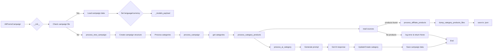

# Анализ кода файла `hypotez/src/suppliers/aliexpress/campaign/ali_promo_campaign.py`

## <input code>

```python
# ... (код файла)
```

## <algorithm>

К сожалению, предоставленная блок-схема в тексте требует дополнений.  Полная блок-схема для всего файла `ali_promo_campaign.py` слишком обширна и не практична для представления здесь.  Однако, можно проследить основные алгоритмы:

* **`__init__`:**
    1. Инициализирует атрибуты класса, включая путь к файлу кампании.
    2. Проверяет существование файла кампании.
    3. Если файла нет, вызывает `process_new_campaign` для создания новой кампании.
    4. Иначе, загружает данные из файла в `self.campaign`.
    5. Устанавливает языковые и валютные параметры кампании.
    6. Вызывает `_models_payload` для инициализации моделей ИИ.

* **`process_new_campaign`:**
    1. Создает базовую структуру директорий и файлов для новой кампании.
    2. Обрабатывает категории из директорий.
    3. Вызывает функции для обработки товаров и генерации данных ИИ.

* **`process_campaign`:**
    1. Получает список имен категорий.
    2. Для каждой категории вызывает `process_category_products` и `process_ai_category`.


* **`process_category_products`:**
    1. Считывает идентификаторы продуктов из файлов HTML и `sources.txt`.
    2. Если идентификаторы не найдены, возвращает None.
    3. Инициализирует `AliAffiliatedProducts` и вызывает `process_affiliate_products`.
    4. Если результат обработки продуктов пуст, возвращает None.
    5. Возвращает список продуктов.

* **`process_ai_category`:**
    1. Загружает инструкции для модели ИИ.
    2. Инициализирует модель ИИ.
    3. Если указана категория, обрабатывает только её, иначе все категории.
    4. Для каждой категории:
        - Формирует запрос для модели ИИ.
        - Получает ответ от модели ИИ.
        - Обновляет или создаёт категорию в `self.campaign`.
        - Сохраняет обновлённую информацию о кампании.


## <mermaid>




## <explanation>

**Импорты:**

Код импортирует различные модули из разных частей проекта (`src.`). Это указывает на модульную структуру проекта. Например:

* `header`, `asyncio`, `time`, `copy`, `html`, `pathlib`, `typing`: стандартные библиотеки Python.
* `src.gs`: Вероятно, содержит функции или классы для работы с Google Cloud Storage.
* `src.suppliers.aliexpress.campaign`: модули для AliExpress.
* `src.suppliers.aliexpress.affiliated_products_generator`: Модуль для генерации ссылок на продукты.
* `src.suppliers.aliexpress.utils.locales`: содержит локальные параметры (языки, валюты).
* `src.ai`: Модули для работы с ИИ (GoogleGenerativeAI, OpenAIModel).
* `src.logger`: Модуль для логирования.
* `src.utils.file`, `src.utils.jjson`, `src.utils.convertors.csv`, `src.utils.printer`, `src.suppliers.aliexpress.utils.extract_product_id`:  модули, которые, вероятно, содержат полезные инструменты для работы с файлами, JSON, CSV и выводом данных.

**Классы:**

* `AliPromoCampaign`:  Основной класс для управления рекламными кампаниями на AliExpress.
    * `language`, `currency`, `base_path`, `campaign_name`, `campaign`, `campaign_ai`, `gemini`, `openai`: Атрибуты, хранящие информацию о кампании, пути, языки, и ссылки на модели ИИ.
    * `__init__`: Инициализирует экземпляр класса, загружает данные кампании, или создает новую, если файла нет.
    * `_models_payload`: Инициализирует модели ИИ (GoogleGenerativeAI, OpenAIModel).
    * `process_campaign`, `process_category_products`, `process_ai_category`, `process_new_campaign`: методы для обработки кампании, категорий и товаров.  Они содержат сложные алгоритмы и взаимосвязи.
    * `dump_category_products_files`: Сохранение данных о товарах в JSON файлы.
    * `set_categories_from_directories`: Функция для обработки категорий из файлов.
    * `generate_output`: Сохраняет данные продуктов в разных форматах, генерирует HTML.
    * `generate_html`: Создает HTML файлы для категории и корневого индекса.
    * `generate_html_for_campaign`: Генерирует HTML страницы для всей рекламной кампании.


**Функции:**

Каждая функция, реализующая определенную задачу (чтение, обработка, сохранение).  Обратите внимание, что `process_ai_category` является сложной функцией, включающей запрос к модели ИИ и обновление данных кампании.

**Переменные:**

Переменные хранят данные о кампаниях, продуктах, категориях, путях и т.д.  Их типы, например, `str`, `Path`, `SimpleNamespace`, `List[SimpleNamespace]`, указывает на то, какую информацию они содержат.

**Возможные ошибки и улучшения:**

* **Обработка ошибок:** Код содержит `exc_info=False` в некоторых методах, что может скрывать ошибки.  Важно добавлять более подробную обработку ошибок (например, `try...except` блоки), чтобы понять причину ошибок и предотвратить их в будущем.
* **Поддержка асинхронности:** Использование `asyncio` может быть полезным, но следует убедиться, что все асинхронные методы используются эффективно и не создают проблем с блокировкой.
* **Документация:** Документация хорошо написана, но можно было бы добавить больше примеров использования в каждом методе и классе.
* **Модульная структура:** Очень много импортов и зависимостей.  Структура кажется раздутой, и следует рассмотреть возможность более четкого разделения функций и модулей.


**Взаимосвязи с другими частями проекта:**

Явное использование `src` указывает на то, что код связан с другими модулями, которые находятся в папке `src`.  Это предполагает наличие общих ресурсов, данных, или функций, доступных в других модулях проекта.  Например, `gs.path` предполагает существование переменной или объекта `gs` (возможно, из модуля `src.google_service`) содержащей пути, вероятно, к Google Drive.  `gs.credentials` указывает на хранение учетных данных.  Это важно для понимания контекста и масштаба проекта.