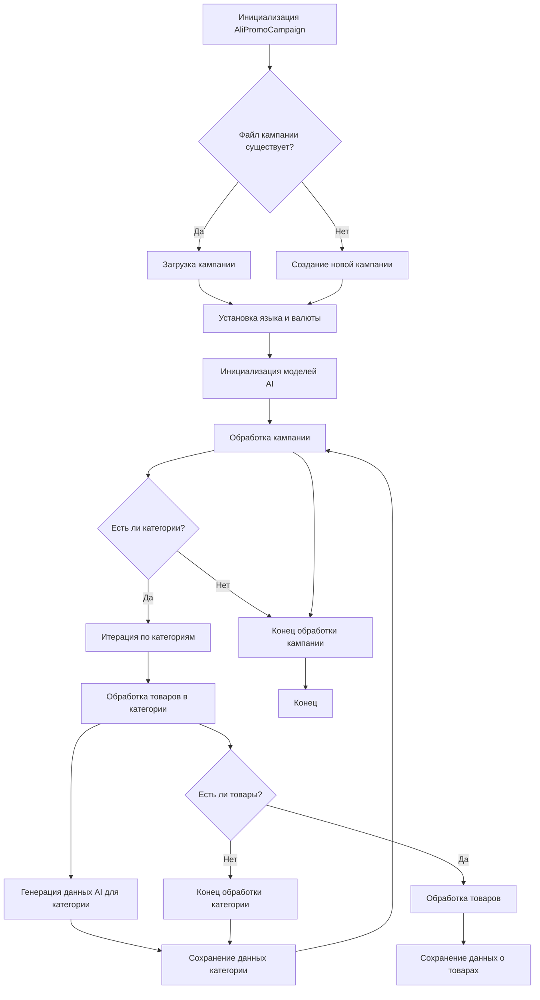
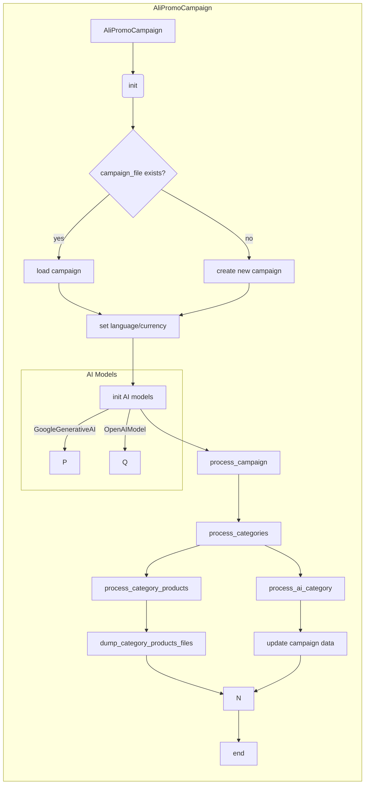

```MD
# Анализ кода AliPromoCampaign.py

## <input code>

```python
# -*- coding: utf-8 -*-\n#! venv/Scripts/python.exe\n#! venv/bin/python/python3.12\n
# ... (много строк кода, как в исходном файле)
```

## <algorithm>

Алгоритм работы модуля `AliPromoCampaign` можно представить следующей блок-схемой:



**Описание блоков:**

* **A:** Создание объекта `AliPromoCampaign`.
* **B:** Проверка наличия файла кампании.
* **C:** Загрузка данных кампании из JSON файла.
* **D:** Создание новой кампании, включая инициализацию пустых структур данных.
* **E:** Установка языка и валюты кампании, если не переданы аргументы.
* **F:** Инициализация моделей AI (`GoogleGenerativeAI`, `OpenAIModel`).
* **G:** Цикл по обработке кампании.
* **H:** Проверка на существование категорий.
* **I:** Цикл по категориям.
* **J:** Обработка товаров в каждой категории.
* **K:** Запрос данных AI для категории.
* **L:** Сохранение результатов обработки категории.
* **M:** Завершение обработки кампании.
* **N:** Проверка наличия товаров в категории.
* **O:** Обработка каждого товара в категории (например, получение ссылок).
* **P:** Завершение обработки категории.
* **Q:** Сохранение данных о товарах в файлы.
* **Z:** Конец выполнения программы.

**Пример перемещения данных:**

1. Функция `__init__` получает данные о кампании и сохраняет их в атрибуты класса.
2. `process_campaign` итерируется по категориям и вызывает `process_category_products`, передавая название категории.
3. `process_category_products` использует `read_sources` для получения списков product_ids.
4. `AliAffiliatedProducts` генерирует список `affiliated_products` и возвращает его в `process_category_products`.
5. Результат `process_category_products` сохраняется в `campaign.category`.


## <mermaid>



**Описание зависимостей:**

* **`gs`:** Управляет доступом к Google Drive.
* **`header`:** Вероятно, содержит общие настройки.
* **`src.suppliers.aliexpress`:** Содержит логику работы с AliExpress.
* **`src.suppliers.aliexpress.affiliated_products_generator`:** Генератор партнерских ссылок.
* **`src.suppliers.aliexpress.utils`:** Вспомогательные функции для работы с AliExpress.
* **`src.ai`:**  Модели искусственного интеллекта.
* **`src.logger`:** Модуль для ведения логов.
* **`src.utils`:** Вспомогательный модуль, включающий `jjson`, `convertors`, `file`, `pprint`.

## <explanation>

### Импорты

Модуль импортирует необходимые библиотеки и классы из других частей проекта (`src`).  Это позволяет использовать функциональность из разных модулей проекта, таких как обработка файлов, работа с Google Drive, использование AI моделей, работа с логами, а также вспомогательные инструменты, например генераторы HTML.

### Классы

* **`AliPromoCampaign`:** Центральный класс для управления рекламной кампанией AliExpress.
    * Атрибуты: `language`, `currency`, `base_path`, `campaign`, `campaign_ai`, `gemini`, `openai`.  Хранят информацию о текущей кампании, данные, полученные с помощью AI, и сами модели AI.
    * Методы: `__init__`, `process_campaign`, `process_category_products`, `process_ai_category`, `process_new_campaign`, `generate_output`, `generate_html_for_campaign`, `set_categories_from_directories`.  Представляют основные действия с кампаниями, обработкой категорий и товаров, AI-генерацией, сохранением данных и генерацией HTML.

### Функции

* **`__init__`:** Инициализирует объект `AliPromoCampaign`, загружает существующую кампанию или начинает создание новой.
* **`process_campaign`:** Итерируется по категориям, обрабатывает товары и вызывает генерацию данных с помощью AI.
* **`process_category_products`:** Обрабатывает товары в заданной категории, получает данные о товарах.
* **`process_ai_category`:**  Обрабатывает данные о категории с помощью моделей AI, получая и сохраняя результаты.
* **`process_new_campaign`:** Создает новую рекламную кампанию, включая создание директорий и файлов.
* **`generate_output`:** Форматирует, сохраняет данные о товарах в различные форматы (JSON, HTML).
* **`generate_html_for_campaign`:** Генерация HTML-страниц для всей кампании, включая страницу с каталогом категорий.
* **`set_categories_from_directories`:** Устанавливает категории кампании из названий директорий.

### Переменные

* `MODE`: Строка, вероятно, определяющая режим работы (например, 'dev' или 'prod').
* `language`, `currency`: Хранят язык и валюту кампании.
* `base_path`:  Путь к директории, где хранятся данные кампании.

### Возможные ошибки и улучшения

* **Обработка ошибок:** Код содержит `exc_info=False` в некоторых местах, что может скрывать ошибки при чтении файлов или работе с JSON. Важно выделить и обработать эти ошибки более детально, чтобы избежать неожиданного завершения программы.
* **Генерация HTML:**  Есть функции для генерации отдельных страниц категорий и основной страницы для кампании, но не хватает обработки структуры HTML.  Можно добавить проверку на валидность данных, предотвращающую ошибки в сгенерированных страницах.
* **Управление ресурсами:** Неясно, как обрабатываются ресурсы, связанные с AI (API-ключи). Важно хранить конфиденциальные данные в безопасном месте и управлять этими ресурсами (например, с помощью файла конфигурации).
* **Рефакторинг:** Некоторые функции слишком длинные и содержат повторяющиеся блоки кода. Можно выделить отдельные функции для конкретных задач.
* **Документация:**  Несмотря на имеющуюся документацию, ее можно улучшить, добавив примеры использования, более четкие пояснения к действиям и описание поведения при различных вводах.

**Цепочка взаимосвязей:**

Данный код, скорее всего, часть более крупного проекта, который ориентирован на работу с рекламными кампаниями.  `AliPromoCampaign` взаимодействует с другими модулями, такими как `gs` для доступа к Google Drive, `src.ai` для генерации данных с помощью AI, `src.suppliers.aliexpress` для обработки данных AliExpress.  Данные о товарах и категориях обрабатываются и передаются через разные функции, а результаты записываются в файлы.  Таким образом, код является важной частью пайплайна обработки и представления данных о рекламных кампаниях.