## <алгоритм>

**Общая схема работы `AliPromoCampaign`:**

1.  **Инициализация (`__init__`)**:
    *   Принимает имя кампании, язык и валюту.
    *   Формирует путь к файлу кампании (`{base_path}/{language}_{currency}.json`).
    *   Пытается загрузить JSON-файл кампании.
        *   **Пример:** `self.base_path = gs.path.google_drive / "aliexpress" / "campaigns" / "summer_sale"` и `campaign_file_path` может быть `/.../summer_sale/EN_USD.json`.
    *   Если файл не найден, запускает `process_new_campaign` для создания новой кампании.
    *   Инициализирует модели ИИ (`_models_payload`).

2.  **Создание новой кампании (`process_new_campaign`)**:
    *   Определяет локали для кампании (если не переданы, использует все из `locales`).
    *   Создаёт структуру данных для кампании (`SimpleNamespace`).
    *   Вызывает `set_categories_from_directories` для определения категорий.
    *   Для каждой категории вызывает `process_category_products` и `process_ai_category`.
        *   **Пример:** Создаётся кампания для EN/USD, затем для RU/ILS если не переданы `language` и `currency`.
    *   Сохраняет данные кампании в JSON-файл.

3.  **Обработка всей кампании (`process_campaign`)**:
    *   Получает список директорий категорий.
        *   **Пример:** `categories_names_list` может быть `['electronics', 'clothing']` если директории `/.../summer_sale/category/electronics` и `/.../summer_sale/category/clothing` существуют.
    *   Для каждой категории вызывает `process_category_products` и `process_ai_category`.

4.  **Обработка продуктов категории (`process_category_products`)**:
    *   Вызывает `read_sources` для получения ID товаров.
    *   Инициализирует `AliAffiliatedProducts` для получения данных по товарам.
    *   Вызывает `process_affiliate_products` для получения данных по партнерским товарам.
        *   **Пример:** `read_sources` возвращает `['12345', '67890']`.
    *   Возвращает список товаров или `None` если не найдены.

5.  **Получение ID товаров (`read_sources`)**:
    *   Получает список HTML файлов из директории категории.
    *   Извлекает ID товаров из HTML файлов.
    *   Читает `sources.txt` (если есть) и извлекает ID от туда.
    *   Возвращает список ID товаров.

6.  **Обработка ИИ для категории (`process_ai_category`)**:
    *   Копирует данные кампании в `campaign_ai`.
    *   Для каждой категории (или для указанной) вызывает `_process_category`.
        *   **Пример:** Если `category_name` равно "electronics", обрабатывается только эта категория, иначе все.
    *   Сохраняет сгенерированные AI данные в файл.

7.  **Внутренняя обработка категории (`_process_category`)**:
    *   Читает названия товаров из файла `product_titles.txt`.
    *   Генерирует запрос для ИИ.
    *   Получает ответ от ИИ (используется `GoogleGenerativeAI`).
    *   Обновляет или добавляет данные категории в `campaign_ai`.
        *   **Пример:** Ответ от ИИ - `{"electronics":{"title": "Cool electronics", "description": "Very cool electronics"}}`
        *   обновляет или создаёт атрибут  `campaign_ai.category.electronics`
        *   если  `campaign_ai.category.electronics` уже существовал то  обновляются  его атрибуты

8.  **Сохранение данных о товарах (`dump_category_products_files`)**:
    *   Сохраняет информацию о каждом товаре в отдельный JSON-файл.
        *   **Пример:** Для товара с `product_id` `12345` будет создан файл `12345.json`.

9.  **Установка категорий из директорий (`set_categories_from_directories`)**:
    *   Получает список директорий в `category` директории.
    *   Создаёт `SimpleNamespace` для каждой категории.
        *   **Пример:** Если есть директории "electronics" и "clothing", создаст `self.campaign.category.electronics` и `self.campaign.category.clothing`.

10. **Генерация вывода (`generate_output`)**:
    *   Форматирует временную метку.
    *   Обрабатывает список продуктов.
    *   Сохраняет каждый продукт в отдельный JSON файл.
    *   Сохраняет список названий и ссылок в отдельные текстовые файлы.
    *   Вызывает `generate_html` для генерации HTML-файлов.

11. **Генерация HTML (`generate_html`)**:
    *   Формирует HTML для каждой категории на основе списка продуктов.
    *   Сохраняет HTML-файл категории.
    *   Создает и сохраняет общий индексный HTML файл.

12. **Генерация HTML для кампании (`generate_html_for_campaign`)**:
    *   Получает все категории кампании.
    *   Для каждой категории получает товары.
    *   Вызывает `ProductHTMLGenerator` и `CategoryHTMLGenerator` для генерации HTML.
    *   Вызывает `CampaignHTMLGenerator` для генерации HTML для всей кампании.

**Поток данных:**

*   **Входные данные:**
    *   `campaign_name`, `language`, `currency`.
    *   HTML файлы или URLS для  товаров
    *   Названия категорий (из директорий).
*   **Выходные данные:**
    *   JSON файлы с данными кампании и товаров.
    *   HTML файлы для категорий и кампании.
    *   Текстовые файлы с названиями и ссылками на товары.
*   **Промежуточные данные:**
    *   `SimpleNamespace` объекты для хранения данных кампании и товаров.
    *   Списки ID товаров.
    *   Ответы от ИИ.

```mermaid
graph LR
    A[AliPromoCampaign.__init__] --> B{Campaign file exists?};
    B -- Yes --> C[Load campaign from JSON];
    B -- No --> D[AliPromoCampaign.process_new_campaign];
    C --> E[AliPromoCampaign._models_payload];
    D --> F[Set campaign properties];
    F --> G[AliPromoCampaign.set_categories_from_directories];
    G --> H[Process categories];
    H --> I{For each category};
    I -- Yes --> J[AliPromoCampaign.process_category_products];
    J --> K[AliPromoCampaign.process_ai_category];
    K --> I;
        I -- No --> L[End process_new_campaign];
    E --> M[AliPromoCampaign.process_campaign];
    M --> N{Get category names};
        N --> O{For each category};
        O -- Yes --> P[AliPromoCampaign.process_category_products];
            P --> Q[AliPromoCampaign.process_ai_category];
                Q --> O;
    O -- No --> R[End process_campaign];
    
    J --> S[AliPromoCampaign.read_sources];
    S --> T{Product IDs found?};
    T -- Yes --> U[AliAffiliatedProducts.process_affiliate_products];
    T -- No --> V[Log error & Return None];
    U --> W[Return products list]
   
    K --> X[Copy campaign data];
    X --> Y{For each category};
         Y -- Yes --> Z[AliPromoCampaign._process_category];
         Z --> Y
         Y -- No --> AA[Save AI data to file];
    Z --> AB[Read product titles];
    AB --> AC[Generate AI prompt];
    AC --> AD[GoogleGenerativeAI.ask];
    AD --> AE{Response OK?};
        AE -- Yes --> AF[Update category data];
        AE -- No --> AG[Log error];
    
    L --> AH[AliPromoCampaign.generate_html_for_campaign];
    R --> AH;
    AH --> AI{For each category};
        AI -- Yes --> AJ[AliPromoCampaign.get_category_products];
        AJ --> AK{Products exists?};
            AK -- Yes --> AL[ProductHTMLGenerator.set_product_html];
            AL --> AM[CategoryHTMLGenerator.set_category_html];
           AK -- No --> AN[Log warning];
           AM --> AI
        AI -- No --> AO[CampaignHTMLGenerator.set_campaign_html];
    
     W --> AP[AliPromoCampaign.dump_category_products_files];
    AP --> AQ[For each product];
    AQ --> AR[Save JSON product file]
    AR --> AQ
    
     W --> AS[AliPromoCampaign.generate_output];
     AS --> AT[Format timestamp];
     AT --> AU[Check product list type];
     AU --> AV[Initialize data lists];
     AV --> AW{For each product};
        AW -- Yes --> AX[Create category dictionary];
            AX --> AY[Attach category dict. to product];
                AY --> AZ[Save product JSON file];
                    AZ --> BA[Append product data to lists];
                    BA --> AW
        AW -- No --> BB[Call save_product_titles];
        BB --> BC[Call save_promotion_links];
        BC --> BD[Call generate_html];
```

## <mermaid>

**Описание зависимостей:**

1.  **`AliPromoCampaign`**: Главный класс, управляющий рекламными кампаниями.
2.  **`AliAffiliatedProducts`**: Класс для обработки партнерских товаров AliExpress.
3.  **`GoogleGenerativeAI` / `OpenAIModel`**: Классы для взаимодействия с моделями ИИ.
4.  **`src.utils.file`**: Модуль для работы с файлами (чтение, запись, получение списка файлов).
5.  **`src.utils.jjson`**: Модуль для работы с JSON (загрузка, сохранение).
6.  **`src.utils.convertors.csv`**: Модуль для конвертации CSV в словарь.
7.  **`src.utils.printer`**: Модуль для красивого вывода.
8.  **`src.suppliers.aliexpress.utils.extract_product_id`**: Модуль для извлечения ID продуктов из HTML или URL.
9.  **`src.suppliers.aliexpress.campaign.html_generators`**: Модуль для генерации HTML.
10. **`src.logger.logger`**: Модуль для логирования.
11. **`src.gs`**: Модуль, содержащий общие настройки проекта.
12. **`src.suppliers.aliexpress.utils.locales`**: Модуль с настройками локализации.

**Связи:**

*   `AliPromoCampaign` использует классы из `src.ai` для генерации контента с помощью ИИ.
*   `AliPromoCampaign` использует модули из `src.utils` для работы с файлами, JSON, CSV и логированием.
*   `AliPromoCampaign` взаимодействует с `AliAffiliatedProducts` для получения данных о товарах.
*   `AliPromoCampaign` использует `src.suppliers.aliexpress.campaign.html_generators` для генерации HTML страниц.
*   `src.gs`,  `src.suppliers.aliexpress.utils.locales` - используются для настроек

## <объяснение>

### Импорты

*   `header`: Заголовок файла.
*   `asyncio`: Для асинхронных операций (используется в `process_affiliate_products`).
*   `time`: Для работы со временем.
*   `copy`: Для создания копий объектов.
*   `html`: Для обработки HTML (экранирование).
*   `pathlib.Path`: Для работы с путями.
*   `types.SimpleNamespace`: Для создания объектов с произвольными атрибутами.
*   `typing.List`, `Optional`, `Dict`: Для аннотации типов.
*   `src.gs`: Глобальные настройки проекта (пути, credentials).
*   `src.suppliers.aliexpress.campaign`: Модуль для работы с кампаниями AliExpress (этот модуль).
*   `src.suppliers.aliexpress.affiliated_products_generator`: Для получения данных о партнерских продуктах.
*   `src.suppliers.aliexpress.utils.locales`: Для локализации (языки, валюты).
*   `src.ai.GoogleGenerativeAI`, `src.ai.OpenAIModel`: Для интеграции с моделями ИИ.
*   `src.suppliers.aliexpress.campaign.html_generators`: Модули для генерации HTML.
*   `src.logger.logger`: Для логирования.
*   `src.utils.file`: Для работы с файлами.
*   `src.utils.jjson`: Для работы с JSON.
*   `src.utils.convertors.csv`: Для конвертации CSV.
*   `src.utils.printer`: Для красивой печати.
*    `src.suppliers.aliexpress.utils.extract_product_id`: Для извлечения ID продуктов.

### Класс `AliPromoCampaign`

*   **Назначение**: Управление рекламными кампаниями AliExpress.
*   **Атрибуты**:
    *   `language` (str): Язык кампании.
    *   `currency` (str): Валюта кампании.
    *   `base_path` (Path): Базовый путь к директории кампании.
    *   `campaign_name` (str): Название кампании.
    *   `campaign` (SimpleNamespace): Данные кампании.
    *   `campaign_ai` (SimpleNamespace): Данные кампании для AI.
    *   `gemini` (GoogleGenerativeAI): Экземпляр класса для работы с Google Gemini.
    *   `openai` (OpenAIModel): Экземпляр класса для работы с OpenAI.
*   **Методы**:
    *   `__init__`: Инициализация класса, загрузка данных кампании или создание новой.
    *   `_models_payload`: Инициализация моделей ИИ.
    *   `process_campaign`: Обработка всех категорий кампании.
    *   `process_campaign_category`: Обработка конкретной категории.
    *   `process_new_campaign`: Создание новой кампании.
    *   `process_ai_category`: Обработка категорий с помощью ИИ.
    *   `_process_category`: Внутренняя функция для обработки данных категории с помощью ИИ.
    *   `process_category_products`: Обработка продуктов в категории.
    *   `read_sources`: Чтение источников для получения ID товаров.
    *   `dump_category_products_files`: Сохранение данных о товарах в JSON.
    *    `set_categories_from_directories`:  Установка категорий из названий директорий.
    *   `generate_output`: Сохранение данных в разных форматах.
    *   `generate_html`: Создание HTML для категорий.
    *   `generate_html_for_campaign`: Генерация HTML для всей кампании.

### Функции

*   `__init__`:
    *   **Аргументы**: `campaign_name`, `language`, `currency`, `model`.
    *   **Назначение**: Инициализация объекта `AliPromoCampaign`.
    *   **Возвращаемое значение**: Нет.
    *   **Пример:** `AliPromoCampaign(campaign_name="SummerSale", language="EN", currency="USD")`
*   `_models_payload`:
    *   **Аргументы**: Нет.
    *   **Назначение**: Загрузка инструкций для AI и инициализация моделей.
    *    **Возвращаемое значение**: Нет.
*   `process_campaign`:
    *   **Аргументы**: Нет.
    *   **Назначение**: Обрабатывает все категории рекламной кампании.
    *   **Возвращаемое значение**: Нет.
*   `process_campaign_category`:
     *   **Аргументы**:  `category_name`
    *   **Назначение**: Обрабатывает все категории рекламной кампании.
    *   **Возвращаемое значение**: `list[SimpleNamespace] | None`
*   `process_new_campaign`:
    *   **Аргументы**: `campaign_name`, `language`, `currency`.
    *   **Назначение**: Создаёт новую рекламную кампанию.
    *   **Возвращаемое значение**: Нет.
    *   **Пример:** `campaign.process_new_campaign(campaign_name="HolidaySale", language="RU", currency="ILS")`
*  `process_ai_category`:
    *   **Аргументы**: `category_name`.
    *   **Назначение**:  Генерирует AI данные для категорий.
    *   **Возвращаемое значение**: `None`.
     *   **Пример:** `campaign.process_ai_category("Electronics")`
*   `_process_category`:
    *   **Аргументы**: `category_name`.
    *   **Назначение**: Обрабатывает AI для одной категории.
    *   **Возвращаемое значение**: `None`.
*   `process_category_products`:
    *   **Аргументы**: `category_name`.
    *   **Назначение**: Обрабатывает товары в категории.
    *   **Возвращаемое значение**: `Optional[List[SimpleNamespace]]`.
    *   **Пример:** `campaign.process_category_products("Electronics")`
*   `read_sources`:
    *   **Аргументы**: `category_name`.
    *   **Назначение**: Получает product ID из файлов HTML и/или из sources.txt.
    *   **Возвращаемое значение**: `Optional[List[str]]`.
    *    **Пример:** `read_sources("Electronics")`
*   `dump_category_products_files`:
    *   **Аргументы**: `category_name`, `products`.
    *   **Назначение**: Сохраняет данные о товарах в JSON файлы.
    *   **Возвращаемое значение**: Нет.
    *    **Пример:** `dump_category_products_files("Electronics", products)`
*   `set_categories_from_directories`:
    *   **Аргументы**: Нет.
    *   **Назначение**: Устанавливает категории кампании из директорий.
    *   **Возвращаемое значение**: Нет.
     *   **Пример:** `self.set_categories_from_directories()`
*   `generate_output`:
    *   **Аргументы**: `campaign_name`, `category_path`, `products_list`.
    *   **Назначение**: Сохраняет данные продуктов в разных форматах (json,txt,html)
    *   **Возвращаемое значение**: None
     *    **Пример:** `await generate_output("CampaignName", category_path, products_list)`
*    `generate_html`:
    *   **Аргументы**: `campaign_name`, `category_path`, `products_list`.
    *   **Назначение**:  Формирует HTML для каждой категории.
    *   **Возвращаемое значение**:  None.
*    `generate_html_for_campaign`:
    *   **Аргументы**:  `campaign_name`.
    *   **Назначение**: Генерирует HTML-страницы для рекламной кампании.
    *   **Возвращаемое значение**: `None`.
     *   **Пример:** `campaign.generate_html_for_campaign("HolidaySale")`

### Переменные

*   `MODE`: Режим работы (`dev`).
*   `language`: Язык кампании (str).
*   `currency`: Валюта кампании (str).
*   `base_path`: Путь к директории кампании (Path).
*   `campaign_name`: Имя кампании (str).
*   `campaign`: Данные кампании (SimpleNamespace).
*   `campaign_ai`: Данные кампании для AI (SimpleNamespace).
*   `gemini`: Экземпляр `GoogleGenerativeAI`.
*   `openai`: Экземпляр `OpenAIModel`.
*  `_l`:  внутреняя переменная `process_new_campaign` список кортежей языков и валют
*  `categories_names_list`:  список названий категорий
*  `product_ids`:  список id товаров
*  `promo_generator`: Экземпляр `AliAffiliatedProducts`
*  `category_path`, `campaign_path` - переменные типа `pathlib.Path`

### Потенциальные ошибки и области для улучшения

*   **Обработка ошибок**: Некоторые функции имеют базовую обработку исключений, но можно добавить более детальное логирование ошибок и обработку различных сценариев.
*   **Зависимости**: Модуль сильно зависит от `src` пакета, что может быть проблемой при изменениях структуры проекта.
*   **Асинхронность**: В основном код синхронный, но в некоторых местах используется `asyncio`. Стоит рассмотреть возможность сделать больше кода асинхронным.
*   **Конфигурация**: Часть параметров (например, пути, assistant_id) прописаны в коде. Лучше перенести их в конфигурационные файлы.
*   **Масштабируемость**: Обработка категорий и товаров может стать узким местом при большом количестве данных.
*   **Тестирование**: Нет тестов.

### Взаимосвязи с другими частями проекта

*   **`src.ai`**: Используется для генерации контента с помощью ИИ.
*   **`src.utils`**: Используется для работы с файлами, JSON, CSV, логированием.
*   **`src.suppliers.aliexpress`**:  Используется для получения данных о товарах AliExpress.
*   **`src.gs`**: Общие настройки проекта.

Этот анализ предоставляет подробное описание функциональности и взаимосвязей модуля `ali_promo_campaign.py`, включая его алгоритмы, структуры данных и потенциальные проблемы.