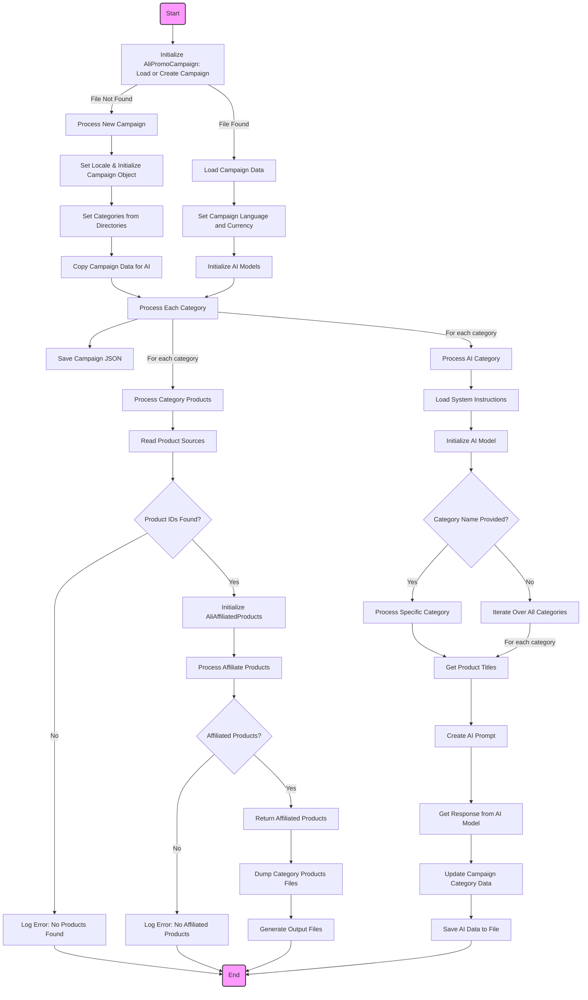
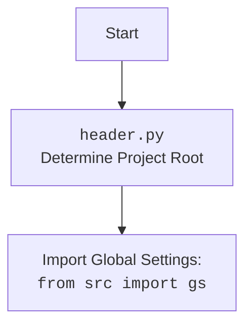

## <алгоритм>

1.  **Инициализация `AliPromoCampaign`**:
    *   При создании экземпляра `AliPromoCampaign` с именем кампании, языком и валютой, проверяется наличие файла конфигурации кампании (`{language}_{currency}.json`) в директории кампании.
        *   **Пример**: `campaign = AliPromoCampaign("new_campaign", "EN", "USD")`
    *   Если файл не найден, запускается процесс создания новой рекламной кампании (`process_new_campaign`).
    *   Если файл найден, загружаются данные кампании, язык и валюта.

2.  **`process_new_campaign`**:
    *   Создает структуру новой рекламной кампании, если файла конфигурации не существует.
    *   Определяет языки и валюты для обработки (либо из параметров, либо из глобальных настроек `locales`).
        *   **Пример**: Вызов `process_new_campaign` при отсутствии файла JSON.
    *   Для каждой комбинации языка и валюты:
        *   Инициализирует пустую структуру данных кампании (`self.campaign` как `SimpleNamespace`).
        *   Вызывает `set_categories_from_directories` для получения списка категорий из поддиректорий `category`.
        *   Создает копию структуры для AI (`self.campaign_ai`).
        *   Для каждой категории вызывает `process_category_products` и `process_ai_category` для обработки товаров и данных AI.
        *   Сохраняет обновленные данные в файл JSON.

3.  **`set_categories_from_directories`**:
    *   Сканирует директорию `category` внутри директории кампании.
    *   Для каждой найденной поддиректории (категории) создает атрибут в `self.campaign.category`, используя `SimpleNamespace`.
    *   Атрибуты каждого объекта категории - `category_name`, `title` и `description`.
        *   **Пример**: После сканирования поддиректорий `electronics`, `fashion`, атрибуты станут доступны как  `self.campaign.category.electronics`,  `self.campaign.category.fashion`.

4.  **`process_campaign`**:
    *   Получает список названий категорий из директории `category`.
    *   Для каждой категории:
        *   Вызывает `process_category_products` для обработки товаров.
        *   Вызывает `process_ai_category` для генерации AI данных.
        *   **Пример**: Итерация по `electronics`, `fashion`, и т.д.

5.  **`process_category_products`**:
    *   Вызывает `read_sources` для получения ID продуктов из HTML и текстовых файлов.
    *   Если ID продуктов не найдены, выводит сообщение об ошибке и возвращает `None`.
    *   Инициализирует `AliAffiliatedProducts` для создания партнерских ссылок.
    *   Вызывает `process_affiliate_products` (асинхронно) для обработки товаров и получения данных.
    *   Возвращает список объектов `SimpleNamespace` с информацией о товарах.
        *  **Пример**: Получает список товаров категории `electronics` с партнерскими ссылками.

6. **`read_sources`**:
    *   Ищет HTML-файлы и `sources.txt` в директории `sources` категории.
    *   Извлекает идентификаторы товаров из HTML-файлов и `sources.txt`.
    *   Возвращает список идентификаторов товаров или `None`, если не находит.

7.  **`process_ai_category`**:
    *   Обрабатывает AI данные для категорий.
    *   Загружает системные инструкции для AI.
    *   Инициализирует AI-модели (`GoogleGenerativeAI`, `OpenAIModel`).
    *   Если `category_name` задан, обрабатывает только эту категорию; иначе обрабатывает все категории.
    *   Для каждой категории:
        *   Читает заголовки товаров из `product_titles.txt`.
        *   Формирует запрос для AI.
        *   Получает ответ от AI.
        *   Обновляет данные категории в `self.campaign_ai` на основе ответа AI.
        *   Сохраняет обновленные данные в JSON файл.

8.  **`_process_category` (внутри `process_ai_category`)**:
    *   Читает названия продуктов из файла `product_titles.txt`.
    *   Формирует запрос для AI, включая язык, название категории и список названий товаров.
    *   Получает ответ от AI и преобразует его в `SimpleNamespace`
    *   Обновляет или создает атрибуты категории в объекте `campaign_ai.category`.

9. **`generate_output`**:
    *   Форматирует текущую дату и время для использования в имени файла.
    *   Преобразует список продуктов если это `SimpleNamespace` в список.
    *   Инициализирует пустые списки для `_data_for_openai`, `_promotion_links_list`, и `_product_titles`.
    *   Итерирует по каждому товару:
        *   Создает словарь `categories_convertor` для конвертации категорий.
        *   Добавляет словарь `categories_convertor` в данные товара.
        *   Сохраняет каждый товар в виде `<product_id>.json` файла.
        *   Добавляет `product_title` и `promotion_link` в соответствующие списки.
    *   Вызывает  `save_product_titles` для сохранения списка названий продуктов.
    *   Вызывает  `save_promotion_links` для сохранения списка ссылок.
    *   Вызывает `generate_html` для генерации HTML-страниц.

10. **`generate_html`**:
     *  Создает HTML-файл для категории и индексный файл.
     *  Для каждой категории создает html файл с информацией о товарах.
     *  Собирает ссылки на все HTML-файлы категорий.
     *  Создает html файл (`index.html`) со списком ссылок на HTML-файлы категорий.

## <mermaid>

## <объяснение>

### Импорты
* `header`: Определяет корень проекта и устанавливает путь, используется для определения корневой директории проекта
* `asyncio`: Для асинхронного программирования, используется для параллельного выполнения задач.
*   `time`: Для работы со временем, например, для замеров производительности.
*   `copy`: Для создания копий объектов, чтобы избежать нежелательных изменений.
* `html`: Для работы с HTML, например, для экранирования символов.
*   `pathlib`: Для работы с путями к файлам и директориям.
*   `types.SimpleNamespace`: Для создания простых объектов с атрибутами (используется для хранения данных).
*   `typing.List`, `typing.Optional`, `typing.Dict`: Для аннотации типов, что делает код более понятным и позволяет проводить проверку типов.
*   `src.gs`: Глобальные настройки проекта, такие как пути, параметры, credentials,  которые используются во всем проекте.
*   `src.suppliers.aliexpress.campaign`: Текущий модуль.
*   `src.suppliers.aliexpress.affiliated_products_generator.AliAffiliatedProducts`: Класс для генерации партнерских ссылок на товары AliExpress.
*   `src.suppliers.aliexpress.utils.locales`: Модуль с информацией о поддерживаемых языках и валютах.
*  `src.ai.GoogleGenerativeAI`, `src.ai.OpenAIModel`: Классы для работы с AI-моделями Google Gemini и OpenAI.
*   `src.suppliers.aliexpress.campaign.html_generators.ProductHTMLGenerator`, `src.suppliers.aliexpress.campaign.html_generators.CategoryHTMLGenerator`, `src.suppliers.aliexpress.campaign.html_generators.CampaignHTMLGenerator`:  Классы для генерации HTML-контента.
*   `src.logger.logger`: Модуль для логирования событий.
* `src.utils.file.get_filenames`, `src.utils.file.read_text_file`, `src.utils.file.get_directory_names`: Функции для работы с файловой системой.
*   `src.utils.jjson.j_dumps`, `src.utils.jjson.j_loads_ns`, `src.utils.jjson.j_loads`: Функции для работы с JSON.
*  `src.utils.convertors.csv.csv2dict`: Функция для конвертации CSV в словарь.
*   `src.utils.file.save_text_file`: Функция для сохранения текстовых файлов.
*   `src.utils.printer.pprint`: Функция для красивой печати данных.
*  `src.suppliers.aliexpress.utils.extract_product_id.extract_prod_ids`: Функция для извлечения идентификаторов товаров из HTML или URL.

### Классы
*   **`AliPromoCampaign`**:
    *   **Роль**: Управляет рекламной кампанией AliExpress, включая создание, обработку категорий, товаров и генерацию AI-данных.
    *   **Атрибуты**:
        *   `language` (str): Язык кампании.
        *   `currency` (str): Валюта кампании.
        *   `base_path` (Path): Путь к директории кампании.
        *   `campaign_name` (str): Имя кампании.
        *   `campaign` (SimpleNamespace): Объект, хранящий данные кампании.
        *   `campaign_ai` (SimpleNamespace): Объект для хранения AI-данных кампании.
        *   `gemini` (GoogleGenerativeAI): Экземпляр AI-модели Google Gemini.
        *   `openai` (OpenAIModel): Экземпляр AI-модели OpenAI.
    *   **Методы**:
        *   `__init__`: Инициализация объекта кампании, загрузка существующих данных или запуск процесса создания новой кампании.
        *  `_models_payload`: Инициализация AI-моделей.
        *   `process_campaign`: Обрабатывает все категории кампании.
        *   `process_campaign_category`: Обрабатывает конкретную категорию в кампании для всех языков и валют.
        *   `process_new_campaign`: Создает новую рекламную кампанию.
        *   `process_ai_category`: Обрабатывает AI-данные для категории.
        *    `process_category_products`: Обрабатывает товары в категории, собирает информацию, генерирует партнерские ссылки.
        *  `dump_category_products_files`: Сохраняет информацию о товарах в JSON-файлы.
        *   `set_categories_from_directories`: Устанавливает категории кампании, основываясь на названиях поддиректорий в `category`.
        *  `generate_output`: Сохраняет данные о товарах в различные форматы, включая JSON и HTML.
        *  `generate_html`: Создает HTML-файлы для категории.
        * `generate_html_for_campaign`: Генерирует HTML-страницы для рекламной кампании.
    *   **Взаимодействие**:
        *   Использует `AliAffiliatedProducts` для генерации партнерских ссылок.
        *   Использует `GoogleGenerativeAI` и `OpenAIModel` для работы с AI-моделями.
        *   Использует классы `ProductHTMLGenerator`, `CategoryHTMLGenerator`, `CampaignHTMLGenerator` для генерации HTML-страниц.
        *   Взаимодействует с файловой системой через функции из `src.utils.file`.

### Функции

*  `read_sources(category_name: str) -> Optional[List[str]]`:
    *   **Аргументы**:
        *   `category_name` (str): Название категории.
    *   **Возвращаемое значение**:
        *   `Optional[List[str]]`: Список идентификаторов товаров или None.
    *   **Назначение**: Читает файлы с источниками товаров и извлекает идентификаторы.
    *   **Пример**: `read_sources("Electronics")`

*  `_process_category(category_name: str)`:
    *   **Аргументы**:
        *   `category_name` (str): Название категории.
    *   **Возвращаемое значение**: None
    *   **Назначение**: Обрабатывает AI данные для конкретной категории.

*   `dump_category_products_files(category_name: str, products: List[SimpleNamespace])`:
    *   **Аргументы**:
        *   `category_name` (str): Имя категории.
        *   `products` (List[SimpleNamespace]): Список объектов с информацией о товарах.
    *   **Возвращаемое значение**: None.
    *   **Назначение**: Сохраняет данные о товарах в JSON-файлы.
    *    **Пример**:  `dump_category_products_files("Electronics", products)`

* `set_categories_from_directories(self)`:
    *   **Аргументы**: Нет
    *   **Возвращаемое значение**: None
    *   **Назначение**: Устанавливает категории кампании, основываясь на названиях поддиректорий в `category`.

*  `generate_output(campaign_name: str, category_path: str | Path, products_list: list[SimpleNamespace] | SimpleNamespace)`:
    *   **Аргументы**:
        *   `campaign_name` (str): Название кампании.
        *   `category_path` (str | Path): Путь к директории категории.
        *    `products_list` (list[SimpleNamespace] | SimpleNamespace): Список объектов SimpleNamespace с информацией о товарах.
    *   **Возвращаемое значение**: None
    *   **Назначение**: Сохраняет данные о товарах в различные форматы, включая JSON и HTML.
    *    **Пример**: `await generate_output("SummerSale", Path("/path/to/electronics"), products)`

* `generate_html(campaign_name:str, category_path: str | Path, products_list: list[SimpleNamespace] | SimpleNamespace)`:
    *   **Аргументы**:
        *   `campaign_name` (str): Название кампании.
        *   `category_path` (str | Path): Путь к директории категории.
        *    `products_list` (list[SimpleNamespace] | SimpleNamespace): Список объектов SimpleNamespace с информацией о товарах.
    *   **Возвращаемое значение**: None
    *   **Назначение**: Создает HTML-файлы для категории и индексный файл кампании.

*  `generate_html_for_campaign(campaign_name: str)`:
    *   **Аргументы**:
        *    `campaign_name` (str): Название кампании.
    *   **Возвращаемое значение**: None
    *   **Назначение**:  Генерирует HTML-страницы для рекламной кампании.

### Переменные
*   `language` (str): Язык кампании (например, "EN", "RU").
*   `currency` (str): Валюта кампании (например, "USD", "ILS").
*   `base_path` (Path): Путь к директории кампании.
*   `campaign_name` (str): Имя кампании (например, "SummerSale").
*   `campaign` (SimpleNamespace): Объект, хранящий данные кампании, категории, товары и тд.
* `campaign_ai` (SimpleNamespace): Объект, хранящий данные кампании сгенерированные AI.
*   `gemini` (GoogleGenerativeAI): Экземпляр модели Google Gemini.
*   `openai` (OpenAIModel): Экземпляр модели OpenAI.
*   `locales`: Глобальная переменная, определяющая языки и валюты.
*   `logger`:  Объект для логирования.
*   `product_ids` (List[str]): Список идентификаторов товаров.
* `_l` (List): Список кортежей `(language, currency)` для цикла обработки языков и валют.
* `response` (str): Строка ответа от AI модели.
*   `product_titles` (list): Список заголовков товаров.
*   `_product_titles` (list): Временный список для сбора заголовков продуктов перед сохранением.
*   `_promotion_links_list` (list): Временный список для сбора ссылок на продукты.
*   `categories_convertor` (dict): Словарь для конвертации категорий.
*  `timestamp` (str):  Текущая дата и время в формате строки.
*   `category` (dict): Словарь с данными для HTML категории.
*   `category_links` (list):  Список ссылок на HTML-файлы категорий.

### Потенциальные ошибки и области для улучшения
*   **Обработка ошибок**: В коде есть места, где обработка ошибок ограничена выводом в лог. Необходимо добавить более надежную обработку ошибок с возможностью повторных попыток или уведомлений.
*   **Производительность**: При обработке большого количества категорий и товаров можно оптимизировать асинхронную обработку и параллелизацию.
*   **Управление AI моделями**: Необходимо добавить возможность выбора и настройки используемых AI моделей.
*   **Гибкость**: Код можно сделать более гибким, добавив параметры для настройки работы с файловой системой, AI моделями и генерацией HTML.
* **Тестирование**: Требуется написание unit и integration тестов, для обеспечения качества кода и его стабильной работы.

### Взаимосвязи с другими частями проекта
*   **`src.gs`**: Используется для доступа к глобальным настройкам, путям, credentials,  которые влияют на все аспекты работы класса, например, пути к файлам и настройки AI.
*   **`src.ai`**: Модули `GoogleGenerativeAI` и `OpenAIModel`  предоставляют функциональность для взаимодействия с AI-моделями, позволяя генерировать описания кампаний и товаров.
*  **`src.suppliers.aliexpress.affiliated_products_generator`**: Модуль `AliAffiliatedProducts` обеспечивает генерацию партнерских ссылок на товары AliExpress.
*   **`src.suppliers.aliexpress.utils`**: Модуль `locales` предоставляет данные о языках и валютах для работы с различными регионами. `extract_product_id` позволяет извлекать id товаров из различных источников.
*   **`src.utils`**: Модули `src.utils.file`, `src.utils.jjson`, `src.utils.convertors.csv` и `src.utils.printer` предоставляют набор функций для работы с файловой системой, JSON, CSV и вывода данных.
*  **`src.logger.logger`**: Обеспечивает логирование различных событий и ошибок, которые могут произойти в процессе выполнения кода.
*   **`src.suppliers.aliexpress.campaign.html_generators`**: Модули `ProductHTMLGenerator`, `CategoryHTMLGenerator`, `CampaignHTMLGenerator` предоставляют функциональность для создания HTML страниц для продуктов и кампаний.

В целом, этот код образует ядро для управления рекламными кампаниями AliExpress, предоставляя возможность создавать, обрабатывать и автоматизировать многие аспекты работы с кампаниями.