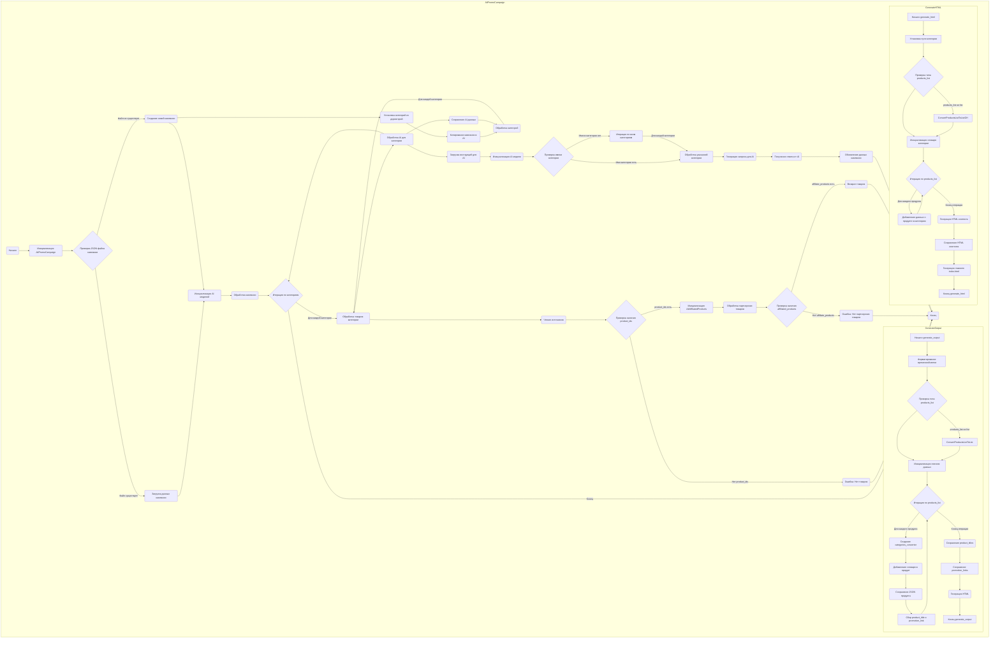

## АНАЛИЗ КОДА: `src/suppliers/aliexpress/campaign/ali_promo_campaign.py`

### 1. <алгоритм>

**Общий рабочий процесс:**

1.  **Инициализация `AliPromoCampaign`**:
    *   При создании экземпляра класса `AliPromoCampaign` происходит инициализация параметров кампании: имя, язык и валюта.
    *   Проверяется наличие JSON-файла с данными о кампании. Если файл существует, его данные загружаются.
    *   Если файл отсутствует, вызывается метод `process_new_campaign` для создания новой кампании.
    *   Инициализируются AI модели `gemini` и `openai`.
    
    **Пример:**
    ```python
    campaign = AliPromoCampaign(campaign_name="SummerSale", language="EN", currency="USD", model='gemini')
    ```

2.  **`process_new_campaign`**:
    *   Если вызывается с новыми параметрами (язык и валюта), то создается новая кампания. Если нет, то обрабатывает все языки и валюты в `locales`.
    *   Создает структуру JSON для кампании.
    *   Заполняет категории на основе названий директорий в `category`.
    *   Копирует структуру кампании в `campaign_ai` для использования AI.
    *   Итерируется по каждой категории, вызывая `process_category_products` и `process_ai_category`.
    *   Сохраняет структуру `campaign_ai` в JSON файл.
    
    **Пример:**
    ```python
    campaign.process_new_campaign(campaign_name="NewCampaign", language="RU", currency="RUB")
    ```

3.  **`process_campaign`**:
    *   Итерируется по всем категориям, вызывая `process_category_products` и `process_ai_category` для каждой.
    *   Читает имена папок в `/category` и для каждого названия папки запускает методы обработки товаров и AI для категорий
    
    **Пример:**
    ```python
    campaign.process_campaign()
    ```

4.  **`process_category_products`**:
    *   Читает все `product_id` из html файлов в `/sources` и из файла `sources.txt`.
    *   Инициализирует `AliAffiliatedProducts` для получения данных о товарах.
    *   Вызывает `process_affiliate_products` для обработки данных и возвращает результат.
    
    **Пример:**
    ```python
    products = campaign.process_category_products("electronics")
    ```

5.  **`process_ai_category`**:
    *   Загружает системную инструкцию из файла.
    *   Инициализирует AI модель (Gemini).
    *   Для каждой категории, на основе `product_titles.txt` , генерирует данные через AI.
    *   Обновляет или создает атрибуты категории в `campaign_ai`.
    *   Сохраняет результат в отдельный JSON файл.
    
    **Пример:**
    ```python
    campaign.process_ai_category("Electronics")
    ```

6. **`generate_output`**:
   *   Форматирует временную метку.
   *   Преобразует `products_list` в список.
   *   Инициализирует списки для сбора данных.
   *   Проходит по каждому продукту:
     *  Создает словарь `categories_convertor`.
     *  Сохраняет каждый продукт в отдельный json файл.
     *  Собирает `product_titles` и `promotion_links`.
   *   Вызывает функции сохранения `product_titles`, `promotion_links` и `generate_html`.
   
  **Пример:**
   ```python
   products = campaign.process_category_products("electronics")
   asyncio.run(campaign.generate_output(campaign_name="SummerSale", category_path="electronics", products_list=products))
   ```
   
7.  **`generate_html`**:
    *   Генерирует html файлы для каждой категории.
    *   Добавляет данные о товарах в html файл (например: title, image, price, links).
    *   Генерирует `index.html` для всей кампании.
        
    **Пример:**
    ```python
    asyncio.run(campaign.generate_html(campaign_name="SummerSale", category_path="electronics", products_list=products))
    ```
    
8. **`set_categories_from_directories`**:
    * Получает все имена поддиректорий в `category`.
    * Создает `SimpleNamespace` объект для каждого имени директории и добавляет в `self.campaign.category`

9. **`dump_category_products_files`**:
    * Сохраняет каждый продукт в отдельный json файл.

### 2. <mermaid>



### Описание `mermaid` диаграммы:

**Общая структура:**

*   Диаграмма представляет собой блок-схему, описывающую основные этапы работы класса `AliPromoCampaign`.
*   Используется подграф `AliPromoCampaign` для группировки всех этапов.
*   Внутри `AliPromoCampaign` есть еще подграфы: `GenerateOutput`, `GenerateHTML`
*   Указаны все основные методы и логические проверки.

**Зависимости и связи:**

1.  **Инициализация (`Init`)**:
    *   Начинается с инициализации класса `AliPromoCampaign`.
    *   Проверяет наличие файла кампании.
    *   Загружает данные или запускает создание новой кампании.

2.  **`process_new_campaign`**:
    *   Создает новую структуру для кампании.
    *   Устанавливает категории из директорий ( `set_categories_from_directories`).
    *   Копирует данные кампании для AI обработки ( `copy_campaign_to_ai`).
    *   Начинает обработку категорий ( `ProcessCategories`).
    
3. **`ProcessCampaign`**
   *   После инициализации, происходит итерация по категориям, для обработки товаров и AI.

4.  **`process_category_products`**:
    *   Читает источники данных товаров ( `read_sources`).
    *   Проверяет наличие `product_ids`.
    *   Инициализирует `AliAffiliatedProducts` для обработки данных о товарах.
    *   Проверяет наличие аффилированных товаров.

5.  **`process_ai_category`**:
    *   Загружает системные инструкции для AI ( `LoadSystemInstructions`).
    *   Инициализирует AI модель ( `InitAIModel`).
    *   Обрабатывает каждую категорию.
    *   Генерирует запрос к AI, получает ответ и обновляет данные кампании.

6. **`generate_output`**:
    * Форматирует временную метку ( `FormatTimestamp` ) для файла.
    * Проверяет тип списка продуктов и преобразует если нужно.
    * Инициализирует списки для сбора данных.
    * Итерирует по каждому продукту.
    * Создает конвертор для категорий.
    * Сохраняет каждый продукт в json файл.
    * Собирает `product_titles` и `promotion_links`.
    * Вызывает функции сохранения данных `save_product_titles`, `save_promotion_links` и генерации `generate_html`.
    
7. **`generate_html`**:
    *   Устанавливает путь категории.
    *   Проверяет тип списка продуктов и преобразует если нужно.
    *   Инициализирует словарь для категорий.
    *   Итерирует по продуктам и добавляет их в категорию.
    *   Создает html контент, сохраняет его, а также генерирует главный index.html.
    

**Переменные:**
* Все переменные в диаграмме имеют осмысленные имена, например, `Init`, `ProcessNewCampaign`, `ProcessCategoryProducts`, и т.д.
*   Имена переменных соответствуют названиям функций или процессов в коде.

### 3. <объяснение>

#### Импорты:

*   `header`: Управление путями проекта (импортируется дважды, что может быть лишним).
*   `asyncio`: Для асинхронного выполнения операций.
*   `time`: Для работы со временем.
*   `copy`: Для создания копий объектов.
*   `html`: Для экранирования HTML-символов.
*   `pathlib.Path`: Для работы с путями к файлам и директориям.
*   `types.SimpleNamespace`: Для создания простых объектов с атрибутами.
*   `typing`: Для аннотации типов.
*   `src.gs`: Глобальные настройки проекта.
*   `src.suppliers.aliexpress.campaign`: Внутренний модуль.
*   `src.suppliers.aliexpress.affiliated_products_generator.AliAffiliatedProducts`: Класс для генерации партнерских ссылок.
*   `src.suppliers.aliexpress.utils.locales`: Локализации.
*   `src.ai.gemini.GoogleGenerativeAI`: Класс для работы с Google Gemini.
*   `src.ai.openai.OpenAIModel`: Класс для работы с OpenAI.
*    `src.suppliers.aliexpress.campaign.html_generators`:  Модули для генерации HTML.
*   `src.logger.logger.logger`: Логгер.
*   `src.utils.file_async.*`: Утилиты для асинхронной работы с файлами.
*   `src.utils.jjson.*`: Утилиты для работы с JSON.
*   `src.utils.convertors.csv`: Утилиты для работы с CSV.
*   `src.utils.file`: Утилиты для работы с файлами.
*   `src.utils.printer.pprint`: Функция для красивого вывода объектов.
*   `src.suppliers.aliexpress.utils.extract_product_id`: Функция для извлечения `product_id` из текста.

#### Классы:

*   `AliPromoCampaign`:
    *   **Роль**: Управляет рекламной кампанией на AliExpress, включая обработку категорий, товаров и использование AI для генерации контента.
    *   **Атрибуты**:
        *   `language` (str): Язык кампании.
        *   `currency` (str): Валюта кампании.
        *   `base_path` (Path): Путь к директории кампании.
        *   `campaign_name` (str): Имя кампании.
        *   `campaign` (SimpleNamespace): Объект, содержащий данные кампании.
        *   `campaign_ai` (SimpleNamespace): Объект, содержащий данные кампании для AI обработки.
        *   `gemini` (`GoogleGenerativeAI`): Объект для взаимодействия с моделью Gemini.
        *   `openai` (`OpenAIModel`): Объект для взаимодействия с моделью OpenAI.
    *   **Методы**:
        *   `__init__`: Инициализация объекта. Загружает данные кампании из JSON файла или запускает создание новой.
        *   `_models_payload`: Инициализирует AI модели.
        *   `process_campaign`: Итерируется по категориям и запускает их обработку.
        *   `process_campaign_category`: Обработка отдельной категории кампании.
        *   `process_new_campaign`: Создание новой рекламной кампании.
        *   `process_ai_category`: Обработка данных категории с помощью AI.
        *   `process_category_products`: Обработка товаров в категории.
        *   `dump_category_products_files`: Сохранение данных о товарах в JSON файлы.
        *  `set_categories_from_directories`: Устанавливает категории из названий директорий в `/category`.
        *  `generate_output`: Сохраняет данные о товарах в различных форматах (JSON, TXT).
        *  `generate_html`: Генерация HTML-страниц для категории и главный index.html
        *   `generate_html_for_campaign`: Генерирует HTML страницы для всей рекламной кампании.
        
#### Функции:

*   `read_sources(category_name: str)`:  
  *   **Аргументы**:
        *   `category_name` (str): Название категории.
    *   **Возвращаемое значение**:
        *   `Optional[List[str]]`: Список идентификаторов товаров или None.
    *   **Назначение**: Читает `product_id` из файлов `html` и `sources.txt` в директории с названием категории.
*   `get_response(_attempts: int = 5)`:  
     *  **Аргументы**:
          *  `_attempts` (int): Количество попыток запроса к AI.
      *   **Возвращаемое значение**:
         *  `str`: Ответ от AI модели
      *   **Назначение**: Получает ответ от AI модели.
*   `_process_category(category_name: str)`:  
     *  **Аргументы**:
          *  `category_name` (str): Название категории.
      *   **Возвращаемое значение**:
         *  `None`:
      *   **Назначение**: обрабатывает данные категории через AI и обновляет `campaign_ai.category`.
*   `fix_json_string(value)`: 
    * **Аргументы:** 
        * `value`: Значение для фиксации.
    * **Возвращаемое значение:**
        * `str`: Отформатированная строка.
    * **Назначение:** Удаляет лишние символы из JSON строки.

#### Переменные:

*   `language` (str): Язык кампании.
*   `currency` (str): Валюта кампании.
*   `base_path` (Path): Путь к директории кампании.
*   `campaign_name` (str): Имя кампании.
*   `campaign` (SimpleNamespace): Объект, содержащий данные кампании.
*   `campaign_ai` (SimpleNamespace): Объект, содержащий данные кампании для AI обработки.
*   `gemini` (`GoogleGenerativeAI`): Объект для взаимодействия с моделью Gemini.
*   `openai` (`OpenAIModel`): Объект для взаимодействия с моделью OpenAI.
*   `system_instruction` (str): Текст инструкции для AI модели.
*   `_l` (list): Список языков и валют для обработки.
*   `category_dirs` (Path): Путь к директории с категориями.
*   `categories` (list): Список категорий (имена директорий).
*   `products` (list): Список товаров `SimpleNamespace`.
*   `promo_generator` (`AliAffiliatedProducts`): Генератор аффилированных товаров.
*   `product_ids` (list): Список идентификаторов товаров.
*   `product_urls` (list): Список ссылок на товары.
*   `titles_path` (Path): Путь к файлу `product_titles.txt`.
*   `product_titles` (list): Список заголовков товаров.
*   `prompt` (str): Текст запроса для AI.
*   `response` (str): Ответ от AI.
*   `res_ns` (SimpleNamespace): Ответ от AI в формате объекта `SimpleNamespace`.
*   `current_category` (SimpleNamespace): Текущая категория в кампании.
*   `nested_category_ns` (SimpleNamespace): Обновленная категория.
*   `category_path` (Path): Путь к директории категории.
*   `product_id` (str): Идентификатор товара.
*  `timestamp` (str): Временная метка для файла.
*  `products_list` (list): Список товаров.
*  `_data_for_openai` (dict): Словарь для AI обработки.
*   `_promotion_links_list` (list): Список ссылок на товары.
*   `_product_titles` (list): Список заголовков товаров.
*  `categories_convertor` (dict): Словарь для конвертации категорий.

#### Потенциальные ошибки и улучшения:

1.  **Дублирование импорта `header`**: Импорт `header` встречается дважды, что является избыточным.
2.  **Обработка ошибок**: В некоторых местах есть `try-except` блоки, но обработка ошибок может быть более детальной.
3.  **Типизация**: Некоторые переменные и функции не имеют полной типизации.
4.  **Логирование**: Логирование можно сделать более подробным, чтобы легче отслеживать процесс выполнения.
5.  **Зависимость от структуры директорий**: Код сильно зависит от структуры директорий и файлов. Желательно сделать его более гибким.
6.  **Использование AI**: AI может быть использован для генерации не только описаний, но и других данных (например, заголовков, ключевых слов).
7.  **Множество методов и ответственности**: Класс `AliPromoCampaign` выполняет много разных задач, что делает его сложным для понимания и сопровождения. Разделение на несколько классов могло бы улучшить структуру.

#### Взаимосвязь с другими частями проекта:

*   `src.gs`: Получение глобальных настроек проекта, таких как пути к директориям.
*   `src.suppliers.aliexpress`: Взаимодействие с другими модулями AliExpress, такими как генерация партнерских ссылок.
*   `src.ai`: Использование AI моделей для генерации контента.
*  `src.suppliers.aliexpress.campaign.html_generators`:  Используется для генерации HTML.
*   `src.utils`: Взаимодействие с утилитами для работы с файлами, JSON, CSV и т.д.
*   `src.logger`: Логирование событий.

**Цепочка взаимосвязей:**

1.  **`AliPromoCampaign`**: Инициализация, загрузка данных, управление процессом.
2.  **`AliAffiliatedProducts`**: Генерация партнерских ссылок.
3.  **`GoogleGenerativeAI`, `OpenAIModel`**: Генерация текстового контента с использованием AI.
4.  **`src.utils.*`**: Обеспечение основных функций работы с файлами, данными и т.д.
5.  **`src.logger`**: Логирование всех ключевых действий и ошибок.
6.  **`html_generators`**: Генерация html файлов.

**Заключение:**

Код представляет собой основной компонент для управления рекламными кампаниями AliExpress. Он включает в себя загрузку данных, обработку категорий и товаров, использование AI для генерации контента и формирование HTML-вывода. Код хорошо структурирован, но имеет некоторые области для улучшения, такие как более детальная обработка ошибок, типизация и разбиение на более мелкие модули.