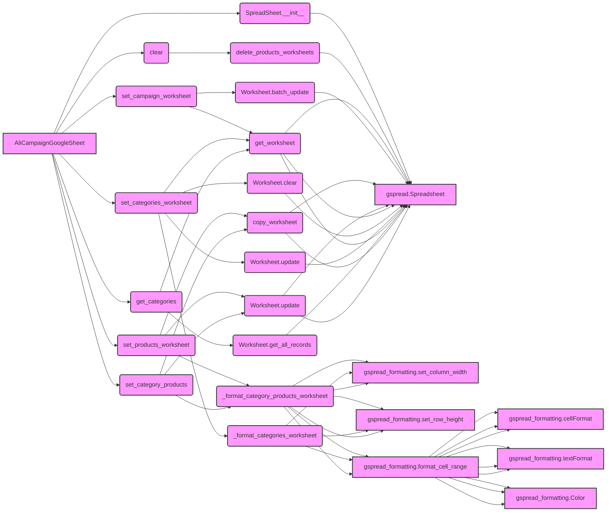

## Анализ кода `hypotez/src/suppliers/aliexpress/campaign/gsheet.py`

### <алгоритм>

1.  **Инициализация `AliCampaignGoogleSheet`**:
    *   При создании экземпляра класса `AliCampaignGoogleSheet` вызывается конструктор `__init__`, который принимает имя кампании, язык и валюту.
    *   Вызывается конструктор родительского класса `SpreadSheet` с `spreadsheet_id`, который инициализирует работу с Google Sheets.
    *   Пример:
        ```python
        campaign_sheet = AliCampaignGoogleSheet(campaign_name="test_campaign", language="ru", currency="RUB")
        ```
2.  **Очистка данных `clear`**:
    *   Функция `clear` удаляет все листы, кроме 'categories', 'product', 'category', 'campaign'.
    *   Вызывается `delete_products_worksheets` для удаления листов продуктов.
    *   Пример:
        ```python
        campaign_sheet.clear()
        ```
3.  **Удаление листов продуктов `delete_products_worksheets`**:
    *   Получает список всех листов в документе.
    *   Проверяет, чтобы имя листа не совпадало с исключенными именами ('categories', 'product', 'category', 'campaign').
    *   Удаляет листы, не входящие в исключения.
4.  **Запись данных кампании `set_campaign_worksheet`**:
    *   Получает лист с именем 'campaign'.
    *   Формирует список кортежей, содержащих данные о кампании (название, заголовок, язык, валюта, описание).
    *   Записывает данные в соответствующие ячейки листа.
    *   Пример:
        ```python
        campaign_data = SimpleNamespace(
            campaign_name="test_campaign",
            title="Test Campaign Title",
            language="ru",
            currency="RUB",
            description="Test Description"
        )
        campaign_sheet.set_campaign_worksheet(campaign_data)
        ```
5.  **Запись данных продуктов `set_products_worksheet`**:
    *   Копирует лист `product` и присваивает имя категории.
    *   Получает данные о продуктах из атрибута `products` категории.
    *   Проходит по всем продуктам и записывает их атрибуты в строки листа.
    *   Пример:
        ```python
        # Предположим, что self.editor.campaign.category имеет категорию "test_category" с продуктами
        campaign_sheet.set_products_worksheet("test_category")
        ```
6.  **Запись данных категорий `set_categories_worksheet`**:
    *   Получает лист 'categories'.
    *   Очищает лист.
    *   Получает данные категорий из объекта `SimpleNamespace`
    *   Проверяет наличие необходимых атрибутов ('name', 'title', 'description', 'tags', 'products_count') у категорий.
    *   Записывает заголовки и данные категорий в лист.
    *   Форматирует лист.
    *   Пример:
        ```python
        category_data = SimpleNamespace(
            test_category1 = SimpleNamespace(name="test_category1", title="Test Category 1", description="Description 1", tags=["tag1", "tag2"], products_count=10),
            test_category2 = SimpleNamespace(name="test_category2", title="Test Category 2", description="Description 2", tags=["tag3", "tag4"], products_count=20)
        )
        campaign_sheet.set_categories_worksheet(category_data)
        ```
7.  **Получение данных категорий `get_categories`**:
    *   Получает лист 'categories'.
    *   Получает все записи из листа и возвращает их в виде списка словарей.
8.  **Запись данных о продуктах категории `set_category_products`**:
    *   Копирует лист 'product' и присваивает имя категории.
    *   Получает данные о продуктах из словаря `products`.
    *   Записывает заголовки и данные продуктов в лист.
9.  **Форматирование листа категорий `_format_categories_worksheet`**:
    *   Устанавливает ширину столбцов.
    *   Устанавливает высоту строк.
    *   Устанавливает форматирование заголовков (жирный шрифт, выравнивание, цвет фона).
10. **Форматирование листа продуктов `_format_category_products_worksheet`**:
    *   Устанавливает ширину столбцов.
    *   Устанавливает высоту строк.
    *   Устанавливает форматирование заголовков (жирный шрифт, выравнивание, цвет фона).

### <mermaid>



**Описание `mermaid` диаграммы:**

*   **`AliCampaignGoogleSheet`**: Основной класс, управляющий операциями с Google Sheets для рекламных кампаний AliExpress.
*   **`SpreadSheet.__init__`**:  Инициализация родительского класса `SpreadSheet` с указанием `spreadsheet_id`
*   **`gspread.Spreadsheet`**: Объект для работы с Google Sheets.
*   **`clear`**: Метод для очистки листов в Google Sheets.
*   **`delete_products_worksheets`**: Метод для удаления листов продуктов, за исключением основных листов.
*   **`set_campaign_worksheet`**: Метод для записи данных о кампании в лист 'campaign'.
*   **`get_worksheet`**: Метод для получения листа по его имени.
*   **`Worksheet.batch_update`**: Метод для пакетного обновления ячеек листа.
*   **`set_products_worksheet`**: Метод для записи данных о продуктах в листы категорий.
*   **`copy_worksheet`**: Метод для копирования листа и присваивания нового имени.
*   **`Worksheet.update`**: Метод для обновления ячеек листа.
*   **`_format_category_products_worksheet`**: Метод для форматирования листов продуктов.
*    **`gspread_formatting.set_column_width`**: Метод для установки ширины столбца.
*   **`gspread_formatting.set_row_height`**: Метод для установки высоты строки.
*   **`gspread_formatting.format_cell_range`**: Метод для форматирования диапазона ячеек.
*    **`gspread_formatting.cellFormat`**: Метод для задания формата ячейки.
*    **`gspread_formatting.textFormat`**: Метод для задания формата текста ячейки.
*   **`gspread_formatting.Color`**: Метод для задания цвета.
*   **`set_categories_worksheet`**: Метод для записи данных о категориях в лист 'categories'.
*   **`Worksheet.clear`**: Метод для очистки листа.
*   **`Worksheet.update`**: Метод для обновления ячеек листа.
*   **`_format_categories_worksheet`**: Метод для форматирования листа категорий.
*    **`get_categories`**: Метод для получения данных о категориях.
*     **`Worksheet.get_all_records`**: Метод для получения всех записей из листа.
*   **`set_category_products`**: Метод для записи данных о продуктах в листы категорий.

**Зависимости:**

*   **`AliCampaignGoogleSheet`** наследуется от **`SpreadSheet`**, что подразумевает использование функциональности для взаимодействия с Google Sheets.
*   **`AliCampaignGoogleSheet`** использует методы из **`gspread`** и **`gspread_formatting`** для работы с таблицами Google Sheets.
*   **`AliCampaignGoogleSheet`** использует **`logger`** для ведения логов работы.
*   **`AliCampaignGoogleSheet`** использует **`SimpleNamespace`** для хранения и передачи данных.

### <объяснение>

**Импорты:**

*   `time`: Используется для добавления задержек в выполнении кода (например, `time.sleep(10)`), хотя в текущей версии кода этот импорт может не использоваться.
*   `SimpleNamespace` из `types`: Используется для создания простых объектов с атрибутами, что упрощает работу с данными.
*   `Optional`, `Any`, `List`, `Dict` из `typing`: Используется для статической типизации, что улучшает читаемость и обнаруживает ошибки на ранних этапах разработки.
*   `gspread.worksheet.Worksheet`: Класс для работы с конкретными листами Google Sheets.
*   `src.goog.spreadsheet.spreadsheet.SpreadSheet`: Класс для работы с Google Sheets, который, вероятно, содержит базовый функционал для подключения к Google Sheets и т.д.
*   `src.utils.jjson.j_dumps`: Функция для преобразования объектов Python в JSON-строки.
*   `src.utils.printer.pprint`: Функция для "красивой" печати объектов Python в консоль.
*   `src.logger.logger.logger`: Модуль для логирования событий и ошибок.
*   `src.ai.openai.translate`: Функция для перевода текста с помощью OpenAI API.
*  `gspread_formatting`:  Библиотека для форматирования Google Sheets (изменение ширины столбцов, высоты строк и т.д).

**Классы:**

*   **`AliCampaignGoogleSheet`**:
    *   **Назначение**: Класс для управления данными рекламных кампаний AliExpress в Google Sheets. Он наследует функциональность `SpreadSheet` и добавляет специфичные методы для работы с листами кампаний, категориями и продуктами.
    *   **Атрибуты**:
        *   `spreadsheet_id`: Идентификатор Google Sheets документа.
        *   `spreadsheet`: Экземпляр класса `SpreadSheet` для взаимодействия с Google Sheets.
        *   `worksheet`: Экземпляр класса `Worksheet` для работы с конкретным листом Google Sheets.
    *   **Методы**:
        *   `__init__`: Конструктор класса, инициализирующий объект `AliCampaignGoogleSheet`.
        *   `clear`: Очищает листы Google Sheets, удаляя все листы продуктов.
        *   `delete_products_worksheets`: Удаляет все листы, кроме основных ('categories', 'product', 'category', 'campaign').
        *   `set_campaign_worksheet`: Записывает данные о кампании в лист 'campaign'.
        *   `set_products_worksheet`: Записывает данные о продуктах в листы категорий.
        *   `set_categories_worksheet`: Записывает данные о категориях в лист 'categories'.
        *   `get_categories`: Получает данные о категориях из листа 'categories'.
         * `set_category_products`: Записывает данные о продуктах в новый лист категории.
        *   `_format_categories_worksheet`: Форматирует лист 'categories'.
        *   `_format_category_products_worksheet`: Форматирует лист продуктов.
        *   Методы с префиксом `_`  являются внутренними и предназначены для использования внутри класса.
    *   **Взаимодействие**:
        *   Использует `SpreadSheet` для базовых операций с Google Sheets.
        *   Использует `gspread.Worksheet` для работы с листами Google Sheets.
        *   Использует  `gspread_formatting` для форматирования.
        *   Взаимодействует с  `SimpleNamespace` для передачи данных.

**Функции:**

*   **`__init__`**: Конструктор класса, инициализирует объект с именем кампании, языком и валютой.
*   `clear`: Очищает данные в Google Sheets.
*   `delete_products_worksheets`:  Удаляет листы с продуктами, исключая основные листы.
*   `set_campaign_worksheet`: Записывает данные кампании в лист, принимает объект SimpleNamespace с данными кампании.
*   `set_products_worksheet`: Записывает данные продуктов в лист.
*   `set_categories_worksheet`: Записывает данные категорий в лист.
*   `get_categories`: Получает данные о категориях из листа.
*   `set_category_products`: Записывает данные продуктов в отдельный лист для каждой категории.
*   `_format_categories_worksheet`:  Форматирует лист 'categories', устанавливая ширину столбцов, высоту строк, выравнивание и цвет фона.
*   `_format_category_products_worksheet`: Форматирует лист продуктов.

**Переменные:**

*   `MODE`: Глобальная переменная, определяющая режим работы ('dev').
*   `spreadsheet_id`: Идентификатор Google Sheets документа (статический атрибут класса).
*   `spreadsheet`: Объект класса `SpreadSheet` для работы с Google Sheets (статический атрибут класса).
*   `worksheet`: Объект класса `Worksheet` для работы с листом Google Sheets (статический атрибут класса).
*   `campaign_name`: Имя рекламной кампании (аргумент конструктора).
*   `language`: Язык рекламной кампании (аргумент конструктора).
*   `currency`: Валюта рекламной кампании (аргумент конструктора).
*   `categories`, `products`:  Переменные, содержащие данные для записи в Google Sheets.
*   `ws`: Экземпляр класса `Worksheet`, представляющий лист Google Sheets.
*   `updates`: Список для хранения операций пакетного обновления Google Sheets.
*   `headers`: Список для хранения заголовков таблиц.
*   `row_data`: Список для хранения данных строк.

**Потенциальные ошибки и области для улучшения:**

1.  **Жестко заданный `spreadsheet_id`**: Идентификатор Google Sheets задан в коде, что делает класс менее гибким.
2.  **Обработка ошибок**: Использование `try...except` блоков с общим `Exception` может затруднить отладку. Лучше ловить конкретные исключения.
3.  **Отсутствие проверки типа**: В функциях нет проверок типов, что может привести к ошибкам во время выполнения.
4.  **Повторяющийся код форматирования**: Код форматирования листов (`_format_categories_worksheet` и `_format_category_products_worksheet`) почти идентичен. Можно вынести общую часть в отдельную функцию.
5.  **Зависимость от `self.editor`**: Код зависит от атрибута `self.editor`, который не определен в текущем файле, что может вызвать ошибку `AttributeError`.
6.  **Магические значения**: Код содержит много "магических значений" (например, индексы колонок и строк), которые стоит заменить на константы или использовать более понятный способ записи.
7.  **Неэффективное обновление**: Запись данных в ячейки происходит поэтапно. Можно улучшить производительность, используя пакетное обновление `batch_update`.

**Взаимосвязи с другими частями проекта:**

*   Класс `AliCampaignGoogleSheet` взаимодействует с модулями `src.goog.spreadsheet.spreadsheet`, `src.utils.jjson`, `src.utils.printer`, `src.logger.logger`, и `src.ai.openai`, которые, вероятно, расположены в других файлах проекта.
*   Зависимость от `self.editor` подразумевает взаимодействие с модулем, предоставляющим данные кампании, категорий и продуктов.
*   Использование `SimpleNamespace` предполагает, что данные для записи в Google Sheets передаются в виде объектов этого типа.

Этот анализ предоставляет подробное описание функциональности кода, его структуры, зависимостей и потенциальных областей для улучшения.