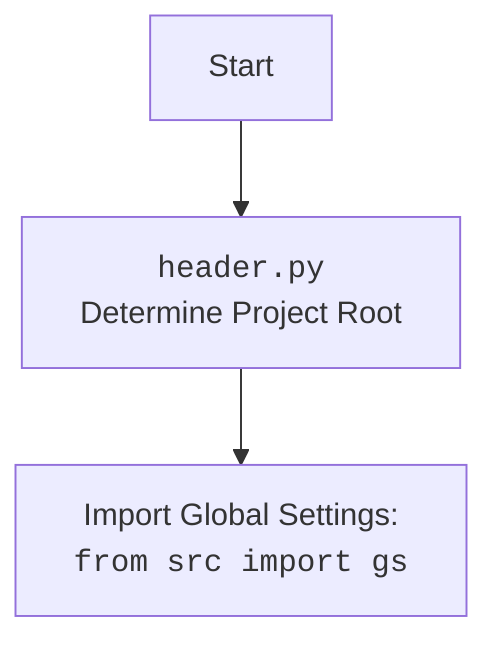

## <алгоритм>

1.  **Инициализация `AliCampaignGoogleSheet`**:
    *   При создании экземпляра `AliCampaignGoogleSheet` происходит инициализация родительского класса `SpreadSheet` с указанием `spreadsheet_id`.
    *   Сохраняются параметры `campaign_name`, `language` и `currency` (если предоставлены).
    *   Пример: `campaign_sheet = AliCampaignGoogleSheet(campaign_name="SummerSale", language="en", currency="USD")`
2.  **Очистка данных (`clear`)**:
    *   Вызывает метод `delete_products_worksheets` для удаления всех листов, кроме 'categories', 'product', 'category', 'campaign'.
    *   Обрабатывает исключения, выводя информацию об ошибке в лог.
    *   Пример: `campaign_sheet.clear()`
3.  **Удаление листов продуктов (`delete_products_worksheets`)**:
    *   Получает список всех листов из Google Sheets.
    *   Итерируется по листам и удаляет те, чьи заголовки не входят в список исключений `{'categories', 'product', 'category', 'campaign'}`.
    *   Выводит сообщение об успешном удалении листа в лог.
    *   Обрабатывает исключения, выводя информацию об ошибке в лог и повторно выбрасывает исключение.
    *   Пример: `campaign_sheet.delete_products_worksheets()`
4.  **Запись данных кампании (`set_campaign_worksheet`)**:
    *   Получает рабочий лист 'campaign'.
    *   Формирует список кортежей `vertical_data` с данными о кампании. Каждый кортеж содержит адрес ячейки, заголовок и значение.
    *   Преобразует `vertical_data` в формат для пакетного обновления (batch_update) Google Sheets.
    *   Обновляет данные в листе 'campaign' с использованием `batch_update`.
    *   Выводит сообщение в лог об успешной записи данных.
    *   Обрабатывает исключения, выводя информацию об ошибке в лог и повторно выбрасывает исключение.
    *   Пример:
        ```python
        campaign_data = SimpleNamespace(
            campaign_name="SummerSale",
            title="Summer Sale Campaign",
            language="en",
            currency="USD",
            description="Summer sale 2024"
        )
        campaign_sheet.set_campaign_worksheet(campaign_data)
        ```
5.  **Запись данных о продуктах (`set_products_worksheet`)**:
    *   Получает имя категории `category_name` и извлекает из атрибута `editor` (если он существует),  список продуктов для этой категории.
    *   Копирует лист 'product' в новый лист с названием `category_name`.
    *   Формирует список строк данных `row_data` для каждого продукта, получая данные из атрибутов продукта.
    *   Записывает данные в лист, начиная со второй строки, для каждого продукта, используя метод `update`.
    *   Форматирует лист продуктов с помощью `_format_category_products_worksheet`.
    *   Выводит сообщение в лог об успешном обновлении продуктов.
    *   Обрабатывает исключения, выводя информацию об ошибке в лог и повторно выбрасывает исключение.
    *   Пример:
        ```python
        # Предполагается, что self.editor и self.editor.campaign.category уже заданы
        # и содержат необходимую структуру данных
        campaign_sheet.set_products_worksheet("electronics")
        ```
6.  **Запись данных о категориях (`set_categories_worksheet`)**:
    *   Получает рабочий лист 'categories'.
    *   Очищает содержимое рабочего листа перед записью.
    *   Получает данные о категориях из `categories.__dict__`.
    *   Проверяет, что все объекты категории имеют необходимые атрибуты (`name`, `title`, `description`, `tags`, `products_count`).
    *   Записывает заголовки в первую строку листа.
    *   Формирует данные для записи в виде списка `rows`, где каждая строка соответствует категории.
    *   Обновляет данные на листе 'categories', начиная со второй строки.
    *   Форматирует лист категорий с помощью `_format_categories_worksheet`.
    *   Выводит сообщение в лог об успешной записи данных категорий.
    *   Обрабатывает исключения, выводя информацию об ошибке в лог и повторно выбрасывает исключение.
    *   Пример:
        ```python
        categories_data = SimpleNamespace(
            electronics=SimpleNamespace(name='electronics', title='Electronics', description='Electronics products', tags=['tech', 'gadgets'], products_count=10),
            clothing=SimpleNamespace(name='clothing', title='Clothing', description='Clothing products', tags=['fashion', 'apparel'], products_count=20)
        )
        campaign_sheet.set_categories_worksheet(categories_data)
        ```
7.  **Получение данных о категориях (`get_categories`)**:
    *   Получает рабочий лист 'categories'.
    *   Извлекает все данные из листа в виде списка словарей с помощью метода `get_all_records`.
    *   Выводит сообщение в лог об успешном получении данных.
    *   Возвращает полученные данные.
    *   Пример: `categories = campaign_sheet.get_categories()`
8.  **Запись данных продуктов (версия 2) (`set_category_products`)**:
    *   Копирует лист 'product' в новый лист с названием `category_name`.
    *   Подготавливает заголовки для столбцов.
    *   Формирует список `row_data` для каждого продукта, получая данные из его атрибутов.
    *   Обновляет лист данными, начиная со второй строки.
    *   Форматирует лист с помощью `_format_category_products_worksheet`.
    *   Выводит сообщение в лог об успешном обновлении продуктов.
    *   Обрабатывает исключения, выводя информацию об ошибке в лог и повторно выбрасывает исключение.
    *   Пример:
        ```python
        products_data = [
            SimpleNamespace(product_id='123', app_sale_price=10.0, original_price=15.0, sale_price=12.0, discount=20, product_main_image_url='url1', local_image_path='local1', product_small_image_urls=['url2', 'url3'], product_video_url='video1', local_video_path='local_video', first_level_category_id=1, first_level_category_name='cat1', second_level_category_id=2, second_level_category_name='cat2', target_sale_price=10, target_sale_price_currency='USD', target_app_sale_price_currency='USD', target_original_price_currency='USD', original_price_currency='USD', product_title='Product 1', evaluate_rate=4.5, promotion_link='promo1', shop_url='shop1', shop_id='shop_id1', tags=['tag1', 'tag2']),
            SimpleNamespace(product_id='456', app_sale_price=20.0, original_price=25.0, sale_price=22.0, discount=10, product_main_image_url='url4', local_image_path='local4', product_small_image_urls=['url5', 'url6'], product_video_url='video2', local_video_path='local_video2', first_level_category_id=3, first_level_category_name='cat3', second_level_category_id=4, second_level_category_name='cat4', target_sale_price=20, target_sale_price_currency='USD', target_app_sale_price_currency='USD', target_original_price_currency='USD', original_price_currency='USD', product_title='Product 2', evaluate_rate=4.7, promotion_link='promo2', shop_url='shop2', shop_id='shop_id2', tags=['tag3', 'tag4'])
        ]
        campaign_sheet.set_category_products("electronics", products_data)
        ```
9.  **Форматирование листа категорий (`_format_categories_worksheet`)**:
    *   Устанавливает ширину столбцов A, B, C, D и E.
    *   Устанавливает высоту первой строки.
    *   Применяет форматирование к заголовкам (жирный шрифт, выравнивание по центру, цвет фона).
    *   Выводит сообщение в лог об успешном форматировании.
    *   Обрабатывает исключения, выводя информацию об ошибке в лог и повторно выбрасывает исключение.
10. **Форматирование листа продуктов (`_format_category_products_worksheet`)**:
    *   Устанавливает ширину столбцов A-Y.
    *   Устанавливает высоту первой строки.
    *   Применяет форматирование к заголовкам (жирный шрифт, выравнивание по центру, цвет фона).
    *   Выводит сообщение в лог об успешном форматировании.
    *   Обрабатывает исключения, выводя информацию об ошибке в лог и повторно выбрасывает исключение.

## <mermaid>

```mermaid
flowchart TD
    Start[Start] --> Init[Initialize `AliCampaignGoogleSheet`];
    Init --> ClearData{Clear Data?};
    ClearData -- Yes --> DeleteWorksheets[Delete Product Worksheets];
    ClearData -- No --> SetCampaignData{Set Campaign Data?};
    DeleteWorksheets --> SetCampaignData;
    SetCampaignData -- Yes --> WriteCampaignData[Write Campaign Data to 'campaign' sheet];
    SetCampaignData -- No --> SetProductsData{Set Products Data?};
    WriteCampaignData --> SetProductsData;
    SetProductsData -- Yes --> WriteProductsData[Write Products Data to Category Sheet];
    SetProductsData -- No --> SetCategoriesData{Set Categories Data?};
    WriteProductsData --> SetCategoriesData;
    SetCategoriesData -- Yes --> WriteCategoriesData[Write Categories Data to 'categories' sheet];
    SetCategoriesData -- No --> GetCategoriesData{Get Categories Data?};
    WriteCategoriesData --> GetCategoriesData;
     GetCategoriesData -- Yes --> ReadCategoriesData[Read Categories Data from 'categories' sheet];
    GetCategoriesData -- No --> SetCategoryProductsData{Set Category Products Data?};
    ReadCategoriesData --> SetCategoryProductsData;
     SetCategoryProductsData -- Yes --> WriteCategoryProductsData[Write Products Data to New Category Sheet];
     SetCategoryProductsData -- No --> FormatCategoriesSheet{Format Categories Sheet?};
       WriteCategoryProductsData --> FormatCategoriesSheet;
    FormatCategoriesSheet -- Yes --> FormatCategories[Format 'categories' Sheet];
    FormatCategoriesSheet -- No --> FormatProductsSheet{Format Products Sheet?};
      FormatCategories --> FormatProductsSheet;
    FormatProductsSheet -- Yes --> FormatProducts[Format Product Sheet];
       FormatProducts --> End[End]
     FormatProductsSheet -- No --> End;
    End[End]
    
    
     classDef default fill:#f9f,stroke:#333,stroke-width:2px
    class Start, End default
```



## <объяснение>

**Импорты:**

*   `import time`: Используется для добавления задержек в коде (например, перед копированием листа, в закомментированном коде).
*   `from types import SimpleNamespace`: Используется для создания объектов с произвольными атрибутами, что упрощает передачу данных между функциями и методами.
*   `from typing import Optional, Any, List, Dict`: Используется для аннотации типов переменных, что улучшает читаемость и позволяет обнаруживать ошибки на ранних этапах.
*   `from gspread.worksheet import Worksheet`: Импортирует класс `Worksheet` из библиотеки `gspread`, который используется для работы с листами Google Sheets.
*   `from src.goog.spreadsheet.spreadsheet import SpreadSheet`: Импортирует класс `SpreadSheet` из локального модуля `src.goog.spreadsheet.spreadsheet`, который является базовым классом для работы с Google Sheets.
*   `from src.utils.jjson import j_dumps`: Импортирует функцию `j_dumps` из локального модуля `src.utils.jjson`, которая, вероятно, используется для сериализации данных в JSON.
*    `from src.utils.printer import pprint`: Импортирует функцию `pprint` из локального модуля `src.utils.printer` для форматированного вывода в консоль.
*   `from src.logger.logger import logger`: Импортирует объект `logger` из локального модуля `src.logger.logger`, который используется для логирования событий и ошибок.
*   `from src.ai.openai import translate`: Импортирует функцию `translate` из локального модуля `src.ai.openai`, который вероятно используется для перевода текста с помощью OpenAI API.
*   Импорты из `gspread_formatting` (закомментированные):  Предназначены для форматирования ячеек Google Sheets (установка шрифта, цвета, выравнивания и т.д.).

**Класс `AliCampaignGoogleSheet`:**

*   **Назначение:** Этот класс предназначен для управления данными рекламных кампаний AliExpress через Google Sheets. Он расширяет возможности базового класса `SpreadSheet`, добавляя методы для работы с данными категорий, продуктов и форматирования листов.
*   **Атрибуты:**
    *   `spreadsheet_id`: Статический атрибут, хранящий идентификатор Google Sheets.
    *   `spreadsheet`: Экземпляр класса `SpreadSheet`, используется для взаимодействия с Google Sheets.
    *   `worksheet`: Экземпляр класса `Worksheet`, используется для взаимодействия с конкретным листом Google Sheets.
*   **Методы:**
    *   `__init__(self, campaign_name: str, language: str | dict = None, currency: str = None)`: Конструктор класса. Принимает имя кампании, язык и валюту в качестве параметров. Инициализирует базовый класс `SpreadSheet` с указанным `spreadsheet_id`.
    *   `clear(self)`: Очищает листы с продуктами, вызывая метод `delete_products_worksheets`.
    *   `delete_products_worksheets(self)`: Удаляет все листы, кроме 'categories', 'product', 'category', 'campaign'.
    *   `set_campaign_worksheet(self, campaign: SimpleNamespace)`: Записывает данные кампании (имя, заголовок, язык, валюту, описание) на лист 'campaign'.
    *   `set_products_worksheet(self, category_name: str)`: Записывает данные продуктов из SimpleNamespace объектов в лист Google Sheets. Использует копирование листа 'product'.
    *   `set_categories_worksheet(self, categories: SimpleNamespace)`: Записывает данные категорий из SimpleNamespace объекта в лист 'categories'.
    *   `get_categories(self)`: Получает данные о категориях из листа 'categories'.
    *   `set_category_products(self, category_name: str, products: dict)`: Записывает данные о продуктах в новый лист Google Sheets, используя копирование листа 'product'.
    *   `_format_categories_worksheet(self, ws: Worksheet)`: Форматирует лист 'categories' (ширина столбцов, высота строк, формат заголовков).
    *   `_format_category_products_worksheet(self, ws: Worksheet)`: Форматирует лист с продуктами (ширина столбцов, высота строк, формат заголовков).

**Функции:**

*   `__init__`: Инициализирует объект класса, устанавливая `spreadsheet_id` и другие параметры.
*   `clear`: Удаляет все листы, кроме 'categories', 'product', 'category', 'campaign'.
*   `delete_products_worksheets`: Выполняет фактическое удаление листов.
*   `set_campaign_worksheet`: Записывает данные кампании в лист "campaign".
*   `set_products_worksheet`: Записывает данные о продуктах в лист категории, используя шаблон "product".
*   `set_categories_worksheet`: Записывает данные о категориях в лист "categories".
*   `get_categories`: Получает данные о категориях из листа "categories".
*  `set_category_products`: Записывает данные о продуктах в новый лист категории.
*   `_format_categories_worksheet`: Форматирует лист "categories".
*   `_format_category_products_worksheet`: Форматирует лист с продуктами.

**Переменные:**

*   `spreadsheet_id`: Идентификатор Google Sheets.
*   `spreadsheet`: Экземпляр класса `SpreadSheet`, представляющий Google Sheets.
*   `worksheet`: Экземпляр класса `Worksheet`, представляющий отдельный лист в Google Sheets.
*    `campaign_name`, `language`, `currency`:  Используются для хранения соответствующих параметров кампании.
*   `ws`: Рабочий лист Google Sheets, используется в различных методах.
*  `category`: Объект типа `SimpleNamespace`, представляющий данные о категории.
*  `products`: Список объектов `SimpleNamespace`, представляющих данные о продуктах.
*  `updates`: Список словарей с данными для пакетного обновления Google Sheets.
*   `vertical_data`: Список кортежей, представляющих данные для вертикальной записи в Google Sheets.
*  `row_data`: Список списков, представляющих данные для записи в Google Sheets, где каждый внутренний список представляет строку.
* `header`: Список заголовков, используемый для обновления данных в Google Sheets.
*  `categories`: Объект типа `SimpleNamespace`,  представляющий данные о категориях.
* `data`: Список словарей, полученный из таблицы Google Sheets.
* `index`, `row`: Используется в цикле для доступа к строкам данных для записи в Google Sheets.

**Потенциальные ошибки и области для улучшения:**

*   Обработка ошибок: В коде есть `try...except` блоки для обработки исключений, однако, стоит рассмотреть добавление более конкретной обработки ошибок для каждого типа исключений.
*   Зависимость от `self.editor`: Методы `set_products_worksheet` и `set_category_products` зависят от наличия атрибута `editor` в экземпляре класса. Необходимо гарантировать, что этот атрибут всегда инициализирован.
*   Жестко заданные имена листов: Имена листов ('categories', 'product', 'category', 'campaign') жестко заданы в коде. Можно рассмотреть возможность их конфигурации через параметры.
*   Повторяющийся код форматирования: Код форматирования для категорий и продуктов можно вынести в отдельную функцию для переиспользования и уменьшения дублирования.
*   Отсутствие проверок данных: В коде нет проверок на типы и корректность данных, поступающих из SimpleNamespace.
*   Неэффективное обновление: Использование `ws.update` в цикле может замедлить выполнение программы. Лучше использовать `ws.batch_update` для массового обновления.
*  Закомментированный код: В коде есть закомментированные блоки, которые могут быть либо удалены, либо доработаны и включены в работу.
*  Использование `getattr` для получения категории:  Использование `getattr(self.editor.campaign.category, category_name)` может привести к ошибке `AttributeError`, если  `category_name` не существует.

**Взаимосвязь с другими частями проекта:**

*   Этот модуль `gsheet.py` является частью модуля `src.suppliers.aliexpress.campaign`.
*   Он использует классы и функции из других модулей `src`:
    *   `src.goog.spreadsheet.spreadsheet` для взаимодействия с Google Sheets.
    *    `src.utils.jjson` для работы с JSON.
    *   `src.utils.printer` для логирования.
    *   `src.logger.logger` для логирования.
    *   `src.ai.openai` для перевода текста (если требуется).
*   Класс `AliCampaignGoogleSheet` является наследником `SpreadSheet`, предполагая наличие базового функционала для работы с Google Sheets.
*   Данные, используемые в методах, предположительно поступают из других частей проекта, в частности, в виде объектов `SimpleNamespace`.
*  Логирование выполняется через глобальный объект `logger`, который может использоваться в других частях проекта для централизованного логирования.
*   `AliCampaignGoogleSheet`  используется для интеграции  данных рекламных кампаний AliExpress с Google Sheets, что позволяет редактировать данные через интерфейс таблиц.
*   Структура и данные объекта `campaign`, который передается в `set_campaign_worksheet` должны соответствовать ожидаемой структуре, т.к. используются атрибуты напрямую из объекта.