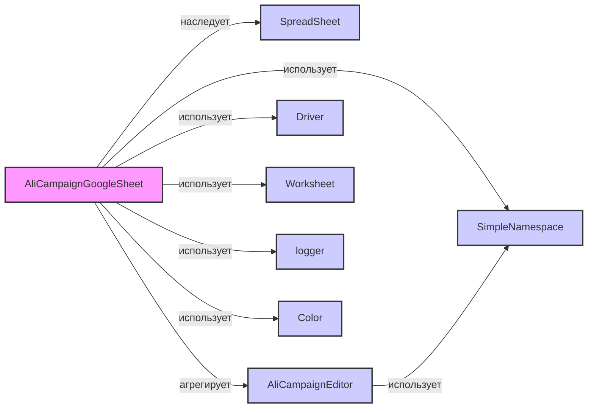

## Анализ кода `hypotez/src/suppliers/aliexpress/campaign/gsheets_check_this_code.py`

### 1. <алгоритм>
**Общий рабочий процесс:**

1.  **Инициализация:**
    *   Создается экземпляр класса `AliCampaignGoogleSheet`.
    *   При инициализации устанавливается ID Google-таблицы и создается экземпляр `AliCampaignEditor` для управления данными кампании.
    *   Происходит очистка Google-таблицы от старых данных (`clear()`): удаляются все листы, кроме "categories", "product", "category" и "campaign".
    *   Записываются основные данные кампании на лист "campaign" (`set_campaign_worksheet()`), а также данные о категориях на лист "categories" (`set_categories_worksheet()`).

2.  **Запись данных о продуктах:**
    *   Метод `set_products_worksheet()`  создает новый лист с именем категории, копируя лист "product", и записывает данные о продуктах для конкретной категории.

3.  **Чтение данных о категориях:**
    *   Метод `get_categories()` считывает данные с листа "categories" в формате списка словарей.

4.  **Запись данных о продуктах (альтернативный метод):**
    *   Метод `set_category_products()`  также создаёт новый лист для продуктов по аналогии с `set_products_worksheet()`, но принимает данные в виде словаря.

5.  **Форматирование листов:**
    *   Методы `_format_categories_worksheet()` и `_format_category_products_worksheet()` форматируют соответствующие листы, устанавливая ширину столбцов, высоту строк и стили заголовков.

**Блок-схема с примерами:**

```
graph LR
    A[Начало: Создание AliCampaignGoogleSheet] --> B{Инициализация};
    B --> C[Очистка Google Sheets: clear()];
    C --> D{Установка данных кампании: set_campaign_worksheet()};
    D --> E{Установка данных категорий: set_categories_worksheet()};
    E --> F{Запись данных о продуктах: set_products_worksheet()};
    F --> G{Альтернативная запись продуктов: set_category_products()};
    G --> H{Чтение данных о категориях: get_categories()};
    H --> I{Форматирование листа категорий: _format_categories_worksheet()};
    I --> J{Форматирование листа продуктов: _format_category_products_worksheet()};
    J --> K[Конец];
    
    subgraph "Примеры"
    
      style A fill:#f9f,stroke:#333,stroke-width:2px
      style B fill:#ccf,stroke:#333,stroke-width:2px
      style C fill:#ccf,stroke:#333,stroke-width:2px
      style D fill:#ccf,stroke:#333,stroke-width:2px
      style E fill:#ccf,stroke:#333,stroke-width:2px
      style F fill:#ccf,stroke:#333,stroke-width:2px
      style G fill:#ccf,stroke:#333,stroke-width:2px
      style H fill:#ccf,stroke:#333,stroke-width:2px
      style I fill:#ccf,stroke:#333,stroke-width:2px
      style J fill:#ccf,stroke:#333,stroke-width:2px
      
      
        B_eg[Создание объекта с campaign_name="test_campaign", language="ru", currency="USD"] --> B
        C_eg[Удаление всех листов, кроме "categories", "product", "category" и "campaign"] --> C
        D_eg[Запись имени кампании, заголовка, языка, валюты и описания в столбцы A и B листа "campaign"] --> D
        E_eg[Запись данных о категориях (имя, заголовок, описание, теги, кол-во продуктов) на лист "categories"] --> E
        F_eg[Создание листа для категории "electronics" и запись данных о продуктах, включая цену, описание, изображения и т.д.] --> F
        G_eg[Создание листа для категории "clothes" и запись данных о продуктах, включая цену, описание, изображения и т.д. (альтернативный метод)] --> G
        H_eg[Получение списка словарей с данными о категориях с листа "categories"] --> H
        I_eg[Установка ширины столбцов, высоты строк и стиля заголовков для листа "categories"] --> I
        J_eg[Установка ширины столбцов, высоты строк и стиля заголовков для листов с продуктами] --> J
    end
```

### 2. <mermaid>


**Объяснение зависимостей:**

*   `AliCampaignGoogleSheet` (A) **наследует** функциональность от `SpreadSheet` (B), который предоставляет базовые методы для работы с Google Sheets.
*   `AliCampaignGoogleSheet` (A) **агрегирует** (имеет внутри себя как атрибут) экземпляр `AliCampaignEditor` (C) для управления данными кампании AliExpress.
*   `AliCampaignGoogleSheet` (A) **использует** `Driver` (D) для управления браузером, что необходимо для открытия Google Sheets в браузере.
*   `AliCampaignGoogleSheet` (A) **использует** `Worksheet` (E) для взаимодействия с отдельными листами Google Sheets.
*   `AliCampaignGoogleSheet` (A) **использует** `logger` (F) для логирования событий и ошибок.
*   `AliCampaignGoogleSheet` (A) **использует** `SimpleNamespace` (G) для представления данных кампании, категорий и продуктов.
*   `AliCampaignGoogleSheet` (A) **использует** `Color` (H) для определения цветов при форматировании ячеек.
*    `AliCampaignEditor` (C) **использует** `SimpleNamespace` (G) для работы с данными кампании, категорий и продуктов.

### 3. <объяснение>

#### Импорты:
*   `time`: Используется для работы со временем.
*   `types.SimpleNamespace`:  Используется для создания объектов с атрибутами, доступными через точечную нотацию (похоже на словарь, но с доступом через атрибуты, например: `obj.attr`).
*   `src.webdriver.driver.Driver`, `Chrome`, `Firefox`, `Edge`:  Используются для управления браузерами (Chrome, Firefox, Edge).  `Driver` - это базовый класс для управления браузером, а `Chrome`, `Firefox`, и `Edge` - это конкретные реализации для каждого браузера. Эти импорты позволяют автоматизировать действия в браузере, например, открыть страницу Google Sheets.
*   `gspread.worksheet.Worksheet`: Используется для работы с отдельными листами Google Sheets.
*   `src.goog.spreadsheet.spreadsheet.SpreadSheet`:  Базовый класс для работы с Google Sheets API. Предоставляет методы для чтения, записи и управления Google Sheets.
*   `src.suppliers.aliexpress.campaign.ali_campaign_editor.AliCampaignEditor`: Класс, отвечающий за логику редактирования кампании AliExpress.
*   `src.utils.jjson.j_dumps`: Используется для преобразования Python объектов в JSON-строку.
*   `src.utils.printer.pprint`:  Используется для форматированного вывода данных.
*   `src.logger.logger.logger`:  Используется для логирования событий.
*   `src.ai.openai.translate`: Используется для перевода текста (не используется напрямую в данном коде, но присутствует в импортах).
*   `typing.Optional`, `List`, `Dict`: Используются для аннотации типов переменных.
*    `gspread_formatting`: Используется для форматирования ячеек в Google Sheets.
*   `src.goog.spreadsheet.spreadsheet.SpreadSheet`:  (Повторный импорт) Базовый класс для работы с Google Sheets API.
*    `src.utils.printer.pprint`:  (Повторный импорт) Используется для форматированного вывода данных.
*    `src.logger.logger.logger`:  (Повторный импорт) Используется для логирования событий.

**Взаимосвязи с `src.`:**

*   `src.webdriver`: Предоставляет функциональность для взаимодействия с браузером.
*    `src.goog.spreadsheet`: Предоставляет функциональность для работы с Google Sheets API.
*   `src.suppliers.aliexpress.campaign`: Содержит логику для работы с кампаниями AliExpress.
*   `src.utils`: Предоставляет различные утилиты, такие как `j_dumps`, `pprint` и др.
*   `src.logger`: Предоставляет функциональность для логирования.
*  `src.ai`: Предоставляет функциональность для ИИ (используется для перевода, но в этом коде не задействовано напрямую).

#### Классы:

*   **`AliCampaignGoogleSheet(SpreadSheet)`:**
    *   **Роль:** Класс для управления Google Sheets в контексте кампаний AliExpress. Наследуется от `SpreadSheet` и предоставляет дополнительные методы для управления листами, записи данных о категориях и продуктах, а также форматирования листов.
    *   **Атрибуты:**
        *   `spreadsheet_id`:  ID Google Sheets таблицы.
        *   `spreadsheet`:  Объект `SpreadSheet` для работы с таблицей.
        *   `worksheet`: Объект `Worksheet` для работы с листом таблицы.
        *   `driver`:  Объект `Driver` для управления браузером.
        *   `editor`:  Объект `AliCampaignEditor` для работы с данными кампании.
    *   **Методы:**
        *   `__init__(campaign_name, language, currency)`: Инициализирует объект, настраивает `AliCampaignEditor`, очищает листы и устанавливает основные данные кампании.
        *   `clear()`: Очищает листы от старых данных (удаляет листы продуктов).
        *   `delete_products_worksheets()`: Удаляет все листы, кроме "categories", "product", "category" и "campaign".
        *   `set_campaign_worksheet(campaign)`: Записывает данные кампании на лист "campaign".
        *   `set_products_worksheet(category_name)`:  Записывает данные о продуктах категории на соответствующий лист.
        *   `set_categories_worksheet(categories)`: Записывает данные о категориях на лист "categories".
        *  `get_categories()`: Получает данные о категориях из листа "categories" в формате списка словарей.
        *   `set_category_products(category_name, products)`: Альтернативный метод для записи данных о продуктах категории на лист.
        *   `_format_categories_worksheet(ws)`: Форматирует лист "categories".
        *   `_format_category_products_worksheet(ws)`: Форматирует лист с продуктами категории.

#### Функции:

*   В данном коде присутствуют только методы класса `AliCampaignGoogleSheet`. Они описаны выше в разделе "Классы".

#### Переменные:
*   `MODE`:  Глобальная переменная, определяющая режим работы (в данном коде имеет значение `dev`).
*   `excluded_titles`: Множество (set) с именами листов, которые не должны удаляться при очистке.
*   `updates`: Список словарей, который используется для пакетного обновления данных в Google Sheets.
*   `vertical_data`: Список кортежей, содержащий данные для вертикальной записи в Google Sheets.
*   `row_data`: Список списков, который используется для хранения данных для записи в Google Sheets.
*   `header_format`: Объект `cellFormat`, определяющий формат заголовка.
*   `ws`: Объект `Worksheet` (рабочий лист).

#### Потенциальные ошибки и области для улучшения:

1.  **Обработка ошибок**:
    *   В блоках `try...except` обрабатываются исключения, но в некоторых случаях, например, при удалении листов или при форматировании, исключения перебрасываются дальше (`raise`). Возможно, стоит добавить более детальную обработку исключений и, при необходимости, возвращать значения по умолчанию или корректно завершать работу.
2.  **Дублирование кода**:
    *   Код для записи продуктов (`set_products_worksheet` и `set_category_products`) почти идентичен, за исключением того, что один принимает данные в виде списка `SimpleNamespace`, а другой - в виде словаря.  Можно вынести этот общий код в отдельную функцию.
3.  **Жёстко заданные значения**:
    *   ID таблицы (`spreadsheet_id`)  задан жёстко в классе.  Можно передавать его через параметры инициализации, что сделает класс более гибким.
4.  **Отсутствие валидации**:
    *   Перед записью данных в Google Sheets не производится валидация данных.  Было бы полезно проверять типы и наличие необходимых атрибутов у объектов.
5.  **Неиспользуемый импорт**:
    *   `src.ai.openai.translate` импортируется, но нигде не используется. Следует либо удалить этот импорт, либо использовать его в коде.
6.   **Отсутствие констант**:
    *   Числовые значения для ширины и высоты столбцов и строк жёстко заданы в коде. Возможно, стоит вынести их в константы для улучшения читаемости и упрощения изменения в будущем.
7.  **Вывод данных**:
    *   Использование `__dict__` для преобразования объекта `SimpleNamespace` в словарь может быть не самым очевидным способом. Возможно, стоит использовать более явные методы для доступа к данным.

#### Цепочка взаимосвязей с другими частями проекта:

*   `AliCampaignGoogleSheet` использует `AliCampaignEditor` для управления данными кампании.  `AliCampaignEditor`, в свою очередь, может использовать другие части проекта, например, для получения данных с AliExpress API.
*   `AliCampaignGoogleSheet` использует `SpreadSheet` из `src.goog.spreadsheet` для взаимодействия с Google Sheets. `SpreadSheet` может использовать другие части проекта, например, для аутентификации в Google API.
*   `AliCampaignGoogleSheet` использует `Driver` из `src.webdriver` для управления браузером.  `Driver` может использовать другие части проекта для настройки браузера или управления прокси.
*   `AliCampaignGoogleSheet` использует `logger` из `src.logger` для логирования. `logger` может использовать другие части проекта, например, для отправки логов на сервер.
*   `AliCampaignGoogleSheet` импортирует `j_dumps` из `src.utils` - который используется для работы с JSON. В коде явно не используется, но может использоваться в других частях проекта.

**Заключение**:

Класс `AliCampaignGoogleSheet` предоставляет функциональность для автоматизированной работы с Google Sheets для редактирования кампаний AliExpress. Он использует другие компоненты проекта, такие как `AliCampaignEditor`, `SpreadSheet` и `Driver`, для выполнения своих задач. В коде есть места для улучшения, в частности, в обработке ошибок, дублировании кода, валидации данных и использовании констант.