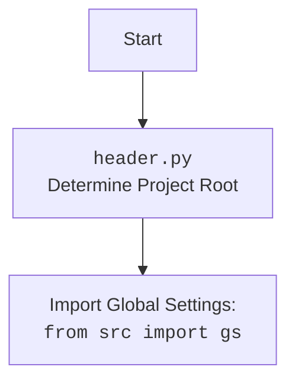

## АНАЛИЗ КОДА

### <алгоритм>
1.  **Инициализация `AliCampaignGoogleSheet`**:
    *   Создается экземпляр класса `AliCampaignGoogleSheet` с указанием имени кампании, языка и валюты.
    *   Инициализируется родительский класс `SpreadSheet` с ID таблицы.
    *   Создается экземпляр `AliCampaignEditor` для управления данными кампании.
    *   Вызывается метод `clear` для удаления старых листов продуктов.
    *   Вызываются методы `set_campaign_worksheet` и `set_categories_worksheet` для заполнения листов кампании и категорий.
    *   Открывается страница Google Sheets в браузере через `driver.get_url()`.
    *   _Пример:_
        ```python
        campaign_sheet = AliCampaignGoogleSheet(campaign_name="Summer Sale", language="en", currency="USD")
        ```
2.  **Очистка (`clear`)**:
    *   Вызывает метод `delete_products_worksheets` для удаления листов продуктов, кроме "categories", "product", "category" и "campaign".
    *   _Пример:_
        ```python
        campaign_sheet.clear()
        ```
3.  **Удаление листов продуктов (`delete_products_worksheets`)**:
    *   Получает список всех листов Google Sheets.
    *   Проходит по каждому листу.
    *   Удаляет лист, если его имя не находится в списке исключений `excluded_titles`.
    *   _Пример:_
        *   Предположим, есть листы "products_1", "products_2" и "categories".
        *   Листы "products_1" и "products_2" будут удалены, а "categories" останется.
4.  **Запись данных кампании (`set_campaign_worksheet`)**:
    *   Получает лист "campaign".
    *   Формирует список `updates` с данными о кампании (имя, заголовок, язык, валюта, описание) для записи в определенные ячейки.
    *   Выполняет пакетное обновление `batch_update` листа данными.
    *   _Пример:_
        *   Данные из `campaign` (SimpleNamespace) записываются в ячейки A1, A2, A3, A4, A5 и их соответствующие значения в столбец B.
5. **Запись данных о продуктах (`set_products_worksheet`)**:
    *   Копирует шаблон листа "product" и переименовывает его в название категории `category_name`.
    *   Получает список продуктов из `self.editor.campaign.category[category_name].products`.
    *   Преобразует данные продуктов в список строк.
    *   Записывает каждую строку на лист Google Sheets, начиная со второй строки.
    *   Форматирует лист продуктов с помощью `_format_category_products_worksheet`
    *  _Пример_:
        *   Для категории "shoes" создает лист с именем "shoes" и заполняет его данными из `self.editor.campaign.category.shoes.products`
6.  **Запись данных категорий (`set_categories_worksheet`)**:
    *   Получает лист "categories".
    *   Очищает лист.
    *   Извлекает данные категорий из `categories.__dict__`.
    *   Проверяет, есть ли все необходимые атрибуты у каждой категории.
    *   Записывает заголовки в первую строку листа.
    *   Записывает данные каждой категории в новую строку листа, используя атрибуты: `name`, `title`, `description`, `tags`, `products_count`.
    *   Форматирует лист категорий с помощью `_format_categories_worksheet`.
    *   _Пример_:
        *   Берет данные из `self.editor.campaign.category` и записывает их на лист "categories".
7.  **Получение данных категорий (`get_categories`)**:
    *   Получает лист "categories".
    *   Читает все записи листа в виде списка словарей.
    *   _Пример_:
        *   Возвращает список словарей, где каждый словарь представляет данные строки листа "categories".
8.  **Установка продуктов категории (`set_category_products`)**:
    *   Копирует шаблон листа "product" и переименовывает его в название категории `category_name`.
    *   Получает список продуктов из `products`.
    *   Записывает заголовки в первую строку листа.
    *   Преобразует данные продуктов в список строк.
    *   Записывает каждую строку на лист Google Sheets, начиная со второй строки.
    *   Форматирует лист продуктов с помощью `_format_category_products_worksheet`.
     *   _Пример_:
        *   Для категории "shoes" создает лист с именем "shoes" и заполняет его данными из переданного списка `products`.
9.  **Форматирование листа категорий (`_format_categories_worksheet`)**:
    *   Устанавливает ширину столбцов A-E.
    *   Устанавливает высоту первой строки (заголовки).
    *   Форматирует заголовки (жирный шрифт, размер 12, центрирование, серый фон).
10. **Форматирование листа продуктов категории (`_format_category_products_worksheet`)**:
    *   Устанавливает ширину столбцов A-Y.
    *   Устанавливает высоту первой строки (заголовки).
     *   Форматирует заголовки (жирный шрифт, размер 12, центрирование, серый фон).

### <mermaid>
```mermaid
flowchart TD
    Start[Начало] --> Initialize[Инициализация AliCampaignGoogleSheet]
    Initialize --> Clear[Очистка (clear)]
    Clear --> DeleteWorksheets[Удаление листов продуктов (delete_products_worksheets)]
    DeleteWorksheets --> SetCampaignWorksheet[Запись данных кампании (set_campaign_worksheet)]
    SetCampaignWorksheet --> SetCategoriesWorksheet[Запись данных категорий (set_categories_worksheet)]
    SetCategoriesWorksheet --> OpenGoogleSheets[Открытие Google Sheets (driver.get_url)]
    OpenGoogleSheets --> SetProductsWorksheet{Запись данных о продуктах (set_products_worksheet)?}
    SetProductsWorksheet -- Yes --> CopyWorksheet[Копирование листа]
    CopyWorksheet --> GetProducts[Получение списка продуктов]
    GetProducts --> TransformProductData[Преобразование данных продуктов]
    TransformProductData --> UpdateProductsSheet[Обновление листа Google Sheets с продуктами]
    UpdateProductsSheet --> FormatProductSheet[Форматирование листа продуктов (_format_category_products_worksheet)]
    FormatProductSheet --> SetProductsWorksheetEnd[Конец set_products_worksheet]
    SetProductsWorksheet -- No --> SetProductsWorksheetEnd
     SetProductsWorksheetEnd-->GetCategories{Получение данных категорий (get_categories)?}
    GetCategories -- Yes --> GetCategoriesFromSheet[Получение данных из Google Sheets]
    GetCategoriesFromSheet --> GetCategoriesEnd[Конец get_categories]
    GetCategories -- No -->GetCategoriesEnd
    GetCategoriesEnd --> SetCategoryProducts{Установка продуктов категорий (set_category_products)?}
    SetCategoryProducts -- Yes --> CopyWorksheetCategory[Копирование листа продукта]
    CopyWorksheetCategory --> TransformProductsData[Преобразование данных продуктов]
    TransformProductsData --> UpdateProductsCategorySheet[Обновление листа Google Sheets с продуктами категории]
    UpdateProductsCategorySheet --> FormatProductCategorySheet[Форматирование листа продуктов (_format_category_products_worksheet)]
    FormatProductCategorySheet --> SetCategoryProductsEnd[Конец set_category_products]
    SetCategoryProducts -- No -->SetCategoryProductsEnd
    SetCategoryProductsEnd --> FormatCategoriesWorksheet[Форматирование листа категорий (_format_categories_worksheet)]
    FormatCategoriesWorksheet --> End[Конец]

    classDef green fill:#90EE90,stroke:#333,stroke-width:2px
    class Start,End,SetProductsWorksheetEnd,GetCategoriesEnd,SetCategoryProductsEnd green
```
**Импорты для диаграммы:**

Диаграмма в формате `mermaid` не использует импорты напрямую, но она отражает логику выполнения программы, в которой используются следующие импорты:

*   `time`: Используется для временных задержек или ожидания. В данной программе не используется напрямую, но может быть в вызываемых функциях (например в драйвере).
*   `types.SimpleNamespace`: Используется для представления данных в виде объектов с атрибутами (например, для данных кампании, категорий и продуктов).
*   `src.webdriver.driver.Driver`, `src.webdriver.driver.Chrome`, `src.webdriver.driver.Firefox`, `src.webdriver.driver.Edge`: Используются для управления браузером, но в коде используется только `Chrome` для открытия Google Sheets.
*   `gspread.worksheet.Worksheet`: Используется для работы с листами Google Sheets.
*   `src.goog.spreadsheet.spreadsheet.SpreadSheet`: Используется как базовый класс для работы с Google Sheets.
*  `src.suppliers.aliexpress.campaign.ali_campaign_editor.AliCampaignEditor`: Используется для редактирования кампаний AliExpress.
*   `src.utils.jjson.j_dumps`: Не используется в предоставленном коде.
*   `src.utils.printer.pprint`: Используется для печати в консоль, в данном коде используется `logger`
*   `src.logger.logger.logger`: Используется для логирования событий.
*   `src.ai.openai.translate`: Используется для перевода текста, в данном коде не используется.
*   `typing.Optional`, `typing.List`, `typing.Dict`: Используются для аннотации типов переменных, не влияют на логику диаграммы.
*   `gspread_formatting`: Используется для форматирования ячеек, колонок и строк в Google Sheets.
*   `src.utils.printer.pprint`: Используется для печати в консоль, в данном коде используется `logger`.



### <объяснение>

**Импорты:**

*   `time`: Модуль для работы со временем. В данном коде явно не используется, но может быть использован в других частях проекта.
*   `types.SimpleNamespace`: Удобный класс для создания объектов с динамическими атрибутами. Используется для хранения данных кампании, категорий и товаров.
*   `src.webdriver.driver.Driver`, `src.webdriver.driver.Chrome`, `src.webdriver.driver.Firefox`, `src.webdriver.driver.Edge`:
    *   `Driver` - базовый класс для управления браузерами.
    *   `Chrome`, `Firefox`, `Edge` - классы для управления конкретными браузерами.
    *   В данном коде используется только `Chrome` для автоматического открытия Google Sheets.
*   `gspread.worksheet.Worksheet`: Класс для работы с листами Google Sheets. Предоставляет методы для чтения, записи и изменения данных.
*   `src.goog.spreadsheet.spreadsheet.SpreadSheet`:
    *   Базовый класс для работы с Google Sheets.
    *   Инкапсулирует логику подключения к Google Sheets и работы с таблицами.
    *   `AliCampaignGoogleSheet` наследуется от этого класса.
*   `src.suppliers.aliexpress.campaign.ali_campaign_editor.AliCampaignEditor`: Класс для управления данными кампании AliExpress (получение, изменение).
*   `src.utils.jjson.j_dumps`: Не используется в данном файле, скорее всего, для сериализации JSON, используется в других частях проекта.
*   `src.utils.printer.pprint`: Используется для красивого вывода информации в консоль. В коде используются логи `logger`
*   `src.logger.logger.logger`: Используется для логирования событий.
*   `src.ai.openai.translate`: Используется для перевода текста. В коде не используется, но может использоваться в других модулях.
*   `typing.Optional`, `typing.List`, `typing.Dict`: Используются для аннотации типов переменных и функций, улучшая читаемость и помогая отлавливать ошибки.
*   `gspread_formatting`:  Используется для форматирования листов Google Sheets: задание ширины столбцов, высоты строк, выравнивания и т.д.

**Классы:**

*   **`AliCampaignGoogleSheet(SpreadSheet)`**:
    *   **Роль**: Класс для управления Google Sheets, связанными с рекламными кампаниями AliExpress. Наследуется от `SpreadSheet`, что позволяет ему использовать базовые методы для работы с Google Sheets.
    *   **Атрибуты**:
        *   `spreadsheet_id`: ID Google Sheets документа.
        *   `spreadsheet`: Экземпляр класса `SpreadSheet` для работы с таблицей.
        *   `worksheet`: Экземпляр класса `Worksheet` для работы с конкретным листом.
        *   `driver`: Экземпляр `Driver` для управления браузером.
        *   `editor`: Экземпляр `AliCampaignEditor` для управления данными кампании.
    *   **Методы**:
        *   `__init__(self, campaign_name: str, language: str, currency: str)`: Конструктор класса. Инициализирует объект, создает экземпляры других классов, очищает таблицу, задает листы.
        *   `clear(self)`: Очищает листы продуктов.
        *   `delete_products_worksheets(self)`: Удаляет все листы, кроме `'categories'`, `'product'`, `'category'` и `'campaign'`.
        *   `set_campaign_worksheet(self, campaign: SimpleNamespace)`: Записывает данные кампании на лист `'campaign'`.
        *  `set_products_worksheet(self, category_name: str)`: Записывает данные о продуктах на лист с именем категории.
        *   `set_categories_worksheet(self, categories: SimpleNamespace)`: Записывает данные категорий на лист `'categories'`.
        *   `get_categories(self)`: Получает данные категорий из Google Sheets в виде списка словарей.
        *   `set_category_products(self, category_name: str, products: dict)`: Записывает данные о продуктах в новый лист, созданный для каждой категории.
        *   `_format_categories_worksheet(self, ws: Worksheet)`: Форматирует лист категорий.
        *   `_format_category_products_worksheet(self, ws: Worksheet)`: Форматирует лист продуктов категории.

**Функции:**

*   `__init__`:
    *   **Аргументы**: `campaign_name`, `language`, `currency`.
    *   **Назначение**: Инициализирует класс, создает экземпляры других классов, вызывает методы для очистки и заполнения Google Sheets.
*   `clear`:
    *   **Аргументы**: Нет.
    *   **Назначение**: Вызывает метод для удаления листов продуктов.
*   `delete_products_worksheets`:
    *   **Аргументы**: Нет.
    *   **Назначение**: Удаляет все листы, кроме `'categories'`, `'product'`, `'category'` и `'campaign'`.
*   `set_campaign_worksheet`:
    *   **Аргументы**: `campaign: SimpleNamespace`.
    *   **Назначение**: Записывает данные о кампании на лист `'campaign'`.
*   `set_products_worksheet`:
    *   **Аргументы**: `category_name: str`.
    *   **Назначение**: Записывает данные о продуктах на лист с именем категории.
*   `set_categories_worksheet`:
    *   **Аргументы**: `categories: SimpleNamespace`.
    *   **Назначение**: Записывает данные о категориях на лист `'categories'`.
*  `get_categories`:
    *   **Аргументы**: Нет.
    *   **Назначение**: Получает данные из листа `categories`.
*  `set_category_products`:
    *   **Аргументы**: `category_name: str`, `products: dict`.
    *   **Назначение**: Записывает данные о продуктах в новый лист.
*  `_format_categories_worksheet`:
    *   **Аргументы**: `ws: Worksheet`.
    *   **Назначение**: Форматирует лист с категориями: устанавливает ширину столбцов и форматирование заголовков.
*   `_format_category_products_worksheet`:
    *   **Аргументы**: `ws: Worksheet`.
    *   **Назначение**: Форматирует лист с продуктами категории: устанавливает ширину столбцов и форматирование заголовков.

**Переменные:**

*   `spreadsheet_id`: Строка, ID Google Sheets.
*  `spreadsheet`: Экземпляр класса `SpreadSheet`.
*  `worksheet`: Экземпляр класса `Worksheet`.
*   `driver`: Экземпляр класса `Driver`.
*   `editor`: Экземпляр класса `AliCampaignEditor`.
*   `campaign_name`: Строка, название кампании.
*   `language`: Строка, язык кампании.
*   `currency`: Строка, валюта кампании.
*   `campaign`: Экземпляр `SimpleNamespace` для хранения данных кампании.
*   `categories`: Экземпляр `SimpleNamespace` для хранения данных категорий.
*   `products`: Список объектов `SimpleNamespace` для хранения данных о товарах.

**Цепочка взаимосвязей:**
1.  **`AliCampaignGoogleSheet`** использует **`SpreadSheet`** для взаимодействия с Google Sheets.
2.  **`AliCampaignGoogleSheet`** использует **`AliCampaignEditor`** для получения данных о кампании, категориях и продуктах.
3.  **`AliCampaignGoogleSheet`** использует **`Driver`** для открытия Google Sheets в браузере.
4.  Все три класса используют **`logger`** для записи логов.
5. Данные (кампания, категории, товары)  представлены в виде **`SimpleNamespace`**, что позволяет легко добавлять и получать значения.
6.  **`gspread_formatting`** используется для форматирования листов Google Sheets.

**Потенциальные ошибки и области для улучшения:**

*   **Обработка исключений:** В коде есть общие блоки `try...except Exception as ex:` которые могут затруднить отладку. Нужно ловить более конкретные исключения.
*  **Жестко заданные форматы ячеек**: Размеры колонок, форматы и т.д. задаются константами, возможно, имеет смысл сделать их настраиваемыми.
*  **Множественное обращение к Google Sheets**: Некоторые операции с Google Sheets могут выполняться медленно, стоит минимизировать количество обращений.
*  **Отсутствует проверка на успешность операций**: Не всегда проверяется, что запись данных прошла успешно.
*   **Дублирование логики**: В функциях `set_products_worksheet` и `set_category_products` логика записи продуктов дублируется.
*  **Отсутствует обработка ошибок при получении данных**: Если данные для записи отсутствуют или имеют неверный формат, код может упасть.
*   **Ограничения на количество столбцов**: В функциях форматирования прописано форматирование до столбца `Y`, в случае добавления новых столбцов нужно будет расширить форматирование.

**Дополнительные замечания:**

*   Код хорошо структурирован с разделением на классы и методы.
*   Активно используется логирование, что упрощает отладку.
*   Используется `SimpleNamespace` для представления данных, что удобно и гибко.

Этот анализ обеспечивает всестороннее понимание кода и его функционирования.