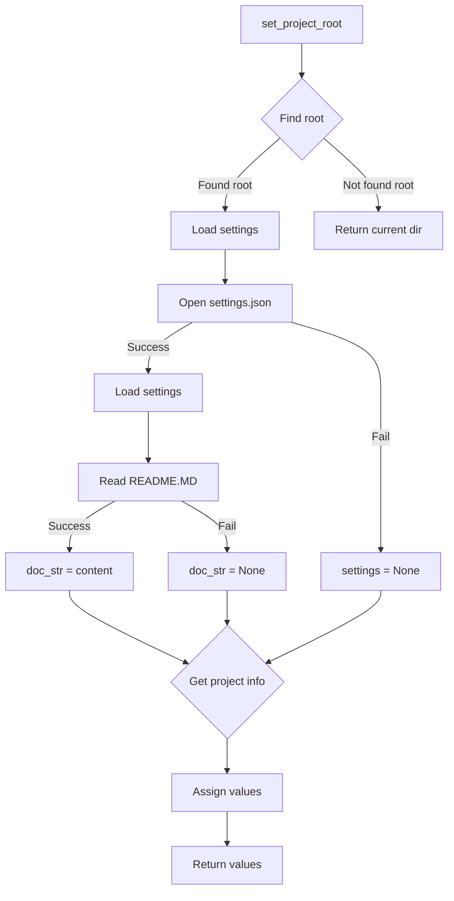

# <input code>

```python
## \file hypotez/src/suppliers/aliexpress/campaign/header.py
# -*- coding: utf-8 -*-\
#! venv/Scripts/python.exe
#! venv/bin/python/python3.12

"""
.. module: src.suppliers.aliexpress.campaign 
	:platform: Windows, Unix
	:synopsis:

"""
MODE = 'dev'


from pathlib import Path
def set_project_root(marker_files=('pyproject.toml', 'requirements.txt', '.git')) -> Path:
    """!
    Finds the root directory of the project starting from the current file's directory,
    searching upwards and stopping at the first directory containing any of the marker files.

    Args:
        marker_files (tuple): Filenames or directory names to identify the project root.
    
    Returns:
        Path: Path to the root directory if found, otherwise the directory where the script is located.
    """
    __root__:Path
    current_path:Path = Path(__file__).resolve().parent
    __root__ = current_path
    for parent in [current_path] + list(current_path.parents):
        if any((parent / marker).exists() for marker in marker_files):
            __root__ = parent
            break
    if __root__ not in sys.path:
        sys.path.insert(0, str(__root__))
    return __root__


# Get the root directory of the project
__root__ = set_project_root()
"""__root__ (Path): Path to the root directory of the project"""

from src import gs

settings:dict = None
try:
    with open(gs.path.root / 'src' /  'settings.json', 'r') as settings_file:
        settings = json.load(settings_file)
except (FileNotFoundError, json.JSONDecodeError):
    ...

doc_str:str = None
try:
    with open(gs.path.root / 'src' /  'README.MD', 'r') as settings_file:
        doc_str = settings_file.read()
except (FileNotFoundError, json.JSONDecodeError):
    ...


__project_name__ = settings.get("project_name", 'hypotez') if settings  else 'hypotez'
__version__: str = settings.get("version", '')  if settings  else ''
__doc__: str = doc_str if doc_str else ''
__details__: str = ''
__author__: str = settings.get("author", '')  if settings  else ''
__copyright__: str = settings.get("copyrihgnt", '')  if settings  else ''
__cofee__: str = settings.get("cofee", "Treat the developer to a cup of coffee for boosting enthusiasm in development: https://boosty.to/hypo69")  if settings  else "Treat the developer to a cup of coffee for boosting enthusiasm in development: https://boosty.to/hypo69"
```

# <algorithm>

**Шаг 1:**  Определение корневой директории проекта (`set_project_root`).
    * Вход: кортеж `marker_files` с именами файлов/папок.
    * Алгоритм: Итерация по родительским директориям текущего файла, проверка существования файлов из `marker_files`.
    * Выход: `Path` до корневой директории проекта или директории текущего файла. 
    * Пример: `marker_files = ('pyproject.toml', 'requirements.txt')`. Если `pyproject.toml` находится в родительской папке, функция вернет путь к ней.

**Шаг 2:**  Загрузка настроек проекта.
    * Вход: корневая директория проекта (`__root__`).
    * Алгоритм: Попытка открыть файл `settings.json` в корне проекта.
    * Обработка ошибок: Если файл не найден или некорректно отформатирован, то `settings` остается `None`, без исключения.
    * Выход: `dict` с настройками проекта или `None`, если файл не найден/некорректен.
    * Пример: Файл `settings.json` содержит данные о имени проекта, версии, авторе.

**Шаг 3:**  Чтение документации проекта.
    * Вход: корневая директория проекта (`__root__`).
    * Алгоритм: Попытка открыть файл `README.MD` в корне проекта.
    * Обработка ошибок: Если файл не найден или некорректно отформатирован, то `doc_str` остается `None`, без исключения.
    * Выход: `str` с содержимым файла `README.MD` или `None`, если файл не найден/некорректно отформатирован.
    * Пример: Файл `README.MD` содержит описание проекта.


**Шаг 4:**  Получение настроек проекта из загруженных данных.
    * Вход: словарь настроек (`settings`).
    * Алгоритм: извлечение значений из настроек проекта (имена проекта, версии, автор, ссылка на пожертвования).
    * Обработка ошибок: Возврат значения по умолчанию, если ключ не найден.
    * Выход: значения проекта (имя, версия, автор, ...).
    * Пример: Если в `settings` есть ключ "project_name" со значением "MyProject", то `__project_name__` будет "MyProject".


# <mermaid>



**Описание зависимостей:**

* `pathlib`: Для работы с путями к файлам.
* `json`: Для работы с файлами JSON.
* `sys`: для изменения пути поиска модулей.
* `gs`:  Модуль из проекта, вероятно, содержит константы и пути, относящиеся к настройкам проекта. 


# <explanation>

* **Импорты**:
    * `pathlib`:  Обеспечивает удобный и платформенно-независимый способ работы с файловыми путями.
    * `json`: Используется для парсинга файла настроек (`settings.json`).
    * `sys`: Используется для добавления корневого каталога проекта в пути поиска модулей.
    * `gs`: Из внутреннего проекта (`src`). Вероятно, содержит утилиты для работы с файлами, каталогами, настройками проекта (`gs.path.root`).

* **Классы**: Нет классов, только функции.


* **Функции**:
    * `set_project_root`: Находит корневую директорию проекта, начиная от текущей директории и идя вверх по дереву директорий. Возвращает путь к корневому каталогу.


* **Переменные**:
    * `MODE`: Строковая переменная, вероятно, для определения режима работы (например, 'dev' или 'prod').
    * `__root__`: Путь к корню проекта, полученный от `set_project_root`.
    * `settings`: Словарь с настройками проекта, загруженными из файла `settings.json`.
    * `doc_str`: Содержимое файла `README.MD`.
    * `__project_name__`, `__version__`, `__doc__`, `__details__`, `__author__`, `__copyright__`, `__cofee__`:  Переменные, содержащие данные из файла `settings.json` или значения по умолчанию, если данные не найдены.


* **Возможные ошибки и улучшения**:
    * Обработка ошибок при чтении и парсинге `settings.json` и `README.MD` более детальна,  с использованием блоков `try...except`.
    * Можно улучшить  `set_project_root` - добавление проверки, что директория содержит необходимые файлы.
    * Рекомендуется использовать `try-except` в каждой попытке открыть файл, чтобы предотвратить неожиданные завершения работы программы.
    * Добавьте  `import json` и `import sys` в начале файла.

**Взаимосвязи с другими частями проекта**:
    * `gs.path.root`: Предполагает, что `gs` содержит модуль для работы с путями и настройками проекта, а значит, есть зависимость от модуля `gs` и его подмодуля `path`.