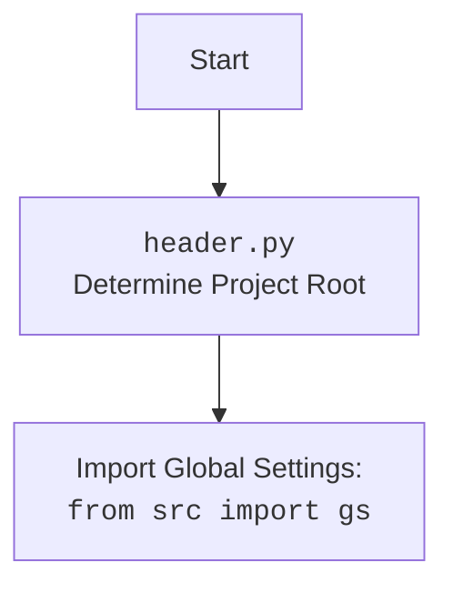

## Анализ кода `hypotez/src/suppliers/aliexpress/campaign/header.py`

### 1. <алгоритм>

**1. `set_project_root(marker_files)`:**
   - **Начало:** Функция принимает `marker_files` (кортеж имен файлов/директорий) в качестве аргумента. По умолчанию это `('__root__', '.git')`.
   - **Инициализация:** Определяет текущий путь к файлу `__file__` и его родительскую директорию, сохраняя их в переменных `current_path` и `__root__`.
   - **Цикл поиска:** 
     - Перебирает текущую директорию и ее родительские директории.
     - Для каждой директории проверяет, существует ли любой из `marker_files` в текущей директории (`parent / marker`).
       - **Пример:** Если текущая директория `/home/user/project/src/suppliers/aliexpress/campaign` и `marker_files` равны `('__root__', '.git')`, то проверяется наличие файлов/директорий `/home/user/project/src/suppliers/aliexpress/campaign/__root__` и `/home/user/project/src/suppliers/aliexpress/campaign/.git`, затем `/home/user/project/src/suppliers/aliexpress` и т.д.
     - Если любой маркер найден, директория сохраняется в переменную `__root__` и цикл прерывается.
   - **Добавление в sys.path:** Проверяет, если  `__root__` нет в списке путей поиска Python, то добавляет его в начало.
   - **Возврат:** Возвращает найденный путь (`__root__`) или путь к директории текущего файла, если маркеры не были найдены.

**2. Глобальное присваивание `__root__`:**
   - Вызывает `set_project_root()` и сохраняет результат (путь к корневой директории проекта) в глобальной переменной `__root__`.

**3. Импорт `src.gs`:**
   - Импортирует модуль `gs` из пакета `src`.

**4. Загрузка настроек из `settings.json`:**
   - Инициализирует переменную `settings` как `None`.
   - Пытается открыть файл `settings.json`, расположенный в `src/settings.json` относительно корневой директории проекта.
   - Если файл найден, загружает JSON данные в `settings`.
   - Если возникает `FileNotFoundError` или `json.JSONDecodeError`, то  пропускается.

**5. Загрузка документации из `README.MD`:**
   - Инициализирует переменную `doc_str` как `None`.
   - Пытается открыть файл `README.MD`, расположенный в `src/README.MD` относительно корневой директории проекта.
   - Если файл найден, читает его содержимое в `doc_str`.
   - Если возникает `FileNotFoundError` или `json.JSONDecodeError`, то  пропускается.

**6. Инициализация глобальных переменных:**
   - Инициализирует глобальные переменные:
      - `__project_name__`: Получает значение из `settings.project_name` (если есть), иначе устанавливает значение `hypotez`.
      - `__version__`: Получает значение из `settings.version` (если есть), иначе устанавливает пустую строку.
      - `__doc__`: Устанавливает значение `doc_str` (если есть), иначе устанавливает пустую строку.
      - `__details__`: Инициализирует пустой строкой.
      - `__author__`: Получает значение из `settings.author` (если есть), иначе устанавливает пустую строку.
      - `__copyright__`: Получает значение из `settings.copyrihgnt` (если есть), иначе устанавливает пустую строку.
      - `__cofee__`: Получает значение из `settings.cofee` (если есть), иначе устанавливает значение по умолчанию: "Treat the developer to a cup of coffee for boosting enthusiasm in development: https://boosty.to/hypo69".

### 2. <mermaid>

```mermaid
flowchart TD
    Start[Start] --> FindRoot[<code>set_project_root()</code><br> Determine Project Root];
    FindRoot --> CheckMarkers[Check for marker files];
    CheckMarkers -- Marker Found --> SetRoot[Set project root];
    CheckMarkers -- Marker Not Found --> UseCurrentDir[Use current directory];
    SetRoot --> AddToPath[Add root to <code>sys.path</code>];
    UseCurrentDir --> AddToPath;
    AddToPath --> ImportGS[Import Global Settings: <br><code>from src import gs</code>];
    ImportGS --> LoadSettings[Load settings from <code>settings.json</code>];
    LoadSettings --> LoadDoc[Load documentation from <code>README.MD</code>];
    LoadDoc --> SetGlobals[Set Global Variables];
    SetGlobals --> End[End];

    style Start fill:#f9f,stroke:#333,stroke-width:2px
    style End fill:#ccf,stroke:#333,stroke-width:2px

```

**Объяснение диаграммы `mermaid`:**

1.  **`Start`**: Начало выполнения скрипта.
2.  **`set_project_root()`**: Функция `set_project_root` вызывается для определения корневой директории проекта.
3.  **`Check for marker files`**: Поиск маркерных файлов (`__root__` или `.git`).
4.  **`Set project root`**: Если маркерные файлы найдены, устанавливается найденный путь в качестве корневого.
5.  **`Use current directory`**: Если маркерные файлы не найдены, используется текущая директория.
6.  **`Add root to sys.path`**: Найденный (или текущий) путь добавляется в `sys.path`, чтобы импорты работали корректно.
7.   **`Import Global Settings: from src import gs`**:  Импортируется модуль `gs` из пакета `src`, предоставляющий глобальные настройки.
8.  **`Load settings from settings.json`**: Пытается загрузить настройки из файла `settings.json`.
9.  **`Load documentation from README.MD`**: Пытается загрузить документацию из файла `README.MD`.
10. **`Set Global Variables`**: Устанавливает глобальные переменные, используя данные из загруженных настроек и документации (или значения по умолчанию).
11. **`End`**: Конец выполнения скрипта.



**Объяснение дополнительной диаграммы `mermaid`:**

1.  **`Start`**: Начало процесса.
2.  **`header.py`**: Выполнение кода из `header.py`.  Основная функция этого модуля - определить корневой каталог проекта.
3.  **`Import Global Settings: from src import gs`**:  Импортируется модуль `gs` из пакета `src`.

### 3. <объяснение>

**Импорты:**

-   `pathlib.Path`: Используется для работы с файловыми путями в кроссплатформенном режиме. Позволяет создавать, проверять и манипулировать путями к файлам и директориям.
-   `sys`: Обеспечивает доступ к некоторым переменным и функциям, используемым интерпретатором. В данном случае используется для модификации `sys.path` (добавление пути к корневой директории проекта).
-   `json`: Модуль для работы с JSON данными. Используется для загрузки настроек из `settings.json`.
-   `src.gs`: Импортируется модуль глобальных настроек проекта. Это означает, что модуль `header.py` зависит от модуля `gs` и использует его для доступа к глобальным настройкам (например, путь к корневой директории `gs.path.root`).

**Функции:**

-   `set_project_root(marker_files)`:
    -   **Аргументы:**
        -   `marker_files`: кортеж строк, представляющих имена файлов или директорий для поиска. По умолчанию `('__root__', '.git')`.
    -   **Возвращаемое значение:** `pathlib.Path` объект, представляющий путь к корневой директории проекта.
    -   **Назначение:** Определяет корневую директорию проекта, начиная поиск от текущей директории файла и двигаясь вверх, пока не найдется маркерный файл.
    -   **Пример:** Если скрипт находится в `/home/user/project/src/suppliers/aliexpress/campaign` и маркерный файл `.git` находится в `/home/user/project`, то функция вернет `Path('/home/user/project')`.

**Переменные:**

-   `__root__`: Глобальная переменная типа `pathlib.Path`, хранящая путь к корневой директории проекта.
-   `settings`: Глобальная переменная типа `dict`, хранящая загруженные настройки из файла `settings.json`. Может быть `None`, если файл не найден или при ошибке декодирования JSON.
-   `doc_str`: Глобальная переменная типа `str`, хранящая содержимое файла `README.MD`. Может быть `None`, если файл не найден или при ошибке чтения файла.
-   `__project_name__`: Глобальная переменная типа `str`, хранящая имя проекта, значение по умолчанию `hypotez`.
-   `__version__`: Глобальная переменная типа `str`, хранящая версию проекта.
-   `__doc__`: Глобальная переменная типа `str`, хранящая документацию проекта.
-   `__details__`: Глобальная переменная типа `str`, хранящая подробности о проекте. Изначально пустая строка.
-   `__author__`: Глобальная переменная типа `str`, хранящая имя автора проекта.
-   `__copyright__`: Глобальная переменная типа `str`, хранящая информацию об авторских правах.
-   `__cofee__`: Глобальная переменная типа `str`, хранящая сообщение для поддержки разработчика.

**Цепочка взаимосвязей:**

1.  `header.py` определяет корневую директорию проекта и добавляет ее в `sys.path`.
2.  Затем импортирует `src.gs`, что позволяет получить доступ к глобальным настройкам.
3.  Использует `gs.path.root`, чтобы загрузить настройки из файла `settings.json`.
4.  Использует `gs.path.root` чтобы загрузить документацию из файла `README.MD`.
5.  Извлекает необходимые данные (имя проекта, версию, автора, копирайт, сообщение о поддержке разработчика) из файла `settings.json`, сохраняя их в глобальные переменные.

**Потенциальные ошибки и области для улучшения:**

-   **Обработка ошибок:** В блоках `try-except` используется пустой `...` для обработки ошибок. Желательно добавить логирование ошибок или более информативное сообщение для пользователя в случае, если не удается загрузить настройки или документацию.
-   **Жестко заданные пути:** Использование `/` для соединения путей может вызвать проблемы на Windows. Лучше использовать `Path` для соединения путей, например, `gs.path.root / 'src' / 'settings.json'` или `Path(gs.path.root, 'src', 'settings.json')`.
-   **Поиск маркерных файлов:** Можно добавить возможность задания пользовательских маркерных файлов через переменные окружения.
-   **Отсутствие валидации данных:** Загруженные данные из `settings.json` не валидируются. Это может привести к ошибкам, если в файле некорректные данные.

**Заключение:**

Модуль `header.py` выполняет важную роль в проекте, определяя корневой каталог и загружая общие настройки, которые используются для настройки проекта. Хотя код в целом работоспособный, он имеет некоторые области для улучшения, которые сделают его более надежным и удобным для сопровождения.