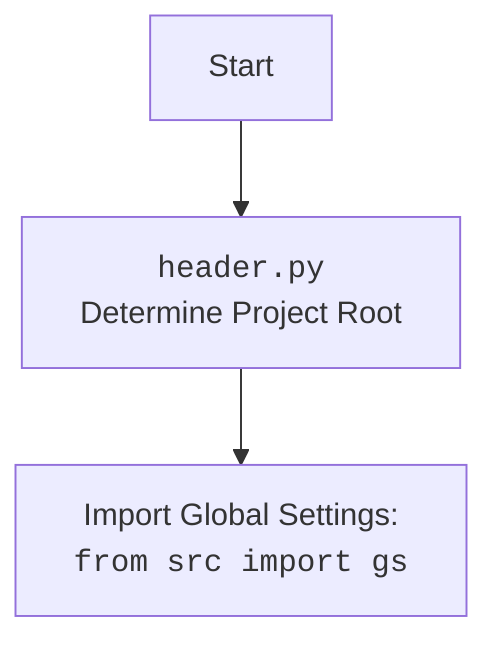

## АНАЛИЗ КОДА

### <алгоритм>

**1. Функция `set_project_root(marker_files: tuple) -> Path`:**

   1.  **Инициализация:**
       *   `current_path`: Определяет абсолютный путь к каталогу, в котором находится текущий файл (`header.py`).
       *   `__root__`: Инициализируется значением `current_path`.
   2.  **Поиск корневого каталога:**
       *   Перебирает текущий путь и все его родительские каталоги.
       *   Для каждого родительского каталога проверяет наличие в нем любого из файлов или каталогов, указанных в `marker_files`.
       *   Если один из `marker_files` найден, текущий родительский каталог назначается в качестве `__root__`, и цикл прерывается.
   3.  **Добавление в `sys.path`:**
       *   Если вычисленный `__root__` не содержится в `sys.path`, он добавляется в начало списка. Это гарантирует, что модули в корневом каталоге проекта доступны для импорта.
   4.  **Возврат:** Функция возвращает `Path` объекта, представляющего корневой каталог проекта.

   **Пример:**

   ```
   # Предположим, что header.py находится в src/suppliers/aliexpress/campaign

   # 1. Инициализация:
   current_path = /path/to/project/src/suppliers/aliexpress/campaign
   __root__ = /path/to/project/src/suppliers/aliexpress/campaign

   # 2. Поиск родительских каталогов:
    #1 итерация
        parent = /path/to/project/src/suppliers/aliexpress/campaign
        parent / '__root__' не существует
        parent / '.git' не существует
    #2 итерация
        parent = /path/to/project/src/suppliers/aliexpress
        parent / '__root__' не существует
        parent / '.git' не существует
     #3 итерация
        parent = /path/to/project/src/suppliers
        parent / '__root__' не существует
        parent / '.git' не существует
     #4 итерация
        parent = /path/to/project/src
        parent / '__root__' не существует
        parent / '.git' не существует
      #5 итерация
        parent = /path/to/project
        parent / '__root__'  существует
   
        __root__ = /path/to/project
        BREAK

   # 3. Добавление в sys.path (если необходимо)

   # 4. Возврат:
   return /path/to/project
   ```

**2. Основная часть:**

   1.  **Вызов `set_project_root()`**:
       *   Функция `set_project_root()` вызывается без аргументов.
       *   Результат сохраняется в глобальной переменной `__root__`.
   2.  **Импорт глобальных настроек:**
       *   Импортируется модуль `gs` из пакета `src`.
   3.  **Чтение настроек из `settings.json`:**
        *   Пытается открыть и прочитать файл `settings.json`, расположенный в `src/settings.json` относительно корневого каталога.
        *   Если файл найден и JSON-валиден, его содержимое загружается в словарь `settings`.
        *   В случае `FileNotFoundError` или `JSONDecodeError`, ошибки игнорируются (используется `...`).
   4.  **Чтение документации из `README.MD`:**
        *   Пытается открыть и прочитать файл `README.MD`, расположенный в `src/README.MD` относительно корневого каталога.
        *   Если файл найден, его содержимое загружается в строку `doc_str`.
        *   В случае `FileNotFoundError` или `JSONDecodeError`, ошибки игнорируются (используется `...`).
   5.  **Определение глобальных переменных:**
        *   `__project_name__`:  Получает имя проекта из `settings['project_name']`, если `settings` определен, иначе устанавливает значение `'hypotez'`.
        *   `__version__`: Получает версию проекта из `settings['version']`, если `settings` определен, иначе устанавливает пустую строку `''`.
        *   `__doc__`: Присваивает значение `doc_str`, если `doc_str` определен, иначе пустая строка `''`.
        *    `__details__`: устанавливает значение пустой строки `''`
        *   `__author__`: Получает автора проекта из `settings['author']`, если `settings` определен, иначе устанавливает пустую строку `''`.
        *   `__copyright__`: Получает авторские права проекта из `settings['copyrihgnt']`, если `settings` определен, иначе устанавливает пустую строку `''`.
        *    `__cofee__`: Получает сообщение о поддержке разработки из `settings['cofee']`, если `settings` определен, иначе устанавливает сообщение по умолчанию.

### <mermaid>

```mermaid
flowchart TD
    Start[Start] --> FindRoot[<code>set_project_root()</code><br>Find project root directory]
    FindRoot --> SetRootPath[Set Project Root<br><code>__root__ = set_project_root()</code>]
    SetRootPath --> ImportGS[Import Global Settings:<br><code>from src import gs</code>]
    ImportGS --> ReadSettings[Read Settings:<br> from <code>settings.json</code>]
    ReadSettings --> ReadDoc[Read Documentation:<br> from <code>README.MD</code>]
    ReadDoc --> DefineVars[Define Global Variables: <br><code>__project_name__</code>, <code>__version__</code>, <br><code>__doc__</code>, <code>__details__</code>, <code>__author__</code>,<code>__copyright__</code>, <code>__cofee__</code>]
    DefineVars --> End[End]

    classDef file fill:#f9f,stroke:#333,stroke-width:2px
     class FindRoot,ReadSettings,ReadDoc file
    classDef var fill:#ccf,stroke:#333,stroke-width:2px
    class ImportGS,DefineVars,SetRootPath var
```



**Описание `mermaid`:**

1.  **`flowchart TD`**: Объявляет диаграмму типа "flowchart" с направлением сверху вниз (Top to Down).
2.  **`Start`**: Начало процесса.
3.  **`FindRoot[<code>set_project_root()</code><br>Find project root directory]`**: Представляет функцию `set_project_root`, которая определяет корневой каталог проекта.
4.  **`SetRootPath[Set Project Root<br><code>__root__ = set_project_root()</code>]`**: Обозначает присвоение результата работы функции в глобальную переменную `__root__`.
5. **`ImportGS[Import Global Settings:<br><code>from src import gs</code>]`**: Обозначает импорт глобальных настроек из модуля `gs`.
6.  **`ReadSettings[Read Settings:<br> from <code>settings.json</code>]`**: Представляет процесс чтения настроек из файла `settings.json`.
7.  **`ReadDoc[Read Documentation:<br> from <code>README.MD</code>]`**: Представляет процесс чтения документации из файла `README.MD`.
8.  **`DefineVars[Define Global Variables: <br><code>__project_name__</code>, <code>__version__</code>, <br><code>__doc__</code>, <code>__details__</code>, <code>__author__</code>,<code>__copyright__</code>, <code>__cofee__</code>]`**: Отображает процесс определения глобальных переменных на основе прочитанных настроек и документации.
9.  **`End`**: Завершение процесса.
10. **`classDef file fill:#f9f,stroke:#333,stroke-width:2px`**: Определяет класс `file` для визуального выделения блоков, отвечающих за работу с файлами (чтение).
11. **`classDef var fill:#ccf,stroke:#333,stroke-width:2px`**: Определяет класс `var` для визуального выделения блоков, связанных с определением переменных.
12.  **`class FindRoot,ReadSettings,ReadDoc file`**: Применяет стиль `file` к узлам `FindRoot`, `ReadSettings` и `ReadDoc`.
13. **`class ImportGS,DefineVars,SetRootPath var`**: Применяет стиль `var` к узлам `ImportGS`, `DefineVars` и `SetRootPath`.

Вторая диаграмма `mermaid` показывает более абстрактное представление импорта модуля `header.py`:

1.  **`Start`**: Начало процесса.
2.  **`Header[<code>header.py</code><br> Determine Project Root]`**: Обозначает начало работы с файлом `header.py`, основная цель которого - определение корневого каталога проекта.
3.  **`import[Import Global Settings: <br><code>from src import gs</code>]`**:  Показывает импорт модуля `gs` из пакета `src` внутри `header.py`.

### <объяснение>

**Импорты:**

*   `from pathlib import Path`: Импортирует класс `Path` из модуля `pathlib`, который используется для представления путей к файлам и каталогам в виде объектов.
*   `from src import gs`: Импортирует модуль `gs` из пакета `src`. Этот модуль, вероятно, содержит глобальные настройки и константы, используемые в проекте.
*   `import json`: Импортирует модуль `json` для работы с JSON-данными, в частности для чтения файла `settings.json`.
* `import sys` : Импортирует модуль `sys` для работы с системными переменными, в частности для добавления пути к проекту в sys.path
* `import os` : Не используется, можно удалить

**Классы:**

*   `Path`: Используется для работы с путями к файлам и каталогам, обеспечивая более удобный и надежный интерфейс по сравнению со строковыми представлениями путей.

**Функции:**

*   `set_project_root(marker_files: tuple) -> Path`:
    *   Аргументы:
        *   `marker_files` (tuple): Кортеж строк, представляющих имена файлов или каталогов, которые указывают на корневой каталог проекта. По умолчанию `('__root__', '.git')`.
    *   Возвращает:
        *   `Path`: Объект `Path`, представляющий путь к корневому каталогу проекта.
    *   Назначение:
        *   Ищет корневой каталог проекта, поднимаясь по родительским каталогам от текущего файла, пока не найдет каталог, содержащий любой из файлов/каталогов из `marker_files`.
        *   Добавляет корневой каталог проекта в `sys.path`, чтобы обеспечить возможность импорта модулей из него.

**Переменные:**

*   `__root__` (Path): Хранит путь к корневому каталогу проекта. Используется для определения путей к другим ресурсам проекта.
*   `settings` (dict): Словарь, содержащий настройки проекта, загруженные из файла `settings.json`.
*   `doc_str` (str): Строка, содержащая документацию из файла `README.MD`.
*   `__project_name__` (str): Имя проекта.
*   `__version__` (str): Версия проекта.
*   `__doc__` (str): Строка, содержащая документацию проекта.
*   `__details__` (str): Детальная информация о проекте.
*   `__author__` (str): Автор проекта.
*   `__copyright__` (str): Информация об авторских правах проекта.
*  `__cofee__` (str): Строка для поддержки разработчиков.

**Взаимосвязи с другими частями проекта:**

*   Модуль `header.py` является фундаментальным, поскольку он определяет корневой каталог проекта. Это позволяет другим модулям (в том числе и `gs`) правильно разрешать пути к ресурсам и импортировать другие модули проекта.
*   Модуль `gs` (глобальные настройки), вероятно, использует `__root__` для определения абсолютных путей к файлам и ресурсам.
*   Значения, загруженные из `settings.json` (например, имя проекта, версия, автор), могут быть использованы в других частях проекта для настройки, отображения информации и т.д.

**Потенциальные ошибки и области для улучшения:**

*   **Обработка ошибок:** При чтении `settings.json` и `README.MD` ошибки игнорируются с помощью `...`. Можно улучшить, добавив более информативную обработку ошибок (например, логирование или вызов исключения), что помогло бы при отладке и понимании проблем.
*   **Отсутствие `settings.json` или `README.MD`:** Если файлы `settings.json` или `README.MD` отсутствуют, переменные `settings` и `doc_str` остаются `None`, что может привести к ошибкам в дальнейшем использовании. Было бы лучше присваивать им дефолтные значения.
*   **Универсальность `marker_files`:** Можно добавить возможность настраивать `marker_files` через переменные окружения или аргументы командной строки, что позволило бы адаптировать этот модуль для различных типов проектов.
*   **`__details__`**: Переменная инициализируется пустой строкой и не используется, можно удалить.
* **`os` import**: Модуль `os` импортирован, но не используется, его можно удалить.

**Цепочка взаимосвязей:**

1.  `header.py` **определяет**: Корневой каталог проекта (`__root__`).
2.  `header.py` **использует** `__root__` для **определения** путей к `settings.json` и `README.MD`.
3.  `header.py` **читает** `settings.json` и `README.MD`, **определяя** переменные проекта: `__project_name__`, `__version__`, `__doc__`, `__author__`, `__copyright__`, `__cofee__`
4.  `header.py` **импортирует** `gs` из пакета `src`, который предположительно **использует** `__root__` для **определения** путей к другим ресурсам.
5.  Другие модули проекта **используют** `__root__` (через `gs` или напрямую) для **импорта** других модулей и **доступа** к ресурсам.

Этот анализ обеспечивает полное понимание функциональности кода, его взаимосвязей, а также выявляет области для потенциального улучшения.