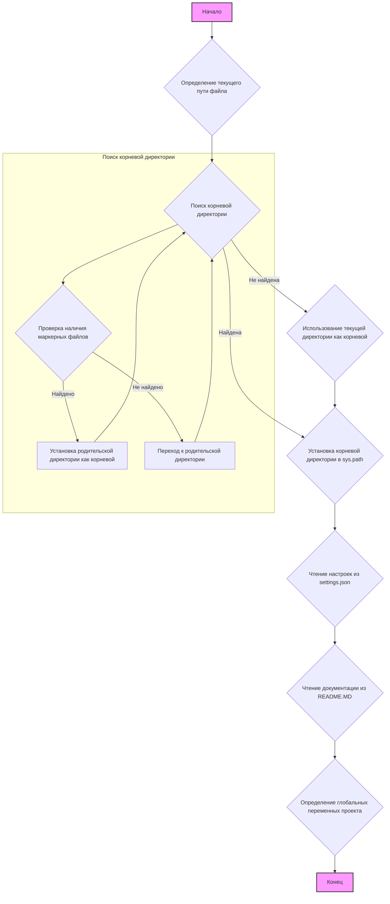

## ИНСТРУКЦИЯ:

Анализируй предоставленный код подробно и объясни его функциональность. Ответ должен включать три раздела:  

1. **<алгоритм>**: Опиши рабочий процесс в виде пошаговой блок-схемы, включая примеры для каждого логического блока, и проиллюстрируй поток данных между функциями, классами или методами.  
2. **<mermaid>**: Напиши код для диаграммы в формате `mermaid`, проанализируй и объясни все зависимости, 
    которые импортируются при создании диаграммы. 
    **ВАЖНО!** Убедитесь, что все имена переменных, используемые в диаграмме `mermaid`, 
    имеют осмысленные и описательные имена. Имена переменных вроде `A`, `B`, `C`, и т.д., не допускаются!  
    
    **Дополнительно**: Если в коде есть импорт `import header`, добавьте блок `mermaid` flowchart, объясняющий `header.py`:\
    ```mermaid
    flowchart TD
        Start --> Header[<code>header.py</code><br> Determine Project Root]
    
        Header --> import[Import Global Settings: <br><code>from src import gs</code>] 
    ```

3. **<объяснение>**: Предоставьте подробные объяснения:  
   - **Импорты**: Их назначение и взаимосвязь с другими пакетами `src.`.  
   - **Классы**: Их роль, атрибуты, методы и взаимодействие с другими компонентами проекта.  
   - **Функции**: Их аргументы, возвращаемые значения, назначение и примеры.  
   - **Переменные**: Их типы и использование.  
   - Выделите потенциальные ошибки или области для улучшения.  

Дополнительно, постройте цепочку взаимосвязей с другими частями проекта (если применимо).  

Это обеспечивает всесторонний и структурированный анализ кода.
## Формат ответа: `.md` (markdown)
**КОНЕЦ ИНСТРУКЦИИ**
## <алгоритм>

1.  **Начало**: Программа начинает выполнение.
2.  **Определение текущего пути файла**: Получается абсолютный путь к директории, в которой находится текущий файл `header.py`.
3.  **Поиск корневой директории**: Начиная с директории текущего файла, программа ищет вверх по дереву директорий, пока не найдет директорию, содержащую один из "маркерных файлов" (`__root__`, `.git`). Если маркерный файл не найден, то используется директория где находится файл `header.py`.
    *   **Пример**:
        *   Текущий путь файла: `/home/user/project/src/suppliers/aliexpress/campaign/header.py`
        *   Маркерные файлы: `__root__`, `.git`
        *   Программа проверяет директорию `/home/user/project/src/suppliers/aliexpress/campaign`, затем `/home/user/project/src/suppliers/aliexpress`, далее `/home/user/project/src/suppliers`, затем `/home/user/project/src` и, наконец, `/home/user/project`. Предположим, что файл `.git` находится в `/home/user/project`. Тогда корневой директорией будет `/home/user/project`.
4. **Установка корневой директории в `sys.path`**: Если найденная корневая директория отсутствует в `sys.path`, она добавляется в начало списка `sys.path`, чтобы обеспечить корректную работу импортов.
5.  **Чтение настроек из `settings.json`**: Программа пытается открыть и загрузить настройки из файла `settings.json`, расположенного в директории `src` корневой директории. Если файл не найден или содержит невалидный JSON, переменная settings остается `None`.
    *   **Пример**: Файл `settings.json` может содержать: `{"project_name": "hypotez", "version": "1.0.0", "author": "John Doe"}`
6.  **Чтение документации из `README.MD`**: Программа пытается открыть и прочитать содержимое файла `README.MD`, также расположенного в директории `src` корневой директории. Если файл не найден, `doc_str` остается `None`.
7.  **Определение глобальных переменных проекта**: Из полученных настроек и документации определяются глобальные переменные проекта: `__project_name__`, `__version__`, `__doc__`, `__details__`, `__author__`, `__copyright__`, `__cofee__`. Если `settings` не были загружены, устанавливаются значения по умолчанию.
    *   **Пример**: Если настройки успешно загружены, то `__project_name__` станет `hypotez` (из примера выше), а если нет, то `hypotez` по умолчанию. `__doc__` будет содержать содержимое файла `README.MD`.
8. **Конец**: Программа завершает свою работу, установив необходимые глобальные переменные.

## <mermaid>

```mermaid
    flowchart TD
        Start --> Header[<code>header.py</code><br> Determine Project Root]
    
        Header --> import[Import Global Settings: <br><code>from src import gs</code>] 
    ```
**Описание:**

**Импорты:**

*   `pathlib.Path`: Импортируется для работы с путями к файлам и директориям.
*   `src.gs`: Импортируется для получения глобальных настроек проекта, а именно путей к файлам.

**Диаграмма Mermaid:**

*   **Начало (Start)**: Начало процесса выполнения скрипта `header.py`.
*   **Поиск корневой директории (FindProjectRoot)**: Функция `set_project_root` определяет корневую директорию проекта. Она начинается с получения текущего пути файла, затем проверяет наличие маркерных файлов в текущей директории и ее родительских директориях.
*   **Добавление корня в `sys.path` (AddRootToSysPath)**: Проверяется, добавлена ли корневая директория в `sys.path`. Если нет, то она добавляется для корректной работы импортов.
*   **Загрузка `settings.json` (LoadSettings)**: Происходит попытка загрузить настройки из файла `settings.json`.
*   **Загрузка `README.MD` (LoadReadme)**: Происходит попытка загрузить контент из файла `README.MD`.
*   **Установка глобальных переменных (SetGlobalVariables)**: На основе загруженных данных и значений по умолчанию устанавливаются глобальные переменные проекта.

## <объяснение>

**Импорты:**

*   `from pathlib import Path`: Модуль `pathlib` используется для создания и манипулирования путями к файлам и директориям в операционной системе. Класс `Path` позволяет более интуитивно и кросс-платформенно работать с файловыми путями, чем использование строк.
*   `from src import gs`: Импортируется модуль `gs` из пакета `src`. Этот модуль, вероятно, содержит глобальные настройки проекта, включая пути к различным ресурсам.

**Функции:**

*   `set_project_root(marker_files: tuple = ('__root__', '.git')) -> Path`:
    *   **Аргументы**:
        *   `marker_files` (tuple): Список имен файлов или директорий, которые используются для определения корневой директории проекта. По умолчанию это `('__root__', '.git')`.
    *   **Возвращает**:
        *   `Path`: Объект `Path`, представляющий путь к корневой директории проекта.
    *   **Назначение**: Функция ищет корневую директорию проекта, поднимаясь вверх по структуре директорий от текущего файла, пока не найдет директорию, содержащую один из маркерных файлов.
    *   **Примеры**:
        1.  Если запустить скрипт из `/home/user/project/src/suppliers/aliexpress/campaign/header.py`, и файл `.git` есть в `/home/user/project`, то вернется `/home/user/project`.
        2.  Если маркерные файлы не найдены, то вернется путь к директории, в которой находится файл `header.py`.

**Переменные:**

*   `__root__: Path`: Глобальная переменная, в которой хранится путь к корневой директории проекта, определенная функцией `set_project_root()`.
*   `settings: dict`: Словарь, содержащий настройки, загруженные из файла `settings.json`. Может быть `None`, если файл не найден или невалидный.
*   `doc_str: str`: Строка, содержащая содержимое файла `README.MD`. Может быть `None`, если файл не найден.
*   `__project_name__: str`: Название проекта, извлекается из `settings` или имеет значение по умолчанию `hypotez`.
*    `__version__: str`: Версия проекта, извлекается из `settings` или имеет значение по умолчанию ''.
*    `__doc__: str`: Содержимое файла `README.MD`, если он был успешно прочитан, иначе пустая строка.
*    `__details__: str`:  Инициализируется как пустая строка.
*   `__author__: str`: Автор проекта, извлекается из `settings` или имеет значение по умолчанию ''.
*   `__copyright__: str`: Копирайт проекта, извлекается из `settings` или имеет значение по умолчанию ''.
*   `__cofee__: str`: Сообщение для поддержки разработчика, извлекается из `settings` или имеет значение по умолчанию.

**Объяснение кода:**

Этот код предназначен для настройки окружения проекта. Основные функции:

1.  **Определение корневой директории**: Функция `set_project_root()` автоматически определяет корневую директорию проекта, поднимаясь вверх по структуре директорий от текущего файла, пока не найдет маркерный файл (`__root__` или `.git`). Это позволяет запускать код из любой точки проекта и при этом иметь корректные пути к ресурсам.
2.  **Загрузка настроек**: Код пытается загрузить настройки из файла `settings.json` в корневой директории проекта. Эти настройки используются для инициализации глобальных переменных.
3.  **Загрузка документации**: Код пытается загрузить документацию из файла `README.MD` в корневой директории проекта.
4.  **Установка глобальных переменных**: На основе загруженных настроек и документации устанавливаются глобальные переменные проекта, такие как название, версия, документация, автор и т.д.

**Потенциальные ошибки и области для улучшения:**

*   **Обработка ошибок**:  Используется пустой блок `...` в `except` блоках. Лучше добавить логирование ошибок или вывод предупреждений, чтобы понимать, почему не удалось загрузить `settings.json` или `README.MD`.
*   **Зависимости**: Зависимость от `settings.json` и `README.MD` делает скрипт уязвимым, если эти файлы отсутствуют. Возможно, стоит добавить проверки на наличие этих файлов и использовать значения по умолчанию.
*   **Универсальность маркерных файлов**:  Маркерные файлы заданы по умолчанию. Возможно, стоит сделать их конфигурируемыми через переменные окружения или аргументы командной строки.
*   **Глобальные переменные**: Использование глобальных переменных может быть проблематичным при масштабировании проекта. Рассмотреть возможность использования классов или конфигурационных объектов для хранения этих данных.

**Взаимосвязи с другими частями проекта:**

*   Модуль `gs` из пакета `src` скорее всего, используется во всем проекте, предоставляя доступ к общим настройкам и путям.
*   Этот файл является частью более крупного проекта, предоставляя глобальные переменные для использования в других модулях.

Этот код обеспечивает базовую настройку проекта, позволяя определить его корневую директорию, загрузить настройки и получить доступ к глобальным переменным, таким как название проекта и версия.