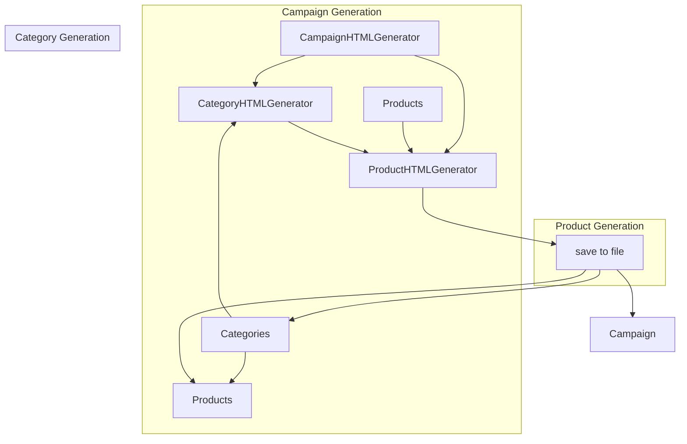

# <input code>

```python
## \file hypotez/src/suppliers/aliexpress/campaign/html_generators.py
# -*- coding: utf-8 -*-\
#! venv/Scripts/python.exe
#! venv/bin/python/python3.12

"""
.. module: src.suppliers.aliexpress.campaign 
	:platform: Windows, Unix
	:synopsis: Генератор HTML контента рекламной кампании

"""
MODE = 'dev'

import header   
from pathlib import Path
from types import SimpleNamespace
from src.utils.file import save_text_file
import html

class ProductHTMLGenerator:
    """ Class for generating HTML for individual products."""

    @staticmethod
    def set_product_html(product: SimpleNamespace, category_path: str | Path):
        """ Creates an HTML file for an individual product.

        @param product: The product details to include in the HTML.
        @param category_path: The path to save the HTML file.
        """
        category_name = Path(category_path).name
        html_path = Path(category_path) / 'html' / f"{product.product_id}.html"

        html_content = f"""<!DOCTYPE html>
<html lang="en">
<head>
    <meta charset="UTF-8">
    <meta name="viewport" content="width=device-width, initial-scale=1.0">
    <title>{html.escape(product.product_title)}</title>
    <link rel="stylesheet" href="https://stackpath.bootstrapcdn.com/bootstrap/5.3.0/css/bootstrap.min.css">
    <link rel="stylesheet" href="styles.css"> <!-- Link to custom CSS file -->
</head>
<body>
    <div class="container">
        <h1 class="my-4">{html.escape(product.product_title)}</h1>
        <div class="card">
            
            <div class="card-body">
                <p class="card-text">Price: <span class="product-price">{product.target_sale_price} {product.target_sale_price_currency}</span></p>
                <p class="card-text">Original Price: <span class="product-original-price">{product.target_original_price} {product.target_original_price_currency}</span></p>
                <p class="card-text">Category: <span class="product-category">{html.escape(product.second_level_category_name)}</span></p>
                <a href="{product.promotion_link}" class="btn btn-primary">Buy Now</a>
            </div>
        </div>
    </div>

    <script src="https://stackpath.bootstrapcdn.com/bootstrap/5.3.0/js/bootstrap.bundle.min.js"></script>
</body>
</html>
"""
        save_text_file(html_content, html_path)


class CategoryHTMLGenerator:
    """ Class for generating HTML for product categories."""

    @staticmethod
    def set_category_html(products_list: list[SimpleNamespace] | SimpleNamespace, category_path: str | Path):
        """ Creates an HTML file for the category.

        @param products_list: List of products to include in the HTML.
        @param category_path: Path to save the HTML file.
        """
        products_list = products_list if isinstance(products_list, list) else [products_list]

        category_name = Path(category_path).name
        html_path = Path(category_path) / 'html' / 'index.html'

        html_content = f"""<!DOCTYPE html>
<html lang="en">
<head>
    <meta charset="UTF-8">
    <meta name="viewport" content="width=device-width, initial-scale=1.0">
    <title>{html.escape(category_name)} Products</title>
    <link rel="stylesheet" href="https://stackpath.bootstrapcdn.com/bootstrap/5.3.0/css/bootstrap.min.css">
    <link rel="stylesheet" href="styles.css"> <!-- Link to custom CSS file -->
</head>
<body>
    <div class="container">
        <h1 class="my-4">{html.escape(category_name)} Products</h1>
        <div class="row product-grid">
"""

        for product in products_list:
            image_url = Path(product.local_saved_image).as_posix()
            html_content += f"""
                <div class="col-md-4 mb-4">
                    <div class="card">
                        
                        <div class="card-body">
                            <h5 class="card-title">{html.escape(product.product_title)}</h5>
                            <p class="card-text">Price: <span class="product-price">{product.target_sale_price} {product.target_sale_price_currency}</span></p>
                            <p class="card-text">Original Price: <span class="product-original-price">{product.target_original_price} {product.target_original_price_currency}</span></p>
                            <p class="card-text">Category: <span class="product-category">{html.escape(product.second_level_category_name)}</span></p>
                            <a href="{product.promotion_link}" class="btn btn-primary">Buy Now</a>
                        </div>
                    </div>
                </div>
            """

        html_content += """
        </div>
    </div>

    <script src="https://stackpath.bootstrapcdn.com/bootstrap/5.3.0/js/bootstrap.bundle.min.js"></script>
</body>
</html>
"""
        save_text_file(html_content, html_path)


class CampaignHTMLGenerator:
    """ Class for generating HTML for a campaign."""

    @staticmethod
    def set_campaign_html(categories: list[str], campaign_path: str | Path):
        """ Creates an HTML file for the campaign, listing all categories.

        @param categories: List of category names.
        @param campaign_path: Path to save the HTML file.
        """
        html_path = Path(campaign_path) / 'index.html'

        html_content = f"""<!DOCTYPE html>
<html lang="en">
<head>
    <meta charset="UTF-8">
    <meta name="viewport" content="width=device-width, initial-scale=1.0">
    <title>Campaign Overview</title>
    <link rel="stylesheet" href="https://stackpath.bootstrapcdn.com/bootstrap/5.3.0/css/bootstrap.min.css">
    <link rel="stylesheet" href="styles.css"> <!-- Link to custom CSS file -->
</head>
<body>
    <div class="container">
        <h1 class="my-4">Campaign Overview</h1>
        <ul class="list-group">
"""

        for category in categories:
            html_content += f"""
                <li class="list-group-item">
                    <a href="{category}/index.html">{html.escape(category)}</a>
                </li>
            """

        html_content += f"""
        </ul>
    </div>

    <script src="https://stackpath.bootstrapcdn.com/bootstrap/5.3.0/js/bootstrap.bundle.min.js"></script>
</body>
</html>
"""
        save_text_file(html_content, html_path)
```

# <algorithm>

(В силу большого объема кода, алгоритм представлен в виде краткого описания, не визуализируется пошаговая блок-схема)


**Общая логика:**

1.  **`CampaignHTMLGenerator`**: Создает главную страницу кампании, содержащую ссылки на все категории.
2.  **`CategoryHTMLGenerator`**: Создает страницу для каждой категории, отображая список продуктов в этой категории.
3.  **`ProductHTMLGenerator`**: Создает страницу для каждого продукта, содержащую подробную информацию о нем.

**Передача данных:**

*   Список категорий передается в `CampaignHTMLGenerator` для создания главной страницы.
*   Список продуктов в каждой категории передается в `CategoryHTMLGenerator` для генерации страниц категорий.
*   Информация о конкретном продукте передается в `ProductHTMLGenerator` для создания страницы продукта.


# <mermaid>



# <explanation>

**Импорты:**

*   `header`: Вероятно, импортирует константы или функции, связанные с настройками модуля (например, режим работы). Необходимо посмотреть содержимое модуля `header`.
*   `pathlib`: Для работы с путями к файлам.
*   `types`:  Для использования `SimpleNamespace`, позволяющего удобно работать со сложными структурами данных.
*   `src.utils.file`: Для сохранения содержимого в файл.
*   `html`: Для безопасного экранирования HTML-строк, предотвращая XSS-атаки.

**Классы:**

*   `ProductHTMLGenerator`: Отвечает за генерацию HTML для отдельных продуктов. `set_product_html` - единственный метод, который принимает данные продукта и путь для сохранения. Он формирует HTML-код, содержащий информацию о продукте, и сохраняет его в файл.
*   `CategoryHTMLGenerator`:  Генерирует HTML для страниц категорий, собирая HTML-представления продуктов из списка. `set_category_html` принимает список продуктов и путь, создает и сохраняет HTML-файл для категории.
*   `CampaignHTMLGenerator`:  Генерирует HTML для главной страницы кампании, собирая ссылки на страницы категорий.  `set_campaign_html` принимает список категорий и путь, генерирует и сохраняет HTML-файл для главной страницы кампании.


**Функции:**

*   `set_product_html`: Создает HTML-код для отдельного продукта и сохраняет его в файл.
*   `set_category_html`: Создает HTML-код для страницы категории, собирая HTML-представления продуктов и сохраняет его в файл.
*   `set_campaign_html`: Создает HTML-код для главной страницы кампании, собирая ссылки на страницы категорий и сохраняет его в файл.
*   `save_text_file`: (Из модуля `src.utils.file`) Сохраняет текст в указанный файл.


**Переменные:**

*   `MODE`: Константа, скорее всего, хранящая режим работы (например, `dev`, `prod`).
*   `product`, `category_path`, `categories`, `campaign_path`: Переменные, содержащие данные для генерации HTML.  `product` - объект `SimpleNamespace` с деталями продукта, `category_path` - путь к сохранению HTML для категории, `categories` - список названий категорий, `campaign_path` - путь к сохранению HTML для всей кампании.


**Возможные ошибки и улучшения:**

*   **Обработка ошибок:** Отсутствие обработки исключений при работе с файлами (`save_text_file`). При возникновении ошибок (например, отсутствие доступа к файлу) код не будет информирован и не сможет корректно справиться с ситуацией. Необходимо добавить обработку исключений для повышения надежности.
*   **Структура данных:** `SimpleNamespace` - хороший выбор для передачи данных, но стоит убедиться, что все необходимые поля присутствуют в переданных объектах.
*   **Проверка данных:** Функции могли бы проверять валидность входных данных (например, что `products_list` действительно содержит объекты `SimpleNamespace`).
*   **Логирование:** Добавьте логирование для отслеживания процесса генерации HTML, что поможет в отладке и анализе.
*   **Использование шаблонизатора:**  Для более сложных случаев, использование шаблонизатора (например, Jinja2) позволит упростить генерацию HTML и добавить гибкость.


**Взаимосвязь с другими частями проекта:**

Модуль `html_generators` зависит от модуля `src.utils.file` для сохранения сгенерированного HTML в файлы. `SimpleNamespace` используется для передачи данных, что подразумевает, что эти данные предоставляет какой-то другой модуль.  Функции ожидают объекты `product` с определенными атрибутами (например, `product_id`, `local_saved_image`),  подразумевая, что эти данные предварительно подготавливаются, либо получаются из внешних источников.  Необходимость в `header` предполагает, что код содержит параметры конфигурации, возможно, для различных режимов работы (dev/prod).