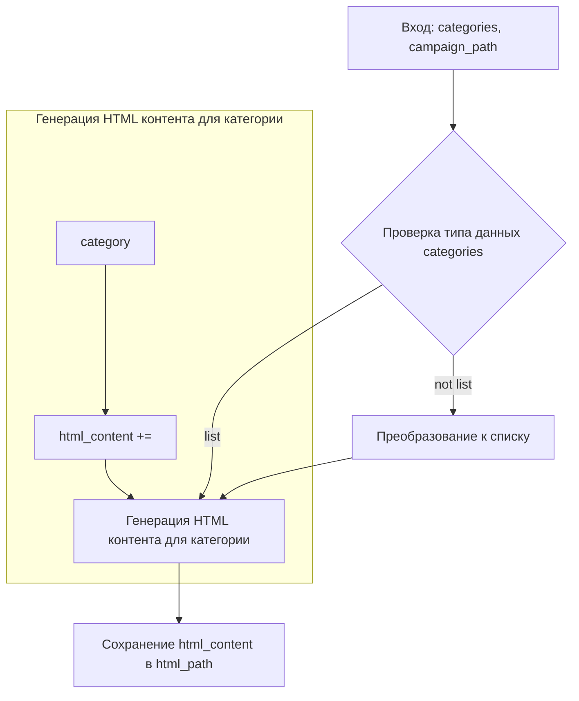

```MD
# Анализ кода из файла `hypotez/src/suppliers/aliexpress/campaign/html_generators.py`

## <input code>

```python
## \file hypotez/src/suppliers/aliexpress/campaign/html_generators.py
# -*- coding: utf-8 -*-\
#! venv/Scripts/python.exe
#! venv/bin/python/python3.12

"""
.. module: src.suppliers.aliexpress.campaign 
	:platform: Windows, Unix
	:synopsis: Генератор HTML контента рекламной кампании

"""
MODE = 'dev'

import header   
from pathlib import Path
from types import SimpleNamespace
from src.utils.file import save_text_file
import html

class ProductHTMLGenerator:
    """ Class for generating HTML for individual products."""

    @staticmethod
    def set_product_html(product: SimpleNamespace, category_path: str | Path):
        """ Creates an HTML file for an individual product.

        @param product: The product details to include in the HTML.
        @param category_path: The path to save the HTML file.
        """
        category_name = Path(category_path).name
        html_path = Path(category_path) / 'html' / f"{product.product_id}.html"

        html_content = f"""<!DOCTYPE html>
<html lang="en">
<head>
    <meta charset="UTF-8">
    <meta name="viewport" content="width=device-width, initial-scale=1.0">
    <title>{html.escape(product.product_title)}</title>
    <link rel="stylesheet" href="https://stackpath.bootstrapcdn.com/bootstrap/5.3.0/css/bootstrap.min.css">
    <link rel="stylesheet" href="styles.css"> <!-- Link to custom CSS file -->
</head>
<body>
    <div class="container">
        <h1 class="my-4">{html.escape(product.product_title)}</h1>
        <div class="card">
            
            <div class="card-body">
                <p class="card-text">Price: <span class="product-price">{product.target_sale_price} {product.target_sale_price_currency}</span></p>
                <p class="card-text">Original Price: <span class="product-original-price">{product.target_original_price} {product.target_original_price_currency}</span></p>
                <p class="card-text">Category: <span class="product-category">{html.escape(product.second_level_category_name)}</span></p>
                <a href="{product.promotion_link}" class="btn btn-primary">Buy Now</a>
            </div>
        </div>
    </div>

    <script src="https://stackpath.bootstrapcdn.com/bootstrap/5.3.0/js/bootstrap.bundle.min.js"></script>
</body>
</html>
"""
        save_text_file(html_content, html_path)


class CategoryHTMLGenerator:
    """ Class for generating HTML for product categories."""

    @staticmethod
    def set_category_html(products_list: list[SimpleNamespace] | SimpleNamespace, category_path: str | Path):
        """ Creates an HTML file for the category.

        @param products_list: List of products to include in the HTML.
        @param category_path: Path to save the HTML file.
        """
        products_list = products_list if isinstance(products_list, list) else [products_list]

        category_name = Path(category_path).name
        html_path = Path(category_path) / 'html' / 'index.html'

        html_content = f"""<!DOCTYPE html>
<html lang="en">
<head>
    <meta charset="UTF-8">
    <meta name="viewport" content="width=device-width, initial-scale=1.0">
    <title>{html.escape(category_name)} Products</title>
    <link rel="stylesheet" href="https://stackpath.bootstrapcdn.com/bootstrap/5.3.0/css/bootstrap.min.css">
    <link rel="stylesheet" href="styles.css"> <!-- Link to custom CSS file -->
</head>
<body>
    <div class="container">
        <h1 class="my-4">{html.escape(category_name)} Products</h1>
        <div class="row product-grid">
    """

        for product in products_list:
            image_url = Path(product.local_saved_image).as_posix()
            html_content += f"""
                <div class="col-md-4 mb-4">
                    <div class="card">
                        
                        <div class="card-body">
                            <h5 class="card-title">{html.escape(product.product_title)}</h5>
                            <p class="card-text">Price: <span class="product-price">{product.target_sale_price} {product.target_sale_price_currency}</span></p>
                            <p class="card-text">Original Price: <span class="product-original-price">{product.target_original_price} {product.target_original_price_currency}</span></p>
                            <p class="card-text">Category: <span class="product-category">{html.escape(product.second_level_category_name)}</span></p>
                            <a href="{product.promotion_link}" class="btn btn-primary">Buy Now</a>
                        </div>
                    </div>
                </div>
            """

        html_content += """ 
        </div>
    </div>

    <script src="https://stackpath.bootstrapcdn.com/bootstrap/5.3.0/js/bootstrap.bundle.min.js"></script>
</body>
</html>
"""
        save_text_file(html_content, html_path)


class CampaignHTMLGenerator:
    """ Class for generating HTML for a campaign."""

    @staticmethod
    def set_campaign_html(categories: list[str], campaign_path: str | Path):
        """ Creates an HTML file for the campaign, listing all categories.

        @param categories: List of category names.
        @param campaign_path: Path to save the HTML file.
        """
        html_path = Path(campaign_path) / 'index.html'

        html_content = f"""<!DOCTYPE html>
<html lang="en">
<head>
    <meta charset="UTF-8">
    <meta name="viewport" content="width=device-width, initial-scale=1.0">
    <title>Campaign Overview</title>
    <link rel="stylesheet" href="https://stackpath.bootstrapcdn.com/bootstrap/5.3.0/css/bootstrap.min.css">
    <link rel="stylesheet" href="styles.css"> <!-- Link to custom CSS file -->
</head>
<body>
    <div class="container">
        <h1 class="my-4">Campaign Overview</h1>
        <ul class="list-group">
    """

        for category in categories:
            html_content += f"""
                <li class="list-group-item">
                    <a href="{category}/index.html">{html.escape(category)}</a>
                </li>
            """

        html_content += """ 
        </ul>
    </div>

    <script src="https://stackpath.bootstrapcdn.com/bootstrap/5.3.0/js/bootstrap.bundle.min.js"></script>
</body>
</html>
"""
        save_text_file(html_content, html_path)
```

## <algorithm>

**Блок-схема (неполная, для иллюстрации)**



**Пример:**

Пусть `categories` = `['Electronics', 'Clothing']`, `campaign_path` = `/path/to/campaign`.
1. Функция `set_campaign_html` принимает `categories` и `campaign_path`.
2. Создается строка `html_content` с начальными тегами.
3. Для каждой категории в `categories` генерируется HTML ссылка на страницу категории.
4. Строка `html_content` дополняется тегами ссылок.
5. `html_content` сохраняется в файл `/path/to/campaign/index.html`.


## <mermaid>

```mermaid
graph LR
    subgraph "Модуль html_generators"
        ProductHTMLGenerator --> save_text_file;
        CategoryHTMLGenerator --> save_text_file;
        CampaignHTMLGenerator --> save_text_file;
    end
    save_text_file -- (Файловая система) --> "Файлы HTML";
    header --> "Файл header";
    "Файлы Bootstrap" -- (зависимость) --> ProductHTMLGenerator;
    "Файлы Bootstrap" -- (зависимость) --> CategoryHTMLGenerator;
    "Файлы Bootstrap" -- (зависимость) --> CampaignHTMLGenerator;
    html -- (зависимость) --> ProductHTMLGenerator;
    html -- (зависимость) --> CategoryHTMLGenerator;
    html -- (зависимость) --> CampaignHTMLGenerator;
    Path -- (зависимость) --> ProductHTMLGenerator;
    Path -- (зависимость) --> CategoryHTMLGenerator;
    Path -- (зависимость) --> CampaignHTMLGenerator;
    SimpleNamespace -- (зависимость) --> ProductHTMLGenerator;
    SimpleNamespace -- (зависимость) --> CategoryHTMLGenerator;
    src.utils.file -- (зависимость) --> save_text_file;

```


## <explanation>

**Импорты:**

- `header`: Вероятно, импортирует функции или константы из модуля `header`, который содержит вспомогательные данные или настройки для проекта. Без конкретного кода `header` невозможно дать точное описание.
- `pathlib`: Предоставляет классы для работы с путями к файлам и каталогам. Используется для построения корректных путей к файлам HTML.
- `types`: Предоставляет базовые типы данных, в том числе `SimpleNamespace`. Используется для передачи данных о продуктах и категориях, организованных как объекты с атрибутами.
- `src.utils.file`: Импортирует функцию `save_text_file`, которая, вероятно, сохраняет текст в файл. Эта функция находится в подпакете `utils` пакета `src`.  Это указывает на иерархическую структуру проекта, где `src` содержит общие вспомогательные утилиты.
- `html`: Предоставляет функции для работы со строками HTML, в том числе для экранирования HTML-спецсимволов, что предотвращает XSS-уязвимости.

**Классы:**

- `ProductHTMLGenerator`:  Генерирует HTML-код для одного продукта.  Используется для сохранения подробностей продукта в отдельном HTML-файле.
- `CategoryHTMLGenerator`:  Генерирует HTML-код для всей категории продуктов.  Создает HTML-страницу, содержащую списки продуктов.
- `CampaignHTMLGenerator`:  Генерирует HTML-код для всей рекламной кампании.  Выводит список доступных категорий для навигации по рекламной кампании.

**Методы:**

- `set_product_html`: Создает HTML-файл для отдельного продукта, принимая `product` (объект `SimpleNamespace`) и `category_path` (путь к папке категории).  Сохраняет результат в файл `html/product_id.html`.
- `set_category_html`: Создает HTML-файл для всей категории, принимая список продуктов `products_list` и `category_path` (путь к папке категории).  Сохраняет результат в файл `html/index.html`.
- `set_campaign_html`: Создает HTML-файл для всей рекламной кампании, принимая список названий категорий `categories` и `campaign_path` (путь к папке кампании).  Сохраняет результат в файл `index.html`, который содержит ссылки на страницы категорий.


**Функции:**

- `save_text_file`: Сохраняет переданный текст в файл по указанному пути.  Определена в модуле `src.utils.file`.

**Возможные ошибки и улучшения:**

- **Обработка исключений:**  Код не обрабатывает потенциальные исключения при работе с файлами (например, ошибки доступа или отсутствие файла). Добавление обработки исключений (try...except) сделает код более надежным.
- **Отсутствующий `styles.css`:** Код предполагает наличие файла `styles.css` в той же директории, что и генерируемый HTML. Если такого файла нет,  может появиться ошибка.  Важно предусмотреть возможность обработки ситуации, когда файл отсутствует.
- **Проверка на существование папок:**  Перед созданием файла необходимо убедиться, что папки (например, папка категории/html) существуют. Если нет, стоит создать их автоматически.
- **Использование шаблонизатора:**  Для больших объемов данных и динамического контента рекомендуется использование шаблонизатора (например, Jinja2), чтобы избежать жесткой вставки строк и сделать код более гибким.
- **Проверка параметров:**  Можно добавить проверки на корректность входных данных (например, проверка, что `products_list` или `categories` не пустые).

**Взаимосвязь с другими частями проекта:**

Функции в этом модуле явно зависят от функций сохранения файла (`src.utils.file.save_text_file`).  Возможно, существуют другие модули, которые обеспечивают подготовку данных для генерации HTML (например,  модуль, который получает `product` объекты из базы данных или API).