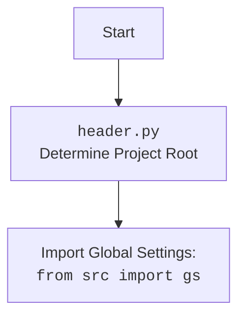

## ИНСТРУКЦИЯ:

Анализируй предоставленный код подробно и объясни его функциональность. Ответ должен включать три раздела:

1.  **<алгоритм>**: Опиши рабочий процесс в виде пошаговой блок-схемы, включая примеры для каждого логического блока, и проиллюстрируй поток данных между функциями, классами или методами.
2.  **<mermaid>**: Напиши код для диаграммы в формате `mermaid`, проанализируй и объясни все зависимости,
    которые импортируются при создании диаграммы.
    **ВАЖНО!** Убедитесь, что все имена переменных, используемые в диаграмме `mermaid`,
    имеют осмысленные и описательные имена. Имена переменных вроде `A`, `B`, `C`, и т.д., не допускаются!

    **Дополнительно**: Если в коде есть импорт `import header`, добавьте блок `mermaid` flowchart, объясняющий `header.py`:
    ```mermaid
    flowchart TD
        Start --> Header[<code>header.py</code><br> Determine Project Root]

        Header --> import[Import Global Settings: <br><code>from src import gs</code>]
    ```

3.  **<объяснение>**: Предоставьте подробные объяснения:
    *   **Импорты**: Их назначение и взаимосвязь с другими пакетами `src.`.
    *   **Классы**: Их роль, атрибуты, методы и взаимодействие с другими компонентами проекта.
    *   **Функции**: Их аргументы, возвращаемые значения, назначение и примеры.
    *   **Переменные**: Их типы и использование.
    *   Выделите потенциальные ошибки или области для улучшения.

Дополнительно, постройте цепочку взаимосвязей с другими частями проекта (если применимо).

Это обеспечивает всесторонний и структурированный анализ кода.
## Формат ответа: `.md` (markdown)
**КОНЕЦ ИНСТРУКЦИИ**

## <алгоритм>

**1. `ProductHTMLGenerator.set_product_html`:**

   - **Вход:** `product` (экземпляр `SimpleNamespace` с данными о продукте), `category_path` (строка или `Path`, путь к директории категории).
     *   Пример: `product` с `product_id='123', product_title='Awesome T-Shirt', local_saved_image='images/t-shirt.jpg', target_sale_price='19.99', target_sale_price_currency='$', target_original_price='29.99', target_original_price_currency='$', second_level_category_name='Apparel', promotion_link='https://example.com/t-shirt'`,  `category_path = 'output/apparel'`
   - **Шаг 1:** Извлекает имя категории из `category_path`.
     *   Пример: `category_name = 'apparel'`
   - **Шаг 2:** Формирует путь к HTML-файлу продукта:  `category_path / 'html' / f"{product.product_id}.html"`.
     *   Пример: `html_path = 'output/apparel/html/123.html'`
   - **Шаг 3:** Создает HTML-контент с использованием данных о продукте. Содержит разметку для отображения: заголовка, изображения, цены, категории и ссылки на покупку. Функция `html.escape` используется для экранирования специальных символов в тексте.
   - **Шаг 4:** Сохраняет сгенерированный HTML-контент в файл по пути `html_path`, используя функцию `save_text_file`.
     *  Пример: Создает файл `output/apparel/html/123.html` с HTML кодом.
   - **Выход:** None (создает HTML-файл)

**2. `CategoryHTMLGenerator.set_category_html`:**

   - **Вход:** `products_list` (список или один экземпляр `SimpleNamespace` с данными о продуктах), `category_path` (строка или `Path`, путь к директории категории).
    *  Пример: `products_list` - список как в примере выше. `category_path = 'output/apparel'`
   - **Шаг 1:** Убеждается, что `products_list` является списком. Если это один продукт, он превращается в список из одного элемента.
   - **Шаг 2:** Извлекает имя категории из `category_path`.
     *   Пример: `category_name = 'apparel'`
   - **Шаг 3:** Формирует путь к главному HTML-файлу категории: `category_path / 'html' / 'index.html'`.
     *   Пример: `html_path = 'output/apparel/html/index.html'`
   - **Шаг 4:** Создает HTML-контент для категории, включая общий заголовок и контейнер для карточек продуктов.
   - **Шаг 5:** Итерируется по списку продуктов, для каждого продукта:
     - Формирует HTML-разметку карточки продукта, включая изображение, название, цену, категорию и ссылку на покупку.
     - Добавляет разметку карточки продукта в общий HTML-контент категории.
   - **Шаг 6:** Закрывает HTML-контент категории.
   - **Шаг 7:** Сохраняет сгенерированный HTML-контент в файл по пути `html_path`, используя функцию `save_text_file`.
     *  Пример: Создает файл `output/apparel/html/index.html` с HTML кодом.
   - **Выход:** None (создает HTML-файл)

**3. `CampaignHTMLGenerator.set_campaign_html`:**

   - **Вход:** `categories` (список строк, имен категорий), `campaign_path` (строка или `Path`, путь к директории кампании).
    *  Пример: `categories = ['apparel', 'electronics'], campaign_path = 'output/campaign'`
   - **Шаг 1:** Формирует путь к главному HTML-файлу кампании: `campaign_path / 'index.html'`.
     *   Пример: `html_path = 'output/campaign/index.html'`
   - **Шаг 2:** Создает HTML-контент для кампании, включая заголовок и список ссылок на страницы категорий.
   - **Шаг 3:** Итерируется по списку категорий, для каждой категории:
     -  Создает элемент списка со ссылкой на HTML-страницу категории.
     -  Добавляет элемент списка в HTML-контент.
   - **Шаг 4:** Закрывает HTML-контент кампании.
   - **Шаг 5:** Сохраняет сгенерированный HTML-контент в файл по пути `html_path`, используя функцию `save_text_file`.
      *  Пример: Создает файл `output/campaign/index.html` с HTML кодом.
   - **Выход:** None (создает HTML-файл)

## <mermaid>
```mermaid
flowchart TD
    Start[Начало] --> ProductHTMLGenerator[<code>ProductHTMLGenerator</code>]
    Start --> CategoryHTMLGenerator[<code>CategoryHTMLGenerator</code>]
    Start --> CampaignHTMLGenerator[<code>CampaignHTMLGenerator</code>]
    
    ProductHTMLGenerator --> set_product_html[<code>set_product_html(product, category_path)</code><br>Generates HTML for a single product]
    CategoryHTMLGenerator --> set_category_html[<code>set_category_html(products_list, category_path)</code><br>Generates HTML for a product category]
    CampaignHTMLGenerator --> set_campaign_html[<code>set_campaign_html(categories, campaign_path)</code><br>Generates HTML for a campaign overview]
    
    set_product_html --> extract_category_name_product[Extract Category Name <br> from <code>category_path</code>]
    extract_category_name_product --> create_html_path_product[Create HTML Path <br> <code>category_path / 'html' / f"{product.product_id}.html"</code>]
    create_html_path_product --> create_html_content_product[Create HTML Content <br> Uses <code>product</code> data]
    create_html_content_product --> save_html_product[Save HTML file <br> <code>save_text_file(html_content, html_path)</code>]

    set_category_html --> ensure_products_is_list[Ensure <code>products_list</code> is a list]
    ensure_products_is_list --> extract_category_name_category[Extract Category Name <br> from <code>category_path</code>]
    extract_category_name_category --> create_html_path_category[Create HTML Path <br> <code>category_path / 'html' / 'index.html'</code>]
    create_html_path_category --> create_html_content_category[Create HTML Content <br> Iterates over <code>products_list</code>]
    create_html_content_category --> save_html_category[Save HTML file <br> <code>save_text_file(html_content, html_path)</code>]
    
    set_campaign_html --> create_html_path_campaign[Create HTML Path <br> <code>campaign_path / 'index.html'</code>]
    create_html_path_campaign --> create_html_content_campaign[Create HTML Content <br> Iterates over <code>categories</code>]
    create_html_content_campaign --> save_html_campaign[Save HTML file <br> <code>save_text_file(html_content, html_path)</code>]

    save_html_product --> End[Конец]
    save_html_category --> End
    save_html_campaign --> End

```



## <объяснение>

**Импорты:**

*   `import header`: Этот импорт предназначен для определения корневой директории проекта и инициализации глобальных настроек. Он импортирует файл `header.py`, который, вероятно, устанавливает необходимые переменные окружения и пути для работы приложения.  Используется для доступа к глобальным настройкам через `from src import gs`.
*   `from pathlib import Path`: Модуль `pathlib` предоставляет классы для представления путей к файлам и директориям, упрощая работу с путями (в том числе кроссплатформенно).
*   `from types import SimpleNamespace`: Класс `SimpleNamespace` используется для создания простых объектов, к атрибутам которых можно обращаться через точку. В данном случае используется для передачи данных о продуктах.
*   `from src.utils.file import save_text_file`:  Импортируется функция `save_text_file` из модуля `src.utils.file`. Эта функция, вероятно, предназначена для записи текстового контента (в данном случае, HTML) в файл, что инкапсулирует логику записи файлов. Она является частью пакета `src` и используется для сохранения HTML-файлов.
*   `import html`: Модуль `html` предоставляет инструменты для работы с HTML, включая экранирование специальных символов, что используется для избежания проблем с некорректным отображением текста в HTML. В данном случае, используется функция `html.escape` для предотвращения HTML-инъекций.

**Классы:**

1.  `ProductHTMLGenerator`:
    *   **Роль**: Класс, отвечающий за генерацию HTML-страниц для отдельных товаров.
    *   **Атрибуты**: Нет.
    *   **Методы**:
        *   `set_product_html(product: SimpleNamespace, category_path: str | Path)`: Статический метод, который принимает данные о продукте (`product`) и путь к категории (`category_path`) и генерирует HTML-файл для этого продукта. Использует `save_text_file` для сохранения результата.

2.  `CategoryHTMLGenerator`:
    *   **Роль**: Класс, отвечающий за генерацию HTML-страницы для списка товаров в рамках одной категории.
    *   **Атрибуты**: Нет.
    *   **Методы**:
        *   `set_category_html(products_list: list[SimpleNamespace] | SimpleNamespace, category_path: str | Path)`: Статический метод, который принимает список товаров (`products_list`) и путь к категории (`category_path`) и генерирует HTML-файл для этой категории. Проверяет, является ли `products_list` списком, и преобразует в список, если это не так.

3.  `CampaignHTMLGenerator`:
    *   **Роль**: Класс, отвечающий за генерацию HTML-страницы, представляющей обзор кампании, и содержащей список категорий.
    *   **Атрибуты**: Нет.
    *   **Методы**:
        *   `set_campaign_html(categories: list[str], campaign_path: str | Path)`: Статический метод, который принимает список названий категорий (`categories`) и путь к кампании (`campaign_path`) и генерирует HTML-файл для обзора кампании, содержащий ссылки на HTML страницы категорий.

**Функции:**

*   `set_product_html(product: SimpleNamespace, category_path: str | Path)`:
    *   **Аргументы**:
        *   `product`: Объект `SimpleNamespace`, содержащий данные о продукте.
        *   `category_path`: Путь к директории, в которой будет создан файл HTML продукта.
    *   **Возвращаемое значение**: None.
    *   **Назначение**: Генерирует HTML-файл для конкретного товара.
    *   **Пример:** Выше в разделе <алгоритм>
*   `set_category_html(products_list: list[SimpleNamespace] | SimpleNamespace, category_path: str | Path)`:
    *   **Аргументы**:
        *   `products_list`: Список объектов `SimpleNamespace`, содержащий данные о продуктах категории, или один объект `SimpleNamespace`
        *   `category_path`: Путь к директории, в которой будет создан файл HTML категории.
    *   **Возвращаемое значение**: None.
    *   **Назначение**: Генерирует HTML-файл для страницы категории, включая список товаров.
    *   **Пример:** Выше в разделе <алгоритм>
*  `set_campaign_html(categories: list[str], campaign_path: str | Path)`:
    *   **Аргументы**:
         *   `categories`: Список строк, содержащий имена категорий.
        *   `campaign_path`: Путь к директории, в которой будет создан HTML файл кампании.
    *   **Возвращаемое значение**: None.
    *   **Назначение**: Генерирует HTML-файл для страницы кампании, отображающий список категорий.
    *   **Пример:** Выше в разделе <алгоритм>
*   `save_text_file(content, file_path)`:
    *   **Аргументы**: `content` - текст для сохранения, `file_path` - путь к файлу
    *   **Возвращаемое значение**: None.
    *   **Назначение**:  Функция сохраняет `content` в файл по указанному `file_path`

**Переменные:**

*   Все переменные, используемые в коде, имеют осмысленные имена, описывающие их назначение, например `product`, `category_path`, `html_path`, `html_content`.
*   Типы переменных: строки, списки, объекты `Path`, объекты `SimpleNamespace`.
*   В `ProductHTMLGenerator`:
    *   `product` содержит данные о конкретном продукте (`product_id`, `product_title`, `local_saved_image` и др.)
    *   `category_path` -  путь к директории категории.
    *   `html_path` - путь к конечному HTML файлу.
    *   `html_content` - сгенерированный HTML контент.
*   В `CategoryHTMLGenerator`:
    *   `products_list` список продуктов или один продукт
    *   `category_path` -  путь к директории категории.
    *   `html_path` - путь к конечному HTML файлу.
    *   `html_content` - сгенерированный HTML контент.
    *   `image_url` - путь к картинке продукта.
*  В `CampaignHTMLGenerator`:
    *  `categories` - список категорий
    *  `campaign_path` - путь к директории кампании.
    *   `html_path` - путь к конечному HTML файлу.
    *   `html_content` - сгенерированный HTML контент.

**Потенциальные ошибки и области для улучшения:**

*   **Отсутствует обработка ошибок:** В коде отсутствует явная обработка возможных исключений, таких как ошибки при сохранении файла. Следует добавить блоки `try...except` для более надежной работы.
*   **Жестко заданные стили:** CSS стили подключены через CDN и могут быть недоступны в некоторых случаях. Лучше либо использовать локальные стили, либо предусмотреть fallback на случай, если CDN не работает.
*   **Масштабирование**: Если количество продуктов или категорий будет очень большим, то генерация HTML может занять продолжительное время. Следует рассмотреть возможность асинхронной генерации или разбиение на части.
*   **Использование f-string**: Код использует f-строки для форматирования HTML, что может привести к снижению читаемости, если HTML-код станет слишком сложным. Следует рассмотреть возможность использования шаблонизатора для более удобного управления HTML.
*   **Общая структура HTML**: HTML код внутри классов  `ProductHTMLGenerator`, `CategoryHTMLGenerator`  и  `CampaignHTMLGenerator`  имеет одинаковые теги head, что ведет к дублированию. Можно выделить общую структуру в отдельную функцию/шаблон.
*   **Зависимость от Bootstrap**: Код сильно зависит от Bootstrap.  Было бы лучше сделать стили более кастомизируемыми, либо добавить поддержку других фреймворков стилей.
*   **Логирование**: Не хватает логов для отслеживания работы скрипта. Необходимо добавить логгирование для отслеживания ошибок.

**Цепочка взаимосвязей с другими частями проекта:**

*   Файл `header.py` используется для инициализации глобальных настроек проекта, что необходимо для работы с файловой системой и другими частями проекта.
*   Функция `save_text_file` из `src.utils.file` обеспечивает функциональность для сохранения сгенерированных HTML-файлов. Она используется всеми HTML генераторами (`ProductHTMLGenerator`, `CategoryHTMLGenerator` и `CampaignHTMLGenerator`).
*   Данный модуль является частью системы генерации HTML контента для рекламных кампаний AliExpress, вероятно, он используется после того, как данные о товарах и категориях были собраны из API,  имеет прямую связь с модулями сбора данных.

В целом, код выполняет свою задачу, но может быть улучшен с точки зрения обработки ошибок, гибкости, масштабируемости, читаемости и сопровождения.