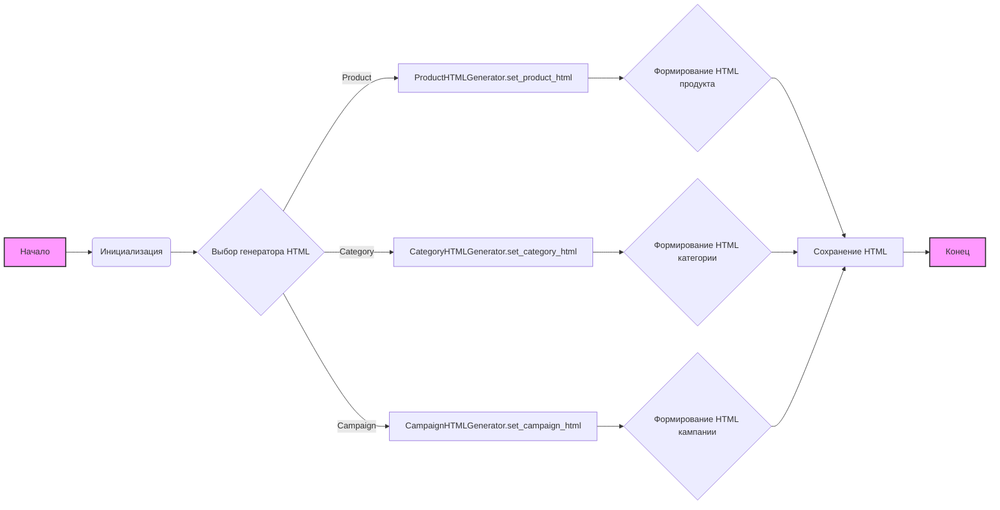
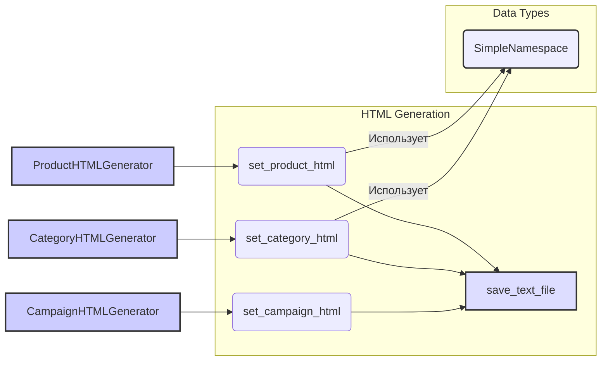

## Анализ кода `hypotez/src/suppliers/aliexpress/campaign/html_generators.py`

### 1. <алгоритм>

**Общий рабочий процесс:**

1.  **Инициализация**:
    *   Устанавливается `MODE = 'dev'`. Этот параметр может использоваться для переключения между разными режимами работы приложения (например, разработка или продакшн).
    *   Импортируются необходимые библиотеки и модули: `pathlib.Path` для работы с путями, `types.SimpleNamespace` для создания объектов с произвольными атрибутами, `src.utils.file.save_text_file` для сохранения HTML файлов, и `html` для экранирования специальных символов.
2.  **Генерация HTML для продуктов**:
    *   Класс `ProductHTMLGenerator` содержит метод `set_product_html` для создания HTML страниц для отдельных продуктов.
    *   Для каждого продукта формируется HTML шаблон, который включает заголовок, изображение, цену, оригинальную цену, категорию и ссылку "Купить сейчас".
    *   HTML файл сохраняется в директорию `html` внутри каталога категории.
    *   **Пример:**
        *   Входные данные: `product` (SimpleNamespace с данными продукта), `category_path` (путь к каталогу категории).
        *   Выход: HTML файл `product_id.html` в папке `html` внутри `category_path`.
3.  **Генерация HTML для категорий**:
    *   Класс `CategoryHTMLGenerator` содержит метод `set_category_html` для создания HTML страниц для каталога категории.
    *   Метод принимает список продуктов или один продукт в виде `SimpleNamespace`.
    *   Для каждого продукта в списке генерируется HTML карточка, которая включает заголовок, изображение, цену, оригинальную цену, категорию и ссылку "Купить сейчас".
    *   Все карточки продуктов выводятся в одном ряду.
    *   HTML файл сохраняется как `index.html` в директорию `html` внутри каталога категории.
    *   **Пример:**
        *   Входные данные: `products_list` (список SimpleNamespace с данными продуктов), `category_path` (путь к каталогу категории).
        *   Выход: HTML файл `index.html` в папке `html` внутри `category_path`.
4.  **Генерация HTML для кампании**:
    *   Класс `CampaignHTMLGenerator` содержит метод `set_campaign_html` для создания HTML страниц для кампании.
    *   Метод принимает список категорий и путь к кампании.
    *   Для каждой категории создается ссылка в виде списка.
    *   HTML файл сохраняется как `index.html` в каталоге кампании.
    *   **Пример:**
        *   Входные данные: `categories` (список названий категорий), `campaign_path` (путь к каталогу кампании).
        *   Выход: HTML файл `index.html` в `campaign_path`.

**Блок-схема:**

### 2. <mermaid>

**Описание зависимостей:**

*   `ProductHTMLGenerator`, `CategoryHTMLGenerator` и `CampaignHTMLGenerator` - это классы, которые отвечают за генерацию HTML-страниц. Каждый класс имеет статический метод (`set_product_html`, `set_category_html` и `set_campaign_html` соответственно) для создания HTML контента.
*   `save_text_file` - это функция из модуля `src.utils.file`, которая используется для сохранения сгенерированного HTML контента в файл. Все генераторы HTML (`set_product_html`, `set_category_html`, `set_campaign_html`) зависят от нее, так как используют ее для сохранения сгенерированных страниц.
*   `SimpleNamespace` - это класс из модуля `types`, который используется для хранения данных о продуктах. Он используется как аргумент в методах `set_product_html` и `set_category_html`.

### 3. <объяснение>

**Импорты:**

*   `import header`: Этот импорт не используется в предоставленном коде. Возможно, это оставшийся импорт от предыдущих итераций.
*   `from pathlib import Path`: Импортирует класс `Path` для работы с путями к файлам и каталогам, упрощая создание и манипулирование путями.
*   `from types import SimpleNamespace`: Импортирует `SimpleNamespace` для создания простых объектов, атрибуты которых можно задавать динамически. Используется для передачи данных о продуктах.
*   `from src.utils.file import save_text_file`: Импортирует функцию `save_text_file` из модуля `src.utils.file`, предназначенную для сохранения текстовых данных в файл, в данном случае HTML контента.
*   `import html`: Импортирует модуль `html` для работы с HTML, в частности для экранирования специальных символов (например, `<`, `>`, `&`) в тексте, который будет вставлен в HTML, чтобы избежать XSS атак.

**Классы:**

1.  **`ProductHTMLGenerator`**:
    *   **Роль**: Генерирует HTML страницы для отдельных продуктов.
    *   **Атрибуты**: Нет атрибутов, используются только статические методы.
    *   **Методы**:
        *   `set_product_html(product: SimpleNamespace, category_path: str | Path)`: Создает HTML страницу для одного продукта, используя предоставленные данные о продукте и путь к категории. Сохраняет страницу в файле `product_id.html` в папке `html` внутри категории.
        *   **Пример использования:** `ProductHTMLGenerator.set_product_html(product_data, '/path/to/category')`
2.  **`CategoryHTMLGenerator`**:
    *   **Роль**: Генерирует HTML страницу, отображающую список товаров в категории.
    *   **Атрибуты**: Нет атрибутов, используются только статические методы.
    *   **Методы**:
        *   `set_category_html(products_list: list[SimpleNamespace] | SimpleNamespace, category_path: str | Path)`: Создает HTML страницу со списком продуктов, используя предоставленный список продуктов или один продукт и путь к категории. Сохраняет страницу как `index.html` в папке `html` внутри категории.
        *   **Пример использования:** `CategoryHTMLGenerator.set_category_html(list_of_products, '/path/to/category')`
3.  **`CampaignHTMLGenerator`**:
    *   **Роль**: Генерирует HTML страницу, отображающую список категорий в кампании.
    *   **Атрибуты**: Нет атрибутов, используются только статические методы.
    *   **Методы**:
        *   `set_campaign_html(categories: list[str], campaign_path: str | Path)`: Создает HTML страницу со списком категорий в виде ссылок, используя предоставленный список категорий и путь к кампании. Сохраняет страницу как `index.html` в каталоге кампании.
        *   **Пример использования:** `CampaignHTMLGenerator.set_campaign_html(list_of_categories, '/path/to/campaign')`

**Функции:**

*   `save_text_file(content, file_path)`: Функция (импортированная из `src.utils.file`), сохраняющая текст (HTML) в указанный файл.
    *   **Аргументы**: `content` (текст для сохранения), `file_path` (путь к файлу).
    *   **Возвращаемое значение**: Нет явного возвращаемого значения.
    *   **Пример:** `save_text_file("<h1>Hello</h1>", '/path/to/file.html')`

**Переменные:**

*   `MODE = 'dev'`: Глобальная переменная, определяющая режим работы скрипта (в данном случае, 'dev' для разработки).
*   `category_name`: имя текущей категории, полученное из пути.
*   `html_path`: путь к html-файлу, который необходимо сохранить.
*    `html_content`: переменная, которая содержит сформированный HTML-код.
* `image_url`: URL изображения продукта.

**Потенциальные ошибки и области для улучшения:**

*   **Жестко заданные пути к CSS и JS:** Ссылки на bootstrap и стили (`styles.css`) могут быть более гибкими, например, через переменные среды или конфигурационные файлы.
*   **Отсутствие обработки ошибок:** Не предусмотрена обработка ошибок при сохранении файла, что может привести к непредсказуемому поведению.
*   **Отсутствие шаблонизации:** HTML код генерируется с помощью f-строк, что затрудняет его модификацию. Лучше использовать шаблонизатор.
*   **Смешивание логики и представления:** Код смешивает логику генерации HTML с бизнес-логикой. Разделение ответственности улучшит читаемость и поддерживаемость.
*   **Ограниченная настройка:** HTML шаблон жестко задан. Не хватает гибкости для настройки вывода HTML.
*   **Неиспользуемый импорт:** `import header` не используется и может быть удален.

**Взаимосвязи с другими частями проекта:**

*   Модуль `src.utils.file` предоставляет функцию `save_text_file`, которая используется для сохранения сгенерированного HTML кода.
*   Структура проекта предполагает наличие директории `src` и, возможно, других модулей в пакете `suppliers.aliexpress`, которые могут использовать данные, сгенерированные этим кодом.

**Цепочка взаимосвязей:**

1.  Другие части проекта могут предоставлять данные о продуктах и категориях в виде объектов `SimpleNamespace`.
2.  Классы `ProductHTMLGenerator`, `CategoryHTMLGenerator` и `CampaignHTMLGenerator` используют эти данные для генерации HTML файлов.
3.  Функция `save_text_file` из `src.utils.file` сохраняет HTML файлы на диск.
4.  Сгенерированные HTML файлы могут использоваться для отображения информации о продуктах и кампаниях в веб-интерфейсе.