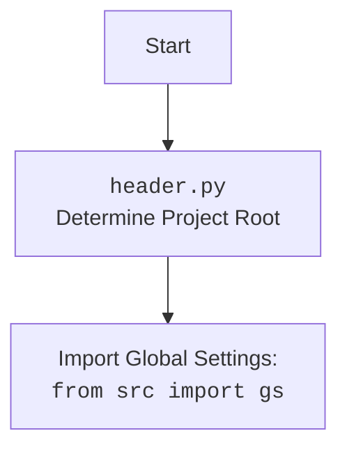

## АНАЛИЗ КОДА: `hypotez/src/suppliers/aliexpress/campaign/html_generators.py`

### 1. <алгоритм>
**Блок-схема:**
```mermaid
flowchart TD
    Start[Начало] --> ProductHTMLGenerator_Start{ProductHTMLGenerator}
    ProductHTMLGenerator_Start --> set_product_html[set_product_html(product, category_path)]
    set_product_html --> CreateHTML[Создать HTML-файл продукта]
    CreateHTML --> SaveHTML[Сохранить HTML-файл продукта]
    SaveHTML --> ProductHTMLGenerator_End{Конец ProductHTMLGenerator}
    ProductHTMLGenerator_End --> CategoryHTMLGenerator_Start{CategoryHTMLGenerator}
    CategoryHTMLGenerator_Start --> set_category_html[set_category_html(products_list, category_path)]
    set_category_html --> IsList{Является products_list списком?}
    IsList -- Да --> CreateCategoryHTML[Создать HTML-файл категории]
    IsList -- Нет --> ConvertToList[Преобразовать в список]
    ConvertToList --> CreateCategoryHTML
    CreateCategoryHTML --> SaveCategoryHTML[Сохранить HTML-файл категории]
    SaveCategoryHTML --> CategoryHTMLGenerator_End{Конец CategoryHTMLGenerator}
    CategoryHTMLGenerator_End --> CampaignHTMLGenerator_Start{CampaignHTMLGenerator}
    CampaignHTMLGenerator_Start --> set_campaign_html[set_campaign_html(categories, campaign_path)]
    set_campaign_html --> CreateCampaignHTML[Создать HTML-файл кампании]
    CreateCampaignHTML --> SaveCampaignHTML[Сохранить HTML-файл кампании]
    SaveCampaignHTML --> CampaignHTMLGenerator_End{Конец CampaignHTMLGenerator}
    CampaignHTMLGenerator_End --> End[Конец]
```
**Примеры:**
1.  **`ProductHTMLGenerator.set_product_html`:**
    *   **Вход:** `product` (SimpleNamespace: `product_id='123', product_title='Test Product', local_image_path='images/test.jpg', target_sale_price='10', target_sale_price_currency='$', target_original_price='20', target_original_price_currency='$', second_level_category_name='Test Category', promotion_link='test_link'`), `category_path` (str: `'test_category'`).
    *   **Процесс:** Создает HTML-файл `test_category/html/123.html` с информацией о продукте.
    *   **Выход:** HTML-файл сохранен.

2.  **`CategoryHTMLGenerator.set_category_html`:**
    *   **Вход:** `products_list` (list[SimpleNamespace]: `[product1, product2]`, где `product1` и `product2` - объекты SimpleNamespace, как в примере выше), `category_path` (str: `'test_category'`).
    *   **Процесс:** Создает HTML-файл `test_category/html/index.html` с карточками всех продуктов из списка.
    *  **Вход:** `products_list` (SimpleNamespace: `product1` где `product1` - объект SimpleNamespace, как в примере выше), `category_path` (str: `'test_category'`).
    *   **Процесс:** Создает HTML-файл `test_category/html/index.html` с карточкой продукта `product1`.
    *   **Выход:** HTML-файл сохранен.

3.  **`CampaignHTMLGenerator.set_campaign_html`:**
    *   **Вход:** `categories` (list[str]: `['category1', 'category2']`), `campaign_path` (str: `'campaign_dir'`).
    *   **Процесс:** Создает HTML-файл `campaign_dir/index.html` со списком ссылок на HTML-файлы категорий.
    *   **Выход:** HTML-файл сохранен.

### 2. <mermaid>
```mermaid
flowchart TD
    Start[Start] --> ImportModules[Import Modules]
    ImportModules --> ProductHTMLGenerator[Class ProductHTMLGenerator]
    ImportModules --> CategoryHTMLGenerator[Class CategoryHTMLGenerator]
    ImportModules --> CampaignHTMLGenerator[Class CampaignHTMLGenerator]

    ProductHTMLGenerator --> set_product_html[Method set_product_html(product: SimpleNamespace, category_path: str | Path)]
    set_product_html --> HTMLGeneration_Product[Generate HTML Content for Product]
    HTMLGeneration_Product --> save_text_file_product[save_text_file(html_content, html_path)]

    CategoryHTMLGenerator --> set_category_html[Method set_category_html(products_list: list[SimpleNamespace] | SimpleNamespace, category_path: str | Path)]
    set_category_html --> IsList_Category{Is products_list a list?}
    IsList_Category -- Yes -->  HTMLGeneration_Category[Generate HTML Content for Category]
    IsList_Category -- No --> ConvertList[Convert products_list to a list]
    ConvertList --> HTMLGeneration_Category

    HTMLGeneration_Category --> save_text_file_category[save_text_file(html_content, html_path)]
    
    CampaignHTMLGenerator --> set_campaign_html[Method set_campaign_html(categories: list[str], campaign_path: str | Path)]
    set_campaign_html --> HTMLGeneration_Campaign[Generate HTML Content for Campaign]
    HTMLGeneration_Campaign --> save_text_file_campaign[save_text_file(html_content, html_path)]

    save_text_file_product --> End[End]
    save_text_file_category --> End
    save_text_file_campaign --> End
    
    
    classDef classStyle fill:#f9f,stroke:#333,stroke-width:2px
    class ProductHTMLGenerator,CategoryHTMLGenerator,CampaignHTMLGenerator classStyle
```

**Анализ зависимостей:**

*   **`flowchart TD`**: Объявляет начало диаграммы в формате `mermaid` и устанавливает тип диаграммы как блок-схему (flowchart).
*   **`Start`**: Начало процесса, представленное узлом с текстом "Start".
*   **`ImportModules`**: Обозначает импорт необходимых модулей, включая `Path` из `pathlib`, `SimpleNamespace` из `types`, `save_text_file` из `src.utils.file` и `html` для экранирования.
*   **`ProductHTMLGenerator`, `CategoryHTMLGenerator`, `CampaignHTMLGenerator`**: Классы для генерации HTML-страниц, имеющие стиль `classStyle`.
*   **`set_product_html`, `set_category_html`, `set_campaign_html`**: Методы соответствующих классов, отвечающие за создание HTML-контента. Они принимают на вход данные (продукты, категории) и путь к файлу.
*   **`HTMLGeneration_Product`, `HTMLGeneration_Category`, `HTMLGeneration_Campaign`**: Узлы, представляющие процессы генерации HTML-кода для продуктов, категорий и кампаний, соответственно.
*   **`save_text_file_product`, `save_text_file_category`, `save_text_file_campaign`**: Вызовы функции `save_text_file` для сохранения сгенерированного HTML-кода в файл.
*   **`IsList_Category`**: Узел проверки типа переменной `products_list` в `CategoryHTMLGenerator`.
*   **`ConvertList`**: Узел преобразования переменной `products_list` в список, если это не так.
*   **`End`**: Конец процесса, обозначенный узлом с текстом "End".

**Зависимости:**

*   `Path` используется для работы с путями файлов.
*   `SimpleNamespace` используется для создания простых объектов для передачи данных о продуктах.
*   `save_text_file` используется для сохранения сгенерированного HTML-кода.
*    `html` используется для безопасного экранирования HTML-спецсимволов в строках, которые будут вставлены в HTML.
*   `header.py` используется для определения корневой директории проекта и импорта глобальных настроек.

### 3. <объяснение>
#### Импорты:
*   **`import header`**: Импортирует модуль `header`, который, вероятно, содержит код для определения корневой директории проекта.
*   **`from pathlib import Path`**: Импортирует класс `Path` из модуля `pathlib` для работы с путями файлов и каталогов в операционной системе.
*   **`from types import SimpleNamespace`**: Импортирует класс `SimpleNamespace`, позволяющий создавать простые объекты с атрибутами. Используется для хранения данных о продуктах и категориях.
*   **`from src.utils.file import save_text_file`**: Импортирует функцию `save_text_file` из модуля `src.utils.file` для сохранения текста в файл.
*    **`import html`**: Импортирует модуль `html`, который предоставляет инструменты для экранирования HTML-спецсимволов.

#### Классы:
1.  **`ProductHTMLGenerator`**:
    *   **Роль**: Класс для генерации HTML-страниц для отдельных продуктов.
    *   **Атрибуты**: Не имеет атрибутов.
    *   **Методы**:
        *   `set_product_html(product: SimpleNamespace, category_path: str | Path)`:
            *   **Аргументы**:
                *   `product` (SimpleNamespace): Объект, содержащий данные продукта (например, название, цена, изображение).
                *   `category_path` (str | Path): Путь к каталогу, где будет сохранен HTML-файл.
            *   **Возвращаемое значение**: Отсутствует (сохраняет HTML-файл в файловой системе).
            *   **Назначение**: Генерирует HTML-страницу для одного продукта и сохраняет её в файл.
2.  **`CategoryHTMLGenerator`**:
    *   **Роль**: Класс для генерации HTML-страниц для категорий продуктов.
    *   **Атрибуты**: Не имеет атрибутов.
    *   **Методы**:
        *   `set_category_html(products_list: list[SimpleNamespace] | SimpleNamespace, category_path: str | Path)`:
            *   **Аргументы**:
                *   `products_list` (list[SimpleNamespace] | SimpleNamespace): Список объектов, содержащих данные продуктов, или один объект `SimpleNamespace`, если продукт только один.
                *   `category_path` (str | Path): Путь к каталогу, где будет сохранен HTML-файл.
            *   **Возвращаемое значение**: Отсутствует (сохраняет HTML-файл в файловой системе).
            *   **Назначение**: Генерирует HTML-страницу со списком продуктов в категории и сохраняет её в файл. Если передан один продукт, то он все равно обрабатывается как список.
3.  **`CampaignHTMLGenerator`**:
    *   **Роль**: Класс для генерации HTML-страницы, представляющей обзор кампании.
    *   **Атрибуты**: Не имеет атрибутов.
    *   **Методы**:
        *   `set_campaign_html(categories: list[str], campaign_path: str | Path)`:
            *   **Аргументы**:
                *   `categories` (list[str]): Список названий категорий, которые нужно включить в обзор кампании.
                *   `campaign_path` (str | Path): Путь к каталогу, где будет сохранен HTML-файл.
            *   **Возвращаемое значение**: Отсутствует (сохраняет HTML-файл в файловой системе).
            *   **Назначение**: Генерирует HTML-страницу со списком ссылок на HTML-страницы категорий и сохраняет её в файл.

#### Функции:
*   `save_text_file(content: str, file_path: Path) `
    *   **Аргументы**:
        *  `content` (str) : Строка с HTML-кодом.
        *  `file_path` (Path) : Путь для сохранения файла.
    *   **Возвращаемое значение**: Отсутствует.
    *   **Назначение**: Сохраняет переданный HTML-код в файл по указанному пути.
    
#### Переменные:
*   `category_name` (str): Имя категории, извлеченное из пути.
*   `html_path` (Path): Полный путь к HTML-файлу, который будет создан.
*   `html_content` (str): HTML-код, который будет записан в файл.
*    `image_url` (str): URL изображения товара, преобразованный в POSIX-совместимый путь.
*   `categories` (list[str]): Список категорий для кампании.

#### Потенциальные ошибки и области для улучшения:
*   **Жестко заданные ссылки на Bootstrap**: Код использует CDN для подключения Bootstrap. Стоит рассмотреть возможность локального хранения Bootstrap или использование других фреймворков.
*   **Отсутствие обработки ошибок**: Не обрабатываются исключения при сохранении файла или создании директорий.
*   **Отсутствие шаблонизации HTML**: HTML-код генерируется с помощью f-strings, что усложняет его поддержку. Можно рассмотреть использование шаблонизаторов, таких как Jinja2.
*    **Возможность XSS** : Несмотря на использование `html.escape` есть риск XSS атак. Стоит рассмотреть более надежные методы санитации HTML.
*   **Стили**: Стили находятся в файле `styles.css`, который не генерируется автоматически. Нужно обеспечить создание этого файла и его наполнение стилями.

#### Взаимосвязь с другими частями проекта:
*   Этот модуль является частью модуля `src.suppliers.aliexpress.campaign`, что говорит о его связи с определенной платформой (AliExpress) и рекламными кампаниями.
*   Использует `src.utils.file.save_text_file` для сохранения HTML-файлов, что демонстрирует связь с модулем `src.utils`.
*   Использует `header.py` для определения корневой директории, что говорит о его зависимости от общего проекта.

В целом, код выполняет свою задачу генерации HTML-файлов для различных уровней (продукты, категории, кампания) рекламной кампании, но требует некоторой доработки в плане безопасности, гибкости и обработки ошибок.