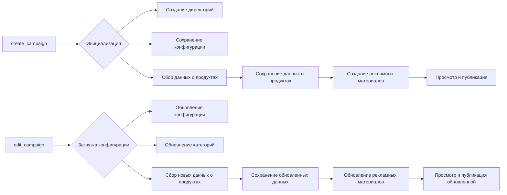

# Анализ кода для создания и редактирования рекламных кампаний

## <input code>

```python
### Инструкция для программиста по поддержке кода для создания и редактирования рекламных кампаний

#### 1. Создание рекламной кампании

1. **Инициализация кампании**
   - Введите имя кампании, язык и валюту.
   - Пример: 
     ```python
     campaign_name = 'example_campaign'
     language = 'EN'
     currency = 'USD'
     ```

2. **Создание директорий для кампании**
   - Создайте директории для кампании и категорий.
   - Пример:
     ```python
     categories = ['electronics', 'fashion']
     create_directories(campaign_name, categories)
     ```

3. **Сохранение конфигурации кампании**
   - Создайте и сохраните конфигурационный файл кампании.
   - Пример:
     ```python
     campaign_config = {'name': campaign_name, 'language': language, 'currency': currency}
     save_config(campaign_name, campaign_config)
     ```

4. **Сбор данных о продуктах**
   - Введите URL или ID продуктов для кампании.
   - Пример:
     ```python
     product_urls = ['https://www.aliexpress.com/item/123.html', 'https://www.aliexpress.com/item/456.html']
     product_data = collect_product_data(product_urls)
     ```

5. **Сохранение данных о продуктах**
   - Сохраните собранные данные о продуктах.
   - Пример:
     ```python
     save_product_data(campaign_name, product_data)
     ```

6. **Создание рекламных материалов**
   - Создайте рекламные материалы на основе собранных данных.
   - Пример:
     ```python
     create_promotional_materials(campaign_name, product_data)
     ```

7. **Просмотр и публикация кампании**
   - Просмотрите и опубликуйте кампанию.
   - Пример:
     ```python
     review_campaign(campaign_name)
     publish_campaign(campaign_name)
     ```

#### 2. Редактирование рекламной кампании

... (остальной код)


### Примерный код

```python
def create_campaign(campaign_name, language, currency, categories, product_urls):
    create_directories(campaign_name, categories)
    campaign_config = {'name': campaign_name, 'language': language, 'currency': currency}
    save_config(campaign_name, campaign_config)
    product_data = collect_product_data(product_urls)
    save_product_data(campaign_name, product_data)
    create_promotional_materials(campaign_name, product_data)
    review_campaign(campaign_name)
    publish_campaign(campaign_name)

def edit_campaign(campaign_name, language, categories, product_urls):
    campaign_config = load_config(campaign_name)
    campaign_config['language'] = language
    save_config(campaign_name, campaign_config)
    update_categories(campaign_name, categories)
    updated_product_data = collect_product_data(product_urls)
    save_product_data(campaign_name, updated_product_data)
    update_promotional_materials(campaign_name, updated_product_data)
    review_campaign(campaign_name)
    publish_campaign(campaign_name)
```
```

## <algorithm>

(Блок-схема, описывающая алгоритмы создания и редактирования кампании, увы, не представляется возможным.  Схема была бы очень большой и сложной.)

## <mermaid>




## <explanation>

**Импорты:**  В коде отсутствуют импорты.  Предполагается, что `create_directories`, `save_config`, `collect_product_data`, `save_product_data`, `create_promotional_materials`, `review_campaign`, `publish_campaign`, `load_config`, `update_categories`, `update_promotional_materials` — это функции или методы из других модулей или классов, которые отвечают за конкретные операции (создание директорий, загрузка/сохранение конфигураций, сбор данных и т. д.).  Также используется функция `logger.error` для обработки ошибок, предполагая импорт соответствующего модуля, например `logging`.


**Классы:** В примере кода нет классов.  Функции `create_campaign` и `edit_campaign` — это функции, предназначенные для управления процессом создания и редактирования кампаний.


**Функции:**

* `create_campaign`: Создает новую рекламную кампанию, принимая имя, язык, валюту, список категорий и список URL-адресов продуктов.
* `edit_campaign`: Редактирует существующую рекламную кампанию, принимая имя, новый язык, новые категории и новые URL-адреса продуктов.

**Переменные:**

* `campaign_name`, `language`, `currency`, `categories`, `product_urls`:  Строки и списки, хранящие информацию о кампании.
* `campaign_config`: Словарь, содержащий конфигурацию кампании.
* `product_data`, `updated_product_data`: Данные о продуктах, возвращаемые из функции `collect_product_data`.


**Возможные ошибки и улучшения:**

* Не указано, как происходит валидация входных данных (например, проверка корректности URL-адресов).  Необходимо добавить проверку на пустые списки или кортежи входных данных.
* Отсутствует логирование ошибок и исключений.
* Не указано, как происходит взаимодействие с хранилищем данных (например, база данных).
* Код не проверяет существование кампании.
* Необходимо обработка ошибок во время работы с файлами и директориями (например, исключения `FileNotFoundError`).
* Не описан механизм хранения и обработки рекламных материалов.
* Не описывается механизм хранения данных о продуктах (например, JSON или CSV).
* Не понятно, как работают функции `collect_product_data`, `save_product_data`, и т. д. –  необходимо их описание.


**Взаимосвязь с другими частями проекта:**  Функции, подобные `create_campaign` и `edit_campaign` обычно являются частью более крупного приложения, которое работает с базами данных, управляет файлами и другими ресурсами.  Они взаимодействуют с другими компонентами через вызовы функций.  Например, функция `create_directories` должна взаимодействовать с операционной системой для создания папок.

**Общее заключение:**  Код предоставляет основу для создания и редактирования рекламных кампаний, но для реального применения потребуется гораздо больше деталей, в том числе, обработка ошибок, валидации, более подробное описание функций и структуры хранения данных.