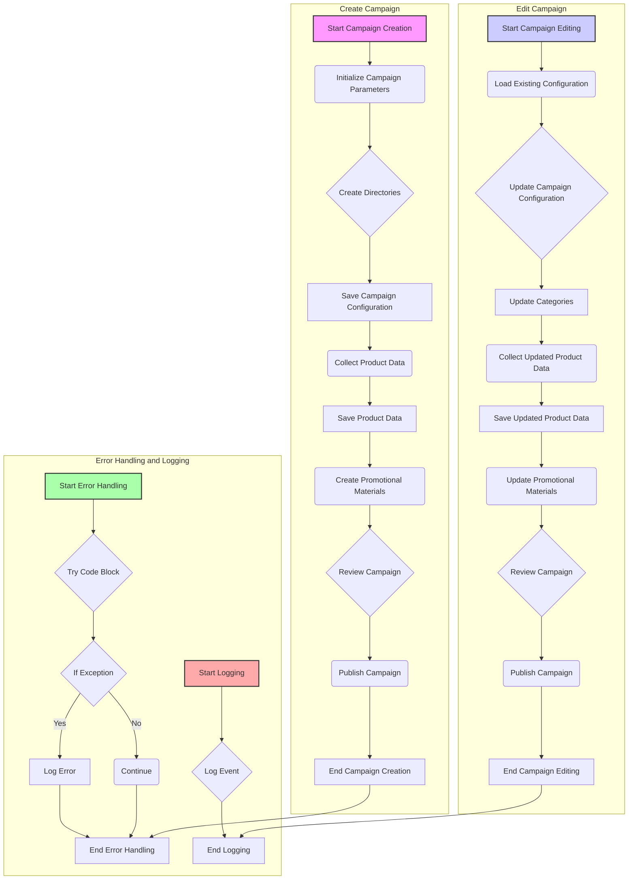

## <алгоритм>

**1. Создание рекламной кампании:**

   - **1.1. Инициализация кампании:**
      - На вход поступают: `campaign_name` (строка, например, "example_campaign"), `language` (строка, например, "EN"), `currency` (строка, например, "USD"), `categories` (список строк, например, ["electronics", "fashion"]), и `product_urls` (список строк, например, ["https://www.aliexpress.com/item/123.html", "https://www.aliexpress.com/item/456.html"]).
      - Пример:
      ```
      campaign_name = "example_campaign"
      language = "EN"
      currency = "USD"
      categories = ["electronics", "fashion"]
      product_urls = ["https://www.aliexpress.com/item/123.html", "https://www.aliexpress.com/item/456.html"]
      ```

   - **1.2. Создание директорий:**
      - Функция `create_directories` принимает `campaign_name` и `categories`.
      - Создаёт папки для каждой категории внутри папки кампании.
      - Пример:
      ```
      create_directories("example_campaign", ["electronics", "fashion"])
      # Создает директории: example_campaign/electronics/, example_campaign/fashion/
      ```

   - **1.3. Сохранение конфигурации:**
      - Создаётся словарь `campaign_config` с ключами: "name", "language", "currency".
      - Функция `save_config` сохраняет этот словарь в файл конфигурации кампании.
      - Пример:
      ```
       campaign_config = {"name": "example_campaign", "language": "EN", "currency": "USD"}
       save_config("example_campaign", campaign_config)
       # Сохраняет config в файл: example_campaign/config.json
      ```

   - **1.4. Сбор данных о продуктах:**
      - Функция `collect_product_data` принимает `product_urls` и собирает данные о продуктах с этих URL.
      - Пример:
      ```
      product_urls = ["https://www.aliexpress.com/item/123.html", "https://www.aliexpress.com/item/456.html"]
      product_data = collect_product_data(product_urls)
      # Возвращает: [{данные продукта 1}, {данные продукта 2}]
      ```

   - **1.5. Сохранение данных о продуктах:**
      - Функция `save_product_data` сохраняет данные о продуктах в файл.
      - Пример:
      ```
      save_product_data("example_campaign", product_data)
      # Сохраняет данные о продуктах в файл: example_campaign/products.json
      ```

   - **1.6. Создание рекламных материалов:**
      - Функция `create_promotional_materials` создаёт рекламные материалы на основе `product_data`.
      - Пример:
      ```
      create_promotional_materials("example_campaign", product_data)
      # Создает рекламные материалы (баннеры, тексты)
      ```

   - **1.7. Просмотр и публикация кампании:**
      - Функции `review_campaign` и `publish_campaign` выполняют проверку и публикацию кампании.
      - Пример:
      ```
      review_campaign("example_campaign")
      publish_campaign("example_campaign")
      ```

**2. Редактирование рекламной кампании:**

   - **2.1. Загрузка существующей конфигурации:**
      - Функция `load_config` загружает конфигурацию кампании.
      - Пример:
      ```
      campaign_config = load_config("example_campaign")
      # Загружает config из файла: example_campaign/config.json
      ```
   - **2.2. Обновление конфигурации:**
      - Изменяет параметры кампании в словаре `campaign_config`.
      - Пример:
      ```
      campaign_config["language"] = "RU"
      save_config("example_campaign", campaign_config)
      ```

   - **2.3. Обновление категорий:**
      - Функция `update_categories` обновляет список категорий.
      - Пример:
      ```
      new_categories = ["home", "beauty"]
      update_categories("example_campaign", new_categories)
      ```

    - **2.4. Сбор новых данных о продуктах:**
        - Функция `collect_product_data` собирает новые данные о продуктах.
        - Пример:
      ```
      new_product_urls = ["https://www.aliexpress.com/item/789.html"]
      updated_product_data = collect_product_data(new_product_urls)
      ```

   - **2.5. Сохранение обновленных данных о продуктах:**
      - Функция `save_product_data` сохраняет обновленные данные.
       - Пример:
      ```
       save_product_data("example_campaign", updated_product_data)
      ```

   - **2.6. Обновление рекламных материалов:**
      - Функция `update_promotional_materials` обновляет рекламные материалы.
      - Пример:
      ```
      update_promotional_materials("example_campaign", updated_product_data)
      ```

   - **2.7. Просмотр и публикация обновленной кампании:**
      - Функции `review_campaign` и `publish_campaign` выполняют проверку и публикацию кампании.
      - Пример:
      ```
      review_campaign("example_campaign")
      publish_campaign("example_campaign")
      ```

**3. Обработка ошибок и логирование:**

   - **3.1. Обработка ошибок:**
      -  Используется `try-except` блок для отлова исключений, которые могут произойти во время выполнения программы.
        - Пример:
      ```python
       try:
          # Ваш код
       except Exception as ex:
          logger.error("Ошибка", ex)
      ```

   - **3.2. Логирование:**
      - Используется для записи событий и ошибок в лог файл.
      - Пример:
      ```python
      logger.info("Начало обработки кампании")
      logger.error("Ошибка при обработке кампании", ex)
      ```
  
**Поток данных:**

*   **Создание:**
    *   `campaign_name`, `language`, `currency`, `categories`, `product_urls` -> `create_campaign`
    *   `campaign_name`, `categories` -> `create_directories`
    *   `campaign_name`, `campaign_config` -> `save_config`
    *   `product_urls` -> `collect_product_data` -> `product_data`
    *   `campaign_name`, `product_data` -> `save_product_data`
    *   `campaign_name`, `product_data` -> `create_promotional_materials`
    *   `campaign_name` -> `review_campaign`, `publish_campaign`
*   **Редактирование:**
    *   `campaign_name`, `language`, `categories`, `product_urls` -> `edit_campaign`
    *   `campaign_name` -> `load_config` -> `campaign_config`
    *   `campaign_config`, `language`  ->  `save_config`
    *   `campaign_name`, `categories` -> `update_categories`
    *   `product_urls` -> `collect_product_data` -> `updated_product_data`
    *   `campaign_name`, `updated_product_data` -> `save_product_data`
    *  `campaign_name`, `updated_product_data` -> `update_promotional_materials`
    *   `campaign_name` -> `review_campaign`, `publish_campaign`
  
## <mermaid>


**Объяснение `mermaid`:**

*   **`flowchart TD`**: Объявляет диаграмму как блок-схему с направлением сверху вниз (Top to Down).
*   **`subgraph Create Campaign ... end`**: Группирует узлы, представляющие процесс создания кампании.
*   **`A[Start Campaign Creation]`**: Начальный узел для процесса создания кампании.
*   **`B(Initialize Campaign Parameters)`**: Действие, представляющее инициализацию параметров кампании.
*   **`C{Create Directories}`**: Условие или действие, представляющее создание директорий.
*   **`D[Save Campaign Configuration]`**: Действие, представляющее сохранение конфигурации кампании.
*   **`E(Collect Product Data)`**: Действие, представляющее сбор данных о продуктах.
*   **`F[Save Product Data]`**: Действие, представляющее сохранение данных о продуктах.
*   **`G(Create Promotional Materials)`**: Действие, представляющее создание рекламных материалов.
*   **`H{Review Campaign}`**: Действие, представляющее просмотр кампании.
*   **`I(Publish Campaign)`**: Действие, представляющее публикацию кампании.
*   **`J[End Campaign Creation]`**: Конечный узел процесса создания кампании.
*   Аналогичная структура и пояснения применяются к подграфам **`Edit Campaign`**, **`Error Handling and Logging`**.
*   **`style`**: Используется для стилизации узлов диаграммы. `fill` задает цвет заливки, `stroke` задает цвет границы, `stroke-width` задает толщину границы.
*   **`-->`**: Стрелка, обозначающая поток управления между узлами.

**Импорты зависимостей:**
    В данном примере кода нету явных импортов, которые мы могли бы отобразить в диаграмме. Однако, на основе описания, мы можем сказать что необходимы следующие функции:
    * `create_directories`
    * `save_config`
    * `collect_product_data`
    * `save_product_data`
    * `create_promotional_materials`
    * `review_campaign`
    * `publish_campaign`
    * `load_config`
    * `update_categories`
    * `update_promotional_materials`
    * `logger`

## <объяснение>

**Импорты:**
- В данном коде импорты не указаны. Однако, опираясь на функциональность, мы можем предположить, что в проекте `src` используются следующие импорты:
    -   `from src.utils import create_directories, save_config, load_config`
    -   `from src.data_collection import collect_product_data`
    -   `from src.data_storage import save_product_data`
    -   `from src.promotional_materials import create_promotional_materials, update_promotional_materials`
    -   `from src.campaign_management import review_campaign, publish_campaign`
    -   `from src.utils import update_categories`
    -   `from src.logger import logger`
 -   `src`  - это корневая директория проекта.
    -   `utils` - модуль, содержащий вспомогательные функции, такие как создание директорий и сохранение конфигураций.
    -   `data_collection` - модуль, отвечающий за сбор данных о продуктах.
    -   `data_storage` - модуль, отвечающий за сохранение данных.
    -   `promotional_materials` - модуль, отвечающий за создание и обновление рекламных материалов.
    -   `campaign_management` - модуль, отвечающий за просмотр и публикацию кампаний.
    -   `logger` - модуль, отвечающий за логирование событий и ошибок.

**Классы:**

- В предоставленном коде классы не используются. Вместо них используется структурный подход с функциями.

**Функции:**

-   **`create_campaign(campaign_name, language, currency, categories, product_urls)`**:
    -   **Аргументы**:
        -   `campaign_name` (str): Имя кампании.
        -   `language` (str): Язык кампании.
        -   `currency` (str): Валюта кампании.
        -   `categories` (list of str): Список категорий товаров.
        -   `product_urls` (list of str): Список URL товаров.
    -   **Возвращаемое значение**: None (Функция выполняет ряд действий и ничего не возвращает).
    -   **Назначение**: Создает новую рекламную кампанию, выполняя все необходимые этапы: создание директорий, сохранение конфигурации, сбор данных о товарах, создание рекламных материалов и публикацию.
    -   **Пример**:
        ```python
        create_campaign("test_campaign", "EN", "USD", ["electronics"], ["https://aliexpress.com/item/123.html"])
        ```
-   **`edit_campaign(campaign_name, language, categories, product_urls)`**:
    -   **Аргументы**:
        -   `campaign_name` (str): Имя кампании.
        -   `language` (str): Язык кампании.
        -   `categories` (list of str): Список категорий товаров.
         -   `product_urls` (list of str): Список URL товаров.
    -   **Возвращаемое значение**: None (Функция выполняет ряд действий и ничего не возвращает).
    -   **Назначение**: Редактирует существующую рекламную кампанию, загружая конфигурацию, обновляя её, обновляя список товаров и рекламные материалы.
    -   **Пример**:
        ```python
       edit_campaign("test_campaign", "RU", ["clothes"], ["https://aliexpress.com/item/456.html"])
        ```
-   **`create_directories(campaign_name, categories)`**:
    -   **Аргументы**:
        -   `campaign_name` (str): Имя кампании.
        -   `categories` (list of str): Список категорий товаров.
    -   **Возвращаемое значение**: None
    -   **Назначение**: Создает директории для кампании и категорий.
-  **`save_config(campaign_name, campaign_config)`**:
    -   **Аргументы**:
        -   `campaign_name` (str): Имя кампании.
        -   `campaign_config` (dict): Словарь с конфигурацией кампании.
    -   **Возвращаемое значение**: None
    -   **Назначение**: Сохраняет конфигурацию кампании в файл.
-  **`collect_product_data(product_urls)`**:
    -   **Аргументы**:
        -   `product_urls` (list of str): Список URL товаров.
    -   **Возвращаемое значение**: `product_data`(list of dict) - список словарей, содержащих данные о продуктах
    -   **Назначение**: Собирает данные о продуктах из предоставленных URL.
-   **`save_product_data(campaign_name, product_data)`**:
    -   **Аргументы**:
        -   `campaign_name` (str): Имя кампании.
        -  `product_data` (list of dict): Список словарей, содержащих данные о продуктах
    -   **Возвращаемое значение**: None
    -   **Назначение**: Сохраняет данные о продуктах в файл.
-   **`create_promotional_materials(campaign_name, product_data)`**:
    -   **Аргументы**:
        -   `campaign_name` (str): Имя кампании.
        -   `product_data` (list of dict): Список словарей, содержащих данные о продуктах
    -   **Возвращаемое значение**: None
    -   **Назначение**: Создает рекламные материалы на основе данных о товарах.
-   **`review_campaign(campaign_name)`**:
    -   **Аргументы**:
        -   `campaign_name` (str): Имя кампании.
    -   **Возвращаемое значение**: None
    -   **Назначение**: Проверяет готовность кампании перед публикацией.
-   **`publish_campaign(campaign_name)`**:
    -   **Аргументы**:
        -   `campaign_name` (str): Имя кампании.
    -   **Возвращаемое значение**: None
    -   **Назначение**: Публикует рекламную кампанию.
-  **`load_config(campaign_name)`**:
    -   **Аргументы**:
        -   `campaign_name` (str): Имя кампании.
    -  **Возвращаемое значение**: `campaign_config` (dict): Словарь с конфигурацией кампании.
    -   **Назначение**: Загружает конфигурацию кампании из файла.
-   **`update_categories(campaign_name, categories)`**:
    -   **Аргументы**:
        -   `campaign_name` (str): Имя кампании.
        -   `categories` (list of str): Список категорий товаров.
    -   **Возвращаемое значение**: None
    -   **Назначение**: Обновляет список категорий товаров и соответствующие директории.
-   **`update_promotional_materials(campaign_name, updated_product_data)`**:
    -   **Аргументы**:
        -    `campaign_name` (str): Имя кампании.
        -    `updated_product_data` (list of dict): Список словарей, содержащих обновленные данные о продуктах.
    -   **Возвращаемое значение**: None
    -   **Назначение**: Обновляет рекламные материалы на основе новых данных.

**Переменные:**

-   `campaign_name`: Строка, имя кампании.
-   `language`: Строка, язык кампании.
-   `currency`: Строка, валюта кампании.
-   `categories`: Список строк, категории товаров.
-   `product_urls`: Список строк, URL товаров.
-   `campaign_config`: Словарь, конфигурация кампании.
-   `product_data`: Список словарей, данные о продуктах.
-   `updated_product_data`: Список словарей, обновленные данные о продуктах.
-   `new_categories`: Список строк, новые категории товаров.
-   `new_product_urls`: Список строк, новые URL товаров.
-   `logger`: Объект для логирования событий и ошибок.

**Потенциальные ошибки и области для улучшения:**
- **Обработка ошибок**: В предоставленном коде есть общий `try-except` блок, который ловит все исключения. Было бы лучше проработать более конкретную обработку исключений.
- **Логирование**: В лог может быть выведено недостаточно информации.
- **Абстракция**: Код может быть более абстрактным, чтобы не повторять одни и те же операции. Можно разбить код на большее количество функций или использовать классы.
- **Конфигурация**: Настройки проекта, которые на данный момент "зашиты" в код, можно вынести в отдельный конфигурационный файл.

**Взаимосвязь с другими частями проекта:**

-   Код тесно связан с модулями `src.utils`, `src.data_collection`, `src.data_storage`, `src.promotional_materials` и `src.campaign_management`, `src.logger`. Все эти модули должны быть реализованы в проекте.