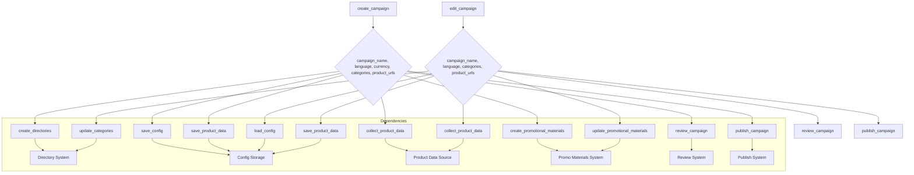

# Анализ кода для создания и редактирования рекламных кампаний

## 1. <input code>

```python
### Инструкция для программиста по поддержке кода для создания и редактирования рекламных кампаний

#### 1. Создание рекламной кампании

1. **Инициализация кампании**
   - Введите имя кампании, язык и валюту.
   - Пример: 
     ```python
     campaign_name = 'example_campaign'
     language = 'EN'
     currency = 'USD'
     ```

2. **Создание директорий для кампании**
   - Создайте директории для кампании и категорий.
   - Пример:
     ```python
     categories = ['electronics', 'fashion']
     create_directories(campaign_name, categories)
     ```

3. **Сохранение конфигурации кампании**
   - Создайте и сохраните конфигурационный файл кампании.
   - Пример:
     ```python
     campaign_config = {'name': campaign_name, 'language': language, 'currency': currency}
     save_config(campaign_name, campaign_config)
     ```

4. **Сбор данных о продуктах**
   - Введите URL или ID продуктов для кампании.
   - Пример:
     ```python
     product_urls = ['https://www.aliexpress.com/item/123.html', 'https://www.aliexpress.com/item/456.html']
     product_data = collect_product_data(product_urls)
     ```

5. **Сохранение данных о продуктах**
   - Сохраните собранные данные о продуктах.
   - Пример:
     ```python
     save_product_data(campaign_name, product_data)
     ```

6. **Создание рекламных материалов**
   - Создайте рекламные материалы на основе собранных данных.
   - Пример:
     ```python
     create_promotional_materials(campaign_name, product_data)
     ```

7. **Просмотр и публикация кампании**
   - Просмотрите и опубликуйте кампанию.
   - Пример:
     ```python
     review_campaign(campaign_name)
     publish_campaign(campaign_name)
     ```

#### 2. Редактирование рекламной кампании

... (остальная часть кода)

### Примерный код

```python
def create_campaign(campaign_name, language, currency, categories, product_urls):
    create_directories(campaign_name, categories)
    campaign_config = {'name': campaign_name, 'language': language, 'currency': currency}
    save_config(campaign_name, campaign_config)
    product_data = collect_product_data(product_urls)
    save_product_data(campaign_name, product_data)
    create_promotional_materials(campaign_name, product_data)
    review_campaign(campaign_name)
    publish_campaign(campaign_name)

def edit_campaign(campaign_name, language, categories, product_urls):
    campaign_config = load_config(campaign_name)
    campaign_config['language'] = language
    save_config(campaign_name, campaign_config)
    update_categories(campaign_name, categories)
    updated_product_data = collect_product_data(product_urls)
    save_product_data(campaign_name, updated_product_data)
    update_promotional_materials(campaign_name, updated_product_data)
    review_campaign(campaign_name)
    publish_campaign(campaign_name)
```
```

## 2. <algorithm>

(Блок-схема отсутствует в запросе.  По описанию кода, это алгоритм для создания и редактирования рекламных кампаний, включающий последовательные шаги: инициализация, создание директорий, сохранение конфигурации, сбор данных о продуктах, сохранение данных о продуктах, создание рекламных материалов, просмотр и публикацию.)


## 3. <mermaid>




## 4. <explanation>

**Импорты:**  Код не содержит импортов.  В реальном приложении необходимо импортировать библиотеки для работы с файловой системой (например, `os` или `pathlib`), с базами данных, с API сайтов,  с  загрузкой/сохранением данных (JSON, CSV), для создания рекламных материалов (библиотеки для работы с изображениями, текстами).  Также, для работы с логами (как показано в примере) нужен `logging`.

**Классы:**  Код не содержит классов.  В более сложной системе создание классов для представления кампаний, продуктов, рекламных материалов,  наверняка, упростило бы управление данными и логику.

**Функции:**
* `create_campaign`, `edit_campaign`:  Функции для создания и редактирования кампаний, принимающие параметры (имя кампании, язык, валюта, категории, URL продуктов).  Они вызывают другие функции, отвечающие за конкретные шаги процесса.  Необходимо добавить обработку ошибок и проверки валидности входных данных.

**Переменные:**  `campaign_name`, `language`, `currency`, `categories`, `product_urls`  являются строками, списками или словарями, хранящими данные о кампании, продуктах и настройках.

**Возможные ошибки и улучшения:**
* **Отсутствие обработки ошибок:**  Код не содержит `try-except` блоков для обработки потенциальных ошибок (например, при чтении/записи конфигурации, сборе данных).  Критически важно добавить обработку исключений, чтобы приложение не аварийно завершалось при ошибках.
* **Отсутствие проверки входных данных:**  Функции не проверяют валидность входных параметров (например, корректность URL или имен кампаний). Это может привести к непредсказуемому поведению.
* **Недостаточная детализация:**  Не указано, как `create_directories`, `save_config`, `collect_product_data`, `save_product_data`, `create_promotional_materials`, `review_campaign`, `publish_campaign`, `load_config`, `update_categories`, `update_promotional_materials` работают.
* **Взаимодействие с другими частями проекта:** Код не связан с другими частями проекта. В реальном приложении должны быть методы для работы с базами данных, системами публикации и другими сервисами, необходимыми для выполнения функциональности.
* **Логирование:**  В примере указано, что нужно использовать логгирование, но сам код его не использует.  Необходимо добавить запись в лог о ходе выполнения программы и возникновении ошибок.
* **Тестирование:**  Не указано о тестировании. Необходимо добавить тесты для функций, чтобы убедиться в их корректной работе и обработке возможных ошибок.


**Цепочка взаимосвязей:**  Этот код является частью системы управления рекламными кампаниями. Он взаимодействует с:

* **Системой хранения конфигурации:**  Для сохранения и загрузки данных о кампаниях.
* **Системой хранения данных о продуктах:**  Для сохранения и загрузки данных о продуктах.
* **Системой создания рекламных материалов:**  Для генерации рекламных материалов.
* **Системой публикации:**  Для публикации рекламных кампаний.
* **Системой сбора данных о продуктах (API):**  Для получения данных о продуктах из внешних источников.


**Итог:**  Код демонстрирует базовый алгоритм создания и редактирования кампаний. Для использования в реальном приложении необходимо добавить обработку ошибок, валидацию данных, импорты нужных библиотек, а также интегрировать его с другими частями системы.