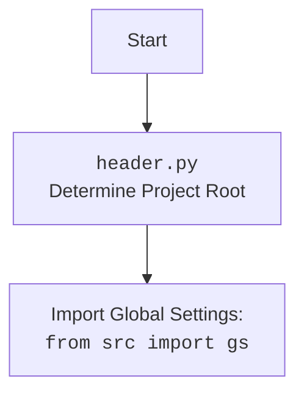

## Анализ кода `hypotez/src/suppliers/aliexpress/campaign/prepare_all_camapaigns.py`

### 1. <алгоритм>

**Начало**
1.  Импорт модуля `header`.
    *   Пример: `import header`
    *   Назначение: Подключение заголовков для определения корня проекта.
2.  Импорт функции `process_all_campaigns` из модуля `src.suppliers.aliexpress.campaign`.
    *   Пример: `from src.suppliers.aliexpress.campaign import process_all_campaigns`
    *   Назначение: Импорт функции для обработки всех рекламных кампаний AliExpress.
3.  Вызов функции `process_all_campaigns`.
    *   Пример: `process_all_campaigns()`
    *   Назначение: Запуск процесса создания или обновления рекламных кампаний AliExpress.

**Конец**

### 2. <mermaid>

```mermaid
flowchart TD
    Start --> Header[<code>header.py</code><br> Determine Project Root]
    Header --> import_gs[Import Global Settings: <br><code>from src import gs</code>]
    Start --> Import_process_all_campaigns[Import <code>process_all_campaigns</code>:<br> from <code>src.suppliers.aliexpress.campaign</code>]
    Import_process_all_campaigns --> Call_process_all_campaigns[Call <code>process_all_campaigns()</code>]
    Call_process_all_campaigns --> End
```

**Объяснение `mermaid` диаграммы:**

-   `Start`: Начало выполнения скрипта.
-   `Header`:  Импорт модуля `header.py`, который предположительно настраивает путь к корню проекта.
-    `import_gs`: Импорт глобальных настроек из `src`.
-   `Import_process_all_campaigns`: Импорт функции `process_all_campaigns` из модуля `src.suppliers.aliexpress.campaign`. Это основная логика обработки кампаний.
-   `Call_process_all_campaigns`: Вызов импортированной функции, которая выполняет основную работу по созданию или обновлению кампаний.
-   `End`: Завершение выполнения скрипта.


**Объяснение `mermaid` диаграммы `header.py`:**
- `Start`: Начало импорта `header.py`.
- `Header`: Определение корня проекта, необходимого для импорта модулей и настроек.
-  `import`: Импорт глобальных настроек проекта из `src`.

### 3. <объяснение>

**Импорты:**

-   `import header`: Импортирует модуль `header.py`. Этот модуль, вероятно, отвечает за настройку окружения проекта, например, определение корневой директории проекта. Это позволяет коду находить другие модули проекта, например `src.`.
-   `from src.suppliers.aliexpress.campaign import process_all_campaigns`: Импортирует функцию `process_all_campaigns` из модуля `src.suppliers.aliexpress.campaign`. Эта функция, как следует из названия, является основной логикой для обработки рекламных кампаний AliExpress.

**Функции:**

-   `process_all_campaigns()`: Это функция, импортированная из другого модуля. Исходя из контекста, она отвечает за проверку существования и создание (если необходимо) или обновление рекламных кампаний на AliExpress. Она не принимает аргументов и не возвращает значения напрямую.

**Переменные:**

-   В данном скрипте явных переменных не объявляется. Он предназначен для запуска логики, инкапсулированной в функции `process_all_campaigns`.

**Объяснение и взаимосвязи:**

1.  **Назначение файла**: Основная цель этого скрипта - автоматизировать процесс создания или обновления рекламных кампаний на AliExpress. Это достигается путем вызова функции `process_all_campaigns`.
2.  **Импорт `header`**: Импорт `header` из `header.py` позволяет корректно импортировать другие модули проекта, что важно для работы скрипта, особенно при его запуске из разных мест в файловой системе.
3.  **Вызов `process_all_campaigns`**: Вызов этой функции - ключевое действие скрипта. Внутри `process_all_campaigns`, вероятно, происходит взаимодействие с API AliExpress, проверка существования кампаний и их создание или обновление, если это необходимо.
4. **Взаимодействие с другими частями проекта:**
   - Данный файл является частью модуля `src.suppliers.aliexpress.campaign` и вызывает функцию `process_all_campaigns`, которая предположительно обрабатывает логику, связанную с API AliExpress.
   - Модуль `header.py` обеспечивает корректную настройку окружения, позволяя другим модулям проекта находить и импортировать необходимые компоненты.
   - Логика работы `process_all_campaigns` зависит от архитектуры `src.suppliers.aliexpress.campaign`. Предполагается, что этот модуль инкапсулирует все детали взаимодействия с AliExpress.
   - В глобальных настройках `gs`, вероятно, хранится информация о настройках проекта, такая как учетные данные для доступа к API AliExpress.
5. **Возможные проблемы и улучшения:**
   - **Обработка ошибок**: В коде не показана обработка ошибок. В реальном приложении необходимо добавить блоки `try...except` для перехвата ошибок и их логирования, особенно при взаимодействии с внешними API.
   - **Конфигурация**: Настройки (ключи доступа к API, идентификаторы кампаний и т.д.) не должны быть жестко заданы в коде. Лучше использовать переменные среды или файлы конфигурации.
   - **Логирование**: Отсутствует логирование действий. Для отслеживания выполнения скрипта и отладки необходимо добавить логирование через `logging` модуль.
   - **Управляемый запуск:**  Если этот скрипт предполагается использовать в более сложном конвейере обработки, возможно, потребуется механизм управления запуском и контроля состояния.

**Пример использования**:

Предположим, что внутри `process_all_campaigns()` происходит следующее:

1. Получение списка существующих кампаний AliExpress через API.
2. Сравнение полученного списка с желаемым списком кампаний.
3. Создание новых кампаний, которых нет в списке.
4. Обновление существующих кампаний, если необходимо.

Таким образом, файл `prepare_all_camapaigns.py` служит точкой входа для запуска процесса создания или обновления рекламных кампаний AliExpress и обеспечивает взаимодействие с другими модулями и компонентами проекта.